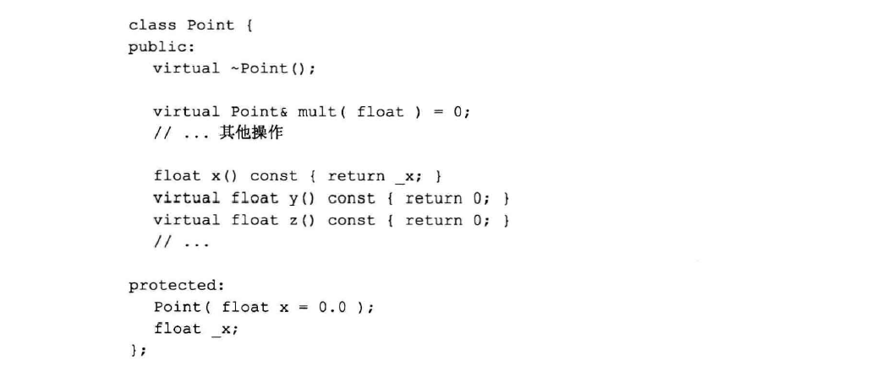
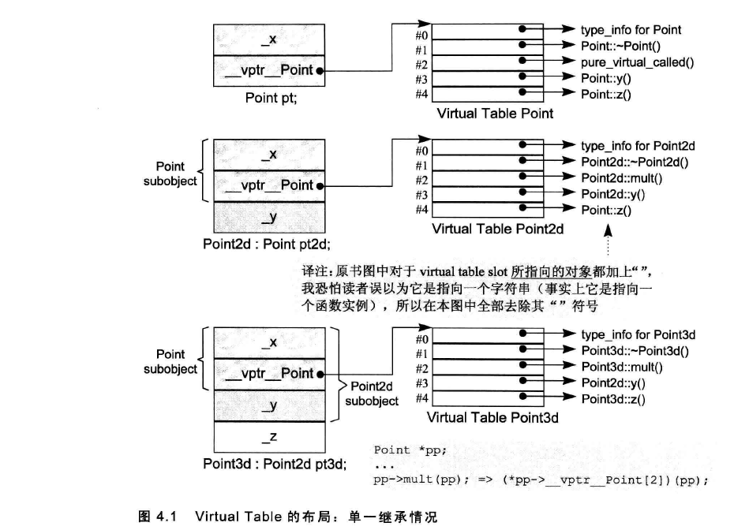

# 成员函数

## Virtual Member Functions

每个声明了虚函数或者继承了有虚函数的类，都会有一个自己的`vtbl`。同时该类的每个对象都会包含一个`vptr`去指向该`vtbl`。虚函数按照其声明顺序放于 `vtbl` 表中, `vtbl` 数组中的每一个元素对应一个函数指针。如果子类覆盖了父类的虚函数，将被放到了虚表中原来父类虚函数的位置。

如果 `normalize()`是一个  `virtual member function`，那么调用：**`ptr->normalize(); `**   

实际上会被编译器转化为：**`(*ptr->vptr[1])(ptr);`**  
+ `vptr` 是指向虚函数表的指针
+ `1` 是表中该函数的索引，
+ `ptr` 表示的是`this`指针

显示地调用“虚函数”可以压制机制，比如说，`point3d::normalized()`就不会触发虚拟机制，其行为和非静态成员函数行为一致，直接可以在编译时确定调用类的`normalized()`。

**注意**：类的对象调用虚函数是不具有多态性质，只能调用对象本身的虚拟函数版本。  

```cpp
    Point3d obj;
    obj.normalize();
    // 会被编译器转换为:  *obj.vptr[1](&obj); 虽然正确，但是没有必要，相当于point3d::normalized()，
    // 决议方式类似于非静态成员函数： normalize_7Point3dFv(&obj);
```
## 静态成员函数
静态成员函数被转换为非成员函数的方式:
``` cpp
    obj.normalized();   // normalize 7Point3dSFv(); 
    ptr->normalized();  // normalize 7Point3dSFv(); 
    // 实际上应该是由类直接调用静态函数，而不是类对象或者类指针
```
对象调用和指针调用可见完全一样，而且转换之后，不带有任何关乎调用这个静态函数的类信息，这也就说明了为什么不能在静态函数中直接调用“普通类成员”。

**静态成员函数的主要特性就是它没有`this`指针**，次要特性：
+ <font color=red>不能</font>够直接存取所属类中的非静态成员函数
+ <font color=red>不能</font>被声明为`const`、 `virtual`、 `volatile`。
+ 不需要通过类对象来调用

如果获取一个静态成员函数的地址，获得的是这个静态成员函数在内存中的位置，也就是其地址。因为其没有`this`指针，所以地址类型是“指向非成员函数指针”，而不是“指向类成员函数指针”。即：
```cpp
    &Point3d::object_count(); 
     // 得到一个数值，其类型是 unsigned int (*)();
     // 而不是 unsigned int (point3d::* )();
```
因此，缺乏`this`指针的静态成员函数，很大程度上等同于非成员函数。
## 虚函数的继承
对于一个虚函数调用`ptr->z();`，其中`z()`是一个虚函数，对于类而言需要什么信息才能让我们在<font color=red>执行期</font>调用正确的`z()`实例：
+ `ptr`所指向对象的真实类型。这可使得我们**选择**正确的`z()`实例·
+ `z()`实例的位置，使得我们可以**正确的找到并且调用它**   

基于上面的要求，因此在每个多态类上增加两个数据成员：
+ 一个字符串或者数字，表示`class`的类型，
+ 一个指针，指向虚函数表，表格中持有程序的`virtual function`执行期地址
  
  > 虚函数地址，在编译时期就可以确定。
  >
  > 因为类中如果有虚函数，这在编译时期就可以确定，并且获得其地址。这个地址是固定的，在执行期不能改变。<font color=red>因此虚函数表的大小和内容都不会改变，其构建和存取都可以在编译期完成，不需要执行期的参与</font>。

为了能在执行期找到这些地址，分为编译器部分和执行期任务：
+ 编译器还做了两个任务：
  + 为了找到表格，每个具有虚函数的<font color=red>类对象</font>都被放置了一个由编译器内部产生的指针`vptr`，指向这个虚函数表格
  + 为了找到地址，每个`virtual function`都被指派了一个表格索引值。  
+ 执行期任务：传入调用虚函数的对象，在特定的`virtual table slot`中激活`virtual function`，也就是调用这个虚函数。

一个类只有一个虚函数表，每个表中可能含有三种类型的虚函数：
+ 此类定义的函数实例。包括重写了父类中的虚函数
+ 从父类中继承的且没有重写的虚函数
+ 纯虚函数

#### 实例
对于基类：


有子类：
```cpp
class Point2d : public Point { 
public:
    Point2d(float x=0.0, float y=0.0) 
    : Point(x), _y(y) 
    { }

    ~Point2d();

    // 改写虚函数
    Point2d& mult(float );
    float y() const { return _y;}

protected:
    float _y;
};

class Point3d : public Point2d { 
public:
    Point2d(float x=0.0, float y=0.0, float z=0.0) 
    : Point2d(x, y), _z(z) 
    { }

    ~Point3d();

    // 改写虚函数
    Point3d& mult(float );
    float z() const { return _z;}

protected:
    float _z;
};
```
对于上面的继承关系，对应的虚函数表格如下图。可看见，对于子类从父类继承的虚函数，在子类的虚函数中的索引保持不变，无论这个虚函数被子类重写没有。



此时，对虚函数的调用`ptr->z();`：
+ 在调用 `z()` 的时候，并不知道`ptr`所指向对象的真正类型，但是我们明白经过`ptr`可以找到真正对象的虚函数表
+ 虽然不知道哪一个 `z()` 会被调用，但是知道每一个`z()`都是被放在了索引值为4的地方。

这些信息可以这个调用在编译期转换为：`(*ptr->vptr[4])(ptr);`。`vptr`表示被安插的指针，指向虚函数表格，4表示`z()`在表中的索引。**唯一在执行期确定的是ptr到底是指向哪一个对象**。


## question

**内联函数、构造函数、静态成员函数、模板函数可以是虚函数吗?**

对于虚函数有几点关键点：
+ 虚函数是属于对象的
+ 虚函数的和运行时期有关

由以上两点，可以回答原问题。

+ `inline`：`inline` 需要在编译期就确定类的信息，但是虚函数具体是属于哪个类的，只有在动态运行时才能知道。
+ `static`：静态函数是没有 `this` 指针，而虚函数是属于某个对象的`this`与`vptr`来调用的。
+ `constructor`：虚函数等到运行时才知道是调用了哪个对象的虚函数。如果构造器也是虚函数，对象都无法构建。因此，构造函数不能是虚函数。而且，在构造函数中调用虚函数，实际执行的是父类的对应函数，因为自己还没有构造好, 多态是被 `disable` 的。 
	
+ 模板函数
    模板函数也不能是虚函数。因为，类会在`vtbl`中存放类中的所有的虚函数的函数指针，而一个模板函数如果设计为虚函数是无法获悉这个模板函数会被实例化为哪些具体的函数。

**为什么需要虚析构函数，什么时候不需要? 父类的析构函数为什么要定义为虚函数**

一般情况下类的析构函数里面都是释放内存资源，而析构函数不被调用的话就会造成内存泄漏。这样做是为了当用一个基类的指针删除一个派生类的对象时，<font color=red> 派生类的析构函数会被正确调用</font>。
	
当然，并不是要把所有类的析构函数都写成虚函数。因为当类里面有虚函数的时候，编译器会给类添加一个虚函数表，里面来存放虚函数指针，这样就会增加类的存储空间。<font color=red> 所以，只有当一个类被用来作为基类的时候，才把析构函数写成虚函数</font>。

### 示例

```cpp
    class Base { 
    public:
      virtual ~Base() { }
      virtual
      void show()  { std::cout<< "base_show"<<std::endl; }
      void print() { std::cout<< "base_print"<<std::endl; }
    };

    class Derived : public Base { 
    public:
      void print() { std::cout<< "Derived_print"<<std::endl; }
      void show()  { std::cout<< "Derived_show"<<std::endl; }
    };

    int main(int argc, char const *argv[])
    {
      Base* base = new Derived;
      base->print();  // base
      base->show();   // derived，是在运行期才会确定是哪个对象调用的 show

      delete base;
      return 0;
    }
```

上面示例中，`print()` 函数不是虚函数，因此 ` base->print(); ` 调用的是 `Base `的 `print`，这个函数调用在编译器就实现了。

