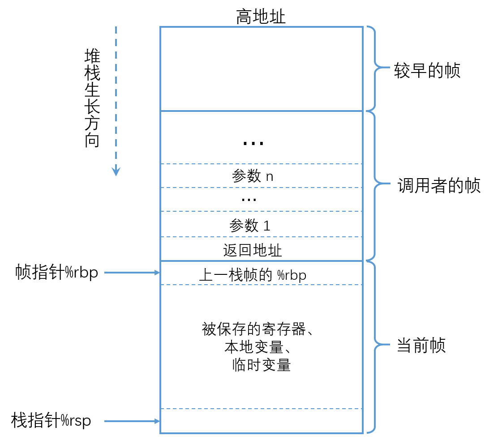
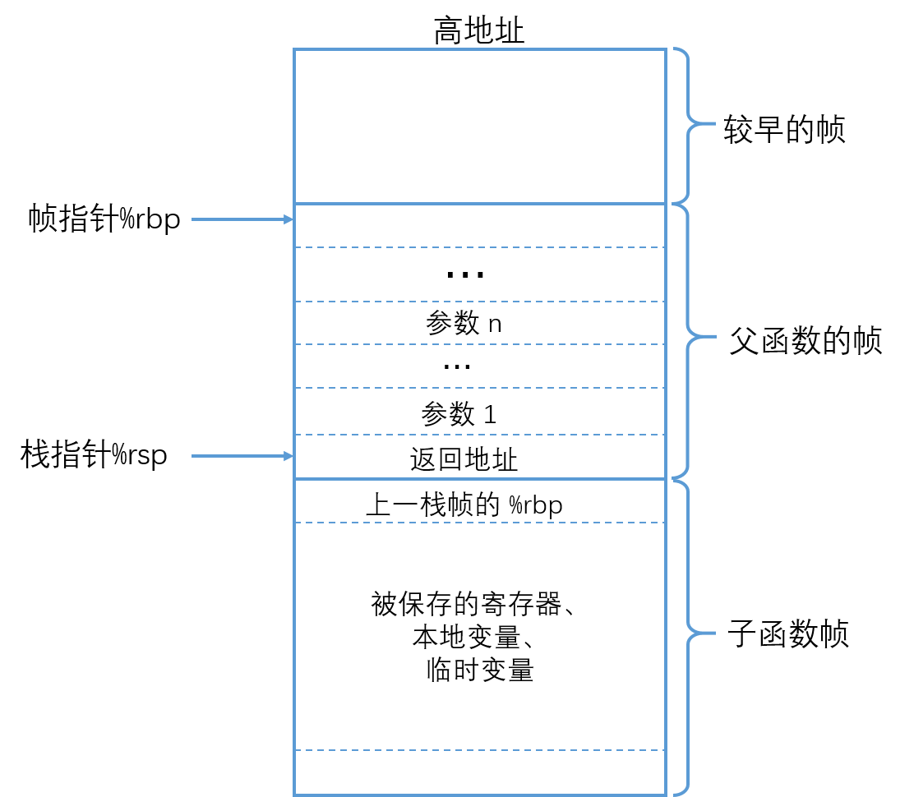

# 函数调用

### 常见寄存器

+ `%rax` 通常用于存储函数的返回值，同时也用于乘法和除法指令。在乘法 `imul` 指令中，两个64位的乘积超过64位时，高位存储在 `%rdx` 中。在除法指令 `idiv` 中，被除数是超过64位时，高位存储在 `%rdx` 中。

+ `%rsp` 是栈指针寄存器，指向的是栈顶元素。 可以用 `pushq` 和 `popq` 指令将数据存入栈中或是一从栈中取出。

  + 分配空间：将栈指针减小个适当的量可以为没有指定初始值的数据在栈上分配空间。 

  + 释放空间： 可以通过增加栈指针来释放空间

  **当前正在执行的过程的帧总是在栈顶。**

+ `%rbp` 是栈帧指针寄存器，用于标识当前栈帧的起始位置。

+ `%rdi, %rsi, %rdx, %rcx, %r8, %r9` 用来存储函数调用的前6个参数，当 x86-64 函数调用的参数大于6时，超出的部分 就会在栈上分配空间，这部分称为函数调用的栈帧（`stack frame`）

### Caller Save 与 Callee Save

 通用寄存器分为  Caller Save 和  Callee Save 两个类型，即发生函数调用时寄存器的值是由”调用者保存“ 还是由 ”被调用者保存“。当发生函数调用时，子函数内通常也会使用到通用寄存器，那么这些寄存器中之前保存的调用者(父函数）的值就会被覆盖。为了避免数据覆盖而导致从子函数返回时寄存器中的数据不可恢复，CPU 体系结构中就规定了通用寄存器的保存方式。

**`Caller Save`**  寄存器：在进行子函数调用前，就需要由调用者提前保存好这些寄存器的值，保存方法通常是把寄存器的值压入栈中，调用者保存完成后，在被调用者（子函数）中就可以随意覆盖这些寄存器的值了。这类寄存器有：`%r10，%r11`。

**`Callee Save`**：在函数调用时，调用者就不必保存这些寄存器的值而直接进行子函数调用，进入子函数后，子函数在覆盖这些寄存器之前，需要先保存这些寄存器的值，即这些寄存器的值是由被调用者来保存和恢复的。这类寄存器有：`%rbx, %rbp, %r12, %r13, %r14, %r15`。

其他的通用寄存比如上面介绍的 `%rax`，`%rsp` 无须保存，还有一些专门用来发生函数调用时的寄存器，专门用来保存函数参数的。

## 函数调用

在子函数调用时，执行的操作有：
+ 父函数将调用参数从后向前压栈,即`arg1`在低地址，`argn`在高地址。

+ 把返回地址当做子函数的栈帧的一部分，子函数的代码会扩展当前栈的边界， 分配它的栈帧所需的空间

+ 跳转到子函数起始地址执行 ，即`%rip`设置为子函数的起始地址。

+ 子函数将父函数栈帧起始地址`%rbp` 压栈 

+ 将 `%rbp` 的值设置为当前 `%rsp` 的值，即将 `%rbp` 指向子函数栈帧的起始地址。
    ```asm
      		call func
      func:
            pushq rbp         // 将调用函数的栈帧起始地址压入栈
          	moveq rsp rbp     // 使得rbp 指向当前被调用函数的栈帧起始地址
    ```

**`call`**  指令完成了：①将父函数的返回地址入栈；②跳转到子函数。已经进入子函数了，因此“调用函数”的`%rbp`需要子函数来保存，属于`callee save`。

下图是发生函数调用时的栈帧。

## 函数返回
需要完成：
+ 恢复栈的结果到函数调用之前的状态
+ 跳转到调用函数的返回地址处继续执行

由于在调用子函数时已经保存了父函数的返回地址和父的栈帧起始地址，那么只需要恢复即可：
```asm
    moveq %rbp, %rsp   // 使得 %rsp 和 %rbp 指向一处：子函数的栈帧起始地址 
    popq  %rbp         // 调用函数的栈帧起始地址地址，并且%rsp上移一个位置，指向返回地址
    ret				   // 从当前%rsp指向的位置弹出数据，并且跳转到此数据表示的地址处，即使返回父函数
```
总结下 `ret` 指令的作用：
+ 使得`%rsp`再上移动一个位置，使得`%rsp`指向父函数的栈帧的结尾处，即保存了父函数的返回地址
+ 会弹出栈中的数据，返回主函数

返回时候的栈帧如下：



## 参考链接
+ [x86-64 下函数调用及栈帧原理](https://zhuanlan.zhihu.com/p/27339191)
+ CSAPP


