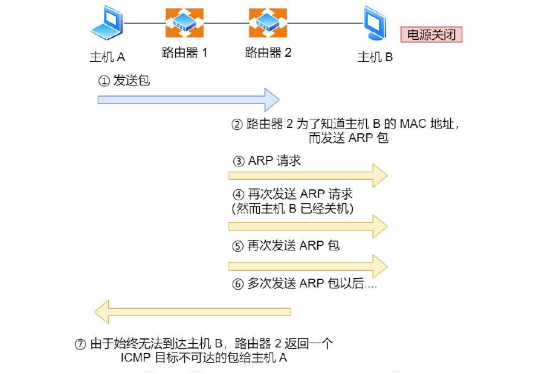
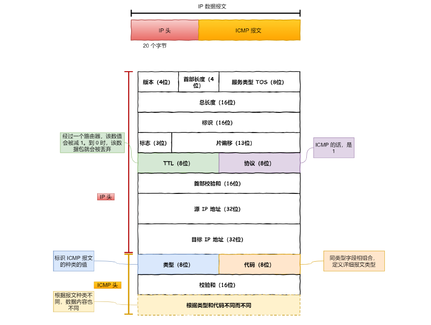

# IP 

 ***ping  ip***  ：主要是用于判断与对方网络 *ip* 是否畅通

 ## ICMP

*ping* 是基于 ICMP （*Internet Control Message Protocol*）协议工作的，*ICMP* 的主要功能包括：

+ 确认 IP 包是否成功送达目标地址
+ 报告发送过程中 IP 包被废弃的原因
+ 改善网络设置

在 IP 通信中如果某个 IP 包因为某种原因未能达到目标地址，那么这个具体的原因将由 ICMP 负责通知。如下图：

主机 A 向主机 B 发送了数据包，由于某种原因，途中的路由器 2 未能发现主机B 的存在，这时，路由器 2 就会向主机 A 发送一个 ICMP **目标不可达数据包**，说明发往主机B 的包未能成功。 ICMP 的这种通知消息会使用 IP 进行发送 。

>  

## ICMP 帧格式

如下图，ICMP报文也是使用IP传输，需要封装ip数据报。

