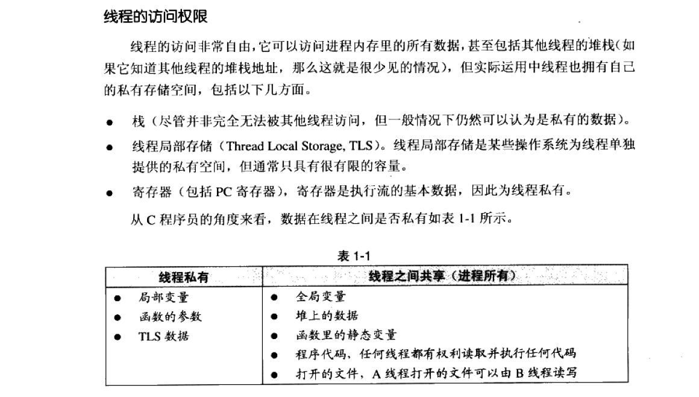

###  线程/进程/协程
#### 什么叫线程安全
如果每次运行结果和单线程运行的结果是一样的，而且其他的变量的值也和预期的是一样的，就是线程安全的

#### 线程访问权限



#### 协程、线程、进程优缺点.线程和进程间的区别  
   进程：是系统资源分配的最小单位
   + 多进程优点: 是稳定性高，因为一个子进程崩溃了，不会影响主进程和其他子进程。

   + 多进程缺点: 创建进程的代价大，在*Unix/Linux*系统下，用 *fork* 调用还行，在 *Windows* 下创建进程开销巨大。另外，操作系统能同时运行的进程数也是有限的，在内存和CPU的限制下，如果有几千个进程同时运行，操作系统连调度都会成问题。

   线程：是系统调度的基本单位，能充分利用多核，
   + 多线程优点：调度通常比多进程快一点。
   + 多线程缺点：致命的缺点就是任何一个线程挂掉都可能直接造成整个进程崩溃，因为所有线程共享进程的内存。

   协程：能充分利用单核
   + 优点：进程/线程在切换调度时，都是需要进入内核态。协程位于线程内，协程的切换只涉及用户态。因此，协程的切换更加高效，能充分利用单核。协程能用同步的思想，编写异步的代码，回避了回调函数。
   + 缺点：本质是个单线程，只不能发挥多核能力。

多线程+协程：IO密集型  
多进程：计算密集型

#### 协程的原理和具体的操作，以及跟线程的区别，协程的创建受什么影响 、

 协程实际上就是类函数一样的程序组件，你可以在一个线程里面轻松创建数十万个协程，就像数十万次函数调用一样。只不过函数只有一个调用入口起始点，返回之后就结束了，而协程入口既可以是起始点，又可以从上一个返回点继续执行，也就是说协程之间可以通过 ***yield*** 方式转移执行权

 协程的创建 受栈的影响

### 线程池
#### 线程类型
+ *IO*  密集型线程
+ *CPU* 密集型线程

在  **wins/Linux** 下，线程的优先级系统会根据线程的表现自动调整，使得调度更加有效。频繁地进入等待状态（**进入等待状态，会放弃之后仍然可占用的时间份片**）的IO密集型线程比频繁进行大量计算、**以至于每次都要把时间片全部用尽**的计算密集线程要受欢迎得多。

**在操作系统里，IO密集型线程总是比CPU密集型线程容易得到优先级的提升**。当一个CPU 密集型的线程获得较高的优先级时， 许多低优先级的进程就很可能饿死。而一个高优先级的IO 密集型线程由于大部分时间都处千等待状态， 因此相对不容易造成其他线程饿死。为了避免饿死现象，调度系统常常会逐步提升那些等待了过长时间的得不到执行的线程的优先级。因此，IO密集型线程，多多益善。

#### [线程池应用场景](https://mp.weixin.qq.com/s?__biz=MzI0NTE4NTE4Nw==&mid=2648792478&idx=1&sn=3a2a1575f8aead00011f01607b96e6c7&chksm=f1479252c6301b44f59e292e4ddbd04fc3c6f781e7d66b8effaea0717704d840893be3292850&scene=126&sessionid=1595393297&key=9c1744d1bffeab4b1358f07a1d07a66e425d475b19f70782828ed3599e2687f78268dfc22962ae74c9056efe933b241f21d8d03889bc4f0389e72cbff246a353e43675f943a250e5b88c855a3457c18c&ascene=1&uin=MTk1MzQ1MjQxMQ%3D%3D&devicetype=Windows+10+x64&version=62090529&lang=zh_CN&exportkey=A2YvoSGOwRtvpaF5rovFOj8%3D&pass_ticket=vWtLV%2FhTU7G4NiazXq8zyEYkMuO8XNd0Ki63PGJZDGjgvcYWq6k0A3QwtG%2BJT26c)

关于线程池使用的三个问题：

+ 高并发、任务执行时间短的业务怎么使用线程池？
+ 并发不高、任务执行时间长的业务怎么使用线程池？
+ 并发高、业务执行时间长的业务怎么样使用线程池？
  

常见的线程池本质上是生产者 & 消费者模型，主要是三个元素：
+ 向线程池任务队列中投递任务的生产者线程
+ 任务池队列
+ 从线程池任务队列取出任务执行的消费者线程

要想配置线程池的大小，得分析线程池任务的特性，可以从以下几个方向来分析：

根据任务类型分析：
+ CPU密集型任务
+ IO密集型任务
+ 混合型任务

根据任务的优先级：
+ 高
+ 中
+ 低

根据任务的执行时间
+ 长
+ 中
+ 短

在这提供下 `libuv`里的线程池设计思想，在`libuv`将线程池中运行的任务分成三种：
```cpp
  enum uv__work_kind {
    UV__WORK_CPU,       // CPU 密集型
    UV__WORK_FAST_IO,   // IO 快速型 
    UV__WORK_SLOW_IO    // 慢速IO型，耗时长
  };
```

根据不同的任务类型，使用不同的函数将任务提交到线程池中。
```cpp
  // 第一种：提交 非 cpu密集型任务
  void uv__work_submit(uv_loop_t* loop,
                       struct uv__work* w,
                       enum uv__work_kind kind,
                       void (*work)(struct uv__work* w),
                       void (*done)(struct uv__work* w, int status)) {
    uv_once(&once, init_once);
    w->loop = loop;     // w->lopp 提交到指定的 loop 中
    w->work = work;     // 线程池要执行的函数
    w->done = done;     // 通知主线程要执行的函数
    post(&w->wq, kind); // 将任务提交到任务队列中
  }


  // 提交的是 CPU 密集型任务
  int uv_queue_work(uv_loop_t* loop,
                    uv_work_t* req,
                    uv_work_cb work_cb,
                    uv_after_work_cb after_work_cb) {
  if (work_cb == NULL)
      return UV_EINVAL;

    ///设置请求的类型是 UV_WORK, loop 的活跃请求+1
    uv__req_init(loop, req, UV_WORK);
    req->loop = loop;
    req->work_cb = work_cb;
    req->after_work_cb = after_work_cb;

    // 提交任务到线程池，让其执行
    // 类型是CPU密集型
    uv__work_submit(loop,
                    &req->work_req,
                    UV__WORK_CPU,   // CPU密集型任务
                    uv__queue_work,
                    uv__queue_done);
    return 0;
  }
```
线程池中的工作队列为空，即没有可执行让任务，仅仅剩下慢速IO任务时，这时候阻塞，等待新的非慢速IO任务到来才执行。
```cpp
  // libuv/src/threadpool.c

  while (QUEUE_EMPTY(&wq) ||
        (QUEUE_HEAD(&wq) == &run_slow_work_message && 
         QUEUE_NEXT(&run_slow_work_message) == &wq &&
         slow_io_work_running >= slow_work_thread_threshold())) {
    idle_threads += 1;
    // 整个线程池只有这里是等待
    // 来一个新任务，空闲线程减少1
    uv_cond_wait(&cond, &mutex);
    idle_threads -= 1;
  }
```

**线程池中的线程数设置**

对于不同性质的任务来说，
+ *CPU* 密集型任务应配置尽可能小的线程，如配置 CPU 个数 + 1的线程数；
+  *IO* 密集型任务应配置尽可能多的线程，因为 IO 操作不占用 CPU，不要让 CPU 闲下来，应加大线程数量，如配置两倍 CPU 个数 + 1；
+ 而对于混合型的任务，如果可以拆分，拆分成 IO 密集型和 CPU 密集型分别处理，前提是两者运行的时间是差不多的，如果处理时间相差很大，则没必要拆分了

如果任务执行时间长，在 *worker* 线程数量有限的情况下，*worker* 很快就很被任务占完，导致后续任务不能及时被处理，此时可以适当增加 *worker* 线程数量或者参考 *libuv* 的设计；反过来，如果任务执行时间短，那么 *worker* 线程数量不用太多，太多的 *worker* 线程会导致过多的时间浪费在线程上下文切换上。

这里的“高并发”应该是生产者生产任务的速度比较快，此时需要适当增大任务队列上限。

但是对于第三个问题并发高、业务执行时间长这种情形单纯靠线程池解决方案是不合适的，即使服务器有再高的资源配置，每个任务长周期地占用着资源，最终服务器资源也会很快被耗尽，因此对于这种情况，应该配合业务解耦，做些模块拆分优化整个系统结构。

#### 线程池设计的时候需要注意哪些事情？  
线程池作用：**避免频繁地创建和销毁线程，达到线程对象的重用**。另外，使用线程池还可以根据项目灵活地控制并发的数目。

   使用场景：
   + 需要大量的线程来完成任务，且完成任务的时间比较短，避免频繁的创建/销毁。 *WEB*服务器完成网页请求这样的任务，使用线程池技术是非常合适的。
   + 接受突发性的大量请求，但不至于使服务器因此产生大量线程的应用。突发性大量客户请求，在没有线程池情况下，将产生大量线程。

   注意事项  
   + 线程池管理器（*ThreadPoolManager*）:用于创建并管理线程池
   + 工作线程（*WorkThread*）: 线程池中线程
   + 任务接口（*Task*）:每个任务必须实现的接口，以供工作线程调度任务的执行。
   + 任务队列：用于存放没有处理的任务。提供一种缓冲机制

   两种设计模式  
   + *work share*
   + *work steal*
###  线程间通信与共享数据   
+ 通信：线程之间不存在通信的问题。因为线程是处于同一个进程地址空间中。
+ 数据共享：线程之间共享数据是需要的，可以使用加锁的队列、加锁的全局变量以及原子变量等。
### 死锁  
#### 死锁产生条件

+ 互斥条件：进程要求对所分配的资源进行排它性控制，即在一段时间内某资源仅为一进程所占用。
+ 请求和保持条件：当进程因请求资源而阻塞时，对已获得的资源保持不放。
+ 不剥夺条件：进程已获得的资源在未使用完之前，不能剥夺，只能在使用完时由自己释放。
+ 循环等待条件：若干进程之间形成一种头尾相接的循环等待资源关系

#### 死锁的预防  
就是在设计的过程中，破坏这四个条件其中一个即可
+ 资源一次性分配：一次性分配所有资源，这样就不会再有请求了：（破坏请求条件）
+ 只要有一个资源得不到分配，也不给这个进程分配其他的资源：（破坏请保持条件）
+ 可剥夺资源：即当某进程获得了部分资源，但得不到其它资源，则释放已占有的资源（破坏不可剥夺条件）。*try_lock*
+ 资源有序分配法：系统给每类资源赋予一个编号，每一个进程按编号递增的顺序请求资源，释放则相反（破坏环路等待条件）。
+ 使用 **R**AII技术
#### 检测死锁
gdb调试，***attach*** 到正在运行的进程，看当前程序阻塞在哪。
#### 解除死锁    
当发现有进程死锁后，便应立即把它从死锁状态中解脱出来，常采用的方法有： 
+ 剥夺资源：从其它进程剥夺足够数量的资源给死锁进程，以解除死锁状态；  
+ 撤消进程：可以直接撤消死锁进程或撤消代价最小的进程，直至有足够的资源可用，死锁状态.消除为止；所谓代价是指优先级、运行代价、进程的重要性和价值等

**怎么剥夺线程资源**  

做一个限制条件，如果不能同时就放弃手中的资源。  

## C++ 六种 memory order 与原子操作
### 内存序
#### *std::memory_order_acquire*    
适用于读操作 *load operation*：*var.load(**std::memory_order_acquire**)*，称为 **acquire** operation，其中 *var*是原子变量。这个操作产生的影响是：
+ 在当前线程中，此操作后的`load`和`store`不能被 `reorder` 到这个操作前面。
+ 对于其他线程中，所有对于原子变量 `var` 的 `release`操作及其之前的写入，对当前线程从该`acquir`操作开始可见。
  ```cpp
  auto var = 10;
  // 1
  std::thread([]
              { 
                  if(var == 20) { 
                      // do something

                  }
                  esle {
                      // do something
                  } 
              });
  // 2
  std::thread([]
              {
                  var=20; // 假设就是这么修改的
              });

  ```
  这波操作，就行如果在线程2中，对于变量`var`进行了写操作，那么在在线程1中，经过 `acquir operation`开始可见。这个`acquire operation`在这的作用：
  + 同步：同步别的线程对变量`var`的修改
  + 防止当前线程的`reorder`


#### *std::memory_order_release*  
   适用于写操作`store operation`：`var.store(std::memory_order_release)`，称为 `release operation`。作用：
   + 其他线程：截止到`release operation`（包括本次），所有对于`var`的写入在其他线程对变量`var`的`acquire operation`开始可见。
   + 当前线程：`release operation`之前对于变量 `var`的`stroe/load`都不能 `reorder`到 `release operation` 之后


  发现没有？经过`release/acquire`，没有使用锁的情况下，实现在多线程中变量`var`的同步。
  ``` markdown
      线程1： .........................var 
                                       ^
                                      读取
      线程2：var  ... var  ... var
              ^        ^       ^
            写入1    读取     写入2
同步：
在线程2中，同一个线程中对于前面对于变量var的修改，对于后面的代码自然是可见的。但是当调度到线程1中，此时变量var是处于什么状态？那么应该是在线程1的 acquire operation开始，线程2的所有对于var的操作都可见，才能正确让程序按照设定进行下去。那么此时线程1中的assert(var==2);

reorder:
acquire operation 限制的是其后的load/store不能reorder到其前面去。但是，其前面的可以reorder到后面去。这在用户明确知道不会即使reorder也不会发生错误的情况下就可以使用std::memory_order_acquire。如果担心可能出错，那么就使用最强语义：std::memory_order_re_acl。

同理 release operation
  ```

  #### *std::memory_order_acq_rel*  
  适用于读改写操作`read_modify_write operation`，又叫做`acq_rel_operation`。作用：
  + 当前线程：`acq_rel operation` 之前的`load/store`不能重排到该操作之后，该 `acq_rel operation` 之后的`load/store`不能重排到该操作之前.
  + 其他线程：其他线程中所有对 `var`的`release operation`及其之前的写入，在当前线程 `acq_rel operation`开始的操作可见。并且截止到该 `acq_rel operation` 的所有内存写入都对另外线程对`var`的 `acquire operation`以及之后的内存操作可见。

    由此可见，这个语义就是结合了`release/acquire operation`形成的最强同步操作。对应的操作，比如：`compare_exchange_weak/strong`，在成功时是`read_modify_write`，失败时`load`。

  #### std::memory_order_seq_cst    
  `memory_order_seq_cst` 可用于 `load operation`，`release operation`, `read-modify-write operation`三种操作:

  + 用于 `load operation`时，有 `acquire operation`的特性
  + 用于 `store operation`时，有`release operation`的特性
  + 用于 `read-modify-write operation`时.有`acq_rel operation`的特性
  + 除此之外，有个很重要的附加特性，一个单独全序，也就是所有的线程会观察到一致的内存修改


### 内存序的组合使用

**`std::memory_order_relaxed`**
这个内存序，一般单独使用，仅仅保证操作本身是原子的，无其他同步/`reorder`限制。即，使用这个内存序的线程，在该指令前后CPU仍可以`reorder`。

```cpp
// x,y 都是初始值为0的原子变量
// Thread 1:
r1 = y.load(std::memory_order_relaxed); // A
x.store(r1, std::memory_order_relaxed); // B

// Thread 2:
r2 = x.load(std::memory_order_relaxed); // C 
y.store(42, std::memory_order_relaxed); // D
```
在两个线程中，没有任何同步/`reorder`限制，因此可能运行的顺序是:`D->A->B->C`，最后结果可能是：`x=y=42`。因此，`std::memory_order_relaxed`最适合于类似计数器的应用场景。

**`release-acquire`**   
`release-acquire`序，就`release-acquire`语义，用的最多，即保证了数据之间的同步操作也使得开销不会太大。这组关系，更加类似于条件变量的操作。比如线程1，2共享原子变量`var`

```cpp

// 线程1 
var.store(10, std::memory_order_release);

// 线程2
while(var.load(std::memory_order_acquire)!=10);
// do something
```
线程2直到 线程1写入之后才开始`do sth`。以cpprference的例子：
```cpp
int main(int argc, char const *argv[]) {
    
    int data=0;
    std::atomic<std::string*> sptr =nullptr;

    auto func1 = [&]
                 {
                    std::string* p = new std::string("hello Cpp"); 
                    data = 1;
                    sptr.store(p, std::memory_order_release); // 1
                 };

    auto func2 = [&]
                 { 
                    std::string* p;
                    while(!(p = sptr.load(std::memory_order_acquire))); // 2
                    assert(*p == "hello Cpp");
                    assert(data == 42);
                 };

    std::thread t1(func1);

    std::thread t2(func2);

    t1.join();
    t2.join();
    return 0;
}
```
线程t2的步骤2会一直堵塞在`while`循环处，直到t1线程`release operation`之后才会顺利进行。

**`Sequentially-consistent`**

使用`memory_order_seq_cst`可以获得顺序一致性，是`atomic`变量默认的内存序，也是x86/x64平台的唯一内存序，是最强的保证。此内存序下，除了有 `release acquire` 的效果，还会外加一个单独全序，即如果一个线程对原子变量`var`进行了任何修改，别的线程都能立马看到。因此这也是代价很大的保持数据同步的一种内存序，尤其是在arm等weak order平台上，因为要实现Sequentially-consistent需要全局的数据同步，因此如果对性能有较高要求，不是特别必要不要使用这个内存序。

```cpp
int main(int argc, char const *argv[]) {

    std::atomic<bool> x{false};
    std::atomic<bool> y{false};
    std::atomic<int>  z{0};


    std::thread t1 {[&]
                    { 
                        x.store(true, std::memory_order_seq_cst); // 1
                    }};

    std::thread t2 {[&]
                    { 
                        y.store(true, std::memory_order_seq_cst); // 2
                    }};
                    
    std::thread t3 {[&]
                    { 
                        while(!x.load(std::memory_order_seq_cst));  // 3
                        if(y.load(std::memory_order_seq_cst)) {     // 4
                            ++z;
                        }
                    }};

    std::thread t4 {[&]
                    { 
                        while(!y.load(std::memory_order_seq_cst));  // 5
                        if(x.load(std::memory_order_seq_cst)) {     // 6 
                            ++z;
                        }
                    }};

    t1.join();
    t2.join();
    t3.join();
    t4.join();

    assert(z != 0);
    return 0;
}
```
在上述例子中，在`std::memory_order_seq_cst`内存序，`z`是用于不可能为0的`asseet(z!=0);`。为什么呢？要使得`z==0`:
+ t3 线程观察到的：`x = true,  y=false`
+ t4 线程观察到的：`x = false, y=true`
显然这个这个内存违背：当`x=true`时，t3线程通过位置3处。
    + 如果t4线程位置5在t3线程的位置4先通过，即`y=true`，那么t4线程也能顺利通过6。t3线程也能顺利通过4。最终`assert(z==2)`
    + 如果t4线程位置5在t3线程的位置4后执行通过，那么`asseet(z==1)`
无论如何也不可能是0。

因为此内存序下一处修改，其他所有的线程可见。


### 读改写
```cpp
bool compare_exchange_weak(T& expected, 
                           T desired,
                           std::memory_order success,
                           std::memory_order failure ) noexcept;

bool compare_exchange_weak(T& expected, 
                           T desired,
                           std::memory_order order = std::memory_order_seq_cst ) noexcept;

// compare_exchange_strong 对称。
```
参数含义：
```
expected -	到期待在原子对象中找到的值的引用。若比较失败则被存储 *this 的实际值。
desired	 -	若符合期待则存储于原子对象的值
success	 -	若比较成功，则读修改写操作所用的内存同步顺序。
failure	 -	若比较失败，则加载操作所用的内存同步顺序。不能为 std::memory_order_release 或 std::memory_order_acq_rel ，且不能指定强于 success 的顺序。
order	-	两个操作所用的内存同步顺序
```

原子地比较 `*this` 和 `expected` 的对象表示值表示。
+ 如果它们逐位相等，`*this = desired`（读改写操作）
+ 否则`excepted = *this`（进行加载操作）
+ `success`的内存序，对应的操作是读改写，一般是`std::memory_order_acq_rel`
+ `failure`的内存序，对应的操作是加载，一般是`std::memory_order_relaxed`,`std::memory_order_acquired`

借用cppreference的例子
```cpp
template<typename T>
struct Node {
    T data;
    Node* next;
    Node(const T& data) : data(data), next(nullptr) {}
};
 
template<typename T>
class stack {
private:
    std::atomic<Node<T>*> head;
 public:
    void push(const T& data) {
      Node<T>* newNode = new Node<T>(data);
 
      // 放 head 的当前值到 newNode->next 中
      newNode->next = head.load(std::memory_order_relaxed);

      /**
       * @brief: 执行过程解释
       * 
       *         假设开始的链表状态是：
       *            开始：  1 --> 2
       *                    ^ 
       *                   head
       * 
       *         newNode 是局部变量，肯定是线程安全的 。而 nodeNode->next 保存的之前的一个 head 值
       *         如果此时有线程2也执行push操作，假设线程2插入的节点是 B, 那么此时的关系：  B->next = head, 
       *         当前线程：newNode->next = head
       *        
       *         注意此时：assert(newNode->next == B-->next);
       *         两个线程，谁先执行完 while(...); 谁先插入。假设是线程2先执行，因为是原子操作，那么此时联邦状态：
       *            执行：  B --> 1 -- >2
       *                    ^
       *                   head
       * 
       *         当 线程1去执行while循环时，此时 assert(newNode->next != head); 那么 这个原子操作`compare_exchange_weak执行
       *         nodeNext->next = head：
       *             执行：newNode --> B --> 1 --> 2
       *                               ^
       *                              head
       * 
       *        那么在下一轮循环的原子操作中 assert(newNode->next == head)。那么就会执行 
       *         newNode->next == head：
       *            执行： newNode --> B --> 1 --> 2
       *                    ^
       *                    head   
       * 
       *          再多几个线程，也是这个的逻辑。
      */

        /** @brief: 内存序解释
         *      enum memory_order {
                    memory_order_relaxed,
                    memory_order_consume,
                    memory_order_acquire,
                    memory_order_release,
                    memory_order_acq_rel,
                    memory_order_seq_cst
                };

            成功时，读改写，内存序是：memory_order_release。因为后面没有对于 head 的读写操作了。没有必要使用限制更强 memory_order_acq_rel。只要保证前面的读写不会被 reorder 到这条指令的后面即可。

            失败时：加载，因为后面也没有操作 head，不需要防止后面的对 head 读写指令 reorder 到这条指令前面，可以直接使用最宽容的 memory_order_relaxed
        */
      while(!head.compare_exchange_weak(newNode->next, 
                                        newNode,
                                        std::memory_order_release,
                                        std::memory_order_relaxed)); 

};
int main()
{
    stack<int> s;
    s.push(1);
    s.push(2);
    s.push(3);
}
```

## 自旋锁 *spinlock*
优点：
+ 非自旋锁在获取不到锁的时候会进入阻塞状态，从而进入内核态，当获取到锁的时候需要从内核态恢复，需要线程上下文切换。 （线程被阻塞后便进入内核（Linux）调度状态，这个会导致系统在用户态与内核态之间来回切换，严重影响锁的性能）
+ 自旋锁不会使线程状态发生切换，**一直处于用户态**，即线程一直都是*active*的；**不会使线程进入阻塞状态**，减少了不必要的上下文切换，执行速度快

缺点：
+ 如果某个线程持有锁的时间过长，就会导致其它等待获取锁的线程进入循环等待，消耗CPU。使用不当会造成CPU使用率极高。
+ 不公平的锁就会存在“线程饥饿”问题
+ 自旋锁一般是配合原子操作实现数据同步。

## 分段锁
最常用互斥锁`std::mutex`来保证线程安全，但是在线程激烈的情况下`std::mutex`效率较低下。比如线程1使用``insert``向`unordered_map`中添加元素，线程2不但不能使用`insert`方法添加元素，并且也不能使用`at`方法来获取元素，所以竞争越激烈效率越低。

因此，为了优化读写操作，提出了使用分段锁设计（借鉴Java），读写锁只能优化读操作而不能优化写操作。

## 问题  
#### 1. 线程同步原语  
+ 互斥锁 *mutex*：本质上是对共享资源的保护

+ 条件变量 *cv*：本质上是为了避免死锁产生的。 *cv.**wait**(mutex)* 与 *cv.**notify**()* 确保不会产生死锁

    条件变量的虚假唤醒
    ```cpp
    
    std::lock_guard<std::mutex> guard(mutex_);
    while(...) { 
        cv.wait(guard)
    }
    ```
    因为，*cv.**notify_all**()*  不止唤醒一个线程。即便是 `cv.notify_one()` 也是有可能唤醒多个。

+ 信号量：本质上是对一个资源的计数，管理的是资源的数量。可以用来实现互斥锁和读写锁。

     *semaphore*  *mutex* 的区别？

    *mutex* 相比较 *semaphore* 增加了所有权的概念， *mutex* 锁住的临界区，只能由于同一个 *mutex* 对象才能解锁，使得这个临界区可以被其他线程使用，即解铃还须系铃人。而 *semaphore* 则是可由任何一个线程解开临界区。 

    ​	

    *mutex* 管理的是资源的使用权，而 *semaphore* 管理的资源的数量。

+ 自旋锁：一般是结合原子操作使用。

##### 三个线程按照顺序打印*abc*

```cpp
#include <iostream>
#include <thread>
#include <atomic>

// 无锁的方式实现
class Solution { 
public:
    enum class State {A, B, C};

    Solution() { 
        state_.store(State::A, std::memory_order_release);
        int cnt=10;
        std::thread([this, cnt]()mutable
                    { 
                        while(cnt--) 
                        { 
                            this->printB();
                        }
                    }).detach();

        std::thread([this, cnt]()mutable
                    { 
                        while(cnt--) 
                        { 
                            this->printC();
                        }
                    }).detach();
        while(cnt--) 
        { 
            this->printA();
        }
    }

    ~Solution() 
    { 
        std::cout<<std::endl;
    }

    void printA() { 
        while(state_.load(std::memory_order_acquire) != State::A);
        std::cout<<"a";
        state_.store(State::B, std::memory_order_release);
    }

    void printB() { 
        while(state_.load(std::memory_order_acquire) != State::B);
        std::cout<<"b";
        state_.store(State::C, std::memory_order_release);
    }

    void printC() { 
        while(state_.load(std::memory_order_acquire) != State::C);
        std::cout<<"c";
        state_.store(State::A, std::memory_order_release);
    }
    private:
        std::atomic<State> state_;
    };

    int main(int argc, char const *argv[])
    {
        Solution();
        return 0;
    }
```
##### 用原子操作实现单生产者、单消费者

```cpp
#include <iostream>
#include <thread>
#include <atomic>
#include <list>

class Solution {
public:
  Solution()
  : state_{State::READ},
    trd_{[this]{this->customer()}}
    { }

    void producer(int val)
    {
      while(state_.load(std::memory_order_acquire) == State::READ);

      task_.push_back(val);
      state_.store(State::WRITE, std::memory_order_release);
    }

    void customer() 
    { 
      while(state_.load(std::memory_order_acquire) == State::WRITE);
      if(!task_.empty()) { 
        int val = task_.front();
        task_.pop_front();
      }

      state_.store(State::READ, std::memory_order_release);
    }
private:
  enum class State {READ, WRITE};

  std::atomic<State> state_;
  std::thread        trd_;
  std::list<int>     task_;
};
```


#### 2. 什么是上下文切换？
CPU通过分配时间片来执行任务，当一个任务的时间片用完，就会切换到另一个任务。在切换之前会保存上一个任务的状态，当下次再切换到该任务，就会加载这个状态。**任务从保存到再加载的过程就是一次上下文切换**。
+ 切出： 一个线程被剥夺处理器的使用权而被暂停运行
+ 切入： 一个线程被系统选中占用处理器开始或继续运行


图的进度信息就是上下文，一般包括通用寄存器和程序计数器的内容。在切出时，操作系统会将线程的进度信息保存到内存。在切入时，操作系统需要从内存中加载线程的上下文。

** 什么时候会发生上下文切换**       
按原因，上下文切换的因素划分为两点：

+ 自发性上下文切换：***sleep***、 ***wait*** 、***join*** 等
+ 非自发性上下文切换：由于多线程调度器的原因被迫切出
  + 切出线程的时间片用完
  + 有一个比切出线程优先级更高的线程需要被运行

**上下文切换的开销**  
上下文切换的开销包括直接开销和间接开销

直接开销有如下几点：
+ 操作系统保存恢复上下文所需的开销
+ 线程调度器调度线程的开销

间接开销有如下几点：  
+ 处理器高速缓存重新加载的开销
+ 上下文切换可能导致整个一级高速缓存中的内容被冲刷，即被写入到下一级高速缓存或主存

#### 3. 多线程适用场景

场景：提高响应速度、让IO和“计算”相互重叠，降低延迟。

多线程对于计算密集型服务，不能提高吞吐量。

#### 4. 某个进程/线程CPU占比高，你如何排查出问题？：

  + 在windows下，任务管理器可以查看进程的占比；线程的可以用vs的性能勘测。
  + Linux下，可以使用 *top*命令查看，[详细可参考](https://www.jb51.net/LINUXjishu/34604.html)

#### 5. 一个进程里面的多线程，如果其中一个线程挂掉了，影响其他线程吗？  

+ 如果进程不屏蔽 *segment fault* 信号，一个线程崩溃，所有线程终结。
+ 如果屏蔽 *segment fault* 信号，且线程崩溃的位置是线程私有位置（stack），那么其他线程没有问题。
+ 如果屏蔽 *segment fault* 信号，且线程崩溃的位置是线程共享位置（heap、全局变量等），那么其他线程也会出现问题。

#### 6. 多进程通信