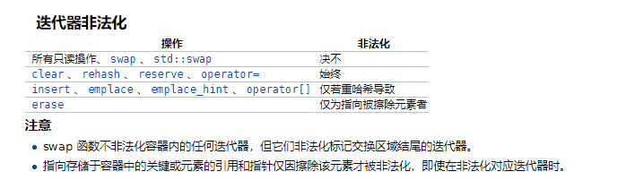

## 基础知识
#### RAII  
全称是 **R**esource **A**cquisition **I**s **I**nitialization ， 即“资源获取即初始化”，其核心是把资源和对象的生命周期绑定：对象创建获取资源，对象销毁释放资源。这就是的资源也有了生命周期，有了自动回收的功能。*lock_guard* 都利用了 *RAII*机制来实现。

防止内存泄露的方式有 **R**AII、智能指针。

#### 大端和小端
+ *Little-Endian* ：就是低位字节排放在内存的低地址端，高位字节排放在内存的高地址端。
+ *Big-Endian* ：就是高位字节排放在内存的低地址端，低位字节排放在内存的高地址端。  
  举一个例子，比如数字**0x12 34 56 78**在内存中的表示形式为： 
  
  > + 大端模式：
  >   低地址 -----------------> 高地址
  >   0x12  |  0x34  |  0x56  |  0x78
  > + 小端模式：
  >   低地址 ------------------> 高地址
  >   0x78  |  0x56  |  0x34  |  0x12

+ 大小端区分：
    ```cpp
       // 大端小端区分  
       bool isBigEndian() {  
            union NUM  {  
                int a;  
                char b; // 如果是大端 b 就是最高位 ，小端就是最低位  
            }num;  

            num.a = 0x1234;  
            if(num.b == 0x12)  
            {  
                return true;  
            }  

            return false;  
        }
    ```
+ 大端小端转换
   ```cpp
   //无符号整型16位  
   uint16_t bswap_16(uint16_t x)  {  
       return ((x & 0x00ff) << 8) | (x & 0xff00) >> 8) ;  
   }  
    
   //无符号整型32位
   uint32_t bswap_32(uint32_t x) {  
       return ((x & 0xff000000) >> 24)| ((x & 0x00ff0000) >> 8) | \
              ((x & 0x0000ff00) << 8) | ((x & 0x000000ff) << 24) ;  
   } 
   ```
+ 优缺点：大端小端没有谁优谁劣，各自优势便是对方劣势：
 + 小端模式 ：强制转换数据不需要调整字节内容，1、2、4字节的存储方式一样。
 + 大端模式 ：符号位的判定固定为第一个字节，容易判断正负。

#### 生成可执行文件过程及各个过程完成的事情：  
1. 预编译处理(**.c**) : 将源文件*main.cc* 翻译成一个ASCII码的中间件文件 *main.i*  
2. 编译、优化程序（**.s、.asm**）： 将 *main.i* 文件翻译成一个 *ASCII* 汇编文件 *main.s*  
3. 汇编程序(**.obj、.o、.a、.ko**)  ：运行汇编器，将 *main.s* 翻译成一个可重定位目标文件 *main.o*   
4. 链接程序（**.exe、.elf、.axf**等） ： 运行链接器，将 *main.o* 中使用到的目标文件组合起来，创建一个可执行的文件     
    为了构造可执行文件，这链接器必须完成两个主要任务：  
    + 符号解析  ：目的是将每个符号引用正好和一个符号定义关联起来。每个符号对应于一个函数、全局变量、*static*变量等
    + 重定位：对于由编译器和汇编器生成的从地址0开始的代码和数据节，链接器将每个符号定义与一个内存位置关联起来，从而重定位这些数据节，然后修改所有对这些符号的引用，使得他们**指向内存位置**。
#### 静态库与动态库

**根本区别**：是在编译期还是在是执行期完成链接、装入动作。链接的主要内容就是把各个模块之间相互引用的部分都处理好，
使得各个模块之间能够正确地衔接

 + 静态库：之所以叫做静态库，是因为在**链接阶段**，当使用链接器将由汇编生成的目标文件构造成一个可执行的输出文件时，它只是**复制静态库中里这个即将生成的可执行文件所引用到的目标模块**。静态库特点总结：

   +  静态库对函数库的链接是放在编译时期完成的。

   + 程序在运行时与函数库再无瓜葛，移植方便。

   + 浪费空间和资源，因为所有相关的目标文件与牵涉到的函数库被链接合成一个可执行文件。

 + 动态库：动态库在程序编译时并不会被连接到目标代码中，而是在程序运行是才被载入。**不同的应用程序如果调用相同的库，那么在内存里只需要有一份该共享库的实例**，规避了空间浪费问题。动态库在程序运行是才被载入，也解决了静态库对程序的更新、部署和发布页会带来麻烦。用户只需要更新动态库即可，**增量更新**

   	+  动态库把对一些库函数的**链接载入**推迟到程序运行的时期。
   + 可以实现进程之间的资源共享。（因此动态库也称为共享库）

   + 将一些程序升级变得简单。

   + 甚至可以真正做到链接载入完全由程序员在程序代码中控制（**显示调用**）。
#### 编译型语言和解释型语言的区别
  +  编译型语言在运行前就生成可执行文件，运行时就没有编译了
  + 解释型语言在运行的时候才翻译
####  static、extern、全局变量
+ static全局变量与普通的全局变量有什么区别：static全局变量只初使化一次，防止在其他文件单元中被引用;

+ static局部变量和普通局部变量有什么区别：static局部变量只被初始化一次，下一次依据上一次结果值；

+ 程序的局部变量存在于（堆栈）中，全局变量存在于（静态区 ）中，动态申请数据存在于（ 堆）中。

  extern全局变量(用extern修饰的变量只是说明该变量在其他地方定义，所以在其他地方一定要用明确的定义如int a，并且不能用static修饰）、static全局变量和static局部变量的生存期都是“永久”，区别只是可见域不同。extern全局变量可见区域是工程，static全局变量可见区域是文件，而static局部变量的可见区域是块。
  
#### volatile
+ 阻止编译器为了提高速度将一个变量缓存到寄存器内而不写回。

+ 阻止编译器调整操作`volatile`变量的指令顺序。

  注意：即使 `volatile` 能够阻止编译器调整顺序， 也无法阻止CPU动态调度换序（`reorder`）
#### *assert*

断言主要用于检查逻辑上不可能的情况。例如，它们可用于检查代码在开始运行之前所期望的状态，或者在运行完成后检查状态。**与正常的错误处理不同，断言通常在运行时被禁用**。

*assert* 是个宏而非函数，如果条件返回错误，则会抛出异常，最后会调用 *abort* 终止程序，发送的是 *SIGABRT*，可以通过宏 ***NODEBUG*** 来关闭 *assert*，但是需要设置在源代码的开头。

```cpp
#define assert(expr)								\
     (static_cast <bool> (expr)						\
      ? void (0)									\
      : __assert_fail (#expr, __FILE__, __LINE__, __ASSERT_FUNCTION))

extern 
void __assert_fail (const char *__assertion, 
                    const char *__file,
                    unsigned int __line, 
                    const char *__function)
{
     __THROW __attribute__ ((__noreturn__));
}

```

在判断失败时会调用 ***__assert_fail*** 来抛出异常，在C++中异常的底层是用 ***abort*** 实现的。

####  指针和引用的区别
+ 目的不同：指针是为了兼容 C 而存在，引用是为了操作符重载而存在
+ 在声明引用的的同时就要对它初始化，并且一经声明就不可以再和其它对象绑定在一起了。
+ 引用更像是常量指针，只能改变绑定对象的值，不能改变绑定的对象。
+ 引用它一定不为空，因此相对于指针，它不用检查它所指对象是否为空，更加安全也增加了效率
####  new、malloc
+ new：不仅仅是分配内存，还包括了对象类型转换以及初始化
  + 是先调用*operator new*分配内存空间，返回是*void* *类型；
  + 再将返回类型转换为指定类型，再调用类的构造函数。
  +  如果内存空间不足，会抛出*std::bad_alloc*异常
  
+ malloc
  + 返回 `void*`类型，并且在内存不足时，返回`NULL`指针
  + 当开辟的空间小于 *128K*时，调用*brk()* 函数，*malloc*的底层实现是系统调用函数 `brk()`
  + 当开辟的空间大于 `128K `时，`mmap()` 系统调用函数来在虚拟地址空间中（堆和栈中间，称为“文件映射区域”的地方）找一块空间来开辟

    `operator new` 底层也是由`malloc`实现。 `malloc`底层是由`slab`实现。

    对于`POD`类型对象，使用`new` 创建的对象，也是可以使用`free`来释放销毁对象，原因就是在于这个对象是`POD` 类型。没有其他资源需要释放，或者文件描述符需要关闭，因此可以不调用析构函数而使用`free`来替代`delete`。尽管可以，但是不推荐，这样的代码并不健壮。

    `new` 在C++里是可以用 `malloc + placement` 替代的，或者说等效于这两个。

    ```cpp
    // 更好的展示 malloc 与 new 的区别与联系
    class Foo { 
    public:
        Foo(int a=0, int b=0): a(a),b(b) { }

        ~Foo() { std::cout<<"dtor"<<std::endl; }
    private:
        int a;
        int b;
    };

    int main(int argc, char const *argv[])
    {
        // new = placement new + malloc
        Foo* foo = static_cast<Foo*>(::malloc(sizeof(Foo)));
        new(foo)Foo(1,1);
        
        // delete
        foo->~Foo();
        ::free(foo);
        return 0;
    }
    // 运行结束，无内存泄露
    ```

+  除了`new`和`malloc`，还有什么方式可以在堆中分配内存么，以及怎么释放？  
    **`mmap`，`munmap`**
#### 多态  
多态的三个条件：继承，重写（*override*），基类引用指向派生类对象。
+ 静态多态   
  
    + 重载，在编译时期就可以确定
    
    + 模板技术：比如 **CRTP**，它是使用子类来作为基类的模板参数，在基类中调用子类的方法。
    
      ```cpp
      template<typename Derived>
      class Base{ 
            // 其他忽略
          Derived& convert() 
          { 
          	return static_cast<Derived&>(*this);
          }
      };
      ```
      这个也从侧面说明`static_cast` 可以让子类转换为父类，要使得保证安全，前提是转换后调用子类的方法中没有使用子类独有的数据成员
    
+ 动态多态    
  运行时才确定调用的是哪个函数。核心关键在于虚函数：子类重写基类的虚方法，定义指向子类对象的基类指针。这个基类指针的行为直到运行时才能确定调用的是子类还是基类的方法，这就是多态。

  实现原理是：虚函数表和虚函数指针`vptr`。[详情](./3.虚拟成员函数.md)
#### 重载(`overload`)和重写(`override`)

+ 重载：允许多个同名函数，而这些函数的参数列表不同，函数模板这么实现的，在编译期间就能确定。

  C++函数重载底层实现原理是C++利用 **`name mangling`** 技术，来改变函数名，区分参数不同的同名函数。编译器通过函数名和其参数类型识别重载函数。不能仅仅基于不同的返回类型而实现函数重载，是因为经过 `name mangling` 后得到的函数名与返回值类型是无关的。
    ```cpp
      void func(int a) { }

      int func(int a, int b) { return a+b; }

      int main(int argc, char const *argv[])
      {
        return 0;
      }
    ```
    比如，如上的代码。在经过编译后，得到的符号表如下：
    ```cpp
      $ objdump -t main.o
      0000000000000000 g     F .text  000000000000000e _Z4funci
      000000000000000e g     F .text  0000000000000018 _Z4funcii
      0000000000000026 g     F .text  0000000000000016 main
    ```
    其中， 前缀 `__z` 是规定，`4` 是函数名的字符个数，`i`是第一个函数的参数类型`int`，`ii`是第二个函数的参数类型`int, int`。由此可见也是与返回值无关的。

+ 重写`override`：是指子类重新定义父类的方法，子类的函数名和参数列表以及返回值必须与父类的完全一致。对于虚函数的重写，c++11中新定义了一个关键词`override`，就是为了让子类在重写父类的虚函数方法时，如何参数列表发生更改可以让编译器报错。
#### `static`
`static`变量都是在全局数据区分配内存,声明周期直到程序运行结束.

+ 四类`static`
  + 全局`static`变量和`static`函数：都已经被匿名命名空间取代，作用是不能外部文件使用
  + 局部`static`变量：在数据区`.data`分配内存，首次初始化以后，以后调用都不会再初始化，**作用域仅局限于函数**，生命周期直到程序运行结束
  + 静态数据成员:类对象共享，不能在类声明中定义，是因为在定义时就要分配空间，也是在`.data` 
  + 静态成员函数:静态成员函数，**不隐含this指针**，不能调用非静态成员函数/变量，可以用作回调函数
  
+ 为什么要引入`static`  

  需要一个数据对象为整个类而非某个对象服务，同时又不能破坏类的封装特性，因此将静态成员隐藏在类的内部,提供静态成员函数接口，因为共享,可以节省内存。
####  对象
+ 空类有六个成员函数
  ```cpp
    class Empty { 
    public:
      Empty(); 
      Empty(const Empty& );
      ~Empty();

      Empty& operator=(consy Empty& );
      Empty* operator& ();               // 取地址运算符
      const Empty* operator& () const;   // const 类型取地址运算符
    };
  ```
+ 构造函数可以是虚函数吗？析构函数可以是虚函数吗？
  
  虚函数对应一个`vtbl`，这个`vtbl`实际是存储在对象的内存空间.如果构造函数是虚的,对象的构造就需要`vtbl`来调用，而虚函数表又是在对象构造后才能建立,因此构造函数不能是虚函数.

  而析构函数在使用多态的继承中一般都是虚析构函数.为的是能正确选择析构函数.

+ `c++`的深拷贝如何理解 
  
  在类中有指针时并且内部分配资源.经过浅拷贝后,最终会造成资源一次分配,多次释放.造成系统崩溃.
#### C++中如何在main()函数之前执行操作
main函数执行之前，主要就是初始化系统相关资源：
+ 设置栈指针
+ 初始化静态`static`变量和`global`全局变量，即`.data`段的内容
+ 将未初始化部分的全局变量赋初值：数值型`short`，`int`，`long`等为`0`，`bool`为`FALSE`，指针为`NULL`等等，即`.bss`段的内容     
+ 全局对象初始化，在`main`之前调用构造函数
+ 将main函数的参数`argc`，`argv`等传递给`main`函数，然后才真正运行`main`函数

**main函数执行之后**：  

+ 全局对象的析构函数会在main函数之后执行； 
+ 可以用 **`atexit`** 注册一个函数，它会在main 之后执行;
#### sizeof  和 strlen 区别
```cpp
  int main(int argc, char const *argv[]){
      
      const char* str = "name";

      sizeof(str); // 取的是指针str的长度，是8
      strlen(str); // 取的是这个字符串的长度，不包含结尾的 \0。大小是4
      return 0;
  }
```
####  strcpy、strncpy和mmemcpy的区别
  ```cpp
  char* strcpy(char*  dest, const char* src);
  char* strncpy(char* dest, const char* src, size_t n);
  void* memcpy (void* dest, const void* src, size_t n);
  ```
  前面两个函数是以字符为单位，而*memcpy*是以字节为单位。

  `strcpy`和`memcpy`主要有以下3方面的区别。  
  + 复制的内容不同。`strcpy` 只能复制字符串，而`memcpy`可以复制任意内容，例如字符数组、整型、结构体、类等。
  + 复制的方法不同。`strcpy` 不需要指定长度，它遇到被复制字符的串结束符`'\0'`才结束，所以容易溢出。`memcpy` 则是根据其第3个参数决定复制的长度，而且如果字符串数据中包含`'\0'`，只能用`memcpy`。
  + 用途不同。通常在复制字符串时用strcpy，而需要复制其他类型数据时则一般用memcpy

  `strncpy` ：在复制字符串时，`memcpy`更加类似于`strncpy`。  
  `strncpy`和`memcpy`很相似，只不过它在一个终止的空字符处停止。当 `n > strlen(src)` 时，`dst[strlen(len)] ~ dst[n-1]`都是`\0`；当 `n<=strlen(src)`时，复制前`src`的n个字符。这里隐藏了一个事实，就是`dst`指向的内存一定会被写n个字符。

  `memcpy`需要注意的是：   
  + `dest` 指针要分配足够的空间，也即大于等于 `n` 字节的空间。如果没有分配空间，会出现断错误。
  + `dest` 和 `src` 所指的内存空间不能重叠（如果发生了重叠，使用 `memmove()` 会更加安全）。

  动手实现 `memcpy`： 
  ```cpp
  void* myMemcpy(void* dst, const void* src, size_t n) { 
    if(dst ==nullptr || src==nullptr) return nullptr;
    if(src == dst) retrun src;
      
      char* pdst       = static_cast<char*>(dst); 
      const char* psrc = static_cast<const char*>(src);
      // 发生重叠时，从后向前复制
      if(psrc <  pdst && pdst < psrc + n) 
      { 
          for(int i=n-1; i >=0; --i)  pdst[i] = psrc[i];
      }
      else 
      { 
          for(int i=0; i < n; ++i) pdst[i] = psrc[i];
      }
      return pdst;
  }

  // 使用
  int main(int argc, char const *argv[])
  {
      char buf[12]={0};
      char str[]  = "hello world cpp";

      myMemcpy(str, str+6, 9);
      std::cout<<str<<std::endl;
      return 0;
  }
  ```
####  野指针和悬空指针   
  都是是指向无效内存区域(这里的无效指的是"不安全不可控")的指针，访问行为将会导致未定义行为。
  + 野指针   
    野指针，指的是没有被初始化过的指针
    
    ```cpp
    int main(void) { 
        
        int* p;     // 未初始化
        std::cout<< *p << std::endl; // 未初始化就被使用
        
        return 0;
    }
    ```
    因此，为了防止出错，对于指针初始化时都是赋值为 `nullptr`，这样在使用时编译器就会直接报错，产生非法内存访问。
    
  + 悬空指针    
    悬空指针，指针最初指向的内存已经被释放了的一种指针。
    
    ```cpp
    int main(void) { 
      int * p = nullptr;
    
      int* p2 = new int;
      
      p = p2;
    
      delete p2;
    }
    ```
此时 p和p2就是悬空指针，指向的内存已经被释放。继续使用这两个指针，行为不可预料。需要设置为`p=p2=nullptr`。此时再使用，编译器会直接保错。
    
    避免野指针比较简单，但悬空指针比较麻烦。c++引入了智能指针，C++智能指针的本质就是避免悬空指针的产生。
#### malloc、calloc、realloc
```c
    #include <stdlib.h>

    void *malloc(size_t size);
    void *calloc(size_t nmemb, size_t size);
    void *realloc(void *ptr,   size_t size);
    void free(void *ptr);
```
+ `malloc`
  最常用的分配内存函数，分配`size`个字节。**分配的内存是未初始化的**，如果`size==0`，要么返回`NULL`，要么返回一个独一无二的指针，能被`free`释放。
+ `realloc`：用来改变已有内存区的大小，而不改变内容。新的大小为参数`size`，即newsize。
  
  + `ptr==NULL`：`realloc(NULL,size)`就相当于`malloc(size)`
  + `size==0`：`realloc(ptr, 0)`就相当于`free(ptr)`
  + `ptr==NULL && size==0`：危险。
  + 如果`newsize > oldsize`，那么增加的内存是未初始化的，原来的内存内容保持不变，即`[ptr, ptr+oldsize)`内部不变，`[ptr+oldsize, ptr+newsize)`是初始化的内容。
+ 如果`newsize < oldsize`，尾部的内容就被切去，释放，只是剩下前面。
  
  **因此 `realloc`之后不能给这个内存区初始化**.
+ `calloc`
  分配`nmemb`个元素，每个元素大小是`size`个字节的连续内存。
  + 内存大小是`nmemb*size`的连续内存区
  + **这块内存被初始化为`0`**。

  如果`size==0`，要么返回`NULL`，要么返回一个独一无二的指针，能被`free`释放。
#### 编译知识
为了减小编译依赖加快编译速度和生成二进制文件的大小，C/C++ 项目中一般在 *.h 文件对于**指针类型（包括智能指针）** 尽量使用前置声明，而不是直接包含对应类的头文件。例如：
```cpp
  //Test.h
  //在这里使用A的前置声明，而不是直接包含A.h文件
  class A;

  class Test
  {
  public:
    Test();
    ~Test();

  private:
    A*
  };
```
#### Copy Elision

g++ 编译器是默认开启 `copy elison` 选项的。如果要关闭这个选项，使用 `-fno-elide-constructors`。*copy elision* 主要包括以下两项内容：

**返回值优化**

即通过将返回对象所占空间的直接构造到他们本来要复制/移动到的对象中去，依次来避免拷贝/移动操作。返回值优化包括具名返回值优化 `NRVO` 与 匿名返回值优化 `URVO`，区别在于返回值是具名的局部变量（`NRVO`）还是无名的临时对象（`URVO`）
+ *URVO* 与 彻底 `Copy elision`
  
  ```cpp
  class Copyable { 
  
    public:
    Copyable() { std::cout<<"default ctor"<<std::endl; }
  
      Copyable(const Copyable& rhs) = delete; 
      Copyable(Copyable&& rhs) = delete;
  };
  
  Copyable return_urvo_value() { 
  
      return Copyable{}; // since c++17 ok
  }
  
  int main(int argc, char const *argv[]) {
  
      auto x  = return_urvo_value();
      
      return 0;
    }
  ```
  上述代码在C++17中是可以编译通过的。在 C++17 之前，并没有明确的提出在什么情况下，可以彻底进行 `Copy Elision`（这里的彻底的指的是包括不进行检查是否有可用的 copy/move 构造函数）。在C++17中，对于匿名对象（or 临时对象）不论是传递参数，还是以返回值返回时，都不会调用拷贝/移动构造。因此上面的这段代码在C++17是可以正常编过的，而在C++14会编译出错。
  ```cpp  
    $ g++ main.cc -std=c++14 -o main && ./main
    main.cc: In function ‘Copyable return_urvo_value()’:
    main.cc:29:19: error: use of deleted function ‘Copyable::Copyable(Copyable&&)’
      29 |   return Copyable{};
         |                   ^
    main.cc:24:3: note: declared here
      24 |   Copyable(Copyable&& rhs) = delete;
         |   ^~~~~~~~
    main.cc: In function ‘int main(int, const char**)’:
    main.cc:34:31: error: use of deleted function ‘Copyable::Copyable(Copyable&&)’
      34 |   auto x  = return_urvo_value();
         |                               ^
    main.cc:24:3: note: declared here
      24 |   Copyable(Copyable&& rhs) = delete;
         |   ^~~~~~~~
  ```
  自然，只要将上面代码中的如下两行注释掉，即可正常编译，并且 `Copyable`的构造函数都是只被调用一次，即`copy elision` 起作用了。 注意：`Copyable`的复制/移动构造函数必须同时可访问。
    ```cpp
      Copyable(const Copyable& rhs) = delete; 
      Copyable(Copyable&& rhs) = delete;
    ```
因此，在C++17以前，对于 `urvo` 不在乎是否返回的对象的复制/移动构造函数是否存在或者可访问，`copy elision` 都能生效。而在 `C++14` 之前，返回的对象可以没有复制/移动构造函数，但是必须可以访问。
  
+ `nrvo`    
  在 `nrvo`时，返回对象的复制/移动构造函数必须可访问。否则编译不过。
  
  ```cpp
    class Copyable { 
    public:
    Copyable() { std::cout<<"default ctor"<<std::endl; }
  
      Copyable(const Copyable& rhs) = delete;
      Copyable(Copyable&& rhs) = delete;
  };
  
  Copyable return_urvo_value() { 
  
      return Copyable{};
  }
  
    Copyable return_nrvo_value() { 
    Copyable local;
  
      return local;
  }
  
  int main(int argc, char const *argv[]) {
  
      auto x  = return_urvo_value();
      auto y  = return_nrvo_value();
      
      return 0;
    }
  ```
  如上代码，即使是C++17也会编译失败，必须将如下两行代码注释掉，使得 `Copyable` 对象的复制/移动构造函数可访问。`copy elision` 才能生效：`Copyable` 的默认构造函数只调用一次。
  ```cpp
    // Copyable(const Copyable& rhs) = delete;
    // Copyable(Copyable&& rhs) = delete;
  ```

**右值拷贝优化**   

右值拷贝优化，当某一个类的临时对象以值传递给该类的另一个对象时，也可以直接利用该临时对象的来避免拷贝/移动操作。在上面的基础上，加上如下的代码：
```cpp  
  void pass_by_value(Copyable rhs) { 

  }

  int main(int argc, char const *argv[]) {

    auto x  = return_urvo_value();
    auto y  = return_nrvo_value();

    pass_by_value(Copyable());
    
    return 0;
  }
```
最终的输出也是调用默认三次构造函数：
```bash
  $ g++ main.cc -std=c++11 -o main && ./main
  default ctor
  default ctor
  default ctor
```

到此，`copy elision` 基本分析结束。如果想查看没有`copy elision` 作用下的输出，开启`-fno-elide-constructors`。
#### Copy Elision 作用  
对于一些没有拷贝/移动构造的对象，如 `unique_ptr`、 `atomic` 等。现在我们能够定义一个工厂函数，即使没有复制或移动构造函数都可以返回一个对象。例如，以下通用工厂函数:
```cpp
  template <typename T, typename... Args>
  T make_instance(Args&& ... args)
  {
    return T{ std::forward<Args>(args)... };
  }
  
  int main()
  {
    int i   = make_instance<int>(42);
    // std::unique_ptr 实现了 移动构造函数，因此可以编译成功 
    auto up = make_instance<std::unique_ptr<int>>(new int{ 42 }); 
    // 禁止了复制构造函数，但是也没有实现移动构造函数，因此要到 C++17 才能编译过
    auto ai = make_instance<std::atomic<int>>(42);                  
  
    return 0;
  }
```
[参考](https://blog.csdn.net/davidhopper/article/details/90696200)

## STL 
### *std::vector*
  + *std::vector* 在 *push_back* 以成倍增长可以在均摊后达到O(1)的事件复杂度，相对于增长指定大小的O(n)时间复杂度更好。
  + 为了防止申请内存的浪费，现在使用较多的有2倍与1.5倍的增长方式，而1.5倍的增长方式可以更好的实现对内存的重复利用，因为更好
  + *std::vector/std::list*的实现原理及其使用场景   
    *std::vector*是用连续内存的数组实现的，*std::list*是通过指针之间的指向实现不连续内存的高效率使用.

*std::vector* 与 *std::list*

  + 数组，最大的好处是能以 *O(1)* 用索引访问任意元素，次要好处是内存布局紧凑，省内存之余还有高缓存一致性（*cache coherence*）。但数组的缺点是不能快速插入元素，而且我们在解析 *JSON* 数组的时候，还不知道应该分配多大的数组才合适。
  + 链表，它的最大优点是可快速地插入元素（开端、末端或中间），但需要以 *O(n)* 时间去经索引取得内容。如果我们只需顺序遍历，那么是没有问题的。还有一个小缺点，就是相对数组而言，链表在存储每个元素时有额外内存开销（存储下一节点的指针），而且遍历时元素所在的内存可能不连续，令缓存不命中（*cache miss*）的机会上升。

### *std::bind* 

对于如下代码，使用 *std::bind* 绑定类的成员函数并调用。

```cpp
class Foo { 
public:
  Foo()=default;

  void add(const int& lhs, const int& rhs) 
  { 
    std::cout<< (lhs + rhs)<<std::endl;;
  }
};

int main(int argc, char const *argv[])
{
  Foo foo1;
   // 绑定并且执行
  std::bind(&Foo::add, &foo1, 1, 2)();
  return 0;
}
```

最后内部执行的代码如下：

```cpp
template<typename _Res, typename _MemFun, typename _Tp, typename... _Args>
constexpr _Res
__invoke_impl(__invoke_memfun_deref, _MemFun&& __f, _Tp&& __t, _Args&&... __args)
{
  return ((*std::forward<_Tp>(__t)).*__f)(std::forward<_Args>(__args)...);
}
```

其中 

+ `_t` ，类型是 `Foo*&` 函数对象指针，指向的`foo1`对象。
+ `_f`是函数指针，指向的就是`add`成员函数
+ `__invoke_memfun_deref`：是用来标记是哪种把绑定方式，比如上述代码中的绑定对象成员函数

因此，最终，调用可以简化为如下：

```cpp
foo1.add(1,2);
```

整个*std::bind* 最终的执行代码如下：

```cpp
// 直接传入函数调用: std::bind(func, arg1, arg2); 或者静态成员函数
// 很明显，这里没有类对象
template<typename _Res, typename _Fn, typename... _Args>
constexpr _Res
__invoke_impl(__invoke_other, _Fn&& __f, _Args&&... __args)
{ return std::forward<_Fn>(__f)(std::forward<_Args>(__args)...); }

// 上面介绍过
template<typename _Res, typename _MemFun, typename _Tp, typename... _Args>
constexpr _Res
__invoke_impl(__invoke_memfun_deref, _MemFun&& __f, _Tp&& __t, _Args&&... __args)
{
  return ((*std::forward<_Tp>(__t)).*__f)(std::forward<_Args>(__args)...);
}

// 下面几种没见过调用
template<typename _Res, typename _MemFun, typename _Tp, typename... _Args>
constexpr _Res
__invoke_impl(__invoke_memfun_ref, _MemFun&& __f, _Tp&& __t, _Args&&... __args)
{ return (__invfwd<_Tp>(__t).*__f)(std::forward<_Args>(__args)...); }

template<typename _Res, typename _MemPtr, typename _Tp>
constexpr _Res
__invoke_impl(__invoke_memobj_ref, _MemPtr&& __f, _Tp&& __t)
{ return __invfwd<_Tp>(__t).*__f; }

template<typename _Res, typename _MemPtr, typename _Tp>
constexpr _Res
__invoke_impl(__invoke_memobj_deref, _MemPtr&& __f, _Tp&& __t)
{ return (*std::forward<_Tp>(__t)).*__f; }
```

*Lambda*

*lambda*可以理解为是仿函数的语法糖。

```cpp
int main(int argc, char const *argv[])
{
  auto add  = [](int a, int b) { return a+b; };
  int c = add(1,2);

  return 0;
}
```

对于上面的*lambda*函数，在gdb调试，经过编译的到的函数类型：

```cpp
(gdb) s
<lambda(int, int)>::operator()(int, int) const (__closure=0x7fffffffe6d3, a=1, b=2) at main.cpp:24
24        auto add  = [](int a, int b) { return a+b; };
```

*lambda*可以看作是匿名的函数对象，并且 *lambda*表达式默认是 *const*属性。

```cpp
class Foo { 
public:
  Foo() 
  { 
    [](){std::cout<<"123"<<std::endl; }();
  }
};

int main(int argc, char const *argv[])
{ 
  Foo foo;

  return 0;
}
```

在类中调用*lambda*表达式，编译出来的类型如下：

```cpp
Foo::Foo()::{lambda()#1}::operator()() const
```

而实际上，*lambda*与*operator*本质上也是一样的，如下代码：
```cpp
	class Foo { 
    public:
      Foo() 
      { 
        // 以下两个设计等价
        [this](const char* str){this->print(str); }("lambda");
        Unmaed(this)("operator");
      }

      void print(const char* str) { 
        std::cout<<str<<std::endl;
      }

    private:
      struct Unmaed
      {
        Unmaed(Foo* foo): foo_(foo) { }

        void operator()(const char* str) const
        {
          foo_->print(str);
        }

        Foo* foo_;
      };
    };
```
#### std::bind 与 lambad区别

+ `lambda` 可以重载，但是 `std::bind` 无法区别重载
  
  ```cpp
    void f(int) {}
  void f(double) {}
  
    auto g = [] { f(1); }; // OK
    auto g = std::bind(f, 1); // 错误
    auto g = std::bind(static_cast<void(*)(int)>(f), 1); // OK
  ```
为此必须指定对应的函数指针类型。`lambda` 闭包类的 `operator()` 采用的是能被编译器内联的常规的函数调用。而`std::bind`采用的是一般不会被内联的函数指针调用，这意味着 **`lambda` 比 `std::bind` 运行得更快**。
  
+ 传给 `std::bind` 的参数，绑定的是 `std::bind`，而不是`std::bind`内部管理的函数
  ```cpp
  void f(std::chrono::steady_clock::time_point t, int i)
  {
      std::this_thread::sleep_until(t);
      std::cout << i;
  }

  auto g = [](int i)
  {
      f(std::chrono::steady_clock::now() + std::chrono::seconds(3), i);
  };

  g(1); // 3秒后打印1
  // 用std::bind实现相同效果，但存在问题
  auto h = std::bind(f,
                      std::chrono::steady_clock::now() + 	 std::chrono::seconds(3),
                      std::placeholders::_1);

  h(1); // 3秒后打印1，但3秒指的是调用std::bind后的3秒，而非调用f后的3秒
  ```
计算时间的表达式作为实参被传递给`std::bind`，因此计算发生在调用`std::bind`的时刻，而非调用其绑定的函数的时刻。
  
  
  
  在 `c++14` 中，完全没有理由使用 `std::bind`，`c++11`由于特性受限，存在两个使用场景：
  
    + 模拟`c++11`缺少的移动捕获
    + 函数对象 `operator()` 是模板时，如果将此函数作为参数使用，用 `std::bind` 绑定才能接受任意类型参数
  ```cpp
      struct X {
          template<typename T>
          void operator()(const T&) const;
      };

        X x;
      auto f = std::bind(x, _1); // f可以接受任意参数类型

      // c++14 做法
      X a;
      auto f = [a](const auto& x) { a(x); };
  ```
#### *Lambda* 与 *std::bind* 区别补充
`std::bind` 传入的参数默认情况下是 “值传递”，想要使用引用传递需要`std::ref`。详细可以参考下面的代码：

```cpp
  class Foo { 
  public:
    Foo() 
    { 
      std::cout<<"default"<<std::endl; 
    }

    Foo(const Foo& rhs)     
    { 
      std::cout<<"ctor"<<std::endl;
    }
  };

  void add(const Foo& lhs, const Foo& rhs) { 

  }


  int main(int argc, char const *argv[])
  {
    std::cout<<std::boolalpha;

    Foo foo1;
    Foo foo2;
  
    std::cout<<"bind: pass by value"<<std::endl;
    auto func = std::bind(add,  foo1, foo2);
    
    std::cout<<"bind: pass by ref"<<std::endl;
    auto func = std::bind(add,  std::ref(foo1), std::ref(foo2));

    std::cout<<"lambda "<<std::endl;
    [&foo1, &foo2]{ add(foo1, foo2);}();

    return 0;
  }
```
上面的代码输出：
```bash
  $ g++ -g  -O0 main.cc -o main && ./main
  default
  default
  bind: pass by value
  ctor
  ctor
  bind: pass by ref
  lambda 
```
可以看到`std::bind`在默认情况下，是依靠值传递，使用了`std::ref`来包裹传入参数才是使用引用传递。用 `gdb` 调试，可以跟踪到发生构造 `Foo` 对象的位置：
```bash
template<typename _UHead>
constexpr _Head_base(_UHead&& __h) : _Head(std::forward<_UHead>(__h)) { }

// 整个调用链如下：
#0  Foo::Foo (this=0x7fffffffe068, rhs=...) at main.cc:13
#1  0x0000555555555a8c in std::_Head_base<1ul, Foo, true>::_Head_base<Foo&> (this=0x7fffffffe068, __h=...) at /usr/include/c++/9/tuple:87
#2  0x00005555555559e8 in std::_Tuple_impl<1ul, Foo>::_Tuple_impl<Foo&> (this=0x7fffffffe068, __head=...) at /usr/include/c++/9/tuple:349
#3  0x00005555555558f3 in std::_Tuple_impl<0ul, Foo, Foo>::_Tuple_impl<Foo&, Foo&, void> (this=0x7fffffffe068, __head=...)
    at /usr/include/c++/9/tuple:218
#4  0x0000555555555815 in std::tuple<Foo, Foo>::tuple<Foo&, Foo&, true> (this=0x7fffffffe068, __a1=..., __a2=...) at /usr/include/c++/9/tuple:969
#5  0x00005555555556fc in std::_Bind<void (*(Foo, Foo))(Foo const&, Foo const&)>::_Bind<Foo&, Foo&>(void (*&&)(Foo const&, Foo const&), Foo&, Foo&)
    (this=0x7fffffffe060, __f=@0x7fffffffe010: 0x5555555551ea <add(Foo const&, Foo const&)>) at /usr/include/c++/9/functional:467
#6  0x0000555555555571 in std::bind<void (&)(Foo const&, Foo const&), Foo&, Foo&> (__f=
    @0x5555555551ea: {void (const Foo &, const Foo &)} 0x5555555551ea <add(Foo const&, Foo const&)>) at /usr/include/c++/9/functional:812
#7  0x00005555555552b7 in main (argc=1, argv=0x7fffffffe198) at main.cc:30
```

### 左值引用和右值引用区别  
 左值引用，也就是“常规引用”，不能绑定到要转换的表达式，字面常量，或返回右值的表达式。而右值引用恰好相反，可以绑定到这类表达式，但不能绑定到一个左值上。

 右值引用就是必须绑定到右值的引用，通过&&获得。右值引用只能绑定到一个将要销毁的对象上，因此可以自由地移动其资源。

 返回左值的表达式包括返回左值引用的函数及赋值，下标，解引用和**前置递增/递减运算符**；
 返回右值的包括返回非引用类型的函数及算术，关系，位和后置递增/递减运算符。可以看到左值的特点是有持久的状态，而右值则是短暂的

 ```cpp
  void func(int&& index, int idx) { 
    if(idx > 3) return;

    func(index++, ++idx);  // Ok 
    func(++index, ++idx);  // Error

    std::cout<< std::is_rvalue_reference<decltype(index)>::value <<std::endl;
  }
 ```
 在上面的代码中，`++index` 产生的是左值，而 `index++` 产生的是右值。因此上面的可以编译成功，下面的编译不过。

【注意】：已经命名的右值，编译器会认为是左值。
### 左值与右值
变量都是左值，即使变量是右值引用类型
```cpp
  int&& ref1 = 1;     //  ok 
  int&& ref2 = ref1;  // error 
```
因为 `ref2` 是右值引用类型的变量，不能将其绑定到左值`ref1`上。**`ref1` 与 `ref2` 是左值，因为他们都是变量，但是变量类型是右值引用类型，即这两个变量只能绑定到右值上**。
### 四种类型转换总结
#### *static_cast*

+ 基类和子类之间转换：  
    `static_cast` 的使用，当且仅当类型之间可隐式转化时，`static_cast` 的转化才是合法的。有一个例外，那就是类层次间的向下转型，`static_cast` 可以完成类层次间的向下转型，但是向下转型无法通过隐式转换完成。
    
    + 向上转换安全：子类指针转换成父类指针是安全的;
    
    + 向下转换不安全：父类指针转换成子类指针是不安全的。
    
    + `static_cast`不能进行无关类型(如非基类和子类)指针之间的转换。
      
      ```cpp
    class Base{ };
    class Derived : public base{ /**....*/ };
      
        Base*    B = new Base;
        Derived* D = static_cast<Drived*>(B); // 不安全
      ```
      为什么不安全？   
      
      D指向本质上还是B的对象模型，D指向的内存模型中可能存在B没有的成员变量。如果 `D->foo()` 中使用了 `D` 的成员变量，那么这个函数调用就是不安全的。因此，向下转换是安全的。
    
+ `static_cast` 还可以在左值和右值之间显示地转换。虽然不能隐式地将左值转换为右值，但是可以使用`static_cast`显示地将左值转换为右值。
+ 基本数据类型转换: `enum`, `int`, `char`, `float`等。安全性问题由开发者来保证。
+ 把空指针转换成目标类型的空指针  
    ```cpp
        int* iptr = static_cast<int*>(::malloc(sizoef(int)));
    ```
+ 把任何类型的表达式转换成void类型：`static_cast<void>(iptr)`
+ `static_cast` 不能去掉类型的`const、volitale`属性(用`const_cast`)
+ 隐式转换都建议使用 `static_cast` 进行标明和替换

#### *dynamic_cast*

专门用于将多态基类的指针或引用强制转换为派生类的指针或引用，而且能够检查转换的安全性。对于不安全的指针转换，转换结果返回 nullptr 指针。  

使用特点：　　
+ 基类必须要有虚函数，因为`dynamic_cast`是运行时类型检查，需要运行时类型信息，而这个信息是存储在类的虚函数表中，只有一个类定义了虚函数，才会有虚函数表　　

+ 对于下行转换，`dynamic_cast`是安全的（当类型不一致时，转换过来的是空指针），而`static_cast`是不安全的（当类型不一致时，转换过来的是错误意义的指针，可能造成踩内存，非法访问等各种问题), `reinterpreter_cast` 下行转换是可以转换，但是不安全。　

+ 相同基类不同子类之间的交叉转换，转换结果是是 nullptr
  ```cpp
    class Base
    {
    public: 
      virtual void fun() { } 
    };

    class Drived : public base {
    public:
      int i;
    };

    Base     *Bptr = new Drived()；//语句0
    Derived *Dptr1 = static_cast<Derived*>(Bptr);  //语句1；
    Derived *Dptr2 = dynamic_cast<Derived*>(Bptr); //语句2；
  ```
此时语句1和语句2都是安全的，因为此时 `Bptr` 确实是指向的派生类的内存模型，所以两个类型转换都是安全的。`Dptr1` 和 `Dptr2` 可以尽情访问 `Drived` 类中的成员，绝对不会出问题。但是如果此时语句0更改为如下表达：
  ```cpp
    Base* Bptr = new Base(); `
  ```
  那么 `Bptr` 指向的是`Base`对象内存模型。因此语句1是不安全的，因为如果访问子类的数据成员，其行为将是未定义。而语句2返回的是 `nullptr`，更加直观的告诉用户不安全。

#### *reinterpreter_cast*

用于进行各种不同类型的指针之间、不同类型的引用之间以及指针和能容纳指针的整数类型之间的转换。转换时执行的是**逐 `byte` 复制**的操作。

+ `reinterpret_cast`是从底层对数据仅仅进行重新解释，但没有进行二进制的转换，依赖具体的平台，可移植性差；　　
+ `reinterpret_cast`可以将整型转换为指针，也可以把指针转换为数组；　　
+ `reinterpret_cast`可以在指针和引用里进行肆无忌惮的转换；

#### *const_cast*  

+ 常量指针转换为非常量指针， 并且仍然指向原来的对象　　
+ 常量引用被转换为非常量引用，并且仍然指向原来的对象

### 自己实现一个非侵入式的智能指针
```cpp
// RAII 技术封装  
class RefCount {
public:
      RefCount() : reference_{0} 
      { }

      ~RefCount() { 
          this->decrementRef();
      }

      void IncrementRef()
      {
          ++reference_;
      }

      bool decrementRef()
      {
          if (--reference_ == 0) {
            delete this;
            return true;
          }
          return false;
      }
      
      int64_t use_count() {
          return reference_;
      }

  private:
      std::atomic<int64_t> reference_;
  };


  template <typename T>
  class SharedPtr
  {
  public:
      SharedPtr() : ptr_(nullptr) {}

      explicit SharedPtr(T* ptr) 
      : ptr_(ptr),
        ref_(new RefCount)
      {
          if (ref_) ref_->IncrementRef();
      }

      SharedPtr(const SharedPtr& other) 
      : ptr_(other.ptr_),
        ref_(other.ref_)
      {
          if (ref_) ref_->IncrementRef();
      }

      SharedPtr(SharedPtr&& other) noexcept {
          ptr_ = other.ptr_;
          ref_ = other.ref_;
          other.ptr_ = nullptr;
          other.ref_ = nullptr;
      }

      SharedPtr& operator=(const SharedPtr& other) {
          if (this == &other || *this == other) 
              return *this;

          reset();
          ptr_ = other.ptr_;
          ref_ = other.ref_;
          ref_->IncrementRef();
          return *this;
      }

      SharedPtr& operator=(SharedPtr&& other) noexcept {
          if (this == &other || *this == other) return *this;

          reset();
          ptr_ = other.ptr_;
          ref_ = other.ref_;
          
          other.ptr_ = nullptr;
          other.ref_ = nullptr;

          return *this;
      }

      ~SharedPtr() 
      {
          if (ref_) this->decrementRef(); 
      }

      T& operator*()  const { return *ptr_; }
      T* operator->() const { return ptr_; }

      explicit operator bool() const { return !!ptr_; }

      T* get() const { return ptr_; }

      void reset() {
          if (ptr_) {
              this->decrementRef();
              // ptr_ = nullptr;
          }
      }

      void decrementRef() { 
          if(ref_ && ptr_) { 
              if(ref_->decrementRef()) { 
                  delete ptr_;
                  ptr_ = nullptr;
              }
          }
      }

      int64_t use_count() {
          return  ref_->use_count();
      }

      bool unique() {
          return use_count() == 1;
      }

      void swap(SharedPtr & other) {
          std::swap(ptr_, other.ptr_);
          std::swap(ref_, other.ref_);
      }

      friend inline bool operator==(SharedPtr const& lhs, SharedPtr const& rhs) {
          return lhs.ptr_ == rhs.ptr_;
      }

      friend inline bool operator!=(SharedPtr const& lhs, SharedPtr const& rhs) {
          return lhs.ptr_ != rhs.ptr_;
      }

      friend inline bool operator<(SharedPtr const& lhs, SharedPtr const& rhs) {
          return lhs.ptr_ < rhs.ptr_;
      }

  private:
      T*        ptr_; 
      RefCount* ref_;
  };

  int main(int argc, char const *argv[]) {
    
      SharedPtr<int> iptr (new int);
      SharedPtr<int> iptr2(iptr);
      SharedPtr<int> iptr3(std::move(iptr));
      SharedPtr<int> iptr4 = iptr2;
      SharedPtr<int> iptr5 = std::move(iptr3);

      std::cout<<iptr5.use_count()<<std::endl; // 3
      return 0;
  }
```
### 迭代器失效的场景
+ 序列式容器
    序列式容器会失效的原因是因为其存储都是连续的，因此删除或者插入一个元素都有可能导致其他元素的迭代器失效。
  
  + `vector`
    
      + 在遍历时，执行`erase`会导致删除节点之后的全部失效
      + 在`push_back`时，之前的`end()`操作得到的迭代器失效
    + `insert/push_back`导致`capacity()`改变，那么之前的`first()/end()`得到的迭代器会失效
  + `insert`一个元素，如果空间没有分配，那么插入节点之前的迭代器位置有效，之后的失效。
    
      简而言之：导致内存分配的全会失效，导致元素移动的会局部失效
  + `deque`
    
    + 在首尾添加元素，会导致迭代器失效，但是指针、引用不会失效
    + 其余位置插入元素，迭代器、指针、引用都是失效
    + 在首尾之外的位置删除元素，那么其他位置的迭代器都失效
    + 在首尾删除元素，只是会导致被指向的删除元素的迭代器失效
+ 关联式容器
  + 基于哈希表实现的*std::unordered_map/std::set* 导致迭代器失效，一般是插入元素导致 *reshash* 产生，如果是删除只是会导致被删除元素的迭代器失效。
    
###  *std::unordered_map*
#### 底层实现及其解决 *hash* 冲突方法 

*std::unorder_map*  解决冲突方式是 **拉链法**（数组的每个元素都连着一个链表？）：将所有产生冲突的关键字所对应的数据全部存储在同一个线性链表中（*bucket*）。这个方法解决数据存储位置发生冲突的哈希表，整个存储结构如图 1 所示。

<div align=center> </div>

  其中 p_i表示存储的各个键值对。

当使用无序容器存储键值对时，会先申请一整块连续的存储空间，但此空间并不用来直接存储键值对，而是存储各个链表的头指针，各键值对真正的存储位置是各个链表的节点。`STL` 标准库默认选用`vector`容器存储各个链表的头指针。`STL` 标准库中，将图 1 中的各个链表称为桶 *bucket*，每个桶都有自己的编号（从 0 开始）。当有新键值对存储到无序容器中时，整个存储过程分为如下几步：
  + 将该键值对中 `key` 的值带入设计好的哈希函数，会得到一个哈希值: *H = hash(key)*；
  + 将 H 和无序容器拥有桶的数量 n 做整除运算（即` H % n`），该结果即表示应将此键值对存储到的桶的编号；
  + 建立一个新节点存储此键值对，同时将该节点链接到相应编号的桶上

 **其他解决冲突的方法**
  + 开放地址法：
    $$
    H =(hash(key) + d)  \%  m
    $$
    
    
     其中`m`是哈希表的表长，`d`是一个增量，当产生冲突时，选择以下三种方法一种获取d的值，然后计算，直到计算出的*hash* 值不存在冲突。
    
    +  线性探测法：d = 1,2,3,...
    +  二次探测法：d = 12,-12, 22, -22...
    +  伪随机数探测法: d = 伪随机数
    
  + 再哈希法`rehasp`  
    当通过哈希函数求得的哈希地址同其他关键字产生冲突时，使用另一个哈希函数计算，直到冲突不再发生

#### rehashp

上述的拉链法解决了哈希冲突的问题，但是当插入元素很多，产生了严重哈希冲突时，就会导致某个链表长度越来越长，进而导致哈希表的查找就会退化为链表，效率降低为O(n)的时间复杂度。

 哈希表存储结构还有一个重要的属性，称为负载因子`load factor`，用于衡量容器存储键值对的空/满程度：即负载因子越大，意味着容器越满，即各链表中挂载着越多的键值对，这无疑会降低容器查找目标键值对的效率；反之，负载因子越小，容器肯定越空，但并不一定各个链表中挂载的键值对就越少。

>  负载因子的计算方法为：负载因子 = 容器存储的总键值对 / 桶数

` STL` 中默认情况下，无序容器的最大负载因子为 1.0。如果操作无序容器过程中，使得最大复杂因子超过了默认值，则容器会自动增加桶数，并重新进行哈希，以此来减小负载因子的值。需要注意的是，此过程会导致容器迭代器失效，但指向单个键值对的引用或者指针仍然有效。

因此当插入元素过多，使得负载因子的大于1.0，就会产生*rehash*行为，来改善即将下降的效率。

 **STL中的 *unordered_map* 的 *rehash* 策略**
一下代码节选自g++的*STL*库：

```cpp
// __n_bkt is current bucket count, __n_elt is current element count,
// and __n_ins is number of elements to be inserted.  Do we need to
// increase bucket count?  If so, return make_pair(true, n), where n
// is the new bucket count.  If not, return make_pair(false, 0).
std::pair<bool, size_t>
 _M_need_rehash(size_t __n_bkt, size_t __n_elt, size_t __n_ins) noexcept {
  if (__n_elt + __n_ins >= _M_next_resize) {
    long double __min_bkts = (__n_elt + __n_ins) / (long double)_M_max_load_factor;
    if (__min_bkts >= __n_bkt)
      //  这个是需要rehash 时返回的策略
      return std::make_pair(true, 
                            _M_next_bkt(std::max<size_t>(__builtin_floor(__min_bkts) + 1,
                                                         __n_bkt * _S_growth_factor)));

        _M_next_resize  = __builtin_floor(__n_bkt * (long double)_M_max_load_factor);
        return std::make_pair(false, 0);
      }
 
      return std::make_pair(false, 0);
    }

size_t _M_next_bkt(size_t __n) noexcept {
    
  const auto __max_width = std::min<size_t>(sizeof(size_t), 8);           // 8 个字节
  const auto __max_bkt   = size_t(1) << (__max_width * __CHAR_BIT__ - 1); // 2 ^ 63
  size_t __res           = __clp2(__n);        // 计算大于等于 n 的最小的2的幂

  if (__res == __n) __res <<= 1;
  if (__res == 0) __res = __max_bkt;

  // Set next resize to the max value so that we never try to rehash again
  // as we already reach the biggest possible bucket number.
  // Note that it might result in max_load_factor not being respected.
  if (__res == __max_bkt)
    _M_next_resize = size_t(-1);
  else
    _M_next_resize = __builtin_ceil(__res * (long double)_M_max_load_factor);

  return __res;
}
```
其中，在这个类的前面有定义：
>  + ***_M_max_load_factor*** 初始化为 1.0
>  + ***static const size_t _S_growth_factor = 2;***

整个扩容的策略大致是按照2倍的策略增长，但是并不严格按照。在MSVC中按照的是8倍的扩充策略。

#### 多线程下的 *std::unordered_map* 
`STL`中的 哈希表 是线程不安全的（其实 `STL` 库都是线程不安全的）。 比如两个线程同时向 *std::unordered_map* 中插入数据，当发生*rehash*时，如果不加锁，可能导致两个线程都会产生*rehash*。

**如何优化 多线程读写操作？这里要借鉴下java的分段锁。**

#### 参考链接

  + [hash](http://c.biancheng.net/view/3437.html)
  + [std::unordered_map底层原理](http://c.biancheng.net/view/7235.html)
  + g++ 中 *std::unordered_map* 的实现

###  *map* 与 红黑树

+ 红黑树的规则

  1. 树根始终为黑色
  2. 外部节点均为黑色
  3. 其余节点若为红色，则器孩子节点必为黑色
  4. 从任一外部外部节点到根节点的沿途，黑色节点的数目相等

  条件1和2说明，红色节点均是内部节点，其父节点及左、右孩子节点必然存在；另外条件3说明，红节点之父必为黑色，因此树中任一通路都不含相邻的红节点

+ 红黑树的效率为什么比AVL树高?如果只有查询操作哪种树的效率高?
  
  红黑树的效率高,是因为不需要像`AVL`树那样,为了维护高度平衡性,而不断地动态调整以维护左右子树高度差不超过1.红黑树降低了对平衡度的要求,以减少每次插入/删除操作时的动态调整次数.但是就查询效率而言,是不如`AVL`树的.

## 工具
####  如何进行性能排查？找出性能瓶颈？性能测试？有什么工具：
+ *valgrind* :可以查找代码问题
####  GDB学习参考链接
+ [GDB学习1](https://blog.csdn.net/haoel/article/details/2879)
+ [GDB学习2](https://blog.csdn.net/haoel/article/details/2880)
+ [GDB学习3](https://blog.csdn.net/haoel/article/details/2881)
+ [GDB学习4](https://blog.csdn.net/haoel/article/details/2882)
+ [GDB学习5](https://blog.csdn.net/haoel/article/details/2883)
+ [GDB学习6](https://blog.csdn.net/haoel/article/details/2884)
+ [GDB学习7](https://blog.csdn.net/haoel/article/details/2885)
