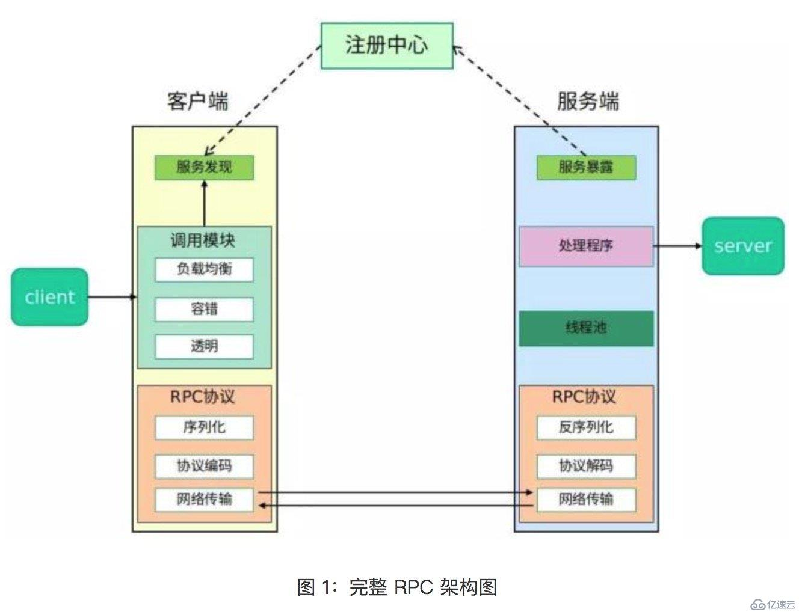
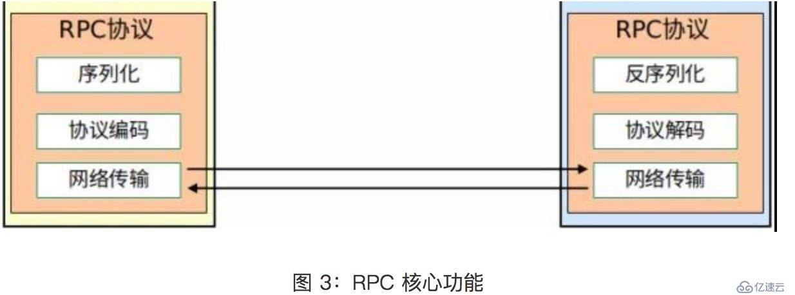
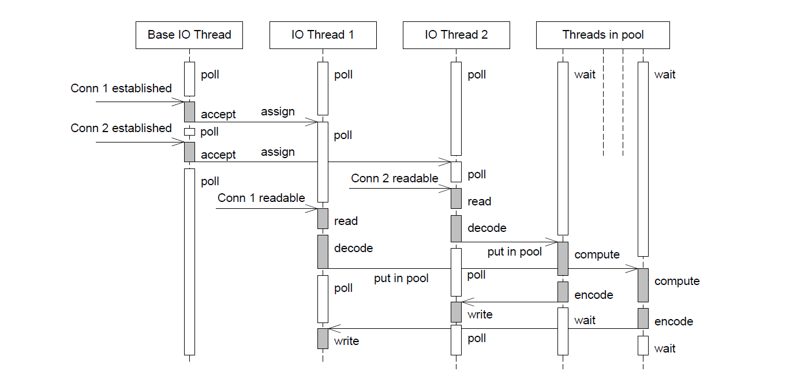

# RPC
为了实现服务可重用或者说系统间的交互调用、解耦

### RPC 要解决的三个问题

RPC要达到的目标：远程调用时，要能够像本地调用一样方便，让调用者感知不到远程调用的逻辑。

- **Call ID映射**。我们怎么告诉远程机器我们要**调用哪个函数呢**？在本地调用中，函数体是直接通过函数指针来指定的，我们调用具体函数，编译器就自动帮我们调用它相应的函数指针。但是在远程调用中，是无法调用函数指针的，因为两个进程的地址空间是完全不一样。所以，在RPC中，**所有的函数都必须有自己的一个ID**。这个ID在所有进程中都是唯一确定的。客户端在做远程过程调用时，必须附上这个ID。然后我们还需要在客户端和服务端分别维护一个 {函数 <--> Call ID} 的对应表。两者的表不一定需要完全相同，但相同的函数对应的Call ID必须相同。当客户端需要进行远程调用时，它就查一下这个表，找出相应的Call ID，然后把它传给服务端，服务端也通过查表，来确定客户端需要调用的函数，然后执行相应函数的代码。
- **序列化和反序列化**。客户端怎么把参数值传给远程的函数呢？在本地调用中，我们只需要把参数压到栈里，然后让函数自己去栈里读就行。但是在远程过程调用时，客户端跟服务端是不同的进程，**不能通过内存来传递参数**。甚至有时候客户端和服务端使用的都**不是同一种语言**（比如服务端用C++，客户端用Java或者Python）。这时候就需要客户端把参数先转成一个字节流，传给服务端后，再把字节流转成自己能读取的格式。这个过程叫序列化和反序列化。同理，从服务端返回的值也需要序列化反序列化的过程。
- **网络传输**。远程调用往往是基于网络的，客户端和服务端是通过网络连接的。所有的数据都需要通过网络传输，因此就需要有一个网络传输层。网络传输层需要把Call ID和序列化后的参数字节流传给服务端，然后再把序列化后的调用结果传回客户端。只要能完成这两者的，都可以作为传输层使用。因此，它所使用的协议其实是不限的，能完成传输就行。尽管大部分RPC框架都使用TCP协议，但其实UDP也可以，而gRPC干脆就用了HTTP2。Java的Netty也属于这层的东西。

### 实现高可用RPC框架需要考虑到的问题

- 既然系统采用分布式架构，那一个服务势必会有多个实例，要解决**如何获取实例的问题**。所以需要一个服务注册中心，比如在Dubbo中，就可以使用Zookeeper作为注册中心，在调用时，从Zookeeper获取服务的实例列表，再从中选择一个进行调用；
- 如何选择实例呢？就要考虑负载均衡，例如dubbo提供了4种负载均衡策略；
- 如果每次都去注册中心查询列表，效率很低，那么就要加缓存；
- 客户端总不能每次调用完都等着服务端返回数据，所以就要支持异步调用；
- 服务端的接口修改了，老的接口还有人在用，这就需要版本控制；
- 服务端总不能每次接到请求都马上启动一个线程去处理，于是就需要线程池；

#### ` ProtoBuf ` 与  `json ` 的优缺点对比

+ `json` 没有类型，而 `protobuff ` 是具有类型的，更好的融入编程语言

+ `json`是文本传输，`protobuff` 是二进制传输，后者解析速度更加快，序列化数据非常简洁、紧凑。

#### 为什么需要序列化

序列化就是将一个结构对象转换成字节流的过程。那为什么需要序列化？

+ 为了跨网络传输
+ 持久化存储

即使不序列化，依然可以传输，即结构对象本身也可以跨网络传输和持久化存储。

- 序列化所做的工作除了将数据以二进制存入本地外，还要提供筛选数据，防止重复存储等功能。但是如果直接赋值内存中的数据，肯定达不到筛选数据，防止重复存储等功能。
- 跨平台、或者跨语言时，这个序列化方式就显得更重要了。例如，可以将 `java` 对象序列化成 `xml`、 `json` 形式。这样即使是 `python` 等非`java`语言都可以直接使用这个xml 或者json 对象得到自己需要的信息了

我对序列化的理解就是 **序列化使得对象信息更加普通化，可读化**（`xml`、`json`）。这样就可以使得别的进程，别的语言，别的平台都能够知道这个对象信息，从而保证了**对象信息的持久化**

#### [`RPC` 设计 ](https://www.yisu.com/zixun/8540.html)



+ 网络传输
+ 协议编码
+ 序列化与反序列化的设计与考量，比如兼容性。
+ 远程接口的代理实现
+ 服务负载均衡、容错

`Rpc` 的核心功能



下面分别介绍核心 RPC 框架的重要组成：

- `Client`：服务调用方。
- `Client Stub`：存放服务端地址信息，将客户端的请求参数数据信息打包成网络消息，再通过网络传输发送给服务端。
- `Server Stub`：接收客户端发送过来的请求消息并进行解包，然后再调用本地服务进行处理。
- `Server`：服务的真正提供者。
- `Network Service`：底层传输，可以是 TCP 或 HTTP。

在 `client/server stub` 部分进行编码与解码、序列化与反序列化。在 `server stub` 中一般会建立一个哈希表，`call Id` 与对应的函数建立映射关系。这个`call Id`可以是字符串，也是可以是数字，用来标识对应的函数。 

### Rpc底层网络库的模型部分

本质上是个 多个 `EventLoop` 线程  + 线程池。前者用于处理IO事件，后者主要用于处理计算密集型。线程池可以自己选择，如果当前任务计算量比较大可以交由线程池进行计算，不大的可以直接在 `EventLoop` 线程中计算。



### `Libnet`  中的  `TimeWheel`设计细节

#### 时间轮的设计


时间轮的每个槽（ *`slot`* ）都连着一个定时器链表。时间轮以恒定的速度顺时针转动，每转动一次，就指向下一个槽（*`slot`*）。每次转动就称为一个滴答（*`tick`*），一个滴答的时间称为时间轮的槽间隔 `si`（*`slot interval`*），实际上就是心搏时间。

该时间轮共有N个（*`slot`*），因此运行一周的时间是 **`N*si`**。因此，每个槽的定时器链表的定时器具有相同的特征：他们的定时时间相差  **`N*si`**  的整倍数。

假如现在指针指向槽 *cs* （*current slot*），我们要添加一个定时时间为 `ti` 的定时器，则该定时器将插入到槽 `ts` （*`timer slot`*）对应的链表中：
$$
t_s = (c_s + (t_i / s_i))  \% N
$$

#### 时间轮复杂度

时间论采用的是 *hashtable* 的思想：将定时器散列到不同的链表中。这样每条链表上的定时器数目都将明显少于原来的排序链表上的定时器数目，这样插入的操作的效率基本不受定时器数目的影响。

要提供定时器精度，要使得时间轮的 **`si`** 值要小。要提高执行效率，类似于 *hashtable* ，则要求N值足够大。

#### 时间轮的驱动

在我的 **`WebServer`** 中的项目设计的时间轮：

```cpp
class TimerWheel { 
public:
  TimerWheel(EventLoop* loop, uint32_t timeout=0);
  ~TimerWheel() = default;

  void start(); 
  void insert(ConnectionPtr conn);
  void insertNew(ConnectionPtr conn);

  void setTimeout(uint32_t timeout) { expired_ = timeout; }
private:  

  void wheelCallback(); 

  uint32_t index_;
  uint32_t expired_;
  Timer    timer_;

  std::vector<std::unordered_set<std::shared_ptr<ConnectionItem>>> wheels_;
}; // class TimerWheel
```

整个时间轮的转动是由 `timer_` 来驱动的，每次定时器触发一次时间轮就转动一次，因此时间轮的精度 **`si`** 是取决于定时器 `timer_` 的精度。

在上面的时间轮中设计是 数组作为时间轮，每个 **`slot`** 指向的是  **`std::unordered_set`**。最终的时间轮超时函数任务是在  **`wheelCallback()`**  中执行。

```cpp
TimerWheel::TimerWheel(EventLoop* loop, uint32_t timeout) 
: index_(0), 
  expired_(timeout), 
  timer_(loop, 1000, 1000, std::bind(&TimerWheel::wheelCallback, this)) 
{ }

void TimerWheel::start() { 
  if(expired_) 
  {
    wheels_.resize(expired_); 
    timer_.start();
  }
}

void TimerWheel::wheelCallback() { 
  if(! expired_) 
    return;
  // 定时器每触发一次，时间轮的就转动一次，即指针就加1
  if(++index_ == expired_) { 
    index_ =0;
  }
  // 使得 index_ 这个槽的都被清除了
  // 这个是设计是存在问题的
  wheels_[index_].clear();
}
```

为什么要使用 **`std::unordered_set`** ，应该是使用链表，因为没有使用到查找   **`std::unordered_set`** 的查找功能。

#### 定时器设计

一个 `EventLoop` 的循环流程一般是如下

```cpp
//线程函数
void thread_func(void* thread_arg)
{

    while (!m_bQuitFlag)
  	{
      handle_timer_event();		// 调用触发的超时任务
      epoll_or_select_func();
      handle_io_events();
      handle_other_things();
    }

	//这里做一些需要的清理工具
}
```

如上图，一般会根据 `epoll_wait` 或者 `select` 函数来触发定时器，每轮都是会进行触发一些超时的定时器。


