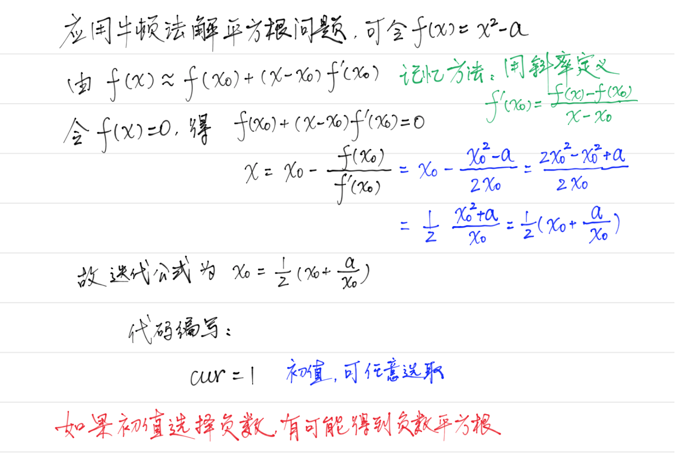

# 数学

最大的问题是考虑边界：
+ 负数转为正数时，可能会溢出：负数最大`-2147483648`，而正数最大为`2147483647`，因此在求绝对值时可能溢出。 
+ 在求除数，分母为0时，异常
+ 求和时，也要防止溢出：`if(sum > INT_MAX/10 || sum == INT_MAX/10 && num>7) return;`
+ 有时，加法和减法同样能完成一个任务时，可以考虑减法，因为加法会溢出。同样，除法相比乘法，避免溢出。

    比如[阶乘后的零](https://leetcode-cn.com/problems/factorial-trailing-zeroes/)这道题，使用乘法会溢出。为避免溢出使用更大数据范围的`long long`数据类型。使用乘法/加法更加符合直觉。当出现溢出时，不妨考虑除法/减法。
    ```cpp
        class Solution {
        public:
          int trailingZeroes(int n) {
              long long div = 5;
              int cnt=0; 
              while(div <= n) { 
                  cnt += n/div;
                  div*=5;   // 溢出防范
              }
              return cnt;
          }-+
       };
    ```
    但是换用除法，就可以直接避免这个问题。
    ```cpp
        int trailingZeroes(int n) {
            int cnt=0; 
            while(n >0) { 
                cnt += n/5;
                n /=5;
            }
    
        return cnt;
        }
    ```
+ 在遇到大数问题，如果数字无法表示，可以使用字符产表示。在数字不能很好的解决时，可以考虑转为字符串解决。[最大数](https://leetcode-cn.com/problems/largest-number/)问题为比较两个数之间的大小，直接用数字较难。但是转换为字符串比较好，就很轻松解决。
    ```cpp
        struct Compare { 
          bool operator()(const std::string& lhs, const std::string& rhs) const { 
              return lhs + rhs > rhs + lhs;
          }
        };
    	// 或者
    	auto compare = [](const std::string& lhs, const std::string& rhs) 
        			  { 
            			return lhs + rhs > rhs + lhs; 
        			  };
    ```

## 计算器三连
### [基本计算器](https://leetcode-cn.com/problems/basic-calculator/)
```cpp
class Solution {
public:
    int calculate(std::string express) {
      std::stack<int> path;
      int sign = 1, res = 0;
      int length = express.length();

      for(int i = 0; i < length; i++) {
        char ch = express[i];

        // 遇到数字就计算出来
        if(::isdigit(ch))
        {
          int value = ch - '0';
          while(i + 1 < length && ::isdigit(express[i+1])) {
            ++i;
            value = value * 10 + (express[i] - '0');
          }
          // 前面的符号 sign
          res = res + sign * value;
        }
        else if(ch == '+')
        {
          sign = 1;
        }
        else if(ch == '-')
        {
          sign = -1;
        }
        else if(ch == '(')
        {
          path.push(res);
          path.push(sign);
          res = 0;
          sign = 1;
        }
        else if(ch == ')')
        {
          int op  = path.top(); path.pop();
          int num = path.top(); path.pop();
          res = op * res + num;
        }            
      } // for-end
      
      return res;        
    }
};
```
### [基本计算器II](https://leetcode-cn.com/problems/basic-calculator-ii/)
这个情况是没有小括号，仅仅是实现基本的四则运算。没有小括号的时候，就是直接按照加减乘除进行运行。从左到右入队列，**遇到加减不运算，只是在乘除才运算**。[下面这个答案很巧](https://leetcode-cn.com/problems/basic-calculator-ii/comments/32510)，巧妙之处在于将加减元素直接处理为正负号，而只是运算乘除。
```cpp
class Solution {
public:
    int calculate(std::string express) {
        int result =0, value=0;
        int length = express.size();
        // sign 表示的是当前数字前面的符号，默认是加号
        char sign = '+';
        std::stack<int> nums;

        for(int i=0; i < length; ++i) {  
            char ch = express[i];
            if(isdigit(ch)) 
            {  
                value = value * 10 + (ch -'0');
            }

            /// @brief: 没有遇到符号就会一直加，遇到符号就会进行相应的运算
            if((!isdigit(ch) && ch != ' ') || i == length -1) {  
                if(sign == '+') 
                { 
                    nums.push(value);
                }
                else if(sign =='-')
                {
                    nums.push(-value);
                }
                // 当前value数字前面是 * / 运算符号  
                // 即 此时的数字 value 是第二个操作数，要开始运算了
                else if(sign == '*' || sign == '/') {  
                    int firstNum = nums.top(); nums.pop();
                    nums.push(sign == '*' ? firstNum * value : firstNum / value);
                }

                value =0;
                sign = ch;
            }
        } // for-end
        
        while(!nums.empty()) {  
            result += nums.top();
            nums.pop();
        }

        return result;
    }
};
```
### [基本计算器III](https://leetcode-cn.com/problems/basic-calculator-iii/)
这道题在上一题的基础上，加上左右括号的解析。基本流程没有改变。
```cpp
class Solution {
public:
    int calculate(string expression) { 
        int index=0;
        return __calculate(expression, index);
    }
private:
    int __calculate(const std::string& expression, int& index) {  
        char sign ='+';  		// 值前面的符号
        std::stack<int> path;

        for(int64_t value=0; index < expression.size(); ++index) {  
            char ch = expression[index];
            // 遇到数字了
            if(::isdigit(ch)) 
            { 
                value = value * 10 + (ch -'0'); // 计算每次的值
            }
			// 遇到了左边的括号
            if(ch == '(') 
            {  
              ++index; // 跳过 '('
              value =  __calculate(expression, index); // 计算括号内的值，形成一个递归
              // 此时 index 指向左括号对应的右括号位置
            }
			// 遇到符号了 or 到达表达式末尾
            if((!isdigit(ch) && ch != ' ') || index == expression.size()-1) {  
                if(sign == '+') 
                { 
                    path.push(value);
                }
                else if(sign =='-') 
                { 
                    path.push(-value);
                }
                else if(sign =='*' || sign =='/') 
                {  
                    int firstNum = path.top(); path.pop();
                    path.push(sign == '*' ? firstNum * value : firstNum / value);
                }

                sign = ch;
                value =0;
            }

            // 局部计算完毕，(...)
            if(ch ==')') 
                break;
        }
	
        int result=0;
        while(!path.empty()) { 
            result += path.top(); 
            path.pop();
        }
        
        return result;
    }
};
```
## K进制与K-伪进制
### [字符转数字](https://leetcode-cn.com/problems/decode-ways/)
```cpp
class Solution {
public:
    int numDecodings(string str) {
        if(str.empty() || str.front()=='0') return 0; 

        int length = str.length();

        int dp[length];  
        dp[length-1] = str.back() =='0' ? 0 : 1;

        for(int i=length-2; i >=0; --i) {   
            // 以 0 开始的字符
            if(str[i] =='0') { 
                dp[i] = 0;
                continue;
            }

            dp[i] = dp[i+1];

            int dec = str[i]  - '0';
            int sig = str[i+1] - '0';
            int sum = dec * 10 + sig;

            if(sum > 26 && sig==0 ) return 0; 

            // 大于10是为了排序以0开头的
            if(10 <= sum  && sum <= 26) {
                if(i < length-2) 
                    dp[i] += dp[i+2];
                else 
                    dp[i] += 1;
            }
        }

        return dp[0];
    }
};

```
### [数字转字符](https://leetcode-cn.com/problems/ba-shu-zi-fan-yi-cheng-zi-fu-chuan-lcof/)
```
题目：
给定一个数字，我们按照如下规则把它翻译为字符串：0 翻译成 “a” ，1 翻译成 “b”，……，11 翻译成 “l”，……，25 翻译成 “z”。一个数字可能有多个翻译。请编程实现一个函数，用来计算一个数字有多少种不同的翻译方法
```
动态规划。`dp[i]`表示从`i`到结束有多少种不同的翻译方法。
```cpp
class Solution {
public:
    int translateNum(int num) {
        std::string digits(std::to_string(num));
        
        int length = digits.size();

        int dp[length] = { 0 }; // dp[i] : i~end 的翻译方法，最终的目标就是 0~end
        dp[length-1] = 1;

        for(int i = length-2; i >=0; --i) {  
            dp[i] = dp[i+1];

            int dec = digits[i] -  '0';
            int sig = digits[i+1] - '0';
            int sum = dec * 10 + sig;
            // 大于10是为了排除以0开始的字符
            if(10 <= sum && sum < 26) {
                if(i < length-2) 
                    dp[i] += dp[i+2];
                else 
                    dp[i] +=1;
            }
        }
        
        return dp[0];
    }
};
```
## 两数相除
边界处理
```cpp
class Solution {
public:
    int divide(int dividend, int divisor) {
        if(divisor ==0 || divisor ==1) return dividend; 
        
        if(divisor ==-1) {  
            if(dividend == INT_MIN) return INT_MAX;

            return -dividend; 
        }

        // 负数
        bool neg = (dividend > 0 && divisor < 0) || (dividend < 0 && divisor > 0);
        int ret =0;

        //处理b为特殊值的情况
       if( divisor == INT_MIN){ 
            return dividend == INT_MIN ? 1 : 0;
        }

        //处理a为特殊值的情况
        if(dividend == INT_MIN){ 
            dividend =  neg ? dividend + divisor : dividend - divisor;
            ++ret;
        }

        dividend = std::abs(dividend);
        divisor  = std::abs(divisor);

        ret += __divide(dividend, divisor);

        return neg ? -ret : ret;
    }

private:
    int __divide(int dividend, int divisor) {  
        if(dividend < divisor) 
            return 0;

        int cnt = 1; 
        int cur = divisor;

        // divisor 可能会溢出，如果发生了溢出，左移会变小
        while(dividend - cur >= cur) { 
            cnt +=cnt;   
            cur +=cur;
        }

        return  cnt ==1 ? cnt : cnt + __divide(dividend - cur, divisor);
    }
};
```
## [数独](https://leetcode-cn.com/problems/valid-sudoku/)
简化提速技巧，经常用数组来代替`hash`表：只是出现一次。
```cpp
class Solution {
public:
    typedef std::vector<std::vector<char>> vectorSet;
    bool isValidSudoku(vectorSet& board) {
        
        constexpr int N = 9;

        std::vector<std::vector<int>> col(std::vector<int>(N, 0)); 
        bool row[N][N]; ::memset(row, 0, sizeof(row));
        bool box[N][N]; ::memset(box, 0, sizeof(box));

        for(int i=0; i <N; ++i) 
        {   
            for(int j=0; j<N; ++j) 
            { 
                if(board[i][j] == '.') 
                {
                    continue;
                }   
                
                int val = board[i][j] - '1'; // 让 1~9 变成 0~8
                int idx = i / 3 * 3 + j / 3; // 第几个3*3的小方格
                if(row[i][val] || col[val][j] || box[idx][val]) 
                { 
                     return false;
                }
                else 
                {   
                    box[idx][val] = true;
                    col[val][j]   = true;
                    row[i][val]   = true;
                }
            }
        }

        return true;
    }
};
```
## [求幂](https://leetcode-cn.com/problems/powx-n/)  

这题肯定不是用累乘的方法。如何快速地求解。比如求 $2^19$，可以将n = 19 化为二进制：`0001 0011` 。
$$
2^{19}= 2^1 \cdot 2^1 \cdot 2^{16}
$$
各项幂次对应的就是二进制表示。那么由此可知：
$$
a^b = a^{b_0} \cdot a^{b_1} ... a^{b_m}
$$

```cpp
class Solution {
public:
    double myPow(double x, int n) {
        if(x ==0.0) return 0.0;
        if(n ==0)   return 1;
        
        uint64_t cnt =n;  // 为了防止溢出
		
        if(n < 0) { 
            cnt = -cnt;
            x = 1/x;
        }

        double rst = 1.0;
        while(cnt) { 
            if(cnt & 1) rst *=x;  // 只是乘那些二进制中为1的部分
            x *=x;
            cnt >>=1;
        }

        return rst;
    }
};
```

+ 时间复杂度为`O(1)`
+ 空间复杂度为`O(n)`

## [求平方根](https://leetcode-cn.com/problems/sqrtx/)
牛顿迭代法  

 

```cpp
	class Solution{ 
    public:
    int mySqrt(int x) {

        int64_t n = x;
        // 需要找到第一个 n * n <=x
        // 如果不满足，就是需要递归
        while(n*n > x) { 
            n = (n + x/n) >>1;
        }

        return n;
    }
};
```
## 分数转小数 
对于小数部分，使用一个hash表来存储每一位`[K, V]`--[小数，在字符串中的下标]。当 “余数/分母” 出现相同的余数，即开始出现循环了。
+ 考虑边界情况： -1,-2147483648,分子分母0。
```cpp
class Solution {
public:
    std::string fractionToDecimal(int numerator, int denominator) {
        if(denominator == 0) return "";
        if(numerator ==0)    return "0";

        int64_t numera = static_cast<int64_t>(numerator);
        int64_t denom  = static_cast<int64_t>(denominator);

        std::string result;
        if((numera >0) ^ (denom >0))  { 
            result.push_back('-');
        }

        numera = std::abs(numera); denom  = std::abs(denom);

        result.append(std::to_string(numera/denom)); 

        int64_t remainer = numera % denom; // 余数
        if(remainer ==0) return result;     // 整除
        
        // 小数部分
        result.push_back('.');
        int32_t index  = result.size()-1;
        
        std::unordered_map<int, int> map_; // 数字 - 在result中的下标
        
        while(remainer && map_.find(remainer) == map_.end()) {
            map_[remainer] = ++index;
            remainer *=10;
            result.append(std::to_string(remainer / denom));  
            remainer = remainer %denom;
        }

        if(remainer !=0) { 
            result.insert(map_[remainer], "(");
            result.push_back(')');
        }

        return result;
    }
};
```
## [计数质数](https://leetcode-cn.com/problems/count-primes/)
判断一个数是否是质数，`O(logn)`时间复杂度
``` cpp
    bool isPrime(int n) {	
        if(n ==2) return true;
        if(n ==3) return true;
        if(n ==5) return true;

        if(n % 6 !=1 && n % 6 !=5) return false;
    
        for(int i=5; i <=sqrt(n); i+=6) {
            if(n%(i)==0 || n%(i+2)==0) 
                return false;
        }
        return true;
    }
```
## 计算质数个数
但是计算有多少个，有单独的方法。
```cpp
class Solution {
public:
    int countPrimes(int n) {
        std::vector<bool> isPrime(n, true);

        for(int i=2; i*i < n; ++i) {
            if(isPrime[i] ==false) continue;

            for(int j=i*i; j < n; j+=i) { 
                isPrime[j] = false;
            }  
        }

        int count =0;
        for(int i=2; i < n; ++i) { 
            if(isPrime[i]) count++; 
        }
        return count;
    }
};
```
## [字符串相乘](https://leetcode-cn.com/problems/multiply-strings/)
字符串相乘，可以解决相乘导致溢出的问题。

方法：字符串`num1`和字符串`num2`相乘，最大可能长度是`num1.size() + num2.size()`，比如两个一位数相等最大可能是两位数。那么就是可以直接填充结果
```cpp
class Solution {
public:
    std::string multiply(std::string num1, std::string num2) {
      if(num1.empty() || num2.empty()) return product;
      if(num1 == "0"  || num2 == "0") return "0";

      std::vector<int> value(num1.size() + num2.size());
	 // 从尾向头乘，即从低位向高位乘
      for(int i=num1.size()-1; i >=0; --i) { 
        int n1 = num1[i] - '0';
        for(int j=num2.size()-1; j >=0; --j) { 
          int n2  = num2[j] -'0';
           // value[i+j+1] 是前一步运算的进位
          int sum = value[i+j+1] + n1*n2;
          value[i+j+1] = sum % 10;  // 个位
          value[i+j]  += sum /10;   // 十位，表示是否进位
        }
      }
    
      product.reserve(value.size()); 
      for(int i=0; i < value.size(); ++i) { 
        if(i ==0 && value[0] ==0) 
          continue;

        product.push_back(value[i]+'0');
      }

      return product;
    }
private:
  std::string product;
};
```
## [格雷编码](https://leetcode-cn.com/problems/gray-code/)
这题，[详细解答见题解](https://leetcode-cn.com/problems/gray-code/solution/gray-code-jing-xiang-fan-she-fa-by-jyd/)。很强的技巧性。
```cpp
class Solution {
public:
  std::vector<int> grayCode(int n) {
    std::vector<int> result{0};

    result.reserve(std::pow(2, n));
    
    for(int head=1, idx=0; idx < n; ++idx) {
      // 逆序加1
      for(int j=head-1; j >=0; --j) 
      {
        result.emplace_back(head + result[j]);
      }
      // 依次在 2 、4、6、8...等位上加上1
      head <<=1;  
    }

    return result;
  }
};
```
## [等概率生成器](https://www.cnblogs.com/lfri/p/12427656.html)
问题：
+ 已知一随机发生器，产生0的概率是p，产生1的概率是1-p，现在要你构造一个发生器，使得它构造0和1的概率均为1/2；
+ 构造一个发生器，使得它构造1、2、3的概率均为1/3；…， 
+ 构造一个发生器，使得它构造1、2、3、…n的概率均为1/n，要求复杂度最低。

解决方法：  

原始的随机数生成器，生成0的概率为p，生成1的概率为1-p，那么怎么构造才能使得生成0和1的概率相等呢。或者说有两个独立的事件的概率是相等呢？

这样来做一下，让该随机数生成器生成两个数，那么序列是 `00,01,10,11` 概率分别为 `p*p`,`p(1-p)`,`(1-p)p`,`(1-p)*(1-p)`。很明显，这四种情况中存在两个独立的事件概率是相等。也就是 `01` 和 `10` ，那么我把 `01` 看成是 `0`, `10` 看成是`1`，那么他们输出的概率均为 `p(1-p)`，其他的情况舍弃。这样就得到了0和1均等生成的随机器了。

这种解法可以推广到n个数的情况，我们知道，取n个随机数发生器，存在n个概率相同的独立事件，我们只使用这n个事件就得到1/n的概率了。例如n=3,有8中情况000,001,010,011,100,101,110,111，其中001,010,100的概率都是p^2*(1-p)。

## 被3整除
```
题目描述
小Q得到一个神奇的数列: 1, 12, 123,...12345678910,1234567891011...。并且小Q对于能否被3整除这个性质很感兴趣。小Q现在希望你能帮他计算一下从数列的第l个到第r个(包含端点)有多少个数可以被3整除。

输入包括两个整数l和r(1 <= l <= r <= 1e9), 表示要求解的区间两端。输出一个整数, 表示区间内能被3整除的数字个数。
```
### 分析 
[来源：牛客网](https://www.nowcoder.com/questionTerminal/51dcb4eef6004f6f8f44d927463ad5e8?f=discussion)  

能被3整除的数的特征：各个数位上数字之和能被3整除
>推广：不是一个数字一个数字地拆分，把某个数视为字符串划分为多个任意长度的数字字符串，比如a=137928672拆成b=137，c=9286，d=72，那么有a%3=(b+c+d)%3

题中数组`A`第`i`个数`A[i]`是从1写到`i`的数，根据推广的结论把它拆成`1,2,3,4,5,...,i`，则有：`A[i] % 3=(1+2+3+...+i) % 3`。而自然数序列`1,2,3,4,5...i`取模3的结果分别是`1,2,0,1,2,0,...,i % 3`，也就是：`A[i] % 3=(1+2+0+1+2+0+...+i%3)%3`。因为`1+2=3`能被3整除，只要序列中1和2个数相同，`A[i]`也能被3整除：
+ 当`i%3=0`时，括号内是`1,2,0`的重复序列，当然能被3整除
+ 当`i%3=2`时，括号内是`1,2,0`重复序列最后跟上1,2，末尾没有0但还是能被3整除
+ 当`i%3=1`时，显然`A[i]%3=1`不能被3整除。

```cpp
    #include<stdio.h>

    /*func(x)表示正整数1~x中除3余数不为1的数的个数*/
    // 为什么？
    inline int func(int x) {  
        return x / 3 *2  + (x % 3 == 2 ? 1 : 0);
    }

    int main(){

        int l,r;
        while(~scanf("%d %d",&l,&r))
        {
            printf("%d\n",func(r)-func(l-1));
        }
    }
```
## 数对
[题目描述](https://www.nowcoder.com/practice/bac5a2372e204b2ab04cc437db76dc4f?tpId=98&tqId=32828&tPage=1&rp=1&ru=/ta/2019test&qru=/ta/2019test/question-ranking)
### 分析
x可以在`[1, n]`上取，但是`y`只能在`[k, n]`上取，因为`k`以下都不存在大于等于`k`的余数。 **所以遍历`y`，对于每一个`y`，统计符合的`x`的个数，加到`count`里**。

先假设`x`可以从`[0, n]`中取值，那么这段区间至少可以分成`(n/k)`个完整的、长度为`y`的区间。
```
x = [0，1……y-2，y-1] [y，y+1，……，2y-2，2y-1] ... [……，n]

其中，最后一个区间可能不是完整的y个长度。
```
在每个小区间a上，第`i`个数`a[i]%y`的余数是`i`。这样每一小段上大于等于k的x有`y-k`个（显然当k=0时，y个数都满足题意）。
```
[0，1,..., k, k+1, ..., y-1]
```
这样，已经遍历的总数是`(n / y) * y`，而其中满足条件的x的总数是`(n / y) * (y - k)`。因为 **`n = (n / y) * y + n % y`** ， 所以还没遍历的数有 `n+1 - (n / y)*y = n+1 - (n - n % y) = 1 + n % y` 个，令它为`t`。因为 `n % y∈[0, y-1]`， 则`t∈[1, y]`。

也就是说这种方法，至少剩了一个数，至多会把一个整区间（数量为y）都剩下来。但是无论如何，这个区间`last`的第i个数`last[i]%y`一定是i。则最后一个数（n）的余数就是`n % y`。如此一来，此区间内从 `[k,n % y]` 包含共计 `n % y-k+1` 个数。不过如果算出小于0的数，则不需要减回去，直接当没有就可以了。所以最后一个区间里包含了 `max(n % y-k+1, 0)` 个满足条件的`x`。

最后注意，这里实际上枚举了`x∈ [0, n]`所有的数字，当`k==0`的时候，多统计了一个0，必须减掉。

### 代码实现
```cpp
#include <iostream> 
#include <algorithm>

int main() {
    int n, k;  
    std::cin>> n;
    std::cin>>k;
   
    long long count = 0;  // 统计满足条件的x个数
    for (int y = k + 1; y <= n; ++y) { 
      count += (n / y) * (y - k) + std::max( n % y + -k +1, 0); 
      if (!k)  
        count--; 
    } 
   
    std::cout<<count<<std::endl;
   
    return 0;
}
```
### 总结下
关键点：
+ 将问题转换为求满足条件的x个数
+ **`n = (n / y) * y + n % y`**，将n拆分为两个部分，前面是区间长度是y的个数，后面是不满y的区间长度
+ 引入0。因为要使得区间长度为`[0，1,..., k, k+1, ..., y-1]`。而原本的题目中x属于的`1~n`。这也使得在`k=0`时需要减去这个引入的0。
+ 利用余数求解

## [vivo-数位之积](https://www.nowcoder.com/test/question/done?tid=33770110&qid=925106#summary)

```
题目：
现给定任意正整数 n，请寻找并输出最小的正整数 m（m>9），使得 m 的各位（个位、十位、百位 ... ...）之乘积等于n，若不存在则输出 -1
```
思路：因为求的是满足条件的最小值。因为，从 `9、8、7、...、2` 依次查找最大的能被`n`整除的数。如此循环。代码比较容易懂。
```-cpp
class Solution { 
public:
  int solution(int n) {
    if( n < 10) return 10+n; // 1 放到10位数上，所以是10
    
    int result=0;
    for(int base=1, idx=9; idx > 1; --idx) { 
      while(n % idx ==0) { 
        result += idx * base;
        base *=10;
        n /= idx;
      }
    }

    return n > 1 ? -1 : result; // 找到满足要求的数，n应该是1
  }
};
```