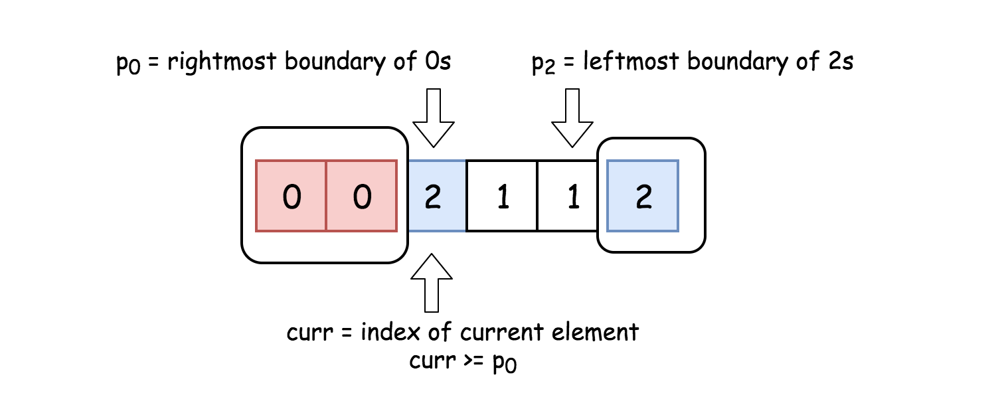

# 数组

## 前缀和问题
在求取**数组区间**相关问题，前缀和这一技巧很有用。前缀和的思路是这样的：对于一个给定的数组 nums，我们 **额外开辟一个前缀和数组进行预处理** ：

比如求取`nums[i..j]`的和，多次调用这个接口，那么时间复杂度就会很高。如果使用一个前缀和处理下：
```cpp
    int n = nums.size();
    // 前缀和数组
    std::vector<int> preSum(n+1);
    preSum[0] = 0;
    for (int i = 0; i < n; i++)
        preSum[i + 1] = preSum[i] + nums[i];
```

那么计算`sum(i,j)`只是需要 `preSum(j+1) - preSum(i)` 。`O(1)`的时间复杂度完成。

+ 既有正数也有负数，使用前缀和
+ 全是正数，使用双指针
+ 在优化减少嵌套循环时，经常可以考虑 `hashtable`，可以减少一层`for/while`循环。

### [和为K的最长子数组]()
前缀和：求出以数字`j (0 <= j < n)`为结束的且累加和 `k` 的最长子数组，再求完所有的位置的数字的最长子数组，那么答案就在其中了。时间复杂度为 $O(n^2)$，空间复杂度 $O(n)$

优化：假设`K =40`，以位置 `j` 结尾的子数组`nums[i, j]`区间和是 `100` ，那么这个子数组的首数字`nums[i]`累加到第一次出现的`60`的地方`pos`，那么 `pos` 到 `j` 的距离，就是以 `j` 结尾的最长子数组。根据这个逻辑，就可以求出最长子数组。
```cpp
class Solution{
     int maxLength(std::vector<int> arr,  int k) { 
        if(arr.empty()) return 0;

        std::unordered_map<int, int> map_; // 位置 - 索引
        map_.emplace(0,-1);    // 哨兵节点
        int len =0;
        int sum =0;
        for(int j=0; j < arr.size(); ++j) { 
            sum += arr[j];    // 以j结尾的子数组和

            // 求以j结尾的子数组中是否包含 sum-k
            // nums[i, j] --> nums[i, t] U nums[t+1, j]
            if(map_.find(sum-k) != map_.end()) 
            {
                len = std::max(j - map_[sum -k], len);
            }

            // 记录以 j 为结尾的子数组和
            // 如果之前已经存在，那么就只记录第一次
            if(map_.find(sum) == map_.end()) {
                map_.emplace(sum, j);
            }
        }

        return len;
    }
};
```

#### 扩展
```
一个连续子数组中，奇数和偶数相等的最长子数组，或者1和2相等的最长的子数组等类似问题，都可以化为这个问题：将奇数设计为-1，偶数设计为1，那么就是求和为0的最长子数组。
```

### [长度最小的子数组](https://leetcode-cn.com/problems/minimum-size-subarray-sum/)
这题数组里全是正数，可以省去 `map` 使用双指针：开始时 `L, R` 都是指向开头
+ `sum[L, R] <  target`时，++R
+ `sum[L, R] >=  target`时，++L，并且更新最短长度
```cpp
  class Solution {
  public:
      int minSubArrayLen(int target, const std::vector<int>& nums) {
        if(nums.empty()) return 0; 

        int L=0, R=1, sum=nums[0];
        int minLength =INT_MAX;
        int len = nums.size();
        while(R < len) { 
          if(sum < target) 
          { 
            sum += nums[R];
            ++R;
          } 
          else 
          {
            minLength = std::min(minLength, R-L); 
            sum -= nums[L];
            ++L;
          }
        }
        // 因为 L 还没到头，仍然可能满足条件
        while(L < len && sum >= target) { 
          minLength = std::min(minLength, len - L);
          sum -= nums[L];
          ++L;
        }

        return minLength == INT_MAX ? 0 : minLength;
      }
  };
```

## 数据与桶排序
### [最大间距](https://leetcode-cn.com/problems/maximum-gap/)
桶排序： 

桶的数量 `N` 比数组元素个数多1。遍历一次数组，找出数组中的最大值`max`和最小值`min`，并且将数组元素以间隔 $(max - min) /(N+1)$ 分配到各个桶中。再遍历一次，将数放到各自的桶中。0号桶肯定有放最小的数，N号桶肯定有放最大的数。

> 相邻数：即排序好之后相邻两个差值最大的元素。
> 
> 要么来自于桶内部，要么来自于跨桶，后一个非空桶的最小值，前一个非空桶的最大值。而设置一个空桶是为了不考虑桶内的相邻数。因为桶之间的间距肯定大于桶内数的间距。
> 
> 因此，一个桶内只需要留下两个数：这个桶区间的最大值和最小值。

代码：
```cpp
class Solution {
public:
  int maximumGap(const std::vector<int>& nums) {
    if(nums.size() <2) return 0;

    int n = nums.size();
    auto pair = std::minmax_element(nums.begin(), nums.end());
    int numsMax = *(pair.second);
    int numsMin = *(pair.first);

    if(numsMax == numsMin) return 0;

    // 如果numsMax -numsMin 的差值小于 n-1，那么 intervl 就等于0.
    int interval= std::max(1, (numsMax -numsMin) / (n-1)); // 间距 
    int buckNum = (numsMax -numsMin)/interval +1;          // 多一个空桶出来
    std::vector<Bucket> buckets(buckNum); 

    for(const auto& num : nums) { 
      int Id = (num - numsMin) / interval; // 落在第几个桶里
     
      // 更新最值
      if(buckets[Id].minval > num) 
      {
        buckets[Id].minval = num;
        buckets[Id].used = true;
      }
      
      if(buckets[Id].maxval < num)
      {
        buckets[Id].maxval = num;
        buckets[Id].used = true;
      } 
    }

    // numsMin 就是第一个桶里最小元素
    int maxGap=0, prevBucketMax = numsMin;
    for(const auto& bucket : buckets) { 
      if(!bucket.used) 
        continue;

      maxGap = std::max(maxGap, bucket.minval - prevBucketMax);
      prevBucketMax = bucket.maxval;
    }

    return maxGap;
  }

private:
  struct Bucket { 
    int minval;
    int maxval;
    bool used;

    constexpr Bucket()
    : minval(std::numeric_limits<int>::max()),
      maxval(std::numeric_limits<int>::min()),
      used(false)
    { }
  };
};
```
### [存在重复的元素III](https://leetcode-cn.com/problems/contains-duplicate-iii/)
这也是使用桶排序解决的一道题。

将每个桶的大小设置为`t+1`，使得每个桶的之间数据的距离都不大于`t`。因此如果一个桶的元素超过1，那么就是满足条件。否则去相邻的两个桶中排查，看是否存在距离小于`t`的。
+ 桶的数目就设置为k个，使得所有的桶在位置上满足条件。当桶的数目超过 `k` 个就删除最前面的桶，因为那个位置的桶已经不在当前位置的有效答案范围内。  
     ` if(i >=k) bucket.erase(getId(nums[i-k], width));`
+ 当存在负数时，为获得正确的桶id，需要一点小技巧：  
    `return x < 0 ? (x+1)/width-1 : x / width;`
+ 为了防止数据溢出，增加数据范围 : `int -> int64_t`
```cpp
  class Solution {
  public:
      bool containsNearbyAlmostDuplicate(std::vector<int>& nums, int k, int t) {
          if(t <0) return false;

          std::unordered_map<int64_t, int64_t> bucket; // id - 元素

          int64_t width = static_cast<int64_t>(t) +1;
          for(int i=0; i < nums.size(); ++i) {
              int64_t num = nums[i];
              int64_t id = getId(num, width);


              if(bucket.count(id)                                         ||
                bucket.count(id-1) && std::abs(num - bucket[id-1]) <width || 
                bucket.count(id+1) && std::abs(num - bucket[id+1]) <width )
                return true;

              // 桶的编号 - 数
              bucket.emplace(id, static_cast<int64_t>(num));
              
              // 让bucket中只有k个桶，i==k时说明，已经有k+1个桶
              if(i >=k) 
              {
                  bucket.erase(getId(nums[i-k], width));
              }
          }

          return false;
      }
  private:
      inline int64_t getId(int64_t x, int64_t width) { 
          return x < 0 ? (x+1)/width-1 : x / width;
      }
  };
```

## 数组 与hash
hash表就是由于数组实现的，很多事情，在数量量不大的时候，常用数组来实现hash表：数组下标为key，内容为value。常见的是字串映射。不仅高效，且更能提高内存利用率。

## 空间复杂度`O(1)`
限制空间复杂度为`O(1)`，使得题目较为棘手。
### [缺失的第一个正整数](https://leetcode-cn.com/problems/first-missing-positive/)
如果是有序没有缺失的数组，那么数字`nums[i]`应该出现在位置`nums[i]-1`处。
```
array :  1 2 3 4 ...
index :  0 1 2 3 ...
```
对于给出的无序数组中的`nums[i]`如果不在`nums[i]-1`处，那么就将其放到这个位置处。当对所有的元素处理完，遍历一遍就可以知道答案。
```cpp
  class Solution {
  public:
      int firstMissingPositive(std::vector<int>& nums) {
          int length = nums.size(); 

          for(int i=0; i < length; ++i) {  
              /// @brief: 将数值为 nums[i] 的数映射到下标为 nums[i] - 1 的位置
              ///         如果是0和负数， 直接忽略
              /// @b 这里是while循环
              while(0 < nums[i] && nums[i] <= length && nums[nums[i] -1] != nums[i]) { 
                  std::swap(nums[nums[i] -1], nums[i]);
              }
          }

          for(int i=0; i < length; ++i) { 
              if(nums[i] != i+1) 
                  return i+1;
          }

          return length +1;
      }
  };
```

### [缺失的数字](https://leetcode-cn.com/problems/missing-number/)
使用位运算：异或。因为`nums[i]`的范围是`[0,n]`，共`n+1`个数，而下标的范围是`[0,n-1]`，共n个数。因此肯定缺失一个正数。只需要将 `i ^ nums[i]`。但是有可能最后缺失的是n，因此需要将结果初始化为`n`。
```cpp
class Solution {
public:
    // 如果都出现了，那么数字和其下标应该是相等的
    // 第一个不等的，就是缺失的
    int missingNumber(std::vector<int>& nums) {
        int length = nums.size(); 
        int result = length; // 因为下标只能是 0~n-1d，为了弥补n，所有初始化为n

        for(int i =0; i <length; ++i) { 
            result ^= i ^ nums[i]; 
        }

        return result;
    }
};

```
### [矩阵旋转](https://leetcode-cn.com/problems/rotate-image/)
+ 从最外层到最里层，四个坐标之间的交换。
+ 为防止旋转重复，即需要考虑限制条件
```cpp
#include <vector>

class Solution {
public:
    void rotate(std::vector<std::vector<int>>& matrix) {
        
      int length = matrix.size(); 

      for(int i=0; i < (length +1)>>1; ++i) {  
        for(int j=0; j < length >>1; ++j) {  
          int c1 = length-1 -j;
          int c2 = length-1 -i;
          // 逆时针旋转
          // 从 matrix[i][j]的 上一个 位置开始
          // 到 matrix[i][j] 结束
          // 具体面试的时候，想不起就用一个点来具体化
          int start = matrix[c1][i];
          matrix[c1][i]  = matrix[c2][c1];
          matrix[c2][c1] = matrix[j][c2];
          matrix[j][c2]  = matrix[i][j];
          matrix[i][j]   = start;
        }
      }
    }
};
```
### [矩阵置零](https://leetcode-cn.com/problems/set-matrix-zeroes/)
+ 第一次遍历：位置`(i,j)` 为0，那么使得此位置的行首`(i,0)`和列首`(0,j)`都设置为0 
+ 第二次遍历：位置`(i,j)` 是否为0，取决于其行首和行尾是否是0
+ 对于第一行和第一列要单独处理，否则第一行和第一列有0，让第一行/第一列置为0，那么所有元素的行和首都是0，整个矩阵都会设置是0
  
```cpp
  class Solution {
  public:
      void setZeroes(vector<vector<int>>& matrix) {
          
        int rows = matrix.size();
        int cols = matrix[0].size();

        bool firstCol =false;

        // 先单独处理第一列
        for(int row=0; row < rows; ++row) {
          if(matrix[row][0] ==0) { 
            firstCol =true;
            break;
          } 
        }

        for(int row=0; row < rows; ++row) { 
          for(int col=1; col < cols; ++col) { 

            if(matrix[row][col] ==0) { 
              matrix[row][0] = 0; // 行首
              matrix[0][col] = 0; // 列首
            }
          }
        }

        /// @brief: 设置0
        for(int row=1; row < rows; ++row) { 
          for(int col=1; col < cols; ++col) { 

            if(matrix[row][0]==0 || matrix[0][col]==0) 
              matrix[row][col] =0;
          }
        }
        /// @biref: 第一行
        if(matrix[0][0] ==0) 
        { 
          std::fill_n(matrix[0].begin(), cols, 0);
        }
        /// @biref: 第一列
        if(firstCol) { 
          for(int row=0; row < rows; ++row) {
            matrix[row][0] =0;
          }
        }
        // return;
      }
  };
```
### [颜色分类排序-荷兰国旗问题](https://leetcode-cn.com/problems/sort-colors/)

三个指针的实现方式。 

我们用三个指针(`p0`, `p2` 和`curr`)分别来追踪 `0` 的最右边界，2的最左边界和当前考虑的元素。 

 

过程
+ 初始化0的最右边界：`p0 = 0`。在整个算法执行过程中 `nums[idx < p0] = 0`.
+ 初始化2的最左边界：`p2 = n - 1`。在整个算法执行过程中 `nums[idx > p2] = 2`.
+ 初始化当前考虑的元素序号：`curr = 0`.

`While curr <= p2 `:  
+ 若 ` nums[curr] = 0` ：交换第 `curr`个 和 第`p0`个 元素，并将指针**都向右移**。
+ 若 `nums[curr] = 2` ：交换第 `curr`个和第 `p2`个元素，并将 **`p2` 指针左移**。`curr` 与 `p2` 交换的值，`curr`未扫描，要停下来扫描一下，所以`curr`不用`++`。
+ 若 `nums[curr] = 1` ：将指针 `curr`右移
  因为`curr`左边的值已经扫描过了，所以`curr`要`++`继续扫描下一位。

```cpp
class Solution {
public:
    void sortColors(vector<int>& nums) {
        int p0 = 0;
        int curr = 0;
        int p2 = nums.size() - 1;

        while (curr <= p2) {
            if (nums[curr] ==0) 
            {
                std::swap(nums[curr++], nums[p0++]);
            }
            else if (nums[curr] ==2) 
            {
                std::swap(nums[curr], nums[p2--]);
            }
            else 
            {
                curr++;
            }
        }
  }
};
```
### [旋转数组](https://leetcode-cn.com/problems/rotate-array/)
#### 环形
将n个数据分成 `n/k` 组，每次移动 `k` 个数据，`start`的范围是`[0, k-1]`，那么移动 `k` 次就完成。`count = n/k * (start + 1)`，当 `start = k-1` 时，`count=n`。遍历结束。

顺便，修改下里面的遍历名，就很容易理解了
```cpp
class Solution {
public:
    void rotate(std::vector<int>& nums, int k) {
        int n = nums.size(); 
        k = k % n; // 防止 k > n
        int count = 0;
        for (int start = 0; count < n; start++) {
            int cur_index = start;
            int cur = nums[start]; // 
			// 每次移动 n/k 个元素,start = 0~k-1, count = n/k * step = n
            do {
                int next_index = (cur_index + k) % n; // cur_index 前往的地方

                int next = nums[next_index];
                nums[next_index] = cur; // 将当前元素给下一个索引

                cur = next;
                cur_index = next_index;
                count++;
            } while (start != cur_index);
        }
    }
};
```
#### [反转法](https://leetcode-cn.com/problems/rotate-array/solution/xuan-zhuan-shu-zu-by-leetcode/)
这个方法可能更加易于理解和书写。

这个方法基于这个事实：当我们旋转数组 `k`次，`k%n` 个尾部元素会被移动到头部，剩下的元素会被向后移动。在这个方法中，
+ 我们首先将所有元素反转
+ 然后反转前 `k` 个元素
+ 再反转后面 `n-k` 个元素
  
  就能得到想要的结果
  ```
    n=7， k=3
    原始数组                  : 1 2 3 4 5 6 7
    反转所有数字后             : 7 6 5 4 3 2 1
    反转前 k 个数字后          : 5 6 7 4 3 2 1
    反转后 n-k 个数字后        : 5 6 7 1 2 3 4 --> 结果
  ```
  ```cpp
    class Solution {
    public:
        void rotate(vector<int>& nums, int k) {
            
            k %= nums.size();

            std::reverse(nums.begin(), nums.end()); 
            std::reverse(nums.begin(), nums.begin() + k); 
            std::reverse(nums.begin() + k, nums.end()); 
        }
    };
  ```
 
### [移除元素](https://leetcode-cn.com/problems/remove-element/)
实现空间复杂度`O(1)`，在去重的时候，一个比较重要的思想：转换，和移动。这个思想，在很多题目都能应用。  
**移动**：这个思想和上面的荷兰国旗类似，都是用一个指针指向左边的边界。在遍历的过程中把后面的元素向前移动，忽略指定的元素。
```cpp
  class Solution {
  public:
      int removeElement(vector<int>& nums, int val) {
          int left = 0;
          for(const auto & num : nums) { 
            if(num != val) { 
              nums[left] = num;
              ++left;
            }
          }

          return left;
      }
  };
```
### [删除重复元素II](https://leetcode-cn.com/problems/remove-duplicates-from-sorted-array-ii/)
这道，允许存在两个重复元素，其余的重复要删除。也是要求就地完成，空间复杂度 `O(1)`。

这个问题自然也想到了双指针：一个指针 `L` 指向前面要覆盖的位置，一个指针 `R` 指向当前正在遍历的元素，如果`R - L > 2` 并且`nums[L] == nums[R]`，那么就忽略当前的元素，直到遇到新的元素。由于数组是有序的，遇到新的元素，即存在`nums[R] > nums[L]`，这时把`nums[R]`的元素向前移动到`L`位置即可：`nums[L] = nums[R]`。如此不仅实现了空间复杂度`O(1)`，也是实现了时间复杂度`O(n)`。
```cpp
class Solution {
public:
    int removeDuplicates(std::vector<int>& nums) {
      if(nums.empty()) return 0;

      int L=0;
      for(int R=0; R < nums.size(); ++R) {
        // nums[L-2] < nums[R] 
        //    如果重复数字个数不大于2，那么这个判断肯定是成立的
        //    如果重复个数大于2，那么nums[L-2] < nums[R]就是不成立的
        //      即 多余重复项都被忽视了，直到遇到新的数字或者数字结束
        if(L < 2 || nums[L-2] < nums[R]) { 
          nums[L] = nums[R];
          ++L;
        }
      }
      return L;
    }
};
```
### [求众数II](https://leetcode-cn.com/problems/majority-element-ii/)

方法：[摩尔投票法](https://leetcode-cn.com/problems/majority-element-ii/solution/liang-fu-dong-hua-yan-shi-mo-er-tou-piao-fa-zui-zh/).

注意：这个题目说是出现次数超过 `n/3` 的数字，也就说最多只有2个元素。因此最后输出的数组只用2个数据即可。如果是出现次数超过`n/k`的数，那么就是结果最多`k-1`个。解法通用。
```cpp
class Solution {
public:
    std::vector<int> majorityElement(std::vector<int>& nums) {
        std::vector<int> result;

        if(nums.empty()) return result;

        int candidate_1 =nums[0], count1=0;
        int candidate_2 =nums[0], count2=0;

        for(const auto& num : nums) { 
            if(candidate_1 == num) { 
                ++count1;
            }
            else if(candidate_2 == num) { 
                ++count2;
            }
            else 
            { 
                if(count1 == 0) { 
                    candidate_1 = num;
                    ++count1;
                }
                else if(count2 ==0) { 
                    candidate_2 = num;
                    ++count2;
                }
                else { 
                    --count1;
                    --count2;
                }
            }
        } // for-end

        count1=0;
        count2=0;
        for(const auto& num : nums) { 
            if(num == candidate_1) {++count1; continue;} 
            if(num == candidate_2) {++count2;}
        }

        int limits = nums.size() / 3;
        result.reserve(2);
        if(count1 > limits) result.push_back(candidate_1);
        if(count2 > limits) result.push_back(candidate_2);
        
        return result;
    }
};
```

其实，求众数 I 也是这个思路。

## 时间复杂度`O(N)`
在想不出最优解时，先考虑暴力解法，然后看哪里可以改进。

### [除自身以外数组的乘积](https://leetcode-cn.com/problems/product-of-array-except-self/)
#### 左右乘积列表 
每个位置的答案，就是利用索引处左侧的所有数字乘积和右侧所有数字的乘积相乘得到答案。
[算法过程](https://leetcode-cn.com/problems/product-of-array-except-self/solution/chu-zi-shen-yi-wai-shu-zu-de-cheng-ji-by-leetcode/)：

+ 初始化两个空数组 `L` 和 `R`。对于给定索引 `i`，`L[i]` 代表的是 `i` 左侧所有数字的乘积，`R[i]` 代表的是 `i` 右侧所有数字的乘积。
+ 我们需要用两个循环来填充 `L` 和 `R` 数组的值。对于数组 `L`，`L[0]` 应该是 `1`，因为第一个元素的左边没有元素。对于其他元素：`L[i]=L[i-1]*nums[i-1]`。
+ 同理，对于数组 `R`，`R[length-1]` 应为 `1`。`length` 指的是输入数组的大小。其他元素：`R[i]=R[i+1] * nums[i+1]`。
+ 当 `R` 和 `L` 数组填充完成，我们只需要在输入数组上迭代，且索引 `i` 处的值为：`L[i] * R[i]`。

实现
```cpp
class Solution {
public:
    std::vector<int> productExceptSelf(std::vector<int>& nums) {
        int length = nums.size();

        std::vector<int> L(length);
        std::vector<int> R(length);

        std::vector<int> product_(length);

        L[0] = 1, R[length-1]=1;

        for(int i=1; i <length; ++i) { 
            L[i] = nums[i-1] * L[i-1];
        }

        for(int i=length-2; i >=0; i--) { 
            R[i] = nums[i+1] * R[i+1];
        }

        for(int i=0; i < length; ++i) { 
            product_[i] = L[i] * R[i];
        }

        return product_;
    }
};
```
+ 时间复杂度：`O(N)`，其中 `N` 指的是输入数组的大小。
+ 空间复杂度：`O(N)`，使用了 `L` 和 `R` 数组去构造答案
#### 压缩空间 
利用输出数组 `product_` 来作为 `L`或者 `R`，另一个使用变量来标记。
过程：
+ 初始化 `product_` 数组，对于给定索引 `i`，`product_[i]` 代表的是 `i` 左侧所有数字的乘积。
+ 构造方式与之前相同，只是我们视图节省空间。
+ 这种方法的唯一变化就是我们没有构造 `R` 数组。而是用一个遍历来跟踪右边元素的乘积。并更新数组 `product_[i]=product_[i]*R`。然后 `R` 更新为 `R = R * nums[i]`。
```cpp
class Solution {
public:
    std::vector<int> productExceptSelf(std::vector<int>& nums) {
        int length = nums.size();

        std::vector<int> product_(length);
        product_[0] =1;
        
        for(int i=1; i <length; ++i) { 
            product_[i] = nums[i-1] * product_[i-1];
        }

        int R =1;
        for(int i=length-1; i >=0; --i) { 
            product_[i] = product_[i] * R;
            R *= nums[i];
        }

        return product_;
    }
};
```
### [最长连续子序列](https://leetcode-cn.com/problems/longest-consecutive-sequence/)

给定一个未排序的整数数组，找出最长连续序列的长度。

#### 这个算法是根据暴力法改进
因为一个序列可能在 `nums` 数组的任意一个数字开始，我们可以枚举每个数字作为序列的第一个数字，搜索所有的可能性。

```cpp
class Solution {
public:
    int longestConsecutive(std::vector<int>& nums) {
      std::unordered_set<int> set_(nums.begin(), nums.end());

      int longest_=0; 
      for(const int& num : nums) {  
          // num-1 如果包含在内，
          // 那么肯定是某个数字的连续序列，之前已经被排查过
          if(set_.find(num-1) == set_.end()) { 
            int curr = num;
            while(set.find(++curr) != set.end());
            longest_ = std::max(longest_, curr - num); 
          }
      }

      return longest_;
    }
};
```
## 区间操作
### [合并区间](https://leetcode-cn.com/problems/merge-intervals/)
### [插入区间](https://leetcode-cn.com/problems/insert-interval/)
插入一个区间，由于原来的是有序的，那么就是可以找到 `newInterval` 首尾落入的区间，或者没有落入任何区间，然后串起来。由于区间本身就是有有序，不需要再排序，可以直接遍历。而上一题的是无序的，那么就需要先有序，再合并。
```cpp
class Solution {
public:
    template<typename T> using Matrix = std::vector<std::vector<T>>;

    Matrix<int> insert(Matrix<int>& intervals, std::vector<int>& newInterval) {
      Matrix<int> result; result.reserve(intervals.size()+1); // 预分配这么大的内存

      int newStart =newInterval[0], newEnd =newInterval[1];
      int idx=0;
      int n = intervals.size(); 

      for(;idx <n && intervals[idx][0] < newStart; ++idx) 
      {
        result.emplace_back(std::move(intervals[idx]));
      }
      // 第一个 intervals[idx][0] >= newStart 
    
      auto& tail = result.back();
      if(result.empty() || tail[1] < newStart) 
      { 
        // 区间没有重叠部分 
        result.emplace_back(std::move(newInterval));
      }
      else 
      {
        tail[1] = std::max(tail[1], newEnd);
      }

      // 对于另一边
      for(;idx < n; ++idx) { 
        auto  interval = intervals[idx];
        auto& tail = result.back();
        int start =interval[0], end =interval[1]; 
        // 对于每个区间的起点与终点
        // 都判断一次他与result.back()的交集
        if(tail[1] < start) 
        { 
          // 以后的都是小于,
          result.emplace_back(std::move(interval));          
        }
        else 
        {
          // tail[1] >= start
          tail[1] = std::max(tail[1], end);
        } 
      }

      return result;
    }
};
```

## 螺旋矩阵
+ [螺旋矩阵I](https://leetcode-cn.com/problems/spiral-matrix/)
+ [螺旋矩阵II](https://leetcode-cn.com/problems/spiral-matrix-ii/)
问题1采用的是递归的写法
```cpp
class Solution {
public:
    typedef std::vector<std::vector<int>> vectorSet; 

    std::vector<int> spiralOrder(vectorSet& matrix) {
        if(matrix.empty()) return resultSet_;
        
        int rows = matrix.size();
        int cols = matrix[0].size();

        resultSet_.resize(rows*cols);

         __spiralOrder(matrix, 0, 0,rows, cols);

        return resultSet_;
    }

private:

    void __spiralOrder(vectorSet& matrix, int startx, int starty, int endx, int endy) {  
        if(startx >= endx || starty >= endy) return;

        for(int y=starty; y < endy; ++y) { 
            // resultSet_.push_back(matrix[startx][y]);
            resultSet_[index_++] = matrix[startx][y];
        }
        
        for(int x=startx+1; x < endx; ++x) { 
            // resultSet_.push_back(matrix[x][endy-1]);
            resultSet_[index_++] = matrix[x][endy-1];
        }
        
        // 最后一行 
        // 在只有一行时，这个不应该有
        for(int y=endy-2; y >= starty && endy >=2 && (endx -startx) >1; --y) { 
            // resultSet_.push_back(matrix[endx-1][y]);
            resultSet_[index_++] = matrix[endx-1][y];
        }

        // 第一列
        // 在只有一列时，不应有
        for(int x=endx-2; x > startx && endx >=2 && (endy -starty) >1; --x) { 
            // resultSet_.push_back(matrix[x][starty]);
            resultSet_[index_++] = matrix[x][starty];
        }

        __spiralOrder(matrix, startx+1, starty+1, endx-1, endy-1);
    }

    int index_=0;
    std::vector<int> resultSet_;
};
```

问题2才用递归写法比较麻烦，转而采用迭代时，比我之前的递归的写法要简洁。但是思路本质上一样
```cpp
class Solution {
public:
    template<typename T> using Matrix = std::vector<std::vector<T>>;

    Matrix<int> generateMatrix(int n) {
      Matrix<int> matrix(n, std::vector<int>(n));

      int left=0, right  =n-1;
      int top=0,  bottom =n-1;
      int target =n*n; 
      int num=1;

      while(num <= target) { 
        // 从左边到右边
        // 下面是top, 
        for(int i=left;   i <= right;  ++i)  matrix[top][i]    = num++; ++top; 
        for(int i=top;    i <= bottom; ++i)  matrix[i][right]  = num++; --right; 
        for(int i=right;  i >= left;   --i)  matrix[bottom][i] = num++; --bottom;
        for(int i=bottom; i>= top;     --i)  matrix[i][left]   = num++; ++left;
      }
      
      return matrix;
    }
};
```

## 搜索矩阵
这题有两个风格，一个是[剑指offer的搜索](https://leetcode-cn.com/problems/er-wei-shu-zu-zhong-de-cha-zhao-lcof/)，一个是[Leetcode的搜索矩阵](https://leetcode-cn.com/problems/search-a-2d-matrix/)。因后者比前者数据分布特殊点，不仅可以使用前者的解法，更加可以使用二分法。
前者的数据分布:

通用解法:这是因为，都满足“从左边到右边递增，从上到小递增”的规律，利用这个规律可以求解。
```cpp
class Solution {
public:
    bool searchMatrix(vector<vector<int>>& matrix, int target) {
      if(matrix.empty()) 
        return false;

      for(int row=0, col=matrix[0].size()-1; row <matrix.size() && col >=0; ) { 
        int curr = matrix[row][col];
        if(curr == target) 
          return true;
          
        target < curr? --col : ++row;
      }

      return false;
    }
};
```
Leetcode问题的特殊解法：除了满足上述条件之外，此题的数据还满足“每行的第一个整数大于前一行的最后一个整数”。使得这个二维数组展开成一维数据呈现单调递增的规律。因此可以使用二分查找，加速。
```cpp
class Solution {
public:
    bool searchMatrix(vector<vector<int>>& matrix, int target) {
      if(matrix.empty()) 
        return false;

      for(int row=0, col=matrix[0].size()-1; row <matrix.size() && col >=0; ) { 
        int curr = matrix[row][col];
        if(curr == target) 
          return true;
          
        target < curr? --col : ++row;
      }

      return false;
    }
};
```