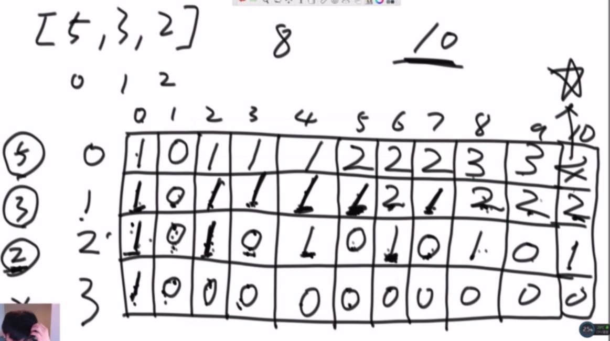

# 动态规划
动态规划，解决的是有重复子问题的递归。当存在重复子问题时，直接递归求解时间复杂度会很高。

## 动态规划一般路径 
**暴力递归** --> 记忆化搜索 --> 动态规划。 升级动态规划：
+ 确定目标`(0, aim)`
+ 递归中的 basecase，不依靠别的就能得到
+ 看位置依赖是怎么变化的
+ 分析变化的参数范围


## 动态规划空间压缩
### 子序列匹配
```
题目：
给定两个字符串str1和str2，求两个字符串的最长公共子序列
```
#### 定义状态 
`dp[i][j]`表示`str1`前缀`0 ~ i`和`str2`的前缀`0 ~ j`最长公共子序列。对于当前状态`dp[i][j]`的依赖项，或者说得到这个状态项的可能性：
+ `str1[i]==str2[j]`时，那么状态`dp[i][j] = dp[i-1][j-1] + 1`
+ `str1[i]!=str2[j]`时，分为两种可能性
  + `dp[i][j] = dp[i-1][j]`表示，`0 ~ i-1`和`0 ~ j`具有的公共最大的前缀
  + `dp[i][j] = dp[i][j-1]`表示，`0 ~ i`和`0 ~ j-1`具有的公共最大的前缀
  
  `dp[i][j]`肯定不会比`dp[i][j-1]`小，也不会比`dp[i-1][j]`小。

分析完可能性，就容易写出状态方程，选择上面三种可能性最大值。
#### 空间压缩
根据`dp[i][j]`的依赖关系，可以实现空间压缩，即不必使用一张二维的表格，只需要使用一维数组。

+ 轮动更新
  
    `dp[i][j]=x`依赖的位置根据坐标关系即`a`，`b`，`c`。即只是依赖当前行和上一行两个数组，那么就不需要使用整个二维表格。
    ```
            j-2  j-1  j
            —————————————
        i-2|
        i-1|       b   a
        i  |       c   x
        i+1|       
    ```
    轮动更新，就是定义两个数组`A`，`B`。`A`用来表示上一行的依赖，`B`表示当前依赖项。在计算`i`行的时候，之前指向`i-2`行的`B`就没用了，就可以使用`B`来承接当前行的数据。当执行到`i+1`行的时候，原本存储`i-1`行数据的数组`A`也没有用了，可以用来承接`i+1`行的数据。

    因此，可以使用两个数组轮动更新就能完成之前一个二维表格才能完成的事情。
+ 自我更新
  
  自我更新，只使用一个一维数组就是数据更新。

    ```
             0   1   2   3
            —————————————
        i-2|
        i-1| p   x  
        i  | 0/1 x'
        i+1|       
    ```
    
    以第一列为例。`j=0`表示`str2`只使用一个字符，来和`str1`来匹配，如果`str2[0]`在`str1[0 ~ i]`中出现过，假设`str[i] == str2[0]`，那么`str1[i]==1`，即最长公共子序列只有1个。第一行和第一列是属于不依赖项，可以直接填好。
    
    设更新数组为`arr`。当在计算从`i-1`行到`i`行时。先更新将`arr[0]`更新为`i+1`行的第0个元素的状态。这个状态是不依赖，可以直接得到。并且记下`arr[0]`之前的状态为`st`，即`i`行的第0个元素状态。

    当更新到x时，将第`i-1`行的x更新为下一行的`x'`。此时`x'`需要依赖三个值`arr[0]`，`st`和`x`。但是由于`x`就是`x'`之前的自己，也是已知。因此`x'`可以直接得到，那么`arr[1]=x'`，同时使得`st = x`。`st`不断标记着左上方的上一行的值，正上方的值一直已知，而左侧的值已经被计算过。 因此整个更新就只需要一个一维数组就能完成。

    整个更新，从左边到右边。
    
### 子串匹配 
```
题目：
给定两个字符串str1和str2，求两个字符串的最长公共子串
```

#### 定义状态 
`dp[i][j]`表示：`str1`必须以`i`结尾的和`str2`必须以`j`结尾的最长公共字串长度是多少。
+ 不依赖项
  第一行和第一列，相等就是1，不相等0。直接全部填好。
+ 变化项 
    ```
      b   1   2   3   f
     ——————————————————
   a| 0   0   0   0   0
   b| 1   0   0   0   0
   1| 0   2   0   0   0
   2| 0   0   3   0   0
   3| 0   0   0   4   0
  ```
  每个表格项只是和其左上角的项目有关：`dp[i][j] = dp[i-1][j-1] + (str1[i] == str2[j] ? 1 : 0);`

#### 压缩空间
使用一个变量t来替代整个二维表格。
```
      b   1   2   3   f
     ——————————————————
   a|         c   a   t
   b|             d   b
   1|                 e
   2| 
   3| 
```
先计算右上角的值记为t，然后计算a，那么就可以直接计算依赖a的b。计算a的左侧位置c，再计算c的依赖项d，再计算d的依赖项e。所有位置都是如此，斜对角线计算。在所有得到的t中的最大值就是答案。


## [单词拆分](https://leetcode-cn.com/problems/word-break/)
想不出怎么直接用动态规划时，先写递归，一般会超时。
```cpp
class Solution {
public:
    bool wordBreak(string s, vector<string>& wordDict) {

        std::unordered_set<std::string> set_(wordDict.begin(), wordDict.end(), wordDict.size());

        return __wordBreak(s, 0, set_);
    }

private:
    bool __wordBreak(std::string& str, int start, std::unordered_set<std::string>& set_) {
        if(start == str.length()) { return true; }

        for(int i=start; i < str.length(); ++i) { 

            if(set_.find(std::move(str.substr(start, i - start+1))) != set_.end()) { 
                if(__wordBreak(str, i+1, set_))
                    return true;
            }
        }

        return false;
    }
};
```
### 记忆化 

+ 消除冗余重复子问题的最简单的方法就是加入记忆化搜索。对于已经搜索过的不再搜索。
    
    `visited[i]`表示`i~end`是否是`wordDict`的一部分。 
    + `-1`为初始化值，表示未知，
    + `1`是
    + `0`为不是，
+ 加入最大长度限制，即 `wordDict` 中存在词条最长长度，在`i`遍历时，`start ~ i`的长度不应该超过这个最大长度。

两个剪枝，能使得整个递归算法，大为改进。
```cpp
class Solution {
public:
    bool wordBreak(std::string s, std::vector<std::string>& wordDict) {
        
        std::unordered_set<std::string> set_;
        int maxLength =0;

        for(const auto& it: wordDict) { 

            if(maxLength < it.length())  maxLength = it.length();

            set_.insert(it);
        }

        std::vector<int> visited(s.length(), -1);

        return __wordBreak(s, 0, maxLength, set_, visited);
    }

private:
    bool __wordBreak(std::string& str, int start, int maxLength,  std::unordered_set<std::string>& set_, std::vector<int>& visited) {
        if(start == str.length()) { return true; }

        if(visited[start] != -1) return visited[start] ==1 ;
        
        for(int i=start; i < str.length() && i < start + maxLength; ++i) { 

            if(set_.find(std::move(str.substr(start, i - start+1))) != set_.end()) 
            { 
                if(__wordBreak(str, i+1,maxLength, set_, visited)) { 
                    visited[start] =  1;
                    return true;
                }
            }
        }

        visited[start] =0;
        return false;
    }
};
```

贪心策略:
```cpp
  class Solution {
  public:
      bool wordBreak(string s, vector<string>& wordDict) {
        
        std::unordered_set<std::string> set(wordDict.begin(), wordDict.end());
        
        int N = s.size();
        std::list<int> boundary;
        boundary.push_front(N);

        for(int idx=N-1; idx >=0; --idx) { 

          for(const auto& R : boundary) { 
            if(set.count(s.substr(idx, R - idx))) { 
              boundary.push_front(idx);
              break;
            }
          }  
        }

        return boundary.front() ==0;
      }
  };
```

## [完全平方数](https://leetcode-cn.com/problems/perfect-squares/)
### 递归解法 
递归解法，但是会超时。问题根源在于存在大量的重复子问题。
```cpp
class Solution {
public:
    int numSquares(int n) {
        int  min=INT_MAX;

        __dfs(n, 0, min);

        return min;
    }

private: 
    void __dfs(int& remains,  int cnt, int& min) { 
        if(remains==0 ) { 
            if(min > cnt) min = cnt;
            return;
        }
        
        for(int i=static_cast<int>(::sqrt(remains)); i >=1; i--) { 
            remains -= i*i; 

           __dfs(remains, cnt+1, min);

            // 恢复现场
            remains += i*i; 
        } // for-end
    } // __dfs -end
};
```
### 动态规划解法 

**定义状态** 

`dp[i]`表示数字平方和为 `i`最少个数。最终的解就是`dp[n]`。

```cpp
class Solution {
public:
    int numSquares(int n) {

        std::vector<int> dp(n+1, INT_MAX);

        dp[0] =0; 

        for(int i=1; i <=n ; ++i) { 
            for(int j=static_cast<int>(::sqrt(i)); j>=1; --j) { 
                dp[i] = std::min(dp[i], dp[i- j*j]+1);
            }
        }

        return dp[n];
    }
};
```
### [零钱问题2](https://leetcode-cn.com/problems/coin-change-2/)

这道题在[背包问题中有讲解](./18_背包问题.md)。这里的讲解，只是为了动态规划的思路形成。

#### 递归
这个找零钱的问题怎么用递归直接求解？

比如[5,10,25,1]，target=15

+ 在5这个位置可能，产生 `5`，在5之后的位置需要产生 `target = target -5 = 10`
+ 在5这个位置可能，产生 `5x2`，在5之后的位置需要产生 `target = target -5*2 = 5`
+ 在5这个位置可能，产生 `5x3`，在5之后的位置需要产生 `target = target -5*3 = 0`

总是将整个问题化解为`arr[i]*times` 和 `target-arr[i]*times`两个子问题。且每个位置i都是如此：要么在自己的位置最终产生`arr[i] == target`，或者在之后的位置产生 `target - arr[i]`。因此最原始的递归如下代码：
```cpp
class Solution { 
public:
    int coins(std::vector<int>arr, int target) { 
        if(arr.empty() || target < 0) return 0;

        return __coins(arr, 0, arr.size());
    }

    int __coins(std::vector<int>&arr, int start,int target){ 
        if(start ==arr.size()) 
            return target ==0 ? 1 : 0;

        int res = 0;
        // 每次i都是从0开始的
        for(int i=0;  target - i*arr[i] >=0; ++i) { 
            res +=__coins(arr, start + 1, target - i*arr[i]);
        }

        return res;
    }
};
```
`i*arr[i]`表示，在`start`位置可能会累加的情况，如果在`index`位置累加和`i*arr[i]`，那么在剩余的位置累加和就是`target - i*arr[i]`的子问题。但是这个递归解法存在大量的重复。 存在重复的递归问题就需要动态规划。
```
比如：[2,1,5,3,6,4], target = 14
```
在前两个位置中选择出一个4：`[2，1，1]`, `[2，2]`和`[1,1,1,1]`三种选择，在第三个位置到最后一个位置都是计算是否有一种组合和为`target-4=10`的可能。在上面的递归代码中，这三种情况，每次都是需要重新计算`[5,3,6,4`]中是否存在`target=10`的组合。因此存在大量的重复。

> 后效型问题：不论前面两个数字中怎么选择出4，对于后面的数字组合出target=10都是没有影响的。
#### 记忆化搜索
这个问题的第一步就是记忆化`memeorize`，使用一个数组或者Map来存储当前状态需要依赖的信息。使用存储空间，将递归化为动态规划初步。
+ 这个问题的最终目标是`(0, target)`
+ 这个参数中变化的是`(start,target)`
+ 根据这两个可变参数建立表格

简单的加入记忆化搜索代码如下：
```cpp
    template<int N,int M>
    int __coins_2(std::vector<int>& arr, int start, int target,int (&map)[N][M]) { 
        int res =0;
        if(start == arr.size()) { 
            res = target ==0 ? 1 : 0;
        }
        else { 
            for(int i=0; target - i * arr[i] >=0; ++i) { 
                int dependency = map[start + 1][target - i*arr[start]]; // 依赖的值
                if(dependency !=0) { 
                    res += dependency;
                }
                else 
                    __coins_2(arr, start +1, target - i*arr[start], map);
            }
        }
        // 每次将计算结果存储在这里
        map[start][target] =  res ==0 ? 0: res;
        return res;
    }
```
#### 升级为动态规划
`start`是从0变化到`length`, `target`是0变化到`target`。那么矩阵`matrix[length +1][target +1]`就能包括所有的情况。最终的解就是`[0, target]`，就是第一行最后一个表格：从位置0开始计算，组合为`target`的可能性种类数。

这个表格一开始就能确定的一些表格项就是原本递归基：`start == arr.size()`，即表格最后一行，满足`target ==0 ?1:0`的才是1，即`matrix[length+1][0]=1`，其余都赋值为0.

下面就可以看位置依赖了，就是在递归中怎么调递归的：`__coins(arr, start + 1, target - i*arr[start])`中，依赖的是`start+1`和`target - i*arr[start`两个参数，即依赖当前位置的下一行左侧的一些元素，比如图中问号：

 



每个位置都是依赖其当下一行的一个位置`[start+1,target]`，以及在这个位置左侧间隔`arr[start]`的元素，即`[start+1, target-arr[start]`。

进一步优化：在求`[start+1, target]`的时候，需要其下方的一些依赖元素的加和，但是这些元素中的大部分在计算`[start +1 -arr[start], target-arr[start-arr[start]]`的时候已经计算过了，这只是剩下最后这个`target-arr[start]`这个位置没有计算过，只计算一次这个即可，就又可以加速。
```java
  public static int coins4(int[] arr, int aim) {
    if (arr == null || arr.length == 0 || aim < 0) {
      return 0;
    }

    int[][] dp = new int[arr.length][aim + 1];
    // 面值是0，方法只有一种，即什么也不用
    for (int i = 0; i < arr.length; i++) {
      dp[i][0] = 1;
    }
    
    // 这个表示 第一行中，只有 arr[0] 的整数倍才能只使用 arr[0] 凑出来
    for (int j = 1; arr[0] * j <= aim; j++) {
      dp[0][arr[0] * j] = 1;
    }

    for (int i = 1; i < arr.length; i++) {
      for (int j = 1; j <= aim; j++) {
        dp[i][j] = dp[i - 1][j];
                // 防止越界
        dp[i][j] += j - arr[i] >= 0 ? dp[i][j - arr[i]] : 0;
      }
    }
    return dp[arr.length - 1][aim];
  }
```
## [安卓手机解锁](https://leetcode-cn.com/problems/android-unlock-patterns/)
这道题[`vivo`](https://www.nowcoder.com/test/question/done?tid=33770110&qid=925105#summary)也是考过

这道题的难点在于怎么判断下一个可达点。因为是`3*3`的九宫格，每个点可以到达的其他点都是可以枚举的。定义一个数组`skip`，枚举出当前节点到其他节点中间需要跳过的节点，如果中间没有需要跳过的节点，那么对应的值就是0。整个过程使用 `dfs + 回溯`的思想：

在当前位置 `curr`，遍历`i: 1-9`的位置，能继续以`i`继续递归的条件：
+ `visited[i]`没有被访问 
+ 如果 `curr`和`i`之间没有间隔点，即使`skip[curr][i]==0` 
+ 或者即有间隔点，但是已经被访问过`visited[skip[curr][i]]=true`

一直递归到`remainStep==0`。再逐步回溯。

```cpp
class Solution {
public:
    int numberOfPatterns(int m, int n) {
      std::array<std::array<int, 10> ,10> skip{0};
      std::array<bool, 10> visited{false};

      skip[1][3] = skip[3][1] = 2;
      skip[1][7] = skip[7][1] = 4;
      skip[1][9] = skip[9][1] = 5;
      skip[2][8] = skip[8][2] = 5;
      skip[3][9] = skip[9][3] = 6;
      skip[3][7] = skip[7][3] = 5;
      skip[4][6] = skip[6][4] = 5;
      skip[7][9] = skip[9][7] = 8;

      int result=0;
      for(int i=m; i <=n; ++i) { 
        result += __dfs(1, i-1, visited, skip) * 4;
        result += __dfs(2, i-1, visited, skip) * 4;
        result += __dfs(5, i-1, visited, skip);
      }

      return result;
     }

     int __dfs(int curr, int remains, std::array<bool, 10>& visited, const std::array<std::array<int, 10>, 10>& skip) { 
       if(remains ==0) 
        return 1;

      int result =0; 
      
      visited[curr] = true;
      // path : curr --> i
      for(int i=1; i <=9; ++i) { 

        int cross = skip[curr][i];
        // 当前这个点i没有被读取过，且curr ->i 中间没有点(corss==0)或者中间有间隔点但是已经被访问过
        // 那么就可以以当前节点为起点，继续遍历
        if(!visited[i] && (cross==0 || visited[cross])) { 
          result += __dfs(i, remains-1, visited, skip);
        }
      }

      // 回溯
      visited[curr] = false;

      return result;
     }
};
```