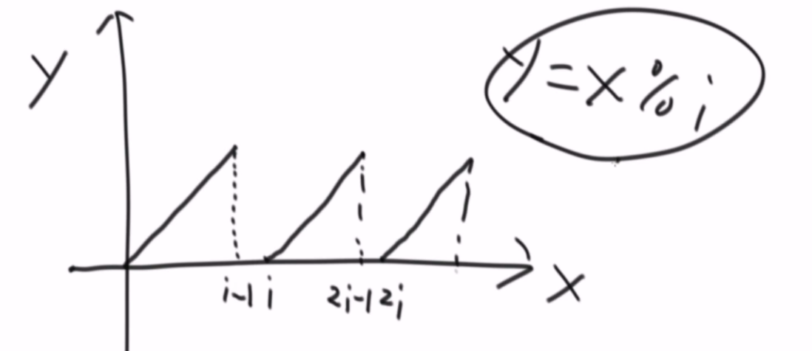

# 环形单链表的约瑟夫问题
```
题目：

据说著名犹太历史学家Josephus有过以下故事：在罗马人占领乔塔帕特后，39个犹太人与Josephus及他的朋友躲到一个洞中，39个犹太人决定宁愿死也不要被敌人抓到，于是决定了一个自杀方式，41个人排成一个圆圈，由第1个人开始报数，报数到3的人就自杀，然后再由下一个人重新报1，报数到3的人再自杀，这样依次下去，直到剩下最后一个人时，那个人可以自由选择自己的命运。这就是著名的约瑟夫问题。现在请用单向环形链表描述该结构并呈现整个自杀过程。

输入：一个环形单向链表的头节点head和报数的值m。
返回：最后生存下来的节点，且这个节点自己组成环形单向链表，其他节点都删掉。
进阶：如果链表节点数为N，想在时间复杂度为O(N)时完成原问题的要求，该怎么实现？
```
#### 锯齿函数
利用的是一个函数`y = x % target`，其中`target`是一个给定值，y的形状是一个锯齿形

 

每次删除一个节点之后就重新编号，当只是剩下最后一个节点的时候，唯一的那个节点是1。思路是，如果能将最终被删除的那个节点的编号，在原始的链表中的编号直接算出来，那么直接返回这个原始编号即可。整个时间复杂度是`O(N)`。
```
    剩余节点数          存活节点编号
        N                   ?
        N-1                 ?
        ...                 ...
        1                   1
```

那，这个之间的关系是怎么算出来的？ 假设有N个节点的单向环形链表，
```
        编号            报数           
        1                1
        2                2
       ...              ...
        N                N
        1                N+1
        2                N+2
       ...              ...
        N                N+N
```
因此，节点和报数之间的关系：也是锯齿波形：`y =( x-1) % N + 1`，其中x表示报数，y表示编号，N表示节点个数。

#### 新号与旧号之间关系
```
序列：[2, 10, 31,  4, 3, 7, 9, 1],  m =3 
编号： 1   2   3   4  5  6  7  8

第一次删除后重新编号：
序列：[2, 10,     4, 3, 7, 9, 1]
编号：[6,  7      1, 2, 3, 4, 5]

第二次删除后重新编号：
序列：[2, 10, 4, 3, 9, 1]
编号：[3, 4, 5， 6, 1, 2]
...
```
假设被删除的节点编号是`S`，那么`S = (m-1) % N + 1`，`m`是肯定的步数，`N`是每次的链表节点个数。 删除指定节点之后和原来节点之家的编号关系：

以第一次删除为例：`S`编号被删除后，`S+1`就是新编号的1，`S-1`就是`N-1`，新旧之间的编号关系：
```
旧编号      新编号
S+1          1
S+2          2 
...         ...
N           N - S
1          N- S + 1
2          N- s + 2
...         ...
S-1         N - 1 
```
如何根据旧编号关系`y = (x -1) % N + 1`，得到新编号关系：
+ 在第一段曲线上旧坐标`[S+1, S+1]`变成了新坐标`[1, S+1]`，是通过新坐标向左平移S个单元，
+ 在第二段曲线上旧坐标`[N+1, 1]`变成了新坐标中的`[N-S+1, 1]`，也可以通过新坐标向左移了S个单元

综上可得，可以得出`旧 = (新 - 1 + S) % N + 1` 

#### 推理
```
S与m关系 ： S = (m-1) % N + 1           // 1
旧编号关系：y = (x -1) % N + 1          // 2
编号关系 ：旧 = (新 - 1 + S) % N + 1    // 3

其中，x是第几个数，m是步数，S是被删除节点编号，N是节点数，N是不断减少的
```
根据这个公式，从删除到节点只剩一个节点开始逆推到原始`N`个节点，推理出留下的节点对应的。就可以知道是哪个了。

```
假设；m=3，那么只是剩下一个节点时的逆推，N = 2
N-1:
  S  = (m-1) % i + 1 = 2 % 2 + 1 = 1
  旧 = (1 - 1 + 1) % 2 + 1 = 2     // 只留下一个节点的编号是 1， 对应的只剩两个节点时，这个节点的编号是2
N-2: 
  S  = (m-1) % i + 1 = 2 % 3 + 1 = 3
  旧 = (2 - 1 + 3) % 3 + 1 =  2    // 此时待返回的节点在只剩三个节点时，这个节点的编号是2
N-3:
  S  = (m-1) % i + 1 = 2 % 4 + 1 = 3
  旧 = (2 - 1 + 3) % 4 + 1 = 1   // 待返回的节点在只剩四个节点时，这个节点的编号是1

...

一直推算到 i == N时， 即原始链表，待返回的节点在原始链表中的编号，就可以算出是第几个节点。
```
公式1和3，可以化简为 **`旧 = (新  + m -1）% i + 1`**。
```java
public calss Solution { 
	public static Node josephusKill(Node head, int m) {
		if (head == null || head.next == head || m < 1) {
			return head;
		}
		Node cur = head.next;
		int numsOfNode = 1;     // numsOfNode -> list size
		while (cur != head) {
			numsOfNode++;
			cur = cur.next;
		}
		
		numsOfNode = getLive(numsOfNode, m); // numsOfNode -> service node position
		while (--numsOfNode != 0) {
			head = head.next;
		}
		head.next = head;
		return head;
	}

    // i 是节点数
    // getLive(i, m) 表示的就是编号 
	public static int getLive(int i, int m) {
		if (i == 1) 
        	return 1;
		
		return (getLive(i - 1, m) + m - 1) % i + 1; // 返回旧的编号
	}
}
```