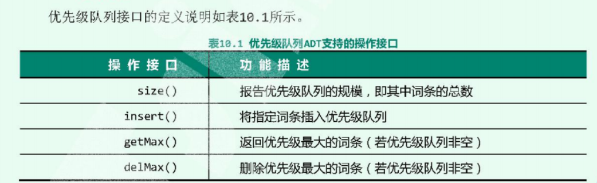
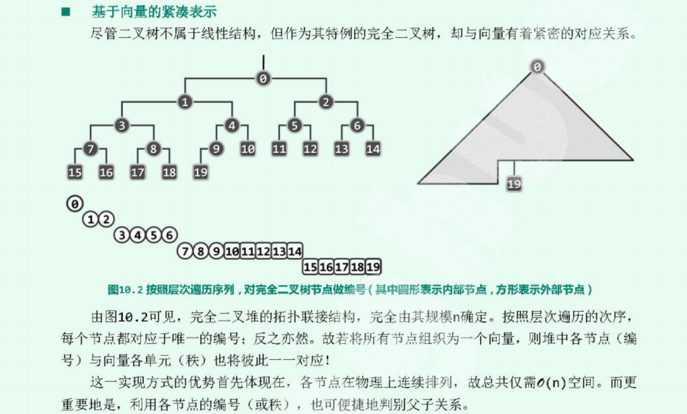
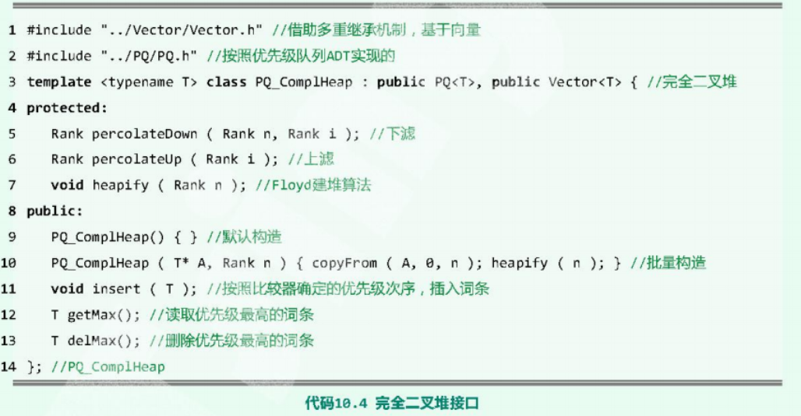
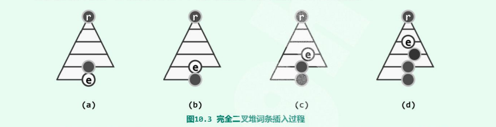
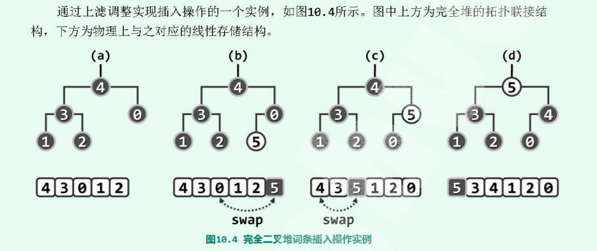
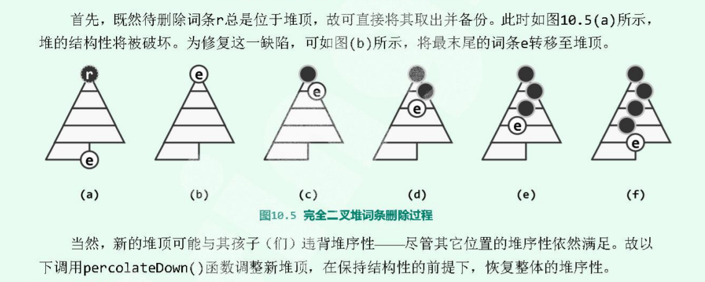
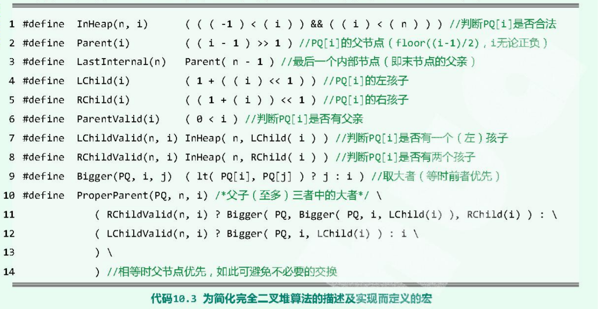
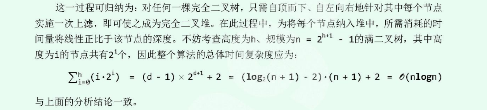
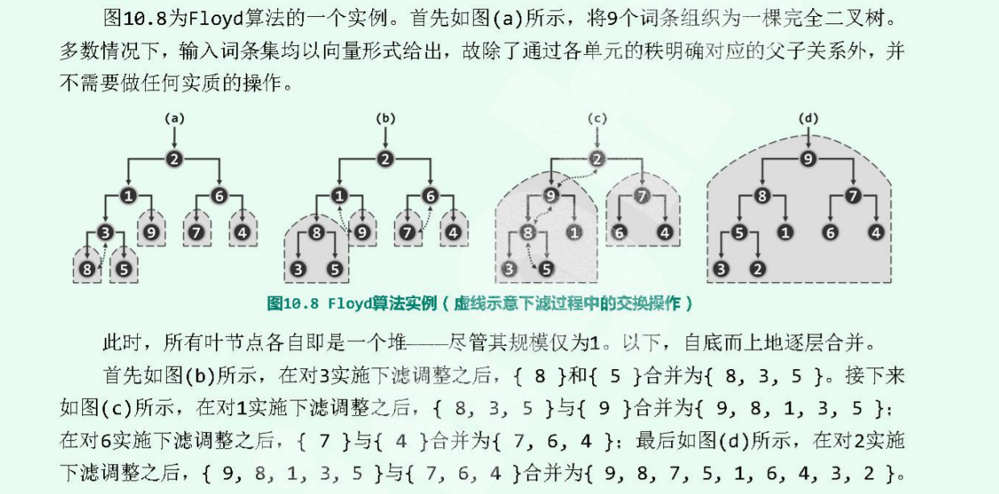
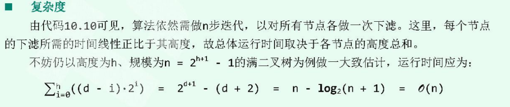

# 优先级队列

优先级队列是根据优先级决定，队列就是先到的元素优先级最高，而栈就是后到的优先级最高。优先级队列维护的是一个偏序关系，优先级的词条(entry)是数据项，而关键码是优先级。



```cpp
template<typename T> 
struct PQ {
  virtual void insert(T ) =0; // 插入 O(logn)

  virtual T getMax() =0;  // 获取优先级别最高的词条  O(1)
  virtual T delMax() =0;  // 删除优先级最高的词条    O(logn)
};
```
## 完全二叉堆
优先级队列高效的原因主要原因在于其不需要维护一个全序关系，仅仅需要维护一偏序关系。完全二叉堆是优先级队列的一种实现。 完全二叉堆具有两个条件
+ 结构性：形式上是完全二叉树
+ 堆序性：堆顶以外的每个节点都不会大于他的父节点-->大顶堆    

### 底层表示
完全二叉堆的底层实现方式是一个`vector`。底层借助`vector`使用`O(n)`的紧凑空间表示：完全二叉树从左到右层的次遍历次序和`vector`的元素内容一一对应。



由次，完全二叉堆中的任意节点v和其字节点以及父节点之间的位置关系，如下：
```
  将节点v的rank记作r(v)，
  1) 如果有左孩子，则 r(lc) = 2*r(lc) +1; 
  2) 如果有右孩子，则 r(rc) = 2*r(lc) +2; 
  3) 如果有父节点，则 r(par)= (r(v)-1)/2 

  如果节点v是根节点
  r(v)   = 0
  r(lc)  = 1
  r(rc)  = 2
  r(par) = -1
```
因此，介于完全二叉堆的组成，由优先级队列和向量组成，因此可以如下定义:
```cpp
template<typename T> 
class PO_ComplHeap : public PQ<T>, public vector<T> { /**/ } ;
```



可以把`PQ`当作接口，必须要实现的接口，其本质上还是向量vector。

### 堆的操作
堆的操作分为获取优先级最大者、插入和删除。
+ `getMax()` 即使堆顶元素，也就是`vector`的首元素，因此可以在`O(1)`时间复杂度内返回。
+ `insert()`：
  + 插入到底层`vector`的末尾，这个操作可以在`O(1)`的时间复杂度内完成
  + 将插入的节点 **上滤** 到合适的位置，以维护堆序性。
  
      

      **上滤**：如果插入的节点e和父节点p之间的有序性违反了堆序性，那么就互换二者位置，这`vector`的底层实现就是互换连个元素位置，`O(1)`的时间复杂度。如果互换之后还是违反，就继续重复这个上滤操作。直到满足堆序性。如上图，至多上滤到堆顶，也就是在最坏的情况下整个插入的过程需要`O(logn)`的时间复杂度。

      

      ```cpp
        template<typenmae T> 
        Rank PQ_CompleteHeap<T>::percolateUp(Rank i) { 
            //只要有父节点存在，最多到根节点
            while(parentValid(i)) { 
              Rank p = parent(i);
              if(ele_[i] < ele_[p]) break; // 不再逆序，上滤完成
              std::swap(ele_[i], ele_[p]);
              i = p;  // 从父节点继续考察是否需要上滤
            }
            return i;
        }
      ```
    上滤操作的时间复杂度最坏情况下是`O(logn)`.
      
+ `deleteMax()`：
  + 交换堆顶元素和堆的一个元素，就是交换`ele_`的首尾元素，删除尾部的元素
  + 将新的堆顶元素下滤，以维护堆序性

    

    **下滤**：新的堆顶点e不满足堆序性，那么就需要和他的子节点中的较大者交换位置，如果还是与子节点违反堆序性，那么继续重复上面操作。这里与上滤不一样的地方是，上滤在交换位置时需要可能需要比较两次，而上滤只是需要比较一次。完全二叉树的结构，保证了下滤操作`O(logn)`
    
    
      ```cpp
        // 对前n个词条中的第i个进行下滤
        template<typename T> 
        Rank PQ_CompleteHeap<T>::percolateDown(rank n, Rank i) { 
          Rank j;
          while(i != (j=properParent(ele_, n, i))) { 
            std::swap(ele_[i], ele_[j]); 
            i = j; 
          }
          retutn i;
        } 
      ```
      其中 `properParent(i)` 是比较节点`i`及其子节点的最大值，如果`j!=i`, 说明仍然需要下滤。退出循环条件：
      + 到最底层
      + `i == j`

      

+ 建堆：
  即将原始的`n`个数据变成一个完成二叉堆，那么最好的情况下也是需要`O(n)`的时间复杂度。建堆方法有两种：
  + 蛮力法：自上而下的上滤   
    这是利用插入排序的思想，每次都从原始数据里选取一个数据，然后调用`insert`接口，让数据自动上滤到合适的位置，这个算法的时间复杂度是`O(nlogn)`。

    这个算法失败的原因在于：使用的是深度和。每次插入一个新的节点，都是先放到最后一层，然后不断的上滤，最坏的情况需要上滤`O(logn)`。因此算法总体复杂度就是`O(nlogn)`。
    
    实际上，优先级队列只是维护一个偏序关系，但是这个时间复杂度足以将整个数据进行全排序，显然代价过于高昂。

    

  + `Floyd算法`：自下而上的下滤  
    `Floyd`算法，是从底层开始：对于堆 ***`H0,H1`*** 以及给定的顶点`p` ，合并一个更高的堆。 这个操作类似于 `deleteMax`, 只是需要将`p`进行下滤操作即可。最初 ***`H0,H1`*** 就是叶节点，经过不断地合并，最终变成一个完全二叉堆。

      

    ```cpp
      template<typename T> 
      void PQ_CompleteHeap()::heapify(Rank n) { 
        for(int i = lastInternal(n) ; InHeap(n, i); --i) 
            percolateDown(n, i);
      }
    ```
    算法复杂度是`O(n)`:  

      


## 左式堆
### 堆合并
为了提高堆的合并操作效率。 左式堆，可以在满足堆序性的条件下，附加新的条件，使得在堆合并的过程中，只需要调整少部分节点--> 时间复杂度O(logn)

对于堆，堆序性才是其本质要求，而结构性，即完全二叉树的结构并不是必须要的

空节点路径长度 Null Path Length: npl，npl(x) =0, npl(X) = 1+std::min();

npl(x) = x到外部节点的最近距离
npl(x) = 以x为根节点的最大满子树的高度