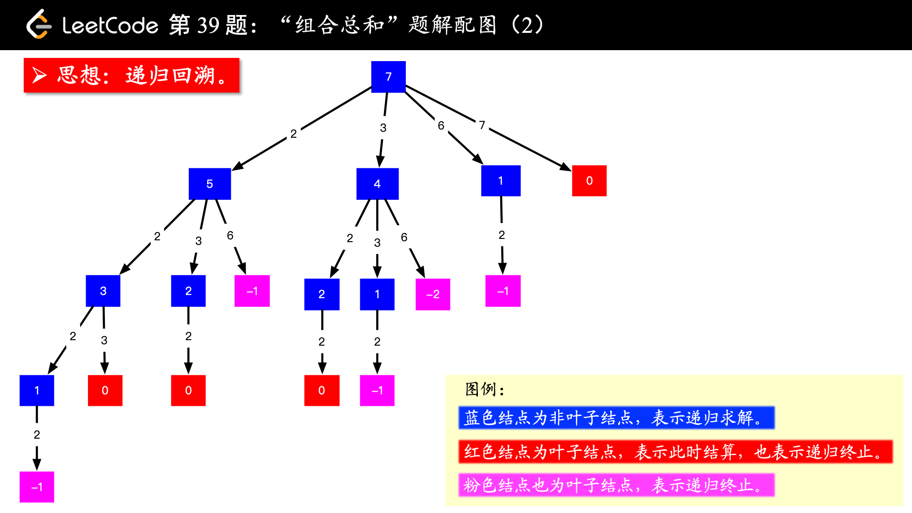
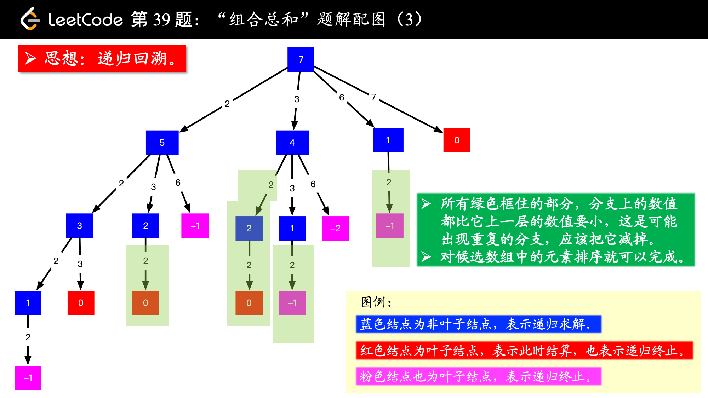
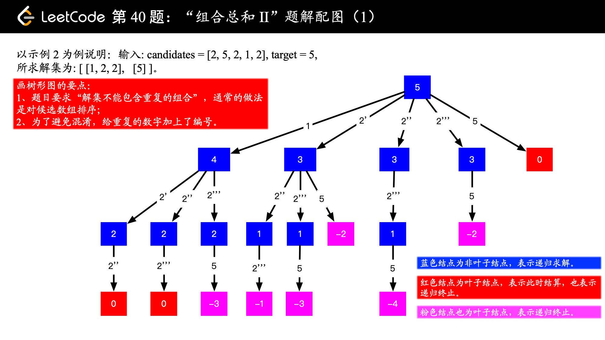
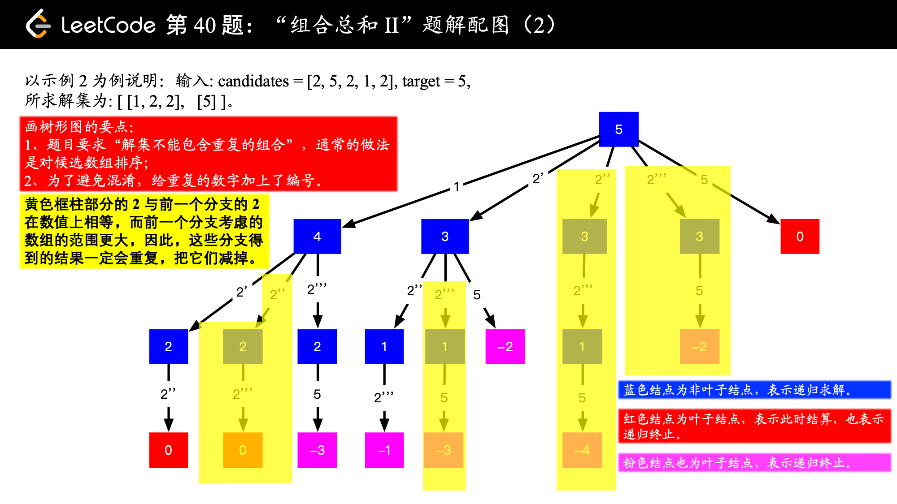
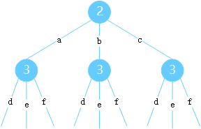
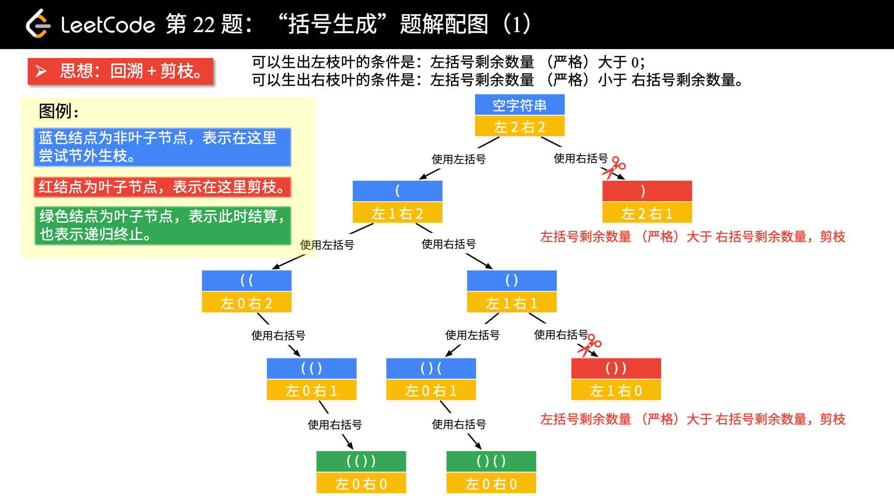

# 回溯
回溯，即深度优先，采用试探性的搜索原则，按优先条件向前进发，**能进则进，无路则退，退而再另辟蹊径**，直至得到所有有效的结果集，也可能无解，有时可能会产生重复的解。

**剪枝**：在搜索过程中，为提高搜索效率利用一些过滤条件而忽略某些不可能产生解的情况，从而避免不必要的搜索，使得提前回溯。
+ 最优剪枝：每次记录当前得到的最优值，如果能够判断出当前路径无法产生比当前最优值更优的情况时，可以提前回溯。

回溯法通常使用递归方式实现，配合恰当的剪枝对复杂度优化有奇效。  

为了方便理解回溯，时常可以画多叉树来帮助理解。

## 应用
回溯，常见的类型：
+ 全排列 
+ 组合
+ 考虑xxx的所有可能
+ 存不存在一条xxx路径
  
## [组合总和](https://leetcode-cn.com/problems/combination-sum/)
以 `basecase`为例：

 

上图，以多叉树的形式，画出回溯过程中的递归情况。总和是`7`，如果和为`7-2=5`，那么就是能找到原问题的一个解，同理`7-3=4`，如果能找到和为`4`的也是原问题的一个解。能找到和为`7-6=1`，也能找到原问题的解。找到和`7-7=0`也能找到原问题的解。

这个问题，**循环里嵌套递归**。比如当前`7`要分别减去`2,3,6,7`，看能不能找到和为`5,4,1,0`的路径。 当减到0的时，路径就出来了。

但是会存在重复。如图

 

怎么避免？ 那就是每次在循环里的下一次递归都是从当前位置`i`开始，而不是从0开始。因为如果`0 ~ j < i`有可能出现解，那么在 `i`位置之前肯定都已经被考虑过了，如果在此位置又考虑了`0~j`，那么就会导致重复解。

比如`[1,2,4], target=3`，那么`i=0`时，有解`{1,2}`。在`i=1`时，如果从0开始考虑，那么`{2,1}`会被再次考虑。而从当前位置`i=11`开始计算，那么考虑序列是`{2, 4}`，不符合条件，直接被过滤。 因此，去重复就需要从当前位置开始即可。

在循环中下一层递归的起始位置，每次都是从 `i`开始，另外一个原因是因为每个数字都能重复使用。如果只能使用一次，那么就从`i+1`位置开始了。
```cpp
    void __backtrace(std::vector<int> &candidates, std::vector<int>& path, int start, int target) { 
        if(target ==0) { 
            resultSet_.push_back(path);
            return ;
        }

        for(int i=start; i < candidates.size() && target - candidates[i] >=0; ++i) { 
            path.push_back(candidates[i]);
            //                         当前位置开始递归
            __backtrace(candidates, path, i, target-candidates[i]);
            path.pop_back();
        }
    }
```
这里剪枝分为两个部分：
+ 剪除不合理的分支：`target - candidates[i] >=0` 这就是过滤条件，直接过滤那些不可能出现解的分支。为了减除这个分支通常需要配合对数组进行排序，以更快的过滤。
+ 剪除重复路径分支：每次下一层的递归都是从当前位置开始 `i`开始.

这道题里也使用一个内存优化策略：要是`path`是值传递，最终会因为 **递归+循环**导致栈溢出。这里使用引用，每次在进深层次之前先`push_back`，回溯回来的时候再 `pop_back` 恢复现场。

## [组合总数2](https://leetcode-cn.com/problems/combination-sum-ii/)
以`[2, 5, 2, 1, 2]`为例子，先对数组进行排序，再和上一道题目一样，画出搜索多叉树。 

 

但是由于这道题，每个数字只能使用一次，且结果不能有重复。因此在搜索树的同一层相同的数字只能出现一次。**如果`arr[i] == arr[i+1]`，那么出现在`i`位置的组合情况肯定包含了`i+1`位置出现的组合情况**。因为，可以直接去除`i+1`位置的。
```cpp
    if(start < cur && candidates[cur] == candidates[cur-1]) 
                continue; 
```
之所以`candidates[cur] == candidates[cur-1]`就是为了保留重复数字中第一个出现的的，因为它的组合情况肯定包含了后面的重复数字。通过这一步，就是去除了因为重复数字带来的重复解。

 

又因为，只能每个数字只能使用一次，因此在循环中的递归起始位置要改为当前位置的下一个。而上一题中的数字可以重复使用，每次循环递归中的起始位置都是从`cur`开始。

换个角度，从`cur+1`开始，而不是从0开始，因为`0 ~ cur`的位置都被使用过了。
```cpp
    for(int cur =start; cur < length && target - candidates[cur] >=0; ++cur) {  
        // 跳过重复的元素
        if(start < cur && candidates[cur] == candidates[cur-1]) 
            continue; 
       
        path.push_back(candidates[cur]);
        //                            cur + 1即从当前位置下一个开始
        __combinationSum2(candidates, cur+1, target - candidates[cur], path);
        path.pop_back(); // 回溯回来时，恢复现场
    }
```
这道题的剪枝策略和上一道的剪枝策略一致：传递给下一层时不能出现负值 `target - candidates[cur] >=0`。为了配合剪枝，先对原数组进行排序。完整的实现代码：
```cpp
class Solution {
public:
    typedef std::vector<std::vector<int>> vectorSet;

    vectorSet combinationSum2(std::vector<int>& candidates, int target) {
        if(candidates.empty()) 
            return resultSet_;

        std::sort(candidates.begin(), candidates.end());

        __combinationSum2(candidates, 0, target, std::vector<int>{ });

        return  resultSet_;
    }

private:
    template<typename Vector>
    void __combinationSum2(std::vector<int>& candidates, int start, int target, Vector&& path) {  
        if(target ==0) {  
            resultSet_.push_back(path);
            return;
        }

        for(int cur =start; cur < candidates.size() && (target - candidates[cur] >=0); ++cur) {  
            // 跳过重复的元素
            if(start < cur && candidates[cur] == candidates[cur-1]) 
                continue; 
           
            path.push_back(candidates[cur]);
            __combinationSum2(candidates, cur+1, target - candidates[cur], path);
            path.pop_back();
        }
    }
    
    vectorSet resultSet_;
};
```
## [电话号码组合](https://leetcode-cn.com/problems/letter-combinations-of-a-phone-number/)
以 `basecase =[2,3]`为例， 先画出这颗可能性多叉树：

  

这道题目，和上面的一个思路，**循环+递归**，因此为了不栈溢出，使用上道题目的内存优化策略。同时这道题，为了直接确定键盘字符和数字的对应，直接定义为静态数组。
```cpp
class Solution {
public:
    typedef std::vector<std::string> stringSet;

    stringSet letterCombinations(string digits) {
        if(digits.empty())  return resultSet_;

        ___letterCombinations(digits, 0, std::string(""));

        return resultSet_;
    }

    template<typename String> 
    void ___letterCombinations(std::string& digits, int index, String&& path) {
        if(index == digits.size()) { 
            resultSet_.push_back(path);
            return;
        }

        int num = digits[index] - '0';
        if(2 <=num && num <= 9) {   
            int len = keyLen[num-2];

            for(int i=0; i < len; i++) {  
                path.push_back(keyboard[num-2][i]);
                ___letterCombinations(digits, index +1, path);
                path.pop_back();
            }  
        }
    }

private: 
    constexpr static const char* keyboard[8] = {"abc", "def", "ghi", "jkl","mno", "pqrs", "tuv", "wxyz"};
    constexpr static const int   keyLen[8]   = {3, 3, 3, 3, 3, 4, 3, 4}; 
    
    stringSet resultSet_;
};
```

## [括号生成](https://leetcode-cn.com/problems/generate-parentheses/)
对应的多叉树



在回溯的过程，可以剪枝的地方：如果 **左括号数大于右括号数** 那么这条路径就不可能产生解。
```cpp
class Solution {
public:
    typedef std::vector<std::string> stringSet;

    stringSet generateParenthesis(int n) {
        if(n ==0) return resultSet_;

        __generateParenthesis(std::string(""), n, n);

        return resultSet_;
    }

private:
    template<typename String>
    void __generateParenthesis(String&& path, int left, int right) { 
        if(left ==0 && right==0) { 
            resultSet_.push_back(path);
            return; 
        }

        // 错误情况
        if(left > right) return;

        if(left >0) { 
            path.push_back('(');
            __generateParenthesis(path, left-1, right);
            path.pop_back(); 
        }

        if(right >0) { 
            path.push_back(')');
            __generateParenthesis(path, left, right-1);
            path.pop_back(); 
        }
    }

    stringSet resultSet_;
};
```

## [全排列](https://leetcode-cn.com/problems/permutations-ii/)

```cpp
class Solution {
public: 
    typedef std::vector<std::vector<int>> vectorSet;

    vectorSet  permuteUnique(std::vector<int>& nums) {
        if(nums.empty()) return resultSet_;
        
        std::vector<bool> visited(nums.size(), false);
        std::sort(nums.begin(), nums.end());

        __permuteUnique(nums, 0, visited, std::vector<int>{ });

        return resultSet_;
    }

private:  

    template<typename Vector>
    void __permuteUnique(std::vector<int>& nums, int depth, std::vector<bool>& visited, Vector&& path) { 
        if(depth == nums.size()) { 
            resultSet_.push_back(path);
        }

        for(int i=0; i < nums.size(); ++i) { 
            // 可能会产生重复的情况
            if(visited[i] || (i > 0 && nums[i] == nums[i-1] && !visited[i-1])) { 
                continue;
            }

            visited[i] = true;
            path.push_back(nums[i]);

            __permuteUnique(nums, depth+1, visited, path);

            visited[i] = false;
            path.pop_back();
        }
    }
    
    vectorSet resultSet_;
};
```
## [下一个排列](https://leetcode-cn.com/problems/next-permutation/)
[题解](https://leetcode-cn.com/problems/next-permutation/solution/xia-yi-ge-pai-lie-by-leetcode/)
```cpp
class Solution {
public:
    void nextPermutation(std::vector<int>& nums) {
      if(nums.empty()) return;

      int size = nums.size();
      int idx = size -2;
      while(idx >=0 &&  nums[idx] >= nums[idx+1]) --idx;
     
      if(idx >=0) 
      { 
        int j = size-1;
        while(j>=idx &&  nums[idx] >= nums[j]) --j;
        std::swap(nums[idx], nums[j]);
      }
  
      std::reverse(nums.begin()+idx+1, nums.end());
    }
};
```

## [第k个排列](https://leetcode-cn.com/problems/permutation-sequence/)
第k个排列，属于数学问题：[康托展开与逆康托展开](https://blog.csdn.net/wbin233/article/details/72998375) 
```cpp
class Solution {
public:
    std::string getPermutation(int n, int k) {
      std::array<int,  10> factorials{1, 1, 2, 6, 24, 120, 720, 5040, 40320, 362880}; 
      std::vector<char> chars{'1','2','3','4','5','6','7','8','9'};
      std::string result; result.reserve(n);
       
      --k;
      while(n) 
      { 
        int i = k / factorials[--n];
       
        result.push_back(chars[i]);
        chars.erase(chars.begin()+i);
        
        k = k % factorials[n];
      }
      return result;
    }
};
```

## [字典序的第K小问题](https://leetcode-cn.com/problems/k-th-smallest-in-lexicographical-order/)

字典序，本事上是个多叉树。而这里是个数字的字典序，就是个十叉树。而字典序的排列就是这个数的先序遍历。自然不能逐个遍历。那么怎么办？
+ 要找到第`k`个节点属于的分支
+ 从该分支层层递进到`k`

**`k`属于的分支**
对于第一个问题，那么需要知道每一层的节点，怎么知道？

每一层的起点`x000...到 x+1000...`，比如`10~20`。那么以1开始的分支，第三层就是有10个节点。
```   
     root
    / |  \
   1  2  3 ...
 /    |
10 ~  20
```
因此计算每一层的节点数：
```cpp
    int64_t M_getCount(int64_t prefix, int64_t n) { 
      int64_t begin = prefix;   // 当前前缀 
      int64_t end = prefix+1;   // 同一层的右边的数
      int64_t count=0;
      while(begin <= n) { 
          count += std::min(end, n+1) - begin;

          begin *=10;
          end *=10;
      }
      return count;
    }
```

为什么要`std::min(n+1, end)`？。因为在最后一层不是满十叉树，因为该层的区间终点应该是 `begin`所在层的最后一个节点
```
       123
     /  |   \
    /   |     \
   1230 1231 1232 
```
比如输入的n是`1231`，那么到这一层的区间的终点就是`1232`。此时计算`[begin, end)`的节点个数就是`n+1 - begin`。

**`k`属于的层**

用一个计数变量`nth`表示累加到第几个节点了
+ `nth +count > k`:说明`k`就是在当前 前缀下分支,只是需要继续深入
+ `else:` 说明`k`还在下一个前缀.

这里大的前缀是`1,2,3,4,5,6,7,8,9`这些数字,然后分别以这些数字往下延申.

整个代码
```cpp
class Solution {
public:
    int findKthNumber(int n, int k) {
        int64_t prefix = 1;
        int64_t nth =1;     // 第几个节点

        while(nth < k) { 
            int64_t count = M_getCount(prefix, n);
            if(nth + count > k) 
            { 
                prefix *=10; // 进入到下一层
                ++nth;       // 因此，只是增加一个节点
            }
            else 
            {
                ++prefix;   // 横向，到右边一个节点上
                nth += count;
            }
        }

        return prefix;
    }
private:
    int64_t M_getCount(int64_t prefix, int64_t n) { 
      //  ...同上   
    }
};
```


## [子集](https://leetcode-cn.com/problems/subsets/)

先画出多叉树，然后查看进入下一层的位置，看是否需要去重剪枝，基本就能确定。

```cpp
class Solution {
public:
    typedef std::vector<std::vector<int>> vectorSet;

    vectorSet subsets(std::vector<int>& nums) {
        resultSet_.emplace_back(std::move(std::vector<int>{ }));

        __subsets(nums, 0, std::vector<int>{ });

        return resultSet_;
    }

private:
    template<typename Vector>
    void __subsets(std::vector<int>& nums, int depth, Vector&& path) {  
        if(depth == nums.size()) { 
            return;
        }

        for(int i=depth; i < nums.size(); ++i) { 
            path.emplace_back(nums[i]);
            resultSet_.push_back(path);

            __subsets(nums, i+1, path);

            path.pop_back(); // 回溯
        }
    }

    vectorSet resultSet_;
};
```
### [原子数量](https://leetcode-cn.com/problems/number-of-atoms/)
分清楚情况,再递归
+ 第一种情况：遇到了左括号，递归处理括号内部的
+ 第二种情况：遇到了右括号，则返回下一个下标比如"Mg(OH)2"，应该返回'2'的下标
+ 第三种情况：遇到普通原子，先读取原子的名称，然后读取该原子的倍率
```cpp
class Solution {
public:
    string countOfAtoms(std::string formula) {
        std::map<std::string, int> map;

        __dfs(formula, 0, map);
        std::string result;

        for(const auto& entry : map) {
            result.append(entry.first);
            if(entry.second >1) 
            { 
                result.append(std::to_string(entry.second));
            } 
        }

        return result;
    }

private:
    int __dfs(const std::string& formula, int currIdx, std::map<std::string, int>& map) { 
        int end = formula.size();

        if(currIdx >= end || formula[currIdx] == ')') { 
            return currIdx+1;
        }

        while(currIdx < end) { 
            // case 1
            if(formula[currIdx] =='(') 
            {
                std::map<std::string, int> inside;
                currIdx = __dfs(formula, currIdx+1, inside);
                
                int count=0;
                while(currIdx < end && ::isdigit(formula[currIdx])) {
                    count = count*10 + (formula[currIdx] -'0'); 
                    ++currIdx;
                }

                if(count >0) 
                { 
                    for(auto&& entry : inside) { 
                        entry.second *=count;
                        map[entry.first] += entry.second; 
                    }
                }
                else 
                {
                    for(auto&& entry : inside) { 
                        map[entry.first] += entry.second;
                    }
                }
            }
            else if(formula[currIdx] ==')') 
            { 
                return currIdx+1;
            }
            else 
            { 

                int begin =currIdx;
                ++currIdx;
                while(currIdx < end && islower(formula[currIdx])) ++currIdx;
                std::string&& name = formula.substr(begin, currIdx-begin);
                int count=0;
                while(currIdx < end && isdigit(formula[currIdx])) { 
                    count = count*10 + (formula[currIdx]- '0');
                    ++currIdx;
                }

                map[name] += (count >0 ? count : 1);
            }
        }

        return currIdx;
    }
};
```


