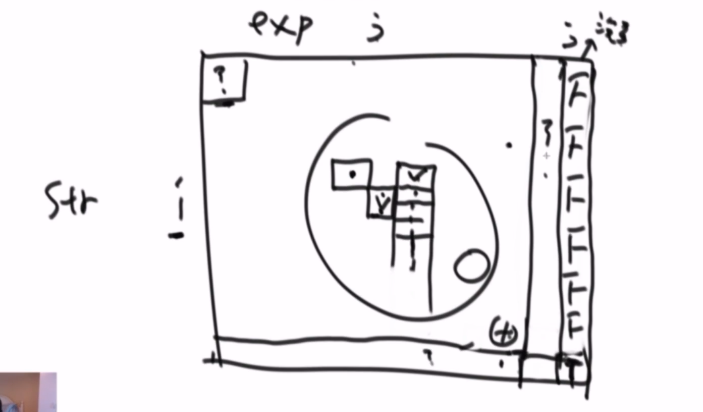

# 字符串匹配 

字符串的问题求解，一般就是动态规划、双指针。

## [Z字形变换]()
**思路**  

通过从左向右迭代字符串，我们可以轻松地确定字符位于 Z 字形图案中的哪一行。

**算法**

我们可以使用 `min(numRows,len(s))` 个行表来表示 `Z` 字形图案中的非空行。

从左到右迭代 `s`，将每个字符添加到合适的行。可以使用当前行和当前方向这两个变量对合适的行进行跟踪。

只有当我们向上移动到最上面的行或向下移动到最下面的行时，当前方向才会发生改变
```cpp
class Solution {
public:
    std::string convert(std::string s, int numRows) {
        if(numRows ==1) return s;

        std::vector<std::string> rows(std::min(numRows, static_cast<int>(s.length())));

        int curRow =0; 
        bool down  =false;

        for(char Ch : s) { 
            rows[curRow].push_back(Ch);
            if(curRow ==0 || curRow == numRows-1) down =!down;
            curRow += down ? 1 : -1;
        }

        std::string result;
        
        for(const auto& entry : rows) { 
            result.append(entry);
        }

        return result;
    }
};
```
## [字符串匹配问题](https://leetcode-cn.com/problems/regular-expression-matching/)
```
题目：
给定字符串str，其中绝对不含有字符'.'和'*'。再给定字符串exp，其中可以含有'.'或'*'，'*'字符不能是exp的首字符，并且任意两个'*'字符不相邻。exp中的'.'代表任何一个字符，exp中的'*'表示'*'的前一个字符可以有0个或者多个。请写一个函数，判断str是否能被exp匹配
```
### 递归实现
定义一个函数 `bool f(i,j);`表示`str`从第`i`位置开始的以后所有字符能否被被`exp`位置处的`j`开始的以后字符匹配
```
    str i _ _ _ _ 
    exp j _ _ _ _
```
对于`j+`位置有三可能：
+ 没有字符
+ 有字符，但不是`*`
  
  那么`str`要和`exp`匹配上，要么`str[i] == exp[j]`满足，要么`exp[j+1]=='.'`满足。如果都不满足就直接返回`false`。如果满足了那么就查看 `f(i+1, j+1)`。逻辑如下：
  ```python
    if exp[j+1] != '*':
      if str[i] != exp[j] AND exp[j+1]!='.': 
          return False;
  ```
+ 有字符，是`*`  
    这里要分几种情况：
    + `str[i] != exp[j]`: 如果`i,j`不匹配，那么可以让`*`使得`exp[j]`变成0个，让`j+2`位置继续和`str[i]`匹配，即递归`f(i, j+2)` 
    + `str[i] == exp[j]`：如果`i, j`匹配，那么需要让`"exp[j]*"`来匹配`str[i]`开始的重复前缀，这种情况就是`str[i]`连续重复出现，比如`aaaaa`。假设匹配完`str`的前缀后，就继续递归`f(i + k, j+2)`，其中`k`是前缀长度

递归代码实现：
```java
  public class Solution { 
  	public static boolean process(char[] str, char[] exp, int i, int j) {
          // 如果exp结束了，str也结束了才算匹配成功
  		if (j == exp.length) {
  			return i == str.length;
  		}
          // j+1 位置不是 '*'，在满足 exp[j] == str[i] || exp[j] == '.' 条件下继续查看 str[i+1] 与 exp[j+1]是否匹配
          // j+1 == exp.length 需要存在，是因为exp[j+1]可能越界。当越界时，j+1 == exp.length处肯定不是'*'，因为这里不属于exp 
          // j+1 == exp.length 语义作用就是exp[j + 1] != '*'，同时防止exp[j + 1]越界
  		if (j + 1 == exp.length || exp[j + 1] != '*') {
  			return i != str.length && (exp[j] == str[i] || exp[j] == '.')
  					&& process(str, exp, i + 1, j + 1);
  		}
          //  这里就就是case 3：exp[j+1] == '*'
          // 一开始 " exp[j]* " 会匹配 0个str[i]，如果满足，就返回true
          // 不满足，i++；  " exp[j]* " 就继续匹配 1个str[i]，如果满足就返回true
          // 不满足，i++,  " exp[j]* " 就继续匹配 2个Str[i],如果满足就返回true
          // ...
          // 要么匹配到满足，要么就匹配到 i == str.length
  		while (i != str.length && (exp[j] == str[i] || exp[j] == '.')) {
  			if (process(str, exp, i, j + 2)) {
  				return true;
  			}
  			i++;
  		}
          // case 3
          // 如果 str[i] 和exp[j]没有匹配上，但是exp[j+1]位置又是'*'
          // 因此，就需要查看 str[i], exp[j+2]是否匹配 
  		return process(str, exp, i, j + 2);
  	}
  }
```
### 递归改成动态规划 

这里变化的参数是`(i,j)`，根据这个两个参数画出一个二维表格`table[str.length+1][exp.length+1]`： 

 

+ 确定不依赖表格项 `[str.length, exp.length] = true`。这个位置表示 `str`和`exp`都结束了，根据递归基可知`matrix[str.length, exp.length] = true;`。
+ 最终目标是求`matrix[0,0];`，这表示`str`的第0个字符开始到结束和`exp`的第0个字符到结束是否匹配，这就是`str`和`exp`是否能匹配。 
+ 然后观察依赖项:`(i,j)`，这个与递归有关
  + 依赖`[i+1, j+1]`：体现在`process(str, exp, i + 1, j + 1)`
  + 依赖`[i, j+2]`：体现在`process(str, exp, i, j + 2)`。但是这里的i范围是` i < str.length`。

#### 填充不依赖项
根据依赖项，可以观察`matrix`填充的不依赖项不完整，即不应该只有`matrix[str.length, exp.length] = true;`。根据依赖项，可以看出至少有两列和一行。下面填充不依赖项目:
+ 倒数第二列 
  

`matrix[i, exp.length-1]， 0 <= i <= str.length`。这一列表示`exp`已经到了最后一个字符而`str`还有多个字符。在`matrix[str.length-1, exp.length-1]`表示`str`和`exp`都是只剩下一个字符，因此这个位置是`true/false`取决`str[str.length-1]`是否和`exp[exp.length-1]`相等。
  ```
  matrix[str.length-1, exp.length-1] =  str[str.length-1] == exp[exp.length-1];
  matrix[i, exp.length-1] = false， 0 <= i < str.length 
  ```
+ 倒数第一行 
  

这一行表示的是`str`结束了，但是`exp`还是有多个字符。因此这一行，除去`matrix[str.length, exp.length] = true;`，其余所有的元素都是`false`.
```
  matrix[str.length, j] = false;   0 <= j < exp.length 
```
#### 代码
因此初始化代码：
```java
  	public static boolean[][] initDPMap(char[] str, char[] exp) {
		int slen = str.length;
		int elen = exp.length;
		boolean[][] matrix = new boolean[slen + 1][elen + 1];
		matrix[slen][elen] = true;
		// 填充最后一行 
		for (int j = elen - 2; j >= 0; j = j - 2) {
			// a*b*c* 这种模式就是一直true，其余都是false
			if (exp[j] != '*' && exp[j + 1] == '*') {
				// 表示从 str处于slen处能和 exp[j]位置开始到结束匹配上
				matrix[slen][j] = true;
			} 
			else break;
		}

		if (slen > 0 && elen > 0) {
			// 倒数第二列的最后一个位置
			if ((exp[elen - 1] == '.' || str[slen - 1] == exp[elen - 1])) {
				matrix[slen - 1][elen - 1] = true;
			}
		}

		return matrix;
	}
```
主体代码 
```java
	// 动态规划
	public static boolean isMatchDP(String str, String exp) {
		if (str == null || exp == null) {
			return false;
		}
		char[] str = str.toCharArray();
		char[] exp = exp.toCharArray();
		if (!isValid(str, exp)) {
			return false;
		}
		boolean[][] matrix = initDPMap(str, exp);

		// 自下而上的递推
		for (int i = str.length - 1; i >=0; i--) {
			for (int j = exp.length - 2; j >=0; j--) {
				// case 2 j +1 位置不是 * 
				if (exp[j + 1] != '*') {
					// 那么此时如果要完全匹配，对应于上面的 case2 分析
					matrix[i][j] = (str[i] == exp[j] || exp[j] == '.') && matrix[i + 1][j + 1];
				} 
				else {
					// 能进入这里即表示 exp[j+1] == '*'
					// 如果当前 i 和 j能够匹配，就查看 i 和 j+2 能否继续匹配 
					// 如果不能查看  i+1 和 j+2 
					// ... 
					int si = i;
					while (si != str.length && (str[si] == exp[j] || exp[j] == '.')) {
						if (matrix[si][j + 2]) {
							matrix[i][j] = true;
							break;
						}
						si++;
					}
					// 如果 i 和 j 位置不能匹配，就直接跳入 i 和 j +2  
					// 这个if 能进入 就表示 (str[si] == exp[j] || exp[j] == '.')不成立
					// 如果是 str[si] == exp[j] || exp[j] == '.' && matrix[i][j] == false，
					// 肯定两个字符串不匹配，因此此时 matrix[i][j] == false --> matrxi[i][j+2] 也都是false
					if (matrix[i][j] != true) {
						matrix[i][j] = matrix[si][j + 2];
					}
				}
			}
		}
        
        // 这就是最终目标
		return matrix[0][0];
	}
```

## [通配符匹配](https://leetcode-cn.com/problems/wildcard-matching/) 
```
题目：
给定一个字符串 (s) 和一个字符模式 (p) ，实现一个支持 '?' 和 '*' 的通配符匹配。

'?' 可以匹配任何单个字符。
'*' 可以匹配任意字符串（包括空字符串）。

两个字符串完全匹配才算匹配成功。
```
### 动态规划
#### 定义状态
`dp[i][j]` 表示与上面的状态一致。要使得`dp[i][j]`为`true`：
+ 当前字符不是通配符时
  + `str[i] != pattern[j]`：直接`dp[i][j] = false`。此时整个匹配结果也就此结束.`return false;`
  + `str[i] == pattern[j]`：直接`dp[i][j] = dp[i+1][j+1]`。
    ```cpp
		if(pattern[j] != '*' || pattern[j] != '.') { 
			if(str[i] != pattern[j])
				return false;

			dp[i][j] = dp[i+1][j+1];
		}
		```
	```
	
	```
+ 当前字符是通配符
  + `str[i] != pattern[j]`，但是`pattern[j] == '.'`，直接`dp[i][j] = dp[i+1][j+1]`。
  + `str[i] != pattern[j]`，但是`pattern[j] == '*`。此时的思想和上一题的`".*"`思路一致：验证此`dp[k][j+1]`是否能匹配，如果能匹配的，则`dp[i][j] = dp[k][j+1]; break;`，其中` i <=k < str.length`
	```cpp
		else { 
			 // 肯定是 str[i] != pattern[j]
			if(`pattern[j] == '.') { 
				dp[i][j] = dp[i+1][j+1];
			}
			else { 
				int k=i;
				while(k < str.length) 
				{ 
					if(dp[k][j+1]) {
						dp[i][j] = true;
						break;
					}

					++k;
				}
			}
		}
	```
  

一共四种可能性。
#### `dp`依赖状态
+ `dp[strLen][expLen] = true`。
+ `dp`的最终目标是`dp[0][0]`
+ `dp[i][j]`依赖的状态是`dp[k][j+1]`，即后一列。因此要从右到左，从下到上填充。
  
  因为只是依赖一行，因此可以实现动态规划的空间压缩：不需要建立一个二维表格，只需要一个一维数组。

## 字母异位词分组(https://leetcode-cn.com/problems/group-anagrams/)
字母移位词：字母异位词指字母相同，但排列不同的字符串

+ 对字符串进行排序
+ 使用`unordered_map`来计算hash，并且存储`hash-index`
  
```cpp
class Solution {
public:
    typedef  std::vector<std::vector<string>>  vectorSet;

    vectorSet groupAnagrams(std::vector<string>& strs) {
        vectorSet resultSet_; 
        
        if(strs.empty()) return resultSet_;

        std::unordered_map<std::string, int> map_;      // hash-索引
        std::string str;
      
        for(const auto& item : strs) {
            str = item;

            std::sort(str.begin(), str.end());
            
            if(map_.find(str) != map_.end()) 
            { 
                resultSet_[map_[str]].push_back(item);
            }
            else 
            { 
                map_[str] = resultSet_.size();
                resultSet_.emplace_back(std::move(std::vector<std::string>(1,item)));
            }
        }

        return resultSet_;
    }
};
```

## [有效的字母异位词](https://leetcode-cn.com/problems/valid-anagram/)
即统计两个字符串是否由相同的字符组成。

可以使用一个`hash`表，来记录每个`s`中出现的次数，如果`t`中出现一样的次数，那么两个相减，结果就是处处为0。对于小规模数据可以使用 数组来替代哈希表,使用词频统计.
```cpp
class Solution {
public:
    bool isAnagram(string s, string t) {
       if(s.length() != t.length()) return false;
       
       int counter[26];
       ::memset(counter, 0, sizeof(counter));

       for(int i=0; i <s.length(); ++i) { 
           counter[(s[i] - 'a')]++;
           counter[(t[i] - 'a')]--;
       }

       for(int i=0; i < 26; i++) { 
           if(counter[i] !=0) 
            return false;
       }

       return true;
    }
};
```
这也证实,很多时候,在小规模数据时,可以用数组代替哈希表.

## [最小覆盖字串](https://leetcode-cn.com/problems/minimum-window-substring/)
```
题目： 
给你一个字符串 S、一个字符串 T，请在字符串 S 里面找出：包含 T 所有字母的最小子串。

示例：

输入: S = "ADOBECODEBANC", T = "ABC"
输出: "BANC"
```
### 分析
这题，是先对字符串`T`进行预处理，用数组`map_`记录下每个字符的个数。比如`ABC`，得到的数组是 **map_[A]=1, map_[B]=1, map_[C]=1**，将字符串t长度记为`all`。

```
S 	： A D O B E C O D E B A  N  C
下标： 0 1 2 3 4 5 6 7 8 9 10 11 12
	   ^
	   L/R
```
一开始双指针`L/R`都是指着开始位置，`R`负责扩大`[L,R]`之间的窗口，`L`负责缩小`[L,R]`之间的窗口。`R`每到一个位置都是进行 `map_[t[R]]--`。如果 `map_[t[R]] >=0`，那么相应的`all--`。这是因为，只有一开始在 `map_`中存在的正数只有`t`中的字符，只有遇到这些字符并且在  `map_[t[R]]--`后才有可能满足 `map_[t[R]] >=0`，随之`all--`。
```cpp
     --map_[str[right]];

    if(map_[str[right]] >=0) 
    { 
        --all;
    }
```
当`all==0`时，即说明已经在`s`中全部遇到了`t`中的字符。`all==0`说明 **以当前 `L` 位置开始的子串中**，满足包含`t`中所有字符的最短字串就是`[L,R]`区间。

下一步操作是`L++`，即在 `[L,R]` 区间寻找以 `R` 结束的字串中满足条件的更短的字串`[L',R]`。在 `L` 右移动的过程中，需要 `map_[t[L]]++` ，表示将当前`L`字符移出`[L.R]`范围。一直移动到 `map_[t[L']] ==0`，此时`s[L]`肯定是`t`中的一个字符，因为只有 `s`中的字符才有可能是0，那么此时计算`[L,R]`之间的长度：`R-L+1`。 

为什么此时才计算长度？ 

`[L, L')` 区间的字符 `map[s[L]] < 0` 说明，要么是 `s[L]` 不是 `t`中的字符，要么就是 `s[L]`是 `t`中字符，但是`s`中包含了多个，即在 `[L',R]` 之间还有`s[L]`，因此可以将当前这个忽略。 当遇到  `map_[t[L']] ==0` 时，说明 `L'`处的字符，在`s`中，且 `[L', R]`只包含一个。 

到次，一次迭代结束，下次迭代重复上述步骤。
```cpp
class Solution {
public:
    std::string minWindow(std::string str, std::string pattern) {
        if(str.empty()) return "";

        int map_[256]; ::memset(map_, 0, sizeof(map_)); 
       
        for(const auto& Ch : pattern) {
            ++map_[Ch];
        }

        int all = pattern.length(); 
        int left =0, right=0;   
        int minLen =INT_MAX, minPos=0; // 记录位置

        while(right < str.length()) {   
            --map_[str[right]];

            if(map_[str[right]] >=0) 
            { 
                --all;
            }

            if(all ==0) { 
                while(map_[str[left]] < 0) { 
                    ++map_[str[left]];
                    ++left;
                }

                int newLen =  right - left +1;
                if(minLen > newLen) { 
                    minLen = newLen;
                    minPos = left;
                }
               
                ++map_[str[left]];
                ++all;
                ++left;
            }

            ++right;
        }  

        return minLen ==INT_MAX ? "" : str.substr(minPos, minLen);
    }
};

```

## [不同的子序列](https://leetcode-cn.com/problems/distinct-subsequences/description/)
子序列，问题比较难。最开始不会可以从递推开始写。写完递推表达式就方便的写出动态规划方程。

考虑的是：如果两个字符`src[i]`，`target[j]`相等或者不等，那么接下去怎么递归？这个问题考虑好，问题也就解答出来了。

具体思考可以参考[Leetcode](https://leetcode-cn.com/problems/distinct-subsequences/solution/xiang-xi-tong-su-de-si-lu-fen-xi-duo-jie-fa-by-27/) 

```cpp
class Solution {
public:
    int numDistinct(std::string src, std::string target) {

        int N =src.size();
        int M =target.size();
        std::vector<std::vector<uint64_t>> dp(N+1, std::vector<uint64_t>(M+1));
        
        for(int i=0; i <=N; ++i) { 
            dp[i][M] =1;
        }

        for(int i=N-1; i >=0; --i) { 
            for(int j=M-1; j>=0; --j) {

                if(src[i] == target[j]) 
                { 
                    dp[i][j] = dp[i+1][j] + dp[i+1][j+1];
                }
                else 
                {
                    dp[i][j] = dp[i+1][j];
                }
            }
        }

        return dp[0][0];
    }
};
```