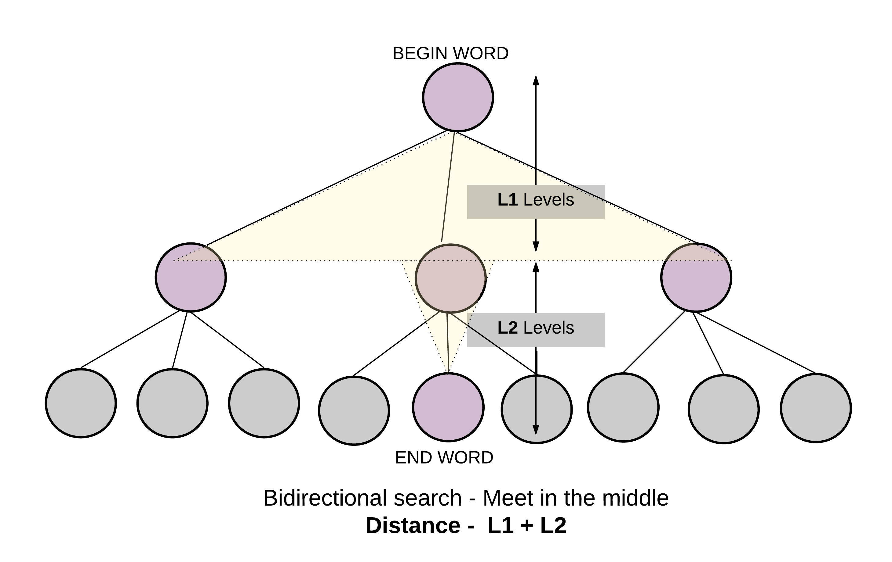

# BFS 

## [单词接龙](https://leetcode-cn.com/problems/word-ladder/)
### 双向BFS
```
beginWord = "hit",
endWord = "cog",
wordList = ["hot","dot","dog","lot","log","cog"]
```
+ 一端从 `hit`开始搜索，找到所有和 `hit`相邻的单词，即只差一个字符的单词，并且都存入队列 `queue_`。
+ 一端从 `cog`开始搜索，找到所有和 `cog`相邻的单词，并且都存入队列 `queue2_`。

当某个单词，同时被两个队列都访问过，那么就说明找到了一条路径。同时也是最短的路径。为什么？



```cpp
class Solution {
public:
    int ladderLength(std::string beginWord, std::string endWord, std::vector<std::string>& wordList) {

        wordList.push_back(beginWord);

        std::queue<std::string> queue1_;    queue1_.push(beginWord);
        std::queue<std::string> queue2_;    queue2_.push(endWord);

        std::unordered_set<std::string> visited1_;  visited1_.insert(beginWord);
        std::unordered_set<std::string> visited2_;  visited2_.insert(endWord);

        std::unordered_set<std::string> wordListSet_(wordList.begin(), wordList.end(), wordList.size());

        int count =0; 
        
        if(wordListSet_.find(endWord) == wordListSet_.end())
            return count;

        while(! queue1_.empty() && !queue2_.empty()) {  

            ++count; // 每增加一层就增加一个
            
            // 总是保证queue小，从小的一端遍历
            if(queue1_.size() > queue2_.size()) { 
                queue1_.swap(queue2_);
                visited1_.swap(visited2_);
            }
            
            int length = queue1_.size();

            while(length--) { 

                std::string str(queue1_.front());  queue1_.pop();

                for(int i=0; i < str.length(); ++i) { 

                    char Ch = str[i]; 
                    // 找到所有和他相邻的单词
                    for(char c='a'; c <= 'z'; ++c) { 
                        str[i] = c; 

                        if(visited1_.find(str) != visited1_.end()) { 
                            continue;
                        }

                        if(visited2_.find(str) != visited2_.end()) { 
                            return count +1;
                        }

                        if(wordListSet_.find(str) != wordListSet_.end()) { 
                            queue1_.push(str);
                            visited1_.insert(str);
                        }
                    }

                    str[i] = Ch;
                }
            }
        }

        return 0; 
    }
};

```