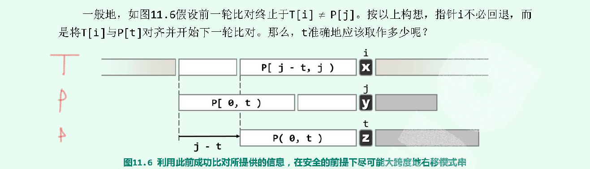

# KMP

`KMP`解决的是字符串字串匹配的问题。子序列是不连续的，而子数组/子串是连续的。

### 原理

#### 最长前缀和最长后缀
`KMP`算法中，使用了一个概念来标记一个字符的信息：使用其前面的字符串中相等部分的最长前缀和最长后缀。

具体地，对于`0<= i <= i+1 < n` ，起始于`i`的`k`个连续字符组成的字串，记作`S.substr(i, k) = S[i,k]`。有两个特殊的的字串，前缀`prefix(0,k)`和后缀`suffix(n-k, k)`。如果一个字符串，位于`i`位置前面的字符串中，存在某个一个`k`使得 `prefix(0,k) = suffix(i-k, k)` 。`k`的最大值，就是这个`i`位置字符的标记信息。

>比如，字符串`ababac`各个位置的`k`值是`[-1, 0, 0, 1, 2, 3]`。第一个位置规定是-1。

如下图，在字符串`T(target)`中寻找子串`P(pattern)`。如果`T[i] != P[j]`。那么就可以确定是`P[0,j) = T[i-j, i)`，即在位置`j`的前`j-1`个字符二者是相等的。如果字串`P`经过适当右移后，能够与`T`的某一个子串匹配，则必要条件就是`P[0,t) = T[i-t, i) = P[j-t, j)`，其中`t`就是前面说的字符`j`的最大前缀。将`P[0]`移到`T[i-t]`的位置，重新匹配`P[t]`是否与`T[i]`相等。
+ 不匹配，则对于`P[0,t)`重复上述步骤（求`t`的最大前缀，然后右移）
+ 相等：继续匹配，直到结束或者下次不匹配时，重复上述步骤



稍微修改就可以去解决leetcode上的[实现strStr](https://leetcode-cn.com/problems/implement-strstr/comments/)。
```cpp
class Solution { 
public:
  int match(const char* P, const char* T)  {

    int* next = buildNext(P); // 构造Next表格
    
    int n = strlen(T), i =0;
    int m = strlen(P), j =0;

    while(j <m  && i <n) 
    { 
      // j ==-1, 可以认为 那是一个哨兵，通配符
      if(j < 0 || P[j] == T[i])  // j==-1时候，表示字串已经移动到左侧了 ++j是0，
      { 
        ++i;
        ++j;
      }
      else 
      {
        // T[i] != P[j]
        j = next[j]; // j左右，去往最大前缀处，继续匹配
      }
    }  

    delete[] next;
    return  j == m ? i-j : -1;
  }
private:
  // 构造next表，动态规划思想
  int* buildNext(const char* P) { 
    size_t m = strlen(P), curr=0;
    int* Next = new int[m]; // next指针

    /** @brief: 索引为-1的哨兵，可以看作是一个通配符号，能与任何字符相匹配。
     *  
     *       因此，当 t <0 ，其含义就等价于 p[t] == p[curr].
     *        
     *        ++curr; 
     *        ++t;
     *        next[curr] = t; // 就是把当前计算的前缀长度当作下一个字符的next值
     * 
     *      
     *      如果没有匹配，那么 t = next[t]，即从上一个相等的位置向前找。 看 P[next[t]] == P[curr] ?
     *      这里也是用了kmp的思想。不是直接从头开始继续查找，而是从不相等的继续查找：
     * 
     *        a  b  a  b  a  c  d 
     *        ^  ^  ^  ^  ^  ^  ^ 
     *        -1 0  0  1  2  3  0
     *                 t    curr
     *          
     *        当计算完 'c' 的前缀，curr 就指向了 'c'，t指向了'b'，下次循环 P[t] != P[curr]，t = next[t],就是如下
     *        a  b  a  b  a  c  d 
     *        ^  ^  ^  ^  ^  ^  ^ 
     *        -1 0  0  1  2  3  0
     *           t           curr
     * 
     *         因为之前已经计算过，'b'的前缀，那么如果next[t]就是`b`的前缀最后一个位置，如果此时 P[t] == P[curr]，那么d的前缀就是 t的值，
     *    否则，就是需要继续去往'b'的next[t]位置处。直到 t变成-1.此时 这个哨兵能与仍和字符匹配。使得P[curr]=0
     *  
    */
    int t = Next[0] = -1; 

    // 因为最后一个不计算，整个长度就变成 m-1
    //  next[m-1] 是前 m-1个字符的前缀
    while(curr < m-1) { 
      if(t <0 || P[t] == P[curr]) 
      { 
        ++curr;
        ++t;
        Next[curr] = t;
      }
      else 
      {
        // P[curr] != P[prefix] 
        t = Next[t];
      }
    }

    return Next;
  }

};
```

#### [一颗树T1是否包含另一个树T2](https://leetcode-cn.com/problems/subtree-of-another-tree/description/)
思路：
+ 先将两个树都使用先序遍历序列化
+ 然后在`T1`的序列化中寻找`T2`的序列化

注意：使用数字`int`类型存储序列化结果，因为如果使用字符。遇到如下情况，将无法区分:
```
  [12] --> 12##
  [2]  -->  2##
```
尽管T2不是t1的子树，但是也能匹配成功。因此使用数字存储。

```cpp
class Solution {
public:
    bool isSubtree(TreeNode* s, TreeNode* t) {
        std::vector<int> src, target;

        __serialize(src, s);
        __serialize(target, t);
        return __KMP(src, target);
    }

private:
  void __serialize(std::vector<int>& result, TreeNode* root) { 
    std::stack<TreeNode*> path;
    path.push(root);
    
    // 最简单的先序遍历代码
    while(!path.empty()) { 
      root = path.top(); path.pop();

      while(root) { 
        path.push(root->right);
        result.push_back(root->val);

        root = root->left;
      }
      
      result.push_back('#'); // 只是为了区分
    }
  } 

  bool __KMP(const std::vector<int>& src, const std::vector<int>& target) { 
    
    int m = target.size();
    int n = src.size();

    std::vector<int> Next(m);
    __buildNext(target, Next); // 建立 next 表
    int i=0, j=0; 
    while(i < n && j <m ) { 

      if(j <0 || target[j] == src[i]) { 
        ++i;
        ++j;
      }
      else 
      {
        j = Next[j];
      }
    }
    return j ==m;
  }

  void __buildNext(const std::vector<int>& pattern, std::vector<int>& Next) { 
      int t=-1;
      int i=0;
      Next[0] =-1;

      while(i < pattern.size()-1) { 
        if(t < 0 || pattern[t] == pattern[i]) { 
          ++t;
          ++i;
          Next[i] = t;
        }
        else 
        {
          t = Next[t];
        }
      }
    }
};
```
#### [树的子结构](https://leetcode-cn.com/problems/shu-de-zi-jie-gou-lcof/)
这道题不是用KMP，只因和上一道题相似。
```cpp
  class Solution {
  public:
      bool isSubStructure(TreeNode* A, TreeNode* B) {  
          if(A ==nullptr || B ==nullptr) return false;      
          //  二重递归，对于每个节点进行遍历并判断是否满足条件 
          if(A->val == B->val &&  __isSubTree(A, B))
            return true; 

          return isSubStructure(A->left,  B) || 
                 isSubStructure(A->right, B);
      }
  private:
      bool __isSubTree(TreeNode* big, TreeNode* small) { 
          if(small ==nullptr) return true;
          if(big   ==nullptr) return false;
              
          return big->val == small->val               &&
                 __isSubTree(big->left,  small->left) &&
                 __isSubTree(big->right, small->right);
      }
  };
```
