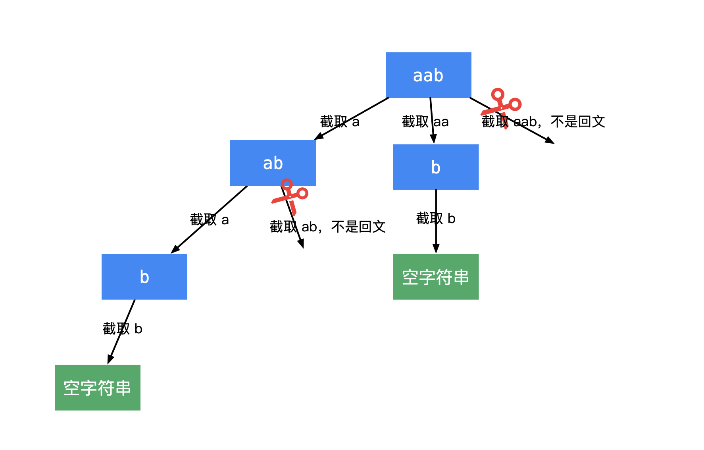

# 回文

## [回文串个数](https://leetcode-cn.com/problems/palindromic-substrings/description/)
直接递归。
```cpp
#include <string>
#include <vector>

class Solution {
public:
    int countSubstrings(std::string str) {
      
      int count=0;
      for(int i=0; i < str.size(); ++i) { 
        __count(str, i, i, count);
        __count(str, i, i+1, count);
      }
      return count;
    }
  private:
    void __count(const std::string& str, int begin, int end, int& count) { 
      while(begin >=0 && end <= str.size() && str[begin] == str[end])
      {
        ++count;
        --begin;
        ++end;
      }
    }
};
```

## [最长回文子串](https://leetcode-cn.com/problems/longest-palindromic-substring/solution/)
### 暴力算法
暴力算法即以每个字符为中心中，看每个字符的能外扩的最长回文字串的长度，时间复杂度为 `O(n^2)`。但是需要加入额外的字符处理 `#` ，否则无法同时应对奇回文和偶回文。
```
  原始串：0 1 2 1 3 1 2 1 0 

  下标 ： 0 1 2 3 4 5 6 7 8 9 10 11 12 13 14 15 16 17 18
  填充后：# 0 # 1 # 2 # 1 # 3  # 1  #  2  #  1  #  0  # 
```
填充算法可如下完成：
```cpp
  void __preProcess(std::string& str) { 
      int length = str.size();

      std::string padding((length<<1) +1, '#');
      
      for(int i=0;  i<length; ++i) { 
          padding[(i<<1) +1]   = str[i];
      }

      str.swap(padding);
  }
```
### 马拉车算法
马拉车算法，是通过 `O(n)` 的辅助空间，获取 `O(n)` 的时间复杂度。马拉车算法是在上述暴力算法上的一点改进，有几个基本概念：
+ 回文半径`r`：表征以每个字符 `i` 为中心的扩充范围 `[i-r, i+r]`。
+ 回文右边界：`R =i+r`
+ 回文右边界最早中心`C`：即到达右边界`R`最早的`C=i`。

需要用法一个数组`radius`记录每个位置 `i` 的回文半径，因此每个位置 `i` 对应的回文右边界 `R = i + radius[i]`。
#### 分析
在当前位置 `i` 之前已经存储了一部分 `radius` 信息了。在当前位置 `i`：
+ 当前字符 `i` 不在当前最大回文右边界 `R` 内，即使 `R < i` 时，和暴力方法一样暴力扩充，获得 `i`的回文半径。
  ```cpp
      while(0 <= i - radius[i] && i + radius[i] < str.size()) { 
        if(str[i + radius[i]] != str[i - radius[i]]) 
            break;
        ++radius[i];
      }
  ```
+ 在回文右边界内 `i <=R`。设`i`关于`C`的对称点为`i'`，`R`关于`C`的对称点为 `L`。根据`i'`的回文半径大小 `radius[i']` 可以情况细分为3种，：
   + `L < i-radius[i']'`时，可以直接确定`i`的回文半径 `radius[i]`

      因为`[L,R]`区间都是回文串，而以`i'`为中心的回文字串`[i'-radius[i'], radius[i'] + i']`也在`[L, R]`范围内，因为 `i` 的回文半径也是`radius[i']`。
      ```
        下标 : 0 1 2 3 4 5 6 7 8 9 10 11 12 13 14 15 16 17 18
        字串 : # 0 # 1 # 2 # 0 # 3  # 0  #  2  #  1  #  1  # 
                   ^ ^   ^   ^   ^    ^     ^     ^  ^
                   L a   i'  b   C    b'    i     a' R
      ```
      比如上图，`a, b`分别是`i'`回文半径范围外前后一个位置，`a', b'`是关于`C`的对称位置。`a!=b`，所以`a'!=b'`，因此`i`所能扩的最大范围也是`[a'+1, b'-1]`，由于对称性可知，这和 `i` 的回文区域 `[a+1, b-1]`长度是一样的。
      
      因此，这种情况下，`i` 的回文半径 `radius[i] = radius[i']`。在 `O(1)` 时间内就可以确定。
   + `L > i-radius[i']`，也能直接确定`i`的回文半径 `RADIUS[i]`
      ```
        下标 : 0 1 2 3 4 5 6 7 8 9 10  11 12 13 14  15 16 17 18
        字串 : # 0 # 1 # 2 # 1 # 3  #  1  #  2  #   4  #  0  # 
                     ^ ^ ^   ^   ^     ^     ^  ^   ^
                     a L i'  b   C     b'    i  R   a'
      ```
      设`R+1`的位置为 `a'` ，`L-1` 的位置为 `a`，可知道 `a`和 `a'`关于 `C`对称。`a`关于`i'`的对称位置是`b`，`b`关于`C`的对称点是`b'`。因此`b'`和`a'`关于`R`对称。
    
      因为当前最大回文区间是 `[L, R]`，也就是说 `a != a'`，而 `a`和`b`同在`i'`的回文区间里：`[a, b] < [i'-radius[i'] , i' + radius[i']]`。因此 `a == b`，又因`b == b'`，因此`a = b'`。又由`a != a'`，可得` b' != a'`。也因此 `i`的回文区间`[b'+1, a'-1]`。`radius[i] = R-i`。此时，`i`的回文右边界就是`R`。

      **前面两种直接确定的，就看 `L`到`i`的距离和 `radius[i]'`谁更小，更小的就是作为 `i` 的回文半径**。 因此：
      ```cpp
         radius[i] =  R > i ? std::min(radius[2*C - i], R -i) : 1; 
      ```
   + `L = i-radius[i']`时，`radius[i]` 不能直接确定，还是需要从 `R`的右边向外扩。
      
      ```
        下标 : 0 1 2 3 4 5 6 7 8 9 10 11 12 13 14 15 16 17 18
        字串 : # 0 # 1 # 2 # 1 # 2  # 1  #  2  #  1  #  0  # 
                   ^ ^   ^   ^ ^ ^
                   L i'  C   i R a'
                         b'
      ```
      如图，上面`i'=1`，它的回文半径时1，左边刚好落在了`L`。此时是不能直接确定的。因为此时不能直接判断`a'==b'?`，仍然需要继续扩，来判断。
#### 代码实现
实现上，有几个注意点：
+ 加入填充后，以字符为中心所得的回文半径`radius[i]`及最大回文半径总是比实际的大1
  ```
    原串：c b b d 
    填充：# c # b # b # d #
            ^   ^ ^ ^   ^
            2   2 3 2   2
  ```
+ 怎么根据`(i, radius[i])`计算得到源字符串中的起始位置?
   + 在填充字符串中的起始位置 ***`pos = i - [radius[i]-1]`***  
   + 在源字符串中的起始位置 ***`start = pos/2`***  

完整代码如下：
  ```cpp
  class Solution {
  public:
      string longestPalindrome(string s) {
        if(s.empty()) return s; 

        std::string str = __preProcess(s); // 上面的代码
        int* radius = new int[str.size()]; 

        int C = -1, R = -1;
        int maxLen = 0, maxPos =0;       

        for(int i=0; i < str.size(); ++i) {  

            radius[i] =  R > i ? std::min(radius[2*C - i], R -i) : 1;  
        
            while(0 <= i - radius[i] && i + radius[i] < str.size()) { 
                if(str[i + radius[i]] != str[i - radius[i]]) 
                    break;
                ++radius[i];
            }

            if(i + radius[i] > R) { 
                R = i + radius[i];
                C = i;
            }

            if(maxLen < radius[i]) { 
                maxLen = radius[i];
                maxPos = (i - (maxLen-1))>>1;
            }
        }

        delete[] radius;
        return s.substr(maxPos, maxLen-1);
    }
  };
  ```
## [最短回文串](https://leetcode-cn.com/problems/shortest-palindrome/)
使用`KMP`方法进行求解。

因为求的是以首字符开始的最大回文串，那么将该字符串逆序后拼接在一起，用`KMP`求一个`next`表，那么`next`的最后一个值就是以首字符的开始的最大回文串。然后就后面的反转贴到首字符前面皆可。
```cpp
class Solution {
public:
  std::string shortestPalindrome(std::string str) {

    std::string reverStr = str;
    std::reverse(reverStr.begin(), reverStr.end());

    std::string newStr(str + '#' + reverStr);
    int M =newStr.size();
    std::vector<int> next(M, -1);

    for(int t=-1, j=0; j <M-1;) { 
      if(t <0 || newStr[t] == newStr[j]) 
      { 
        ++t;
        ++j;
        next[j] = t;
      }
      else 
      {
        t =next[t];
      }
    } // for
    return  reverStr.substr(0, str.size()-next.back()-1) + str;
  }
};
```

## 最长回文子序列
```
题目：给定一个字符串str1，求最长的回文子序列
```
#### 间接求 
求出`str1`的逆序`str2`。那么问题就转换为求`str1`和`str2`的最长公共子序列。


#### 直接求

定义状态`dp[i][j]` 表示`i ~ j`区间的最长回文子序列。 最终的目标是求`0 ~ str.length`得最长回文子序列，即在表格的右上方。

+ `dp[0][0]`表示`0~0`的最长子序列，因此`dp[0][0] =1`。同理，第一条对角线上的都满足`dp[i][i]=1`。第二条对角线也能不依赖就填充，因此此时只有两个字符，相等就是1，不等就是0，下面表格中标记为`a'`
  
  ```
      0   1   2   3   
     ———————————————
   0| 1   a'     target  
   1|     1   a'            
   2|         1   a'
   3|             1
  ```
+ 而在对角线下方的点都用不到，因为在下方`i < j`，都是0.
+ 在普通位置`dp[i][j]`的依赖关系：
  + `str[i] != str[j]`，那么可能：
    + `dp[i][j] = dp[i+1][j]`
    + `dp[i][j] = dp[i][j-1]`
  + `str[i] == str[j]`，那么`dp[i][j] = dp[i+1][j-1] +2`
  ```
        0   1   2   3   
      ———————————————
    0|     
    1|         b   a         
    2|         c   d
    3|             

    dp[i][j]=a依赖的是 dp[i+1][j-1]的c，dp[i+1][j]的d和dp[i][j-1]的b。
  ```
  `dp[i][j]`在三者中取最大。

递推方程出来后，最终目标是右上方因此要从对角线上：**从左到右边，从下到上**依次递推。
```cpp
  class Solution {
  public:
      int longestPalindromeSubseq(std::string str) {
          if(str.empty()) return 0;

          int length = str.size();
          int dp[length ][length];  // 最终目标是 dp[0][length-1]
          ::memset(dp, 0, sizeof(dp));

          for(int i=0; i < length; ++i) { 
              dp[i][i] = 1;
          }

         for(int i=1, j=2; j < length; ++j, ++i) { 
            dp[i][j] = str[i] == str[j] ? 2 : 0;
         }
      
         for(int i =length-2; i>=0; --i) { 
            for(int j =i+1; j < length; ++j) { 
                if(str[i] == str[j]) 
                    dp[i][j] = dp[i+1][j-1] + 2; 
                else 
                    dp[i][j] = std::max(dp[i][j-1], dp[i+1][j]);
            }
         }

         return dp[0][length-1];
      }
  };
```
## [统计回文子序列个数](https://leetcode-cn.com/problems/count-different-palindromic-subsequences/description/)
详细可见代码。
子序列问题，定义状态：`dp[i][j]`表示`str[i...j]`的回文子序列个数，那么如何递推？ 

+ `str[i]==str[j]`：那么就查看`dp[i+1][j-1]`的信息。但是这个子序列问题比较复杂
  
  如果`str[i+1, j-1]`也存在`str[i]`那么肯定会增加子序列个数·
  + `"aba"`类型：即中间没有`str[i]`，此处即没有`a`。那么 `dp[i][j] = dp[i+1][j-1]*2 + 2`。2表示 "a " 和"aa"两种情况
  + `abaca`类型：即中间存在一个`str[i]`，那么此时 `dp[i][j] = dp[i+1][j-1]*2 + 1;`
  + `abacada`类型，即存在多个，`dp[i][j] = dp[i+1][j-1]*2  - dp[left+1][right-1]`; `left` 和 `right`是内部`a`的左右边界
+ `str[i]!=str[j]`，那么就简单多，`dp[i][j] = dp[i+1][j] + dp[i][j-1] - dp[i+1][j-1]`。减去一部分是因为计算重复。
```cpp
class Solution {
public:
    int countPalindromicSubsequences(std::string S) {
      int N   = S.size();
      int Mod = 1e9+7; 
      // dp[i][j]:i 到 j的回文子序列个数
      std::vector<std::vector<int>> dp(N, std::vector<int>(N));

      for(int i=0; i <N; ++i) { 
        dp[i][i] = 1;  
      }

      for(int i=N-2; i >=0; --i) { 
        for(int j=i+1; j < N; ++j) { 
          
          /// @brief:
          //  如果str[i] ==str[j]，那么就需要查询 dp[i+1][j-1]的信息，但是因为题目是回文子序列，如果在str[i..j]中还存在
          /// str[i]，那么势必会增加回文子序列个数，因此需要如下判断
          if(S[i] ==S[j]) {
            int left=i+1, right = j-1;
            while(left <= right && S[i] != S[left]) ++left;
            while(left <= right && S[i] != S[right]) --right;
            /// @biref:
            /// 为什么下面的求值中都x2了?
            /// 比如说 "abca"，内部的"bc"会回文子序列 "b","c"，。内部又是可以和外面的"a"再组合："aba","aca"，因此需要x2
            if(left > right) 
            { 
              dp[i][j] = dp[i+1][j-1]*2 + 2;
            }
            else if(left ==right) 
            { 
              dp[i][j] = dp[i+1][j-1]*2 + 1;
            }
            else 
            {
              // abacada
              // 内部的 aca 已经包含了 a aa 的情况不需要再单独加上
              // 因为这个部分被计算了两次，因此减去
              dp[i][j] = dp[i+1][j-1]*2  - dp[left+1][right-1];
            }
          }
          else 
          {
            dp[i][j] = dp[i+1][j] + dp[i][j-1] - dp[i+1][j-1];          
          }

          dp[i][j] = dp[i][j] < 0 ? dp[i][j] +Mod : dp[i][j] %Mod;
        }
      }

      return dp[0][N-1];
    }
};
```

## [分割回文串I](https://leetcode-cn.com/problems/palindrome-partitioning/) 
[内容来自题解](https://leetcode-cn.com/problems/palindrome-partitioning/solution/hui-su-you-hua-jia-liao-dong-tai-gui-hua-by-liweiw/)

以 basecase 为例子，画出递归树。 

 

思考如何根据这棵递归树编码：
+ 每一个结点表示剩余没有扫描到的字符串，产生分支是截取了剩余字符串的前缀；
+ 产生前缀字符串的时候，判断前缀字符串是否是回文。(这一步需要可以预处理，来加速判断)
    + 如果前缀字符串是回文，则可以产生分支和结点；从当前位置下一个进入递归。
    + 如果前缀字符串不是回文，则不产生分支和结点， **这一步是剪枝操作**。
+ 在叶子结点是空字符串的时候结算，此时从根结点到叶子结点的路径，就是结果集里的一个结果。使用深度优先遍历，记录下所有可能的结果。
### 预处理
如果直接判断一个字串是否是回文串，每次检测一个前缀都要消耗`O(n)`时间复杂度。**当发现某个技巧特别频繁的时候，能不能用一个矩阵或者数组来代替它**。将每段回文字串都存储在一个表格中，可以直接在`O(1)`时间复杂度内查询。设置一个预处理矩阵 ***`table[i][j]`*** ，表示 `i~j`是否是回文。
### [代码参考来源](https://leetcode-cn.com/problems/palindrome-partitioning/solution/hui-su-you-hua-jia-liao-dong-tai-gui-hua-by-liweiw/)
```cpp
class Solution {
public: 
    typedef  std::vector<std::vector<std::string>> vectorStringSet;

    vectorStringSet partition(std::string str) {

        if(str.empty()) return resultSet_;

        int length = str.length(); 
        
        std::vector<std::vector<bool>> table(length, std::vector<bool>(length, false));

        for(int i=0; i < length; ++i) { 
            __prePocess(str, i, i,   table);
            __prePocess(str, i, i+1, table);
        }

        __partition(str, 0, std::vector<std::string>{ }, table);

        return resultSet_;
    }

private:
    void __prePocess(std::string& str, int left, int right, std::vector<std::vector<bool>>& table) { 

        while( 0<= left && right < str.length() && str[left] == str[right]) { 
            table[left][right] = true;
            --left;
            ++right;
        }
    }

    template<typename vectorString>
    void __partition(std::string& str, int index, vectorString&& path ,std::vector<std::vector<bool>>& table) { 
        if(index == str.length()) { 
            resultSet_.push_back(path);
            return;
        }

        for(int i=index; i < str.length(); ++i) { 
            if(!table[index][i]) continue;
            
            path.emplace_back(std::move(str.substr(index, i-index+1)));
            // 这里进入下一层的是下个位置
            __partition(str, i+1, path, table);

            path.pop_back(); // 回溯
        }
    }

    vectorStringSet resultSet_;
};
```
## [分割回文串II](https://leetcode-cn.com/problems/palindrome-partitioning-ii/description/)
```
给定一个字符串str，返回把str全部切成回文子串的最小分割数。

举例：
str="ABA"。不需要切割，str本身就是回文串，所以返回0。
str="ACDCDCDAD"。最少需要切2次变成3个回文子串，比如"A"、"CDCDC"和"DAD"，所以返回2。
```
### 定义状态
`dp[i]` 表示字符串`i`位置以后要切的刀数。 

如果一个字符串前缀就是一个回文字符串，那么就切一刀让这个前缀作为一个整体，然后去查看后缀能切几刀。
```
字符串： aba3aba...

1) a       ...   以a作为第一个部分，后面剩余部分切X刀，总共是 X+1刀
2) aba     ...   以aba作为第一个部分，后面剩余部分切Y刀， 总共是 b' +1刀
3) aba3aba ...   以aba3aba作为第一个部分，后面剩余部分切Z刀，总共是 Z+1刀
...

然后，取可能性中最小值。
```
这个算法是`O(n^2)`时间复杂度。因为每次一个前缀要逐次的尝试以每个字符开始的最长前缀位置。
```
序列：aaaaaa

1) a     ...
2) a a   ...
3) a a a ...
```
为了一次性质定位 `i`开始的前缀中的最长回文。采用和上一道题一样的思想，建立一个`table[i][j]`，表示以`i`开始的最长回文前缀区间是 `[i,j]`。就直接在`O(1)`时间复杂度内查询以 `i` 开始的最长回文前缀位置。
+ **对角线都是回文**
+ **次对角线根据两个字符是否相等就可以直接判断**
+ `table[i][j]`是否是回文：`str[i]==str[j] & table[i+1][j-1]`。当前位置只是依赖左下角的元素。
```
字符串： aba3aba...

aba3aba |  ...   
        ^ 
        第一刀就直接切在这，而不是在a处
```
通过预处理表格加速整个过程，使得变为`O(n)`。

### 代码实现
```cpp
class Solution {
public:
    int minCut(std::string str) {
        if(str.empty()) return 0; 

        int length = str.length(); 

        std::vector<int> dp(length+1, INT_MAX); // dp[i] 表示 i~end 最少切几刀 
        dp[length] = -1;
        
        std::vector<std::vector<bool>> table(length, std::vector(length, false)); 

        for(int i=length-1; i>=0; --i) {
            for(int j=i; j < length; ++j) {
                // dp[i, j] 是回文，才计算
                if(str[i] == str[j] && ( j -i < 2 || table[i + 1][j - 1])) { 
                    table[i][j] = true;
                    dp[i] = std::min(dp[i], 1+dp[j+1]); 
                }
            }
        }

        return dp[0];
    }
};
```

