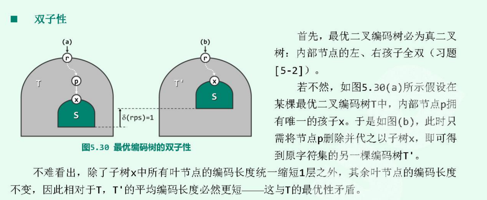
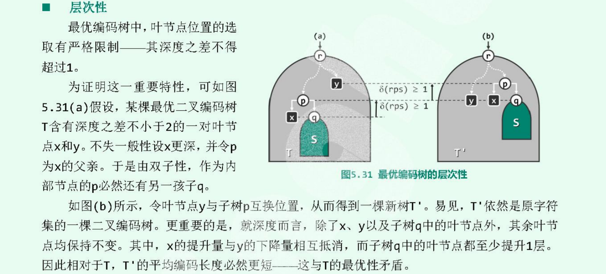
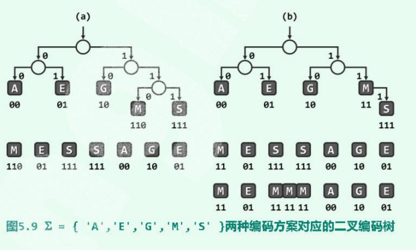

# PFC  prefix-free coding

## `pfc`编码树的构造
从某一个文本信ke息中，挑出所有的单独字符构造一个单节点二叉树，所有的二叉树视为森林。此后，反复从森林中选取两个出现次数最小的树合并起来。如此经过n-1步骤后，初始森林中的n颗树就合并为一颗完整PFC编码树。然后根据PFC编码树转译为编码表，从而可以根据编码字符快速确定对应的编码串。

接收方约定好根据同一颗编码树来记录双方约定的编码方案，于是每当接受到信息，接收方就可以在编码树中查找进而转义为字符。

## 最优编码树
同一个字符集的所有编码方案中，平均编码长度最小者称为最优方案，其中字符编码长度|rps(X)|就是节点x的深度，当然这里的x肯定是叶节点。最优编码树的`ald( average leaf depth)`值也最低。

最优编码树不唯一，但是一定存在，如果不唯一，任取其中一个即可。

### 性质
1. 双子性   
最优二叉编码树都是真二叉树：即内部节点的左、右孩子全是存在。

   假设一个最优二叉编码树T，存在一个节点p，单个孩子节点x，如果将p删除，以x取代，bane就可得到另一个编码树T'，那么子树x的叶节点深度都减少1，因此ald也会减少，这与T的最优性矛盾。

1. 层次性  
最优二叉编码树中，叶节点之间的深度差最大为1。

   

    如果存在超过，那说明可以继续优化：节点互换位置。

### 最优编码树的构造
因此，叶节点只能出现在最低两层。这类树的一种特例就是真完全二叉树。
+ 构造算法：创建一个规模为`2|s|-1`的完全二叉树T，再将|s|中的字符任意分配给T中的|s|个叶节点。

+ 如：以字符集`{'A', 'E', 'G', 'M', 'S'}`为例，只需要创造 2x5-1=9个节点的一颗完全二叉树，并将各个字符分配到5个叶节点，就得到一个最优编码树。
  
  