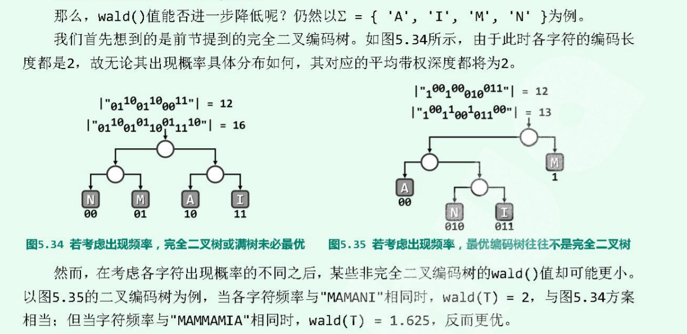
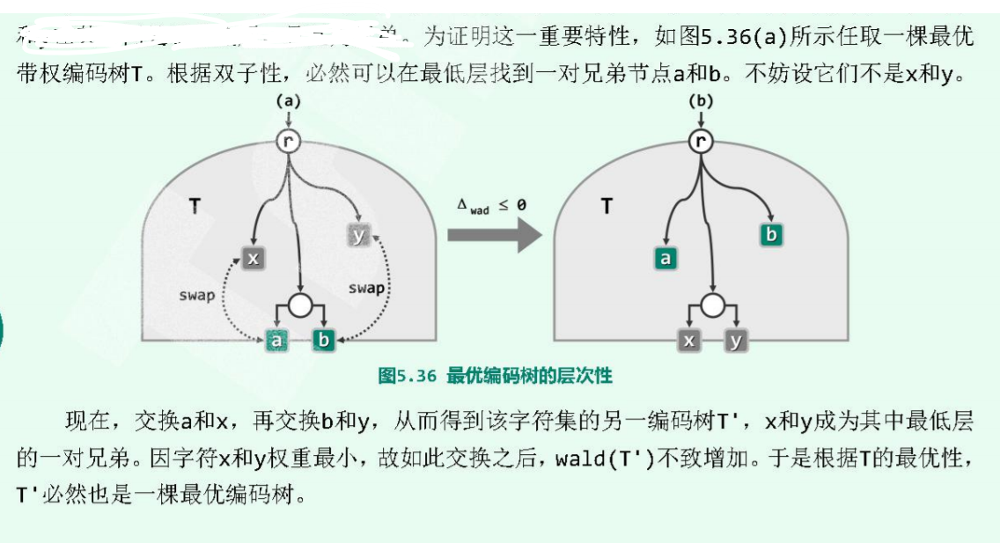
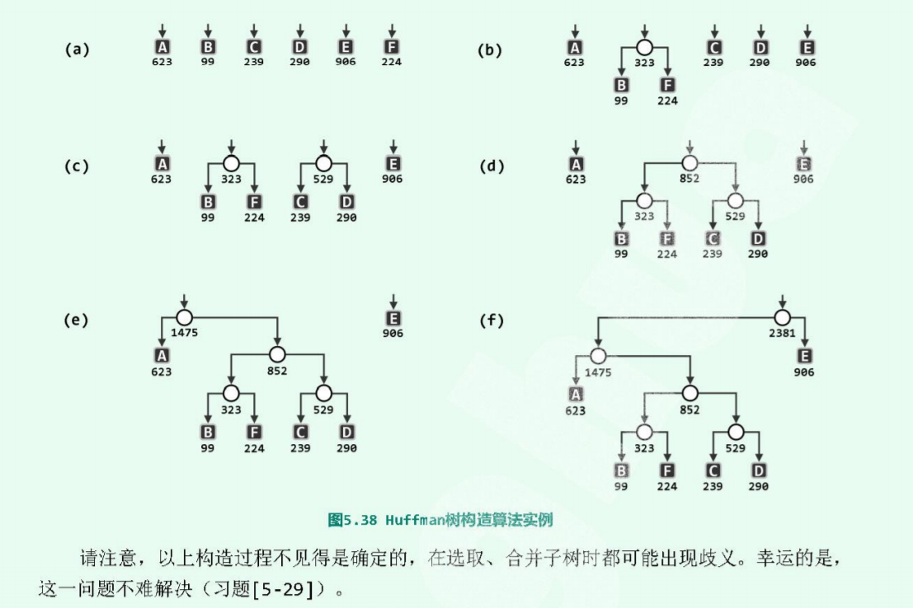

# Haffman Tree

因此之前的最优编码树默认的是各个字符出现的频率都是一样的，那么发送时所占用的比特是最小的。实际上这是不可能的。应该根据词频来建立二叉树，使得高频词汇占用字节少，低频词频占用字节多，这样就能最大程度节省发生字节数。

### 带权平均编码长度与叶节点带权平均深度
考虑各个字符出现的频率后，将编码树T的叶节点带权平均深度(`weight average leaf depth`)作为带权平均编码长度：`wald(T)=\sum(p(x)|rps(x)|`。其中，`p(x)`是叶节点x的出现频率，`|rps(x)|`是叶节点深度。

但是完全二叉树并不等于说它的`wald()`就是最小的。因为完全二叉树相当于忽略了各个词频，仅仅以深度为代价进行衡量。



以字符集`{'A', 'I','M','N'}`建立的二颗编码树，左边是完全二叉树，右边是根据带权编码树建立。此时的的各个字符编码长度都是2，但是当对于新的文本`MAMMANIA`编码传输时，左边的完全二叉树编码长度是2，右边带权平均编码长度确实1.65，反而更优。

### 性质
+ 双子性：此时仍然需要满足
+ 层次性
  与之前不同，此时不需要满足“叶节点深度之差不超过1”，此时可以相差2层以上。

  具体地说，这里层次性是说，**如果字符x和字符y的出现概率在所有字符中最低，则必然存在某一颗最优带权编码树，使得x和y在其中处于最底层，且互为兄弟节点**。这是因为最优带权编码树并不唯一，在所有可能的最优树中必然存在这一情况。简要证明如下。

  


### Huffman 编码算法
+ 对于一个字符集 ***Σ***中的每一个字符，分别以自己为根节点建立一个二叉树，其权重设置为这个字符的词频。因此 ***|Σ|*** 颗树就能构成一个森林 ***Δ***。
+ 从 ***Δ***中选取权重最小的两颗树，创建一个新的节点，并分别以这两颗子树作为左右子树，合并得到一个词频更高的树，词频是两个子树之和。
+ 重复上一步骤，反复的选取-->合并，每经过一轮迭代， ***Δ***中就减少一棵树。当 ***Δ***中只是剩下最后一颗时，就得到了一颗最优带权编码树。构造完毕

  如图：

  

  图(a)是根据词频建立的5个二叉树，经过5论迭代得到一颗最优带权编码树。


```cpp
// 代码实现

```