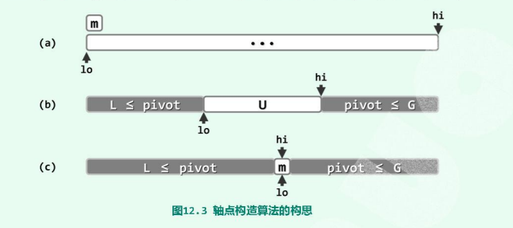

# 快速排序 quickSort

排序的本质就是消除逆序对。以升序为例，就是消除"左边大右边小"的逆序对。当逆序对为0，就说明已经满足有序性。

## 快速排序

快速排序是一种就地排序，会改变输入数组，同时快速排序是一种不稳定的排序。快速排序的关键点是选择一个合适的轴点(`pivot`)，这个选取的不确定性也导致了每次数据的分割是不均匀的。

对于选取的一个轴点，其左边的都不大于轴点，右边的都不小于轴点: **[low, pivot-1] <= pivot <= [pivot+1, high]**



```cpp
// [left, right)
void quickSort(std::vector<int>& arr, int left, int right) { 
    if(right - left <=1)  // [left, left+1) ，只是剩下一个元素就是有序的
      return; 

    int pivot = __partation(arr, left, right-1);
    quickSort(arr, left,    pivot);
    quickSort(arr, pivot+1, right);
}
```
`partition` 算法，就是在扫描数据的过程中，**将所有大于轴点的数据放到轴点右边，将所有小于轴点的数据放到左边**。而`quickSort` 算法就是不断的分割，当只有一个数据时，其本身就是有序，再将所有的子问题组合起来，思想是“分而治之”。

#### 复杂度
可在线性时间内将原向量排序问题划分为两个相互独立、总体规模保持线性的子向量排序问题。但是分治策略高效的两个必要条件：
+ 子任务划分的高效性及子任务之间的独立性：满足
+ 子任务规模的接近：不满足。

实际上，不仅仅不满足条件 2，还是有可能相差悬殊。这是因为划分所得子序列的长度与划分的具体过程无关，而是取决于轴点。比如轴点 *rank=r* ,那么子向量的规模是 `r` 个 `n-1-r`。当r=0，左侧子向量规模为空，右侧与原来的向量等长，对称即 `r=n-1`。这对于有序向量而言，每次都是简单的选取最左侧元素作为轴点，此时的效率是 **O(n^2)**。

#### 降低最坏概率情况
不能每次固定的选取最左端元素，可以每次自由随机选取一个元素，更甚者，从待排序向量中任取三个元素，将数据剧中者作为候选者.
#### 平均运行时间
尽管似乎最差的时间复杂度是 **O(n^2)**,但是在平均意义下,时间复杂度还是 **O(1.38logn)**
#### 应对退化情况 
当所有的元素都是重复的时候,此时对应的情况即之前的最坏情况.因为循环中的 `pivot <= arr[right]`会一直满足,直到 `low < high`  不满足，最后整个算法退化为线性递归,时间复杂度是`o(n^2)`。

改进如下:
```cpp
  int __partation(std::vector<int>& arr, int L, int R) { 
    int pivot = arr[L];

    while(L < R) { 
      while(L < R && pivot  <= arr[R]) --R; if(L < R) arr[L++] = arr[R];
      while(L < R && arr[L] <= pivot ) ++L; if(L < R) arr[R--] = arr[L];
    }

    arr[L] = pivot;

    return L;
  }
```
如此,每次遇到重复的元素,都是将元素放到的对立的区间,当循环中止的时候,恰好位于中间的位置,此时的时间复杂度最好,是`O(nlogn)`

## 应用

### 中位数
挑战在于: **如何避免在全排序的前提下,在 O(nlogn)时间复杂度内找出中位数**.

#### 众数
如果一个向量存在众数,那么中位数肯定是众数.

#### 基于快速划分的 k  - 选取
选取问题所查找的位序`k`，这个`k`就是在有序序列中的`rank`。

调用算法`partition`构造一个轴点`A[L] = x` 。如果`L==k`，那么则该轴点就是待选取的元素，直接返回 `L`。

如果 `L!=k`，则无非两种情况：
+ `k < L` ：那么带选取的元素肯定不在`a[L]`的右侧，那么就可以直接进入左侧进行查找。
+ `k > L`  ：就可以将左侧分支减除,进入右侧进行查找。

因此可以得到快速选取问题的解:
```cpp
void quickSelect(std::vector<int>& arr, int k) { 

    for(int left=0, right=arr.size()-1; left < right; ) { 
        int L     = left;
        int R     = right;
        int pivot = A[left];

        while(L < R) { 
            while(L < R && pivot <= arr[R]) R--; A[L] = A[R]; 
            while(L < R && arr[L] <= pivot) ++L; A[R] = A[L]; 
        } // 每次循环结束，l ==R ，此时轴点左侧的元素都不大于它，右侧的都是不小于它

        A[L] = pivot;
        if(k <= L)   right = L-1; //  实际上就是比较 A[k] <= pivot ?
        if(L <= k)   left  = L+1; // 进入右边
    }// A[k]
}
```
这个算法在最坏情况下，时间复杂度是`O(nlogn)`，那么更好的有没有？`BFPRT`算法。

延续这个思路： 
先选取一个中位数，然后递归迭代，这个方法虽然是时间复杂度是`O(n)`，但是系数很大，在数据量不是很大时，效率并不明显。

```python
// 伪代码
def selece(A, k): 
    if n=|A| <Q:
        return trivalSelect(A, k) # 数据规模不大时直接用蛮力

    1) 将A均匀地分为 n/Q个子序列,各自含有Q个元素
    2) 各个子序列分别排序,计算出中位数,并且将这个中位数组成一个序列
    3) 通过递归调用这个select() 计算出中位数序列的中位数,记M
    4) 根据相对M大小,将A中的元素分为三个子集:L(小于), E(等于), G(等于)
    5) 递归如下

     if(k <= |L|>): 
        return select(L,k)
     elif(k <=|L| + |E|): 
        return M;
     else: 
        retutn select(G, k-|L|-|E|) 

```