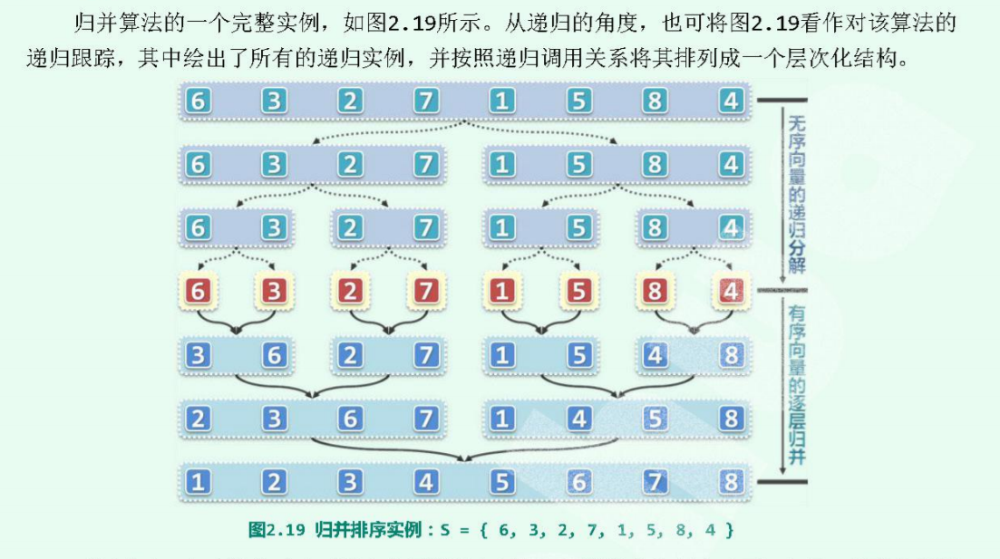

# mergeSort



归并排序分为连两个部分，先将整个序列化为2个规模一样的序列，然后排序。递归的调用，不断地划分，直到子序列的规模为1，那么这个长度为1的子序列就是有序的，然后再开始归并。 
```cpp
    void mergeSort(std::vector<int>& arr, int lo, int hi) { 
        if(hi - lo < 2) return ; 

        int mid = (lo + mi) >>1; // 取中间点
        mergeSort(arr, lo,  mid);
        mergeSort(arr, mid, hi);
        merge(arr, lo, mid, hi);
    }
```

+ 递归基：当hi-lo =1的时候，就是只有一个元素，本身就是有序，就返回。   
+ 中点：每次都是取中点，将数据区间划分为2个等规模的区间。
+ 归并：当划分到单独一个元素的时候，凯斯将数据合并起来

```cpp
  // 此时得到的 arr是一个有序的连个子向量
    void merge(std::vector<int>& arr, int lo, int mid, int hi) { 
        int* A = arr + lo;
        int lb = mid - lo;
        int* B = new int[lb];
        for(size_t i=0; i < lb; B[i]=A[i++]); // 复制前面的向量到 B[]中

        int lc = hi-mid;
        int* C = arr + mid;
        // i 是arr， k是右边的， j是左边的
        for(size_t i=0, j=0 k=0; j<lb || k > lc; ) { 
            //              表示后面的空了
            if(j < lb && ! (k <lc) || [B[j] <= C[k]) A[i++] = B[j++];
            if(k < lc> && ! (j <lb) || [B[j] > C[k]) A[i++] = C[k++];
        }
    }
```
### 时间复杂度 
二路归并排序算法`merge`的复杂度易知是`O(n)`，而`mergeSort`算法以二分划分整个序列到最后变成单个序列的时间复杂度是`O(logn)`，因此整个算法复杂度是`O(nlogn)`。但是实际上经过证明，**归并排序算法的复杂度恒定是`O(nlogn)`**。

## [链表的归并排序](https://leetcode-cn.com/problems/sort-list/)
[解释](https://leetcode-cn.com/problems/sort-list/solution/148-pai-xu-lian-biao-bottom-to-up-o1-kong-jian-by-/)
```cpp
class Solution {
public:
    ListNode* sortList(ListNode* head) {
        ListNode dummyHead(0);
        dummyHead.next = head;
        auto p = head;
        int length = 0;
        while (p) {
            ++length;
            p = p->next;
        }
        
        for (int size = 1; size < length; size <<= 1) {
            auto cur = dummyHead.next;
            auto tail = &dummyHead;
            
            while (cur) {
                auto left = cur;
                auto right = cut(left, size); // left->@->@ right->@->@->@...
                cur = cut(right, size); // left->@->@ right->@->@  cur->@->...
                
                tail->next = merge(left, right);
                while (tail->next) {
                    tail = tail->next;
                }
            }
        }
        return dummyHead.next;
    }
    
    ListNode* cut(ListNode* head, int n) {
        auto p = head;
        while (--n && p) {
            p = p->next;
        }
        
        if (!p) return nullptr;
        
        auto next = p->next;
        p->next = nullptr;
        return next;
    }
    
    ListNode* merge(ListNode* l1, ListNode* l2) {
        ListNode dummyHead(0);
        auto p = &dummyHead;
        while (l1 && l2) {
            if (l1->val < l2->val) {
                p->next = l1;
                p = l1;
                l1 = l1->next;       
            } else {
                p->next = l2;
                p = l2;
                l2 = l2->next;
            }
        }
        p->next = l1 ? l1 : l2;
        return dummyHead.next;
    }
};

```