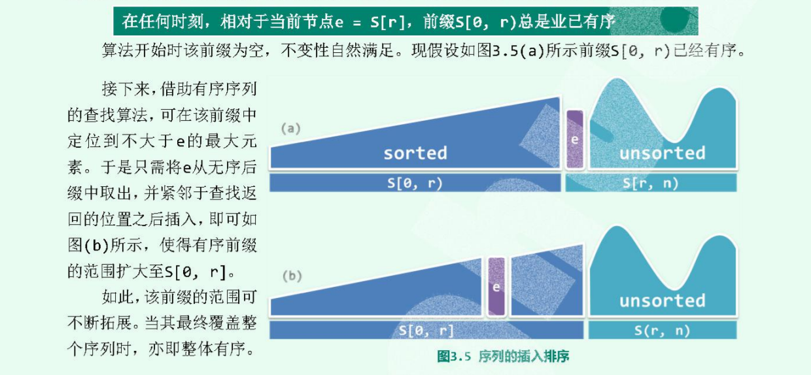

# insertSort 
更加实用于链表

插入排序的思想：始终将整个序列视为两个部分，有序的前缀和无序的后缀；通过反复的迭代，反复地将后缀的首元素转移至前缀中。
> **在任何时刻，相对于当前节点e=s[r], 前缀部分[0, r)总是有序**，那么就可以用有序序列的查找算法，在前缀中查找到小于等于e的最大元素的位置，然后将当前节点e插入找到的位置之后插入。 如果存在重复元素，那么就是插在最后一个重复元素之后。


```cpp
// 以列表为例： 因为列表插入排序方便，vector每次插入一个位置，都得后移

```
### 算法时间复杂度
当序列完全有序的时候**`O(n)`**，完全逆序的时候则时 ** `O(n^2)`**。时间复杂度平均意义下还是 **`O(n^2)`** 。

### 与选择排序的比较
有最好的情况，而选择排序没有，选择排序的复杂度恒定**`O(nlogn)`**，而插入排序与逆序对数据有关，
+ 插入排序是输入敏感性的排序，如果数据本身是有序的，那么整个排序就是**`O(n)`**，只是需要扫描一趟即可。
+ 插入排序是在线排序的，即数据来一点就可以排序一点，而选择排序是需要全部数据后才能排序。插入排序可以数据有一点就排序一点