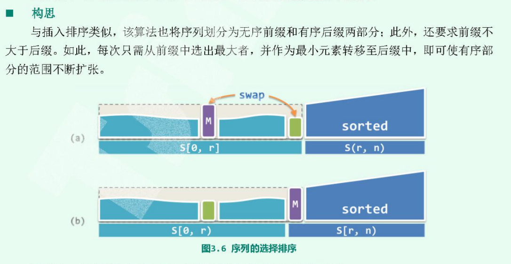
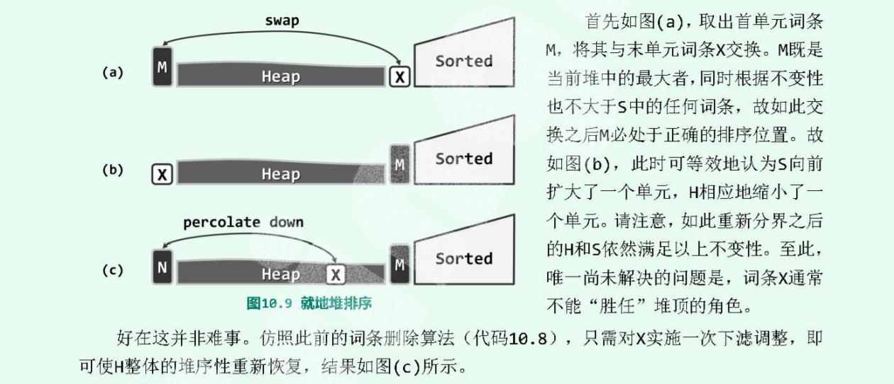
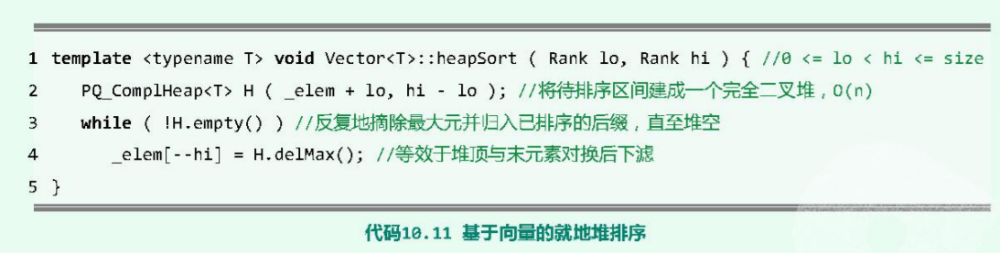

# selectSort 

相比较vector，更加适用于链表



思想：
+ 无序的前缀和有序的后缀
+ 前缀不大于后缀

因此每次从前缀中选择出最大值元素，并且作为最小值转移到后缀中，不断地迭代就可以是的整体有序。

```cpp
// 待实现


```
### 算法复杂度
对于链表而言，每次搜索无序序列中的最大值时间复杂度是`O(n)`。因此对所有的节点进行排序，时间复杂度是`O(n^2)`，**注意选择排序的时间复杂度恒定是`O(n^2)`**

可以采用最大堆，在`O(1)`时间内得到最大值，即变成堆排序。

## 堆排序
堆排序，其实也是选择排序，只是利用优先级队列这个特征，能够在`O(1)`寻找到最大值元素加入有序序列。
+ 相比归并排序的`O(nlogn)`时间复杂度，堆排序常系数可以更小
+ 实现`O(1)`的空间复杂度

由于属于选择排序，因此思想一致：分为无序的前缀 **`H`**和有序的后缀 **`S`**,前者不大于后者。不断地从 **`H`**中选取最大的元素到 **`S`**中。

  

### 时间复杂度 
交换操作只是需要常量时间，下滤操作不超过`O(logn)`，因此全部排序完成不超过`O(nlogn)`。归并排序是恒定的`O(nlogn)`复杂度，堆排序的常系数更小。加上建堆的`O(n)`时间，也不超过`O(nlogn)`



