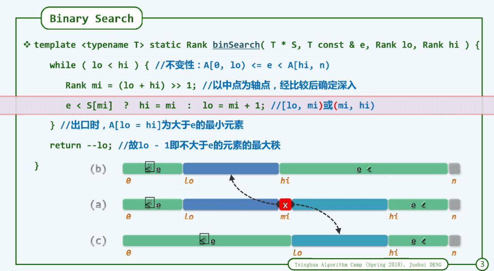
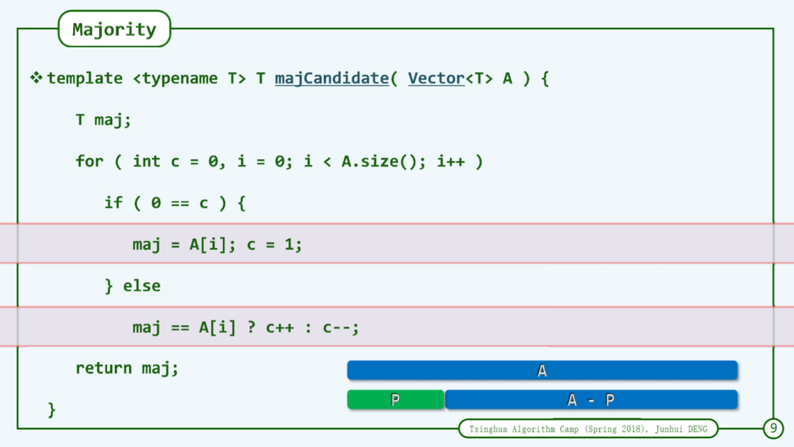
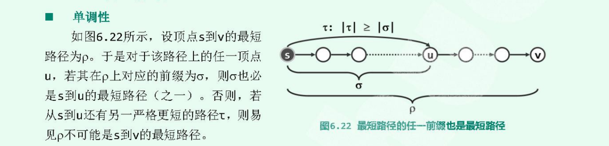
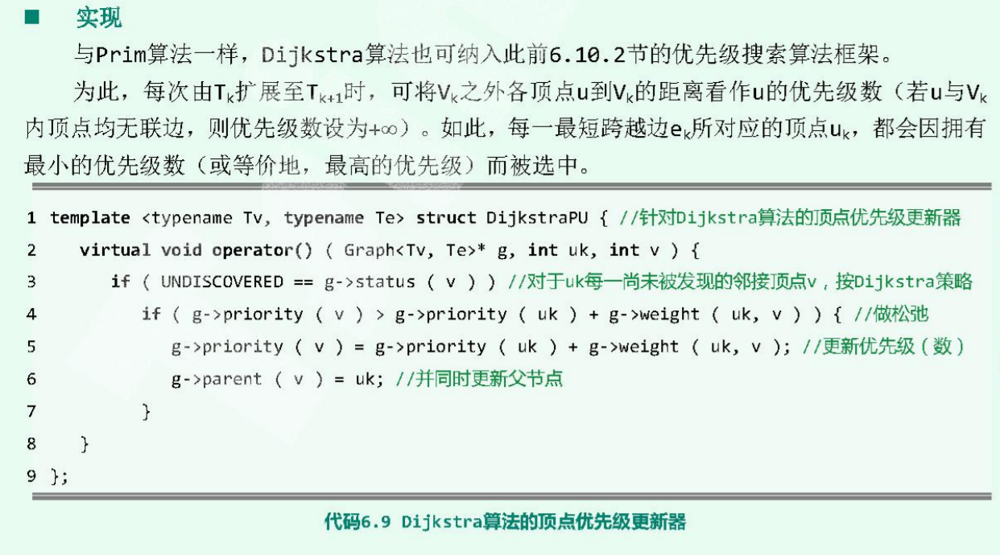

# 减而治之 

减而治之就是将大问题化为小问题，**问题规模不断地减少**。

### 1 二分查找
二分查找是典型的"减而治之"策,每次都将问题规模减少一半,使得在有序向量查找一个元素能够达到**`O(logn)`** 的时间复杂度。

```cpp
    int binarySearch(std::vector<int>& s, const int& e, int lo, int hi) { 
        while(lo < hi) {
            int mi = (lo + hi)>>1;
            e < s[mi] ? hi=m; lo=mi+1; // 前者深入[lo, mi)  后者深入(mi, hi)
        }
        // assert(lo == hi);
        return --lo;
    }
```
这个算法在普通的二分查找上更进一步，做了常系数的修改。整个区间分为两个部分:
**`[0,lo)`里的元素都小于等于`s[mi]`，`[hi, n)`中的元素都大于`s[mi]`**。  

### 2 选择排序
参阅[selectSort](../排序/5_selectSort.md)
### 3 插入排序
参阅[quicksort](../排序/img/insertSort.png)

### 4 k-选择：quicksort
参阅[quicksort](../排序/1_quickSort_.md)
### 5 众数
在一个无序序列中找众数。    



即先从假设序列`A`的首元素就是众数，那么如果猜中了是该元素是众数，那么最后`c`是不会变成0，也就是说前面的`p`不会被减除。一旦变成了0，那么就会减除前面的部分，重新开始计算，此时`A`有众数，当且仅当`A-P`有众数。这就是减而治之思想，把问题规模从`A`减少到`A-P`。

无论结果这个函数返回什么，最后都要交给主程序验证一次，判断是否是众数。

### 6 最短路径
最短路径求的是从指定的起点到图中其他顶点之间的路径怎么最短。设顶点`u_k+1`到起点`s`的最短路径需要要么从最短路径子树`Tk`中找，要么是直接到距离`s`

最短路径里的减而治之思想体现在单调性:



将顶点`ui`到起点s的距离记为：`di = dist(s, ui), 1<= i <=n`，且这个`{u1, u2...}`按照非降序排。就是说按照顶点到起点的距离给各个顶点进行编号，那么起点到各个顶点`uk`的最短路径树相应的也记为`Tk`。因此求起点到`Tk+1`的最短路径子序列，需要从`Tk`进行扩展，即找到`u_k+1`。

为什么一定要从`Tk`扩展，因为如果不从`Tk`扩展，那么说明`u_k+1`到起点`s`的距离少于`uk+1`之前顶点到`s`的距离才有可能，这与非降的排序矛盾，因此必须要从`Tk`扩展。

每次从`Tk`扩展为`Tk+1`，`uk+1`都是在`Tk`之外距离起点`s`最近的顶点，在扩展后，还是需要更新那么仍在`Tk+1`之外并且与`Tk+1`有联系的顶点的优先数。与`Prime`算法不同的是，这里的优先级是到`s`的距离作为优先级。


```cpp
// 顶点的优先级别更新
template<typename Tv, typename Te> 
struct DijkstraPu { 
    // uk 当前被加入Tk的顶点，更新uk的邻居未发现顶点
    viod operator()(Grapg<Tv, Te>* g, int uk, int v) { 
        if(UNDISCOVERED == g->status(v)) { 
            // 如果v到起点的距离 超过了 uk到起点的距离 加上 uk和v的距离
            // 那么就更新这个优先级
            if(g->priority(v) > g->priority(uk) + g->weight(uk, v)) { 
                g->priority(v) = g->priority(uk) + g->weight(uk, v);
                g->parent(v) = uk; // 从之前优先级父节点更新为新的优先级对应父节点
            }
        }
    }
};
```
这样就可以把这个加入优先级搜索框架。然后从`Tk`之外的顶点中，选择一个距离最近的顶点加入。

这个算法复杂度是`O(n^2)`，仍然可以用优先级队列进行优化。