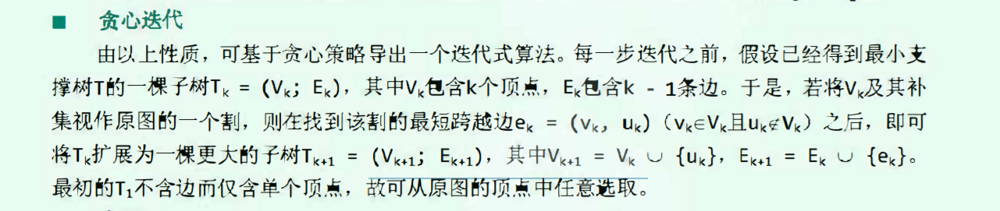

# 贪心算法与最小支撑树

一颗带权网络通常会有多颗支撑树，但是数量有限，因此肯定会有一颗最小支撑树，尽管不一定唯一。

## Prime算法
### 割(cut) 和 跨边(cross)
对于拓扑图 ***G=(V;E)***，顶点 ***V*** 的任一非平凡子集U及其补集 **V/U**之间会构成一个割(cut)，记为 ***(U: V/U)***。如果满足 u属于U，v不属于U，那么uv就是该cut的一条跨边。

`Prim`算法正确性：最小支持树总是会采用联接每一割的最短跨边。因此贪心算法就是不断地联接所有最短跨边。



### 优先级搜索 
因为每次选择从**V/U**下一个顶点时，都要考虑v到**Vk**的距离，并且最小者优先级别最高，因此，可以采用优先级别搜索。

#### 优先级与优先级数
图搜索应用虽然各具特点，但是基本框架相似。比如BFS搜索会优先考虑更早被发现的点，DFS则优先考虑最后被发现的点。每一种选择策略等相当于给所有的顶点都赋予了不同的优先级，而且随着不断迭代，每一次选择的顶点都是当前优先级别最高的点。如此可以将搜索纳入统一的框架：优先级搜索(`Priority-first search, PFS`)。

```cpp
// 下面的代码是伪代码，具体实现根据自己
template<typename Tv, Typename Te>
template<typenmae Pu> 
void Graph<Tv, Te>::PFS(int s, Pu priorityUpdater) { 
    setPriority(s, 0); // s = 0;
    setStatus(s, VISITED); // s = VISITED
    setParent(s, -1); // 根节点的父亲 -1

    while(1) { 
        // 更新顶点s的所有邻居w的优先级别
        for(int w=firstNbr(s); -1<w; w=nextNbr(s,w))  
            priorityUpdater(this, s, w)；
        
        for(int shortest=INT_MAX ,w=0; w<n; w++) { 
            if(status(s) ==UNDISCOVERD) { 
                if(shorest > priority(w)) {  // 说明w的优先级高
                    shortest = priority(w);
                    s = w; // 这一轮令居中优先级别最高的
                }
            }
        }

        if(status(s) == VISITED) break; // 说明所有的顶点都已经遍历
        // 否则
        setStatus(s) = VISITED;  
        type(parents(s), s) = TREE; // 将s及其父顶点的连边加入遍历树  
    }
}
```

因此最小支撑树，只需要实现自己的`priorityUpdater`即可。
```cpp
// uk已经是最小支撑树的一部分， v是待加入的节点
// 首先，必须v是没有访问过的节点
// 二者之间的距离值是最短的，那么就会加入
template<typename Tv, Typename Te>
struct PrimPu {
    void operator()(Graph<Tv,Te>* g, int uk ,int v) { 
        // 从没有发现的节点中寻找
        if(UNDISCOVERED == g->status(v)) { 
            if (g->piority(v) > g->weight(uk, v)) { 
                g->piority(v) = g->weight(uk, v); // 更新优先级
                g->parent(v) = uk;
            }
        }
    }
};
```

这一算法，复杂度是O(n^2),可以通过优先级队列进行改善。由次得到的最小支撑树并不唯一。


## Krusal 
对于最小支撑树提出了另一种解法，需要使用到 **`union-find`**。思想是：对于图中的所有边，第一短，第二短肯定会加入最小支撑树，但是第三短的未必，因此需要考虑，如果第三短和已经形成的最小支撑树部分有相同的交点，那么就不能加入，否则会有环(loop)。判断是否有环，就是可以采用`union-find`。

这也是一种贪心算法：每次取最短的，但是不能有环，所得结果也不唯一。