# 进程

程序段、数据段和进程控制块(PCB)三部分组成了进程实体，即进程。**创建进程，实际上是创建了进程实体中的PCB，而撤销进程就是撤销PCB，PCB是进程存在的唯一标志**。进程是进程实体的运行过程，是 **系统进行资源分配和调度的一个独立单元**。

 

进程特征

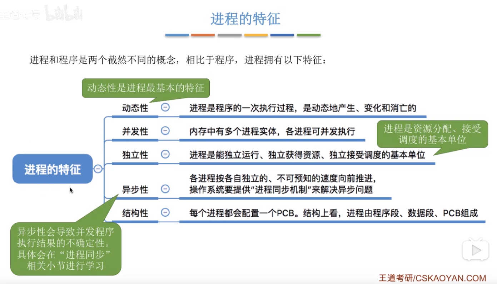 

## 进程状态
进程的状态五种状态：
+ 运行状态
+ 就绪状态
+ 阻塞状态
+ 创建状态
+ 终止状态

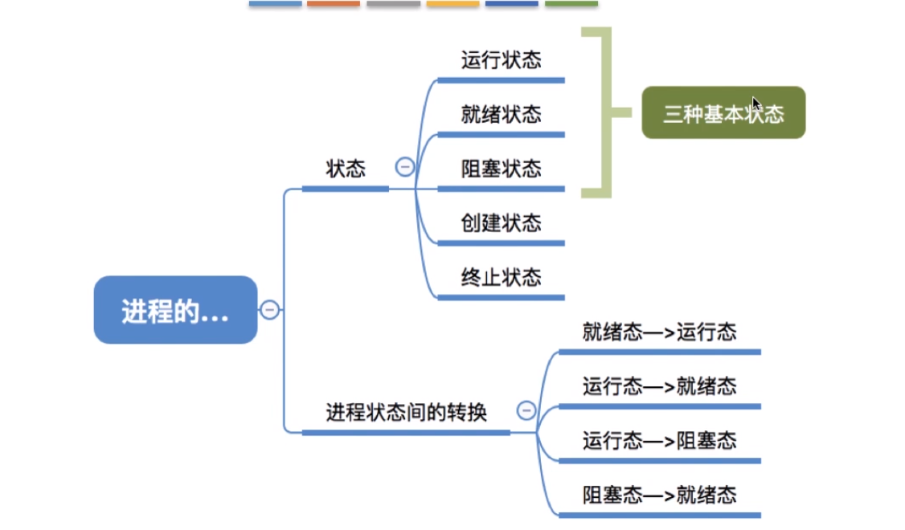

### 三种基本状态
为了方便操作系统对于进程的管理，操作系统需要将进程合理地划分为几种状态：运行态、就绪态和阻塞态。

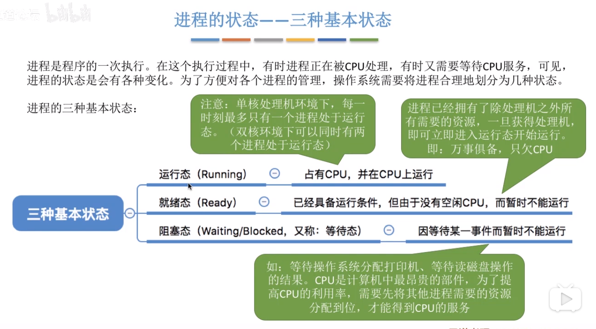 

+ 运行态：当前占据CPU资源的进程的状态
+ 就绪态：已经具备运行条件，位于进程的就绪队列中，等待进程调度被分配CPU资源
+ 阻塞态：处于运行态的进程因发出某种资源请求，操作系统将其CPU资源剥夺，等待请求的事件满足，再变成就绪态，加入就绪队列。
当在这五种状态之间切换时就涉及到进程状态间的转换。

### 进程的创建和撤销
+ 创建态：进程正在被创建，操作系统需要为其分配资源、初始化PCB
+ 终止态：进程正在从系统中撤销，操作系统会回收进程拥有的资源、撤销PCB。

这两个状态是瞬态，没有哪个进程会长时间停留在此。

## 进程状态转换
即在上述五种状态之间转换。 

 

系统完成对进程的创建工作，就进入就绪态。就绪态的进程具备被CPU服务的所有条件，等待被操作系统调度分配CPU资源。当获得CPU资源，就绪态就会变成运行态。1）如果运行态的进程就此运行结束，那么该进程将会被操作系统撤销资源，经过终止态从系统中消失。2）如果运行的进程在进行过程中需要申请某些系统资源或者等待某个时间发生，那么在等到这些条件满足之前，操作系统将该进程从运行态转换为阻塞态。位于阻塞态的进程，直到请求的资源或等待的时间响应，再转换为就绪态，加入进程就绪队列，等到进程调度被分配CPU资源。

上面的阻塞态，只能变为就绪态，而就绪态也只能等待操作系统的进程调度变为运行态。运行态-->阻塞态是主动过程，主动请求资源，而阻塞态-->就绪态是被动过程，即等待响应。

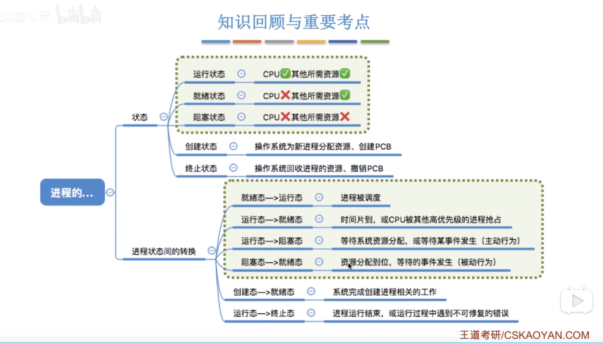

## 进程控制
进程控制：就是实现进程之间的状态转换，是通过 **`原语`** 实现。

### 原语控制
原语控制，即某个任务要么不做，要么就就做完，执行期间不允许中断，只能一气呵成。原子操作即是如此。而原语操作是通过 **关中断和开中断** 指令实现。由于开关中断的指令权限很大，因此只能在内核态下执行的特权指令。

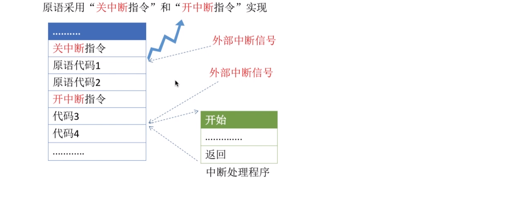 

如图，在处理进程转换时，如果有外部信号到来，这个信号会被阻塞到开中断指令，然后操作系统才会响应中断信号。 如此才能保证进行转换的顺利进行。

#### 为什么采用原语控制
为了防止进程队列中与其进程状态标志不一致。通过原语控制，实现将进程放进某个运行状态的队列时，其对应的PCB数据也会被修改与所在队列保持一致。否则如果被中断，很可能会发生不一致，导致系统崩溃。

#### 进程控制相关原语 
进程控制的相关原语，主要就是完成三个任务：
+ 更新PCB中的信息，如修改进程状态标志、将运行环境保存到PCB、从PCB恢复环境
  + 所有的进程控制原语一定都会修改进程状态标志
  + 剥夺当前运行态进行的CPU资源，肯定要去保存其运行环境
  + 某个进程开始运行前，也必然要恢复其上一次运行环境，如果是第一次，那么就是初始化设置。
+ 将PCB插入合适的队列
+ 分配/回收资源

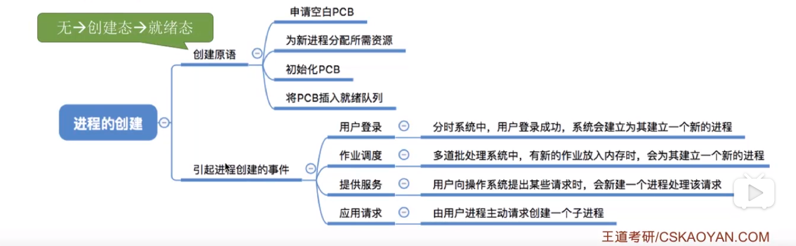 
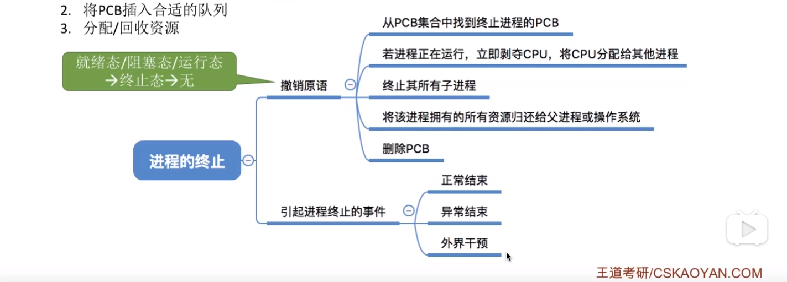
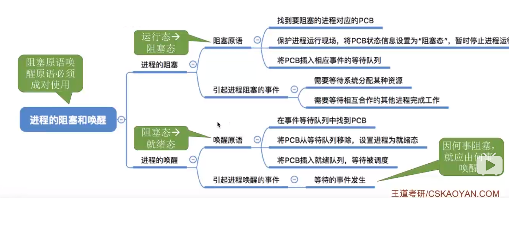 

阻塞和唤醒，是成对使用，因为什么原因阻塞，就相对应的因为其被唤醒。

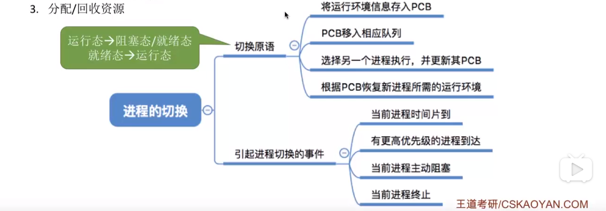

这个进程的切换原语，是一个动态的过程，上面的三个是静态的，对应于进程的某个状态。这个过程类似于函数调用。

## 进程通信
这部分详细参考`APUE`。

进程之间的信息交换。由于进程之间的内存地址空间是相互独立的，不允许进程之间直接访问。

### 共享存储 `mmap`
这是由于进程中的共享区实现的，外部函数调用`mmap`。

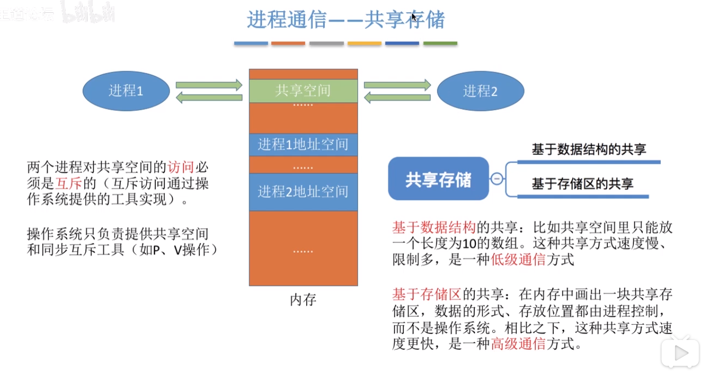

### `pipe`
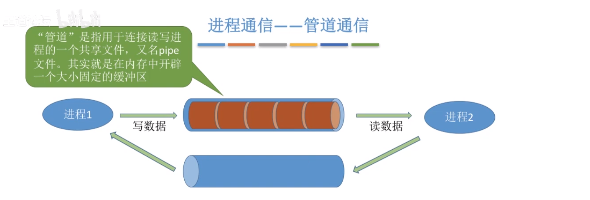 

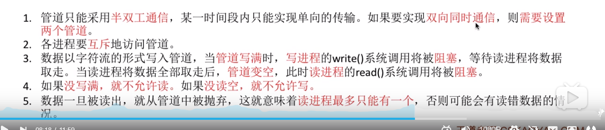

### 进程通信总结

## 线程
为了增加并发度，引入了线程，此时程序的最小执行单元是线程，传统的是进程。
