# 信号量机制

信号量，其实就是一个变量，可以是一个整数，也可以是一个更加复杂的记录型变量。用信号量表示系统中某种资源的数量。比如系统中有2台打印机资源可以使用，那么就将信号量初始值设置为2。

用户进程可以通过`信号量和原语操作`，来方便实现同步和互斥。之所以使用原语，即原子操作，来实现之前软件方法无法实现的 **“判断与赋值”这个操作一气呵成**。

信号量的一对原语，`PV` 操作：
+ `wiat(S)`：即 `P(S)`，语义是申请资源
+ `signal(S)`，即 `V(S)`，语义是释放资源

### 整型信号量
用一个整型数作为信号量，用来表示系统中的某种资源的数量，但是这个整型信号量与普通整型变量不同的是，它的的操作只有三种：初始化、P操作和V操作。

比如，如下一段伪代码，用信号量表示某个计算机系统中打印机的数量：
```cpp

int S = 1; // 初始化整型信号量，表示当前系统中可用的打印机数量

void wait(int& S) 
{ 
    while(S <=0);
    S = S-1;
} 

void signal(int& S) 
{
    S +=1;
}
```
+ `wait`原语：相当于进入区，如果资源不够，那么就会一致等待。比如 `S<=0`表示系统中已经没有资源可以被神经，那么就循环等待。
  如果资源足够，即`S >0`，那么就能成功申请到一个资源。这个`wait`原语操作：`while(s<=0); s -=1;` 是原子操作，一气呵成的。因此不存在并发问题。

+ `signal`原语：相当于退出区，使用完资源后，就是释放资源。

会发现，`wait`对应进入区，`signal`对应退出区，都没有数据处理临界区，因此二者中间部分还是应该会有一个临界区。这部分会引出后文的`互斥锁`，保护临界区。

#### 示例 
进程0 ：
```cpp
wait(S);   //    进入区，申请资源
// 使用打印机资源 临界区，访问资源
siganl(S); //    退出区，释放资源
```
进程1 
```cpp
wait(S);  
// 使用打印机资源 
siganl(S); 
```
进程n 
```cpp
wait(S);  
// 使用打印机资源 
siganl(S); 
```

1) 假设进程0，先调用`wait(S)`，此时系统资源剩余量为1，因此能够顺利申请到资源，
2) 如果又有进程1，到来请求使用打印机资源，于是调用`wait`，但是在判断`while(S <=0);`时发现资源不够，于是只能阻塞于此，一直等待。
3) 在进程0调用`signal`释放资源前，任何后续进程请求打印机资源表现和进程1都一样，只能在阻塞队列中排队。
4) 当进程0使用完打印机资源后，调用`siganl(S)`，释放资源后
5) 阻塞队列中按照调度算法，获取一个进程m为其分配打印机资源，进程m不再堵塞，`s-=1`使得系统中剩余打印机资源又0，因此其余进程还是堵塞。
6) 整个过程都是重复上面的操作，一个进程释放打印机后，其余进程就会竞争这个打印机资源，一旦有一个获得了并且调用`wait`，那么只能等待`signal`释放打印机资源，剩余阻塞进程才会继续竞争，在非竞争期间，都是处于 **忙等待**

#### 存在的问题

+ `wait`是原语操作，实现双标志检测法的功能，并且解决了“判断和赋值不是原子操作”引发的异步问题。但是存在的问题是：不满足“让权等待”，即没有系统资源的进程会出现忙等待，当调度到这个进程时占据CPU资源只能忙等待。

+ `wait`是原语实现，那么是不是就不会被进程切换？？

### 记录型信号量
记录型信号量，解决的是整型信号量中出现的忙等问题。 
```cpp
struct semaphore {
    int value;          // 系统某个资源剩余数
    struct process* L;  // 申请这个资源等待队列
};

void wait(semaphore S) {
  S.value--;
  if(S.value <0){
      block(S.L); // 这里是阻塞，就是使得进程转为阻塞态
  }
}

void signal(semaphore S) {
  S.value++;
  if(S.value <=0)
    wakeup(S.L); // 这里的唤醒，语义就是将 阻塞态的进程加入就绪进程队列
}
```
如此就不会再有忙忙等出现。因为处于阻塞态的进程不会被分配系统资源。只有当调用`signal`，将阻塞态的进程转换为就绪态，才会被分配资源，而此时该进程也已经满足继续运行的条件，因此不会出现忙等待。

#### 示例
仍然以打印机为例，假设系统有2台打印机资源，那么定义信号量变量：`struct semaphore S = {2, nullptr}; ` 
```cpp
// 进程0 ：              进程1：                      进程2：                        进程3：
wait(S);                      wait(S);                     wait(S);                     wait(S);
// 使用打印机资源              ...                          ...                          ...
signal(S);                    signal(S);                   signal(S);                   signal(S); 
``` 
运行情况，假设运行顺序：0-->3-->1-->2  
+ 假设t1时刻进程0先获取CPU资源，进入`wait`，`value`从2减为1，能过`if(S.value <0)`判断，不会堵塞，因此能顺利使用打印机资源
+ t2时刻，进程3获取CPU资源，进入`wait`，`value`从1减为0，也能过`if(S.value <0)`判断，不会堵塞，因此能顺利使用打印机资源
+ t3时刻，进程1获得CPU资源，进入`wait`，`value`从0减少为-1，因此会进入`if`循环，进程1堵塞。这里是进程切换，将进程1变为阻塞状态。
+ t4时刻，进程2获得CPU资源，进入`wait`，`value`从-1减少为-2，因此会进入`if`循环，进程2堵塞。  
`此时，拥有打印机资源的是进程0和进程3，进程1和进程2处于阻塞状态。`  
+ t5时刻，进程0使用完系统资源，进入`signal`，`value`从`-2`增加为`-1`，因此会进`if`循环，调用`wakeup`，将阻塞队列中一个进程唤醒加入到就绪队列
+ t6时刻，同理，进程3的结束，也会唤醒剩余一个阻塞的进程。

#### 记录行信号量总结
PV操作是一起使用的原语操作，不一起使用就会出现死锁。  
+ `wait(s)`：又叫`P(S)`，这个原语操作实现的是 **申请系统资源**
+ `signal(S)`：又叫`V(S)`，这个原语操作实现的是 **实现系统资源的释放**

对信号量S进行一次P操作，意味着进程发出请求系统资源一次，因此执行的是`S.value--`，表示资源数减少1，当`S.value < 0`表示系统资源已经分配完毕，该进程就会调用`block`原语进程自我阻塞，本质上是当前运行进程从运行态转化为阻塞态，主动放弃CPU资源，并且插入该类资源的等待队列`S.L`中，符合 **让权等待**原则，避免了 “忙等待”现象。

对信号量`S`的一次`V(S)`操作，意味着进程释放一个单位的该类资源，因此执行`S.value++`，表示系统资源增加1，如果增加后`S.value < 0`，表示阻塞队列中仍然有进程在阻塞等待该系统系统，因此会调用`wakeup`原语，唤醒阻塞队列中第一个进程，使得由阻塞态转化为就绪态。 
  
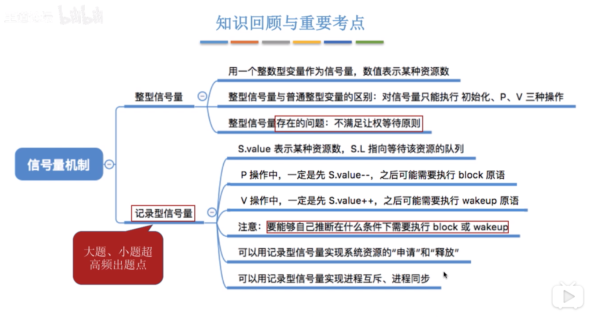 

### 信号量实现互斥

临界区，可以视为是独特的某种资源，只有一份，因此互斥信号量`Mutex`初始化值为1。此时信号量就退化为互斥锁`Mutex`。
+ 分析并发进程的关键活动，划定临界区
+ 在临界区之前执行 `P(mutex)`
+ 在临界区之后执行 `V(mutex)`

不同的临界区需要设置不同的互斥量，互斥信号量自然也需要成对使用，缺少`P(mute)`不能保持临界资源的互斥访问，缺少`V(mtex)`造成死锁。

```cpp
struct semaphore mutex = 1;
P(mutext); 

// 临界资源

V(mutex);
```
### 信号量实现同步
同步，就是让各个并发的进程按要求有序的推进。用信号量实现同步步骤：
+ 分析代码什么地方需要实现“同步关系”，即必须保证“一前一后”**有序地**执行的两个动作。
+ 设置同步信号量`S`，初始化为0.
+ 在同步关系中的“前一个操作”之后执行`V(S)`
+ 在同步关系中的“后一个操作”之前执行`P(S)`

如下代码，假设设定的运行顺序中，代码4必须是在代码2之后运行。在这里有个先后的次序，即使“2前4后”。因此根据用信号量实现同步的规则，那么需要在如下添加`PV`操作：
```cpp
struct semaphore S=0;   // 因为同步对应的没有具体的系统资源，只是用于实现同步操作

void func1(){ 
    代码1；
    代码2；
    V(S);       // 在位于前面的操作后面加V(S)
    代码3;
}

void func2(){ 
    P(S);       // 在位于后面的操作前面加P(S)
    代码4；
    代码5；
    代码6;
}
```
运行分析：  
如果`func2`进程先被运行，当运行 `P(S)`时候，由于系统资源 `S==0`，因此此时当前进程会进入阻塞状态，无法继续运行。当`func`所在进程被调度分配CPU资源：`代码1-->代码2-->V(S)`，此时就会唤醒处于阻塞状态的`func2`所在进程，也因此代码4就能得以运行。如此就保证了代码4不会早于代码2执行。

通过初始化设置`S=0`，并且在位于次序后面的操作前加上`P(S)`，那么后面的操作就会因为得不到系统资源而被阻塞，只能等次序中前一个操作运行结束，其后的`V(s)`运行结束，使得`S==1`，唤醒`P(S)`，次序中的后者才能得以运行。如此就是用信号量实现同步的原理。

自然 `V`操作是主动的，而`P`操作是被动的。

### 用信号量实现前驱关系
前驱关系，就是混合了多级同步关系，需要将其拆分为各个同关系：
+ 要为每一对前去关系设置一对同步变量，
+ 在“前操作”之后对相应的同步变量执行V操作
+ 在“后操作”之前对相应的同步变量执行P操作  

如图右侧：

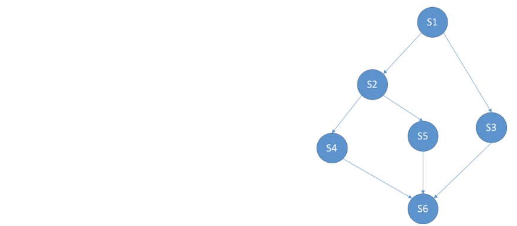 

存在的同步关系：
+ s1--> s2
+ s1--> s3
+ s2--> s4
+ s2--> s5
+ s4--> s6
+ s5--> s6
+ s3--> s6

因此需要设置7个同步信号量。

### 信号量机制总结 

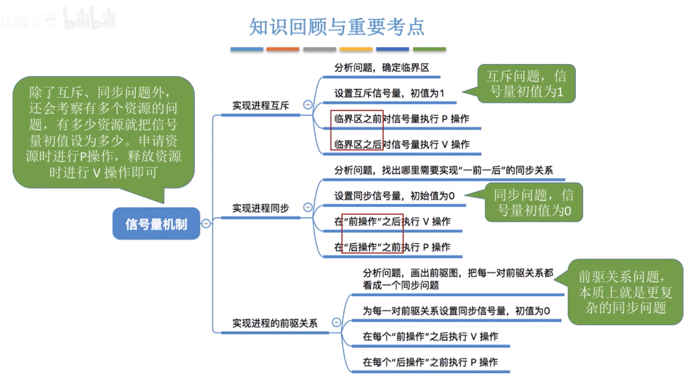 

## 互斥同步问题分析
分析过程：
+ 关系分析：找出问题中描述的各个进程，分析他们之间的同步、互斥关系
+ 整理思路：根据各个进程的操作流程确定PV操作的顺序
+ 设置信号量。设置需要的信号量，并且根据条件确定信号量初值。（一般互斥信号量初值为1，同步信号量要看对应的系统资源是多少）

### 生产者与消费者


分析：
+ 在生产者与消费者进程之间存在一个共享数据缓存区 ==> 临界区资源`mutex`初始化值大小就是该缓冲区大小
+ 生产者进程必须**等到**缓冲区不满。只要缓冲区没有满，生产者才能将产品放入缓冲区 
+ 消费者进程必须**等到**缓冲区不空。消费者才能取走产品 

因此，一共两个同步关系和一个互斥关系，
+ 设置初始值为1的互斥量`mutex=1`，保护临界资源不共享
+ 设置生产者的同步信号量`notfull =n`
+ 设置消费者的同步信号量`notEmpty=0`

在实现代码之前最好先画出PV图，可以很明确的进程之间的顺序。


```cpp

struct semaphore mutex = 1;
struct semaphore notEmpty = 0;  // 关注的是 缓冲区产使用的大小，初始化是0
struct semaphore notFull  = n;  // 关注的是 缓冲区剩余空闲大小，初始化是整个缓冲区


void producer() { 
    while(1) { 
        生产一个产品；
        p(notFull);     // 必须等待这个不是满的，减少一个空闲区
        P(mutex);
        将产品放入缓冲区 
        P(mutex);
        V(notEmpty);    // 通知消费者不是空的了，增加一个使用大小
    }
}

void cusumer() { 
    while(1) { 
        P(notEmpty); // 等待缓存区不是空，缓冲区必须有产品
        P(mutex);
        消费一个产品
        P(mutex);
        V(notFull); // 通知生产者缓冲区不是满的了，又多出了一个空闲大小
    }
}
```

因为这个缓冲区，生产者加入产品时，消费者不能使用，而消费者使用的时候生产也不能使用，因此需要加上`mutex`。
+ `p(notFull);`：每次加入一个产品就会消费一个缓存单位，因此缓存区不是满的，等价于`n!=0`，当满了，缓存区空闲剩余大小`n`就是0，因此会阻塞
+ `V(notEmpty);`：当加入了一个产品，缓冲区就会多出一个产品，那么就会缓存正在等待消费者进程。

#### 相邻的 PV操作能否改变顺序
比如生产者代码中，改变相邻的`P`操作：
```cpp
void producer() { 
    while(1) { 
        生产一个产品；
        P(mutex);       // ①
        p(notFull);     // ②
        将产品放入缓冲区 
        P(mutex);
        V(notEmpty);   
    }
}

void cusumer() { 
    while(1) { 
        P(mutex);    // ③
        P(notEmpty); // ④
        消费一个产品
        P(mutex);
        V(notFull); 
    }
}
```
假设此时，缓冲区放满了产品，运行顺序是：①②，那么`notFull = 0, notEmpty=n`。生产者在经过`P(mutex)`之后，`P(notFull)`会因为缓冲区已满，进入阻塞状态，等待消费者取走产品，那么永远执行解锁操`V(mutex)`。而消费者进程，因为缓冲区一直被生产者的`mutex`占据，消费者进程也会处于阻塞状态，也永远无法从缓冲区中取走产品，一直等待生产者释放锁。这么就会导致死锁，此时两个进程都是处于阻塞状态。  

同理，如果缓冲区没有了产品时，也会导致死锁。

因此， **实现互斥的P操作，一定要在实现同步的P操作之后**。V操作不会导致进程阻塞，可以互换。同时对于使用临界区不改变临界区的代码，不要放在临界区，否则会影响进程并发性。

### 多类生产者多类消费者

#### 问题描述

 

#### 问题分析
在问题中，生产者有父亲和目前，消费者有儿子和女儿。
+ 互斥关系：水果盘，四个人只能有一个人操作
+ 同步关系：
  + 儿子等父亲放橘子
  + 女儿等母亲放苹果
  + 父亲或者母亲等儿子或者女儿取走盘中水果

设置三个同步信号量：`appale`，`orange`，`plate`。橘子和苹果对应产品，一开始是0，盘子对应缓冲区一开始是1，因此初始化值分别是:`0,0,1`。因此可以根据同步关系，可以确定四者之间的PV关系如下：

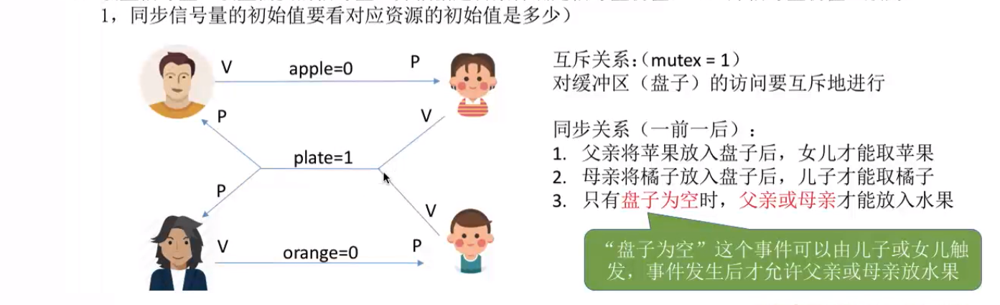 

#### 实现
根据同步关系中的 “前V后P” 关系一一设置，以及在同步关系的PV里加上互斥信号量的PV操作即可： 
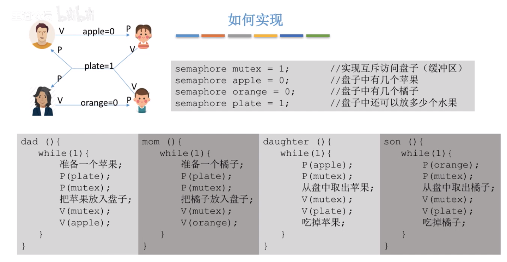

#### 进阶问题
此问题中，可以不要互斥信号量吗？

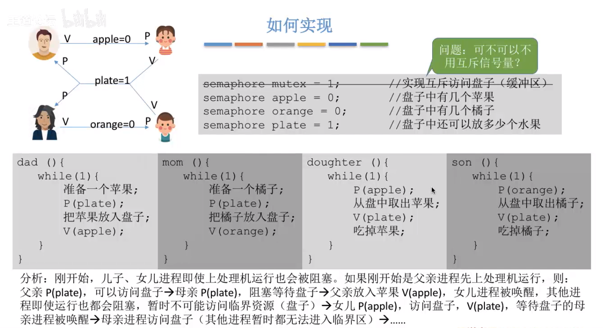

由分析可知，此时没有互斥信号量也是可以的。因此盘中的资源只有一个，而信号量`plate==1`，在某种意义上也充当了互斥信号量的角色。即使没有单独设置`mutex`也是可以的。但是当盘子容量为2时，就无法代替互斥量，此时必须单独设置一个互斥量来保护临界区资源。

#### 多生产者多消费者总结

自我感觉这个里面比较难的点是同步关系：`父亲或者母亲等儿子或者女儿取走盘中水果`的分析，因为这段容易将一个同步关系分析不当变为4个同步关系。 


分析同步关系，不能从进程的角度，比如父亲进程要等待儿子进程或者女儿进程取出盘中水果，母亲进程也是也此。而是从事件角度：父亲进程中，要放置苹果这一个事件需要等待取走水果这一事件。至于是谁取走不关心。母亲进程也是如此。再抽象化：`生产者进程需要等待消费者进程从盘中取出水果事件，才能继续放置水果事件`。

### 吸烟者问题

#### 问题描述

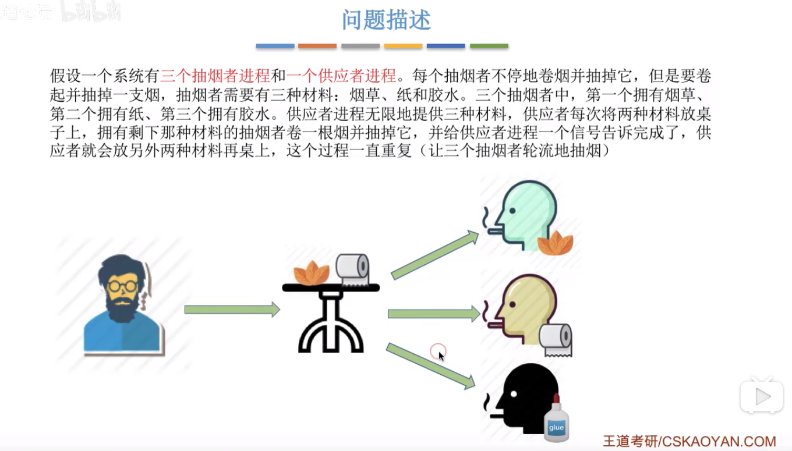 

这个其实也是一个生产消费者问题。一个生产者生产多类产品，对应着不同的消费者。三个消费者需要不同的材料且都不相同，这个生产者可以提供三种不同的材料。
+ 互斥关系：这个桌子，只能其中被一个使用，属于临界资源
+ 同步关系：
  + 消费者等生产者放置材料，
  + 生产者等消费者取走材料
    + 组合1：等第一个抽烟者取走
    + 组合2：等第二个抽烟者取走
    + 组合3：等第三个抽烟者取走

#### 实现
由此这里的资源只有一个，因此不必设置互斥锁。生产者角度的信号量初值其实就是缓冲区大小，此时1。消费者信号量初值都是0。

```cpp
struct semaphore offer1 = 0;
struct semaphore offer2 = 0;
struct semaphore offer3 = 0;
struct semaphore finsh  = 1; // 等待抽烟是否完成，初始化肯定都完成

void provider() { 
    int = 0;
    while(1) 
    { 
        P(finished); // 先请求桌子是空的
        if(i ==0) { 
            // 将组合1 放在桌子上
            V(offer1);
        }
        else if(i==1) {
            // 将组合2 放在桌子上
            V(offer2);
        }
        else {
            // 将组合3放在桌子上
            V(offer3);
        }
        i = (i+1) % 3;
    }
}

void smoke1() { 
    while(1)
    {
        P(offer1);
        // 从桌子上拿走组合1；
        V(finished);
    }
}

void smoke2() { 
    while(1)
    {
        P(offer2);
        // 从桌子上拿走组合2；
        V(finished);
    }
}

void smoke3() { 
    while(1)
    {
        P(offer3);
        // 从桌子上拿走组合3；
        V(finished);
    }
```
**如果一个生产者要生产出多种产品，或者说引发多种前驱事件，那么各个V操作应该放在各自对应的事件之后的位置。**

### 读者和写者问题
这个问题，类似于用信号量机制实现`读写锁`功能。

#### 问题描述

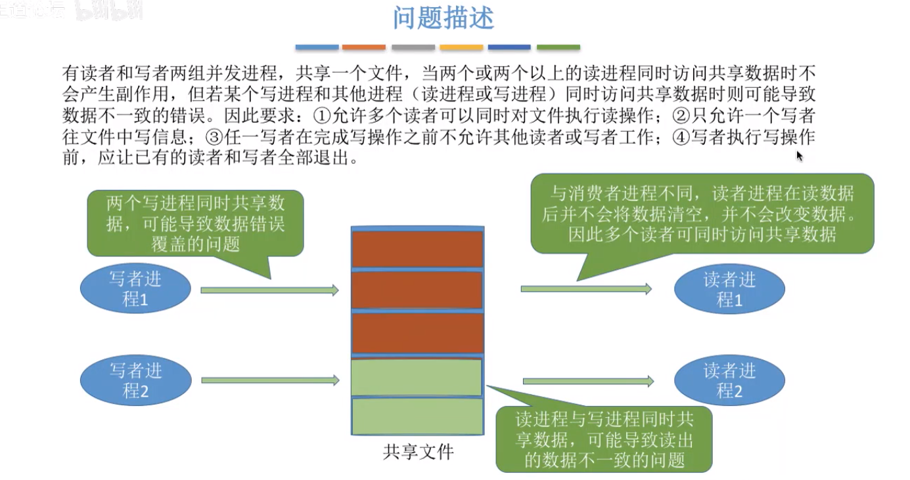 

读写锁的要求是：写优先；写独占；读共享。
+ 互斥关系：写缓冲区时只能一个进程写，不允许别的进程写，也不允许读取。

这个问题体现的是互斥关系，而不是同步关系，因为这里的读操作不会改变缓冲区，这才使得多个读进程可以同时读取，因此生产者与消费者不存在同步关系。这里存在两对互斥关系：写进程-写进程，写进程-读进程。

#### 实现
设置一个信号互斥量`rw`，在写进程共享文件之前分别执行`PV`操作。如果读取进程都执行`PV`进程，那么就会导致别的读取进程也无法访问，无法实现“读共享”。因此读写锁的关键在于：怎么实现读共享？

可以让第一个读操作加上`P(rw)`，最后一个读操作`V(rw)`，即第一个读操作加锁，最后一个读操作解锁。可以通过一个整型变量`count`来记录当前几个读进程在访问。读共享变量`count`也是读取进程中的临界区，因此也需要一个互斥锁进行保护。

```cpp
struct semaphore rw = 1; // 互斥量
struct mutex = 1;        // 用来保护对 count 变量的互斥访问 
int count = 0;

void writer() { 
    while(1) 
    {
        P(rw);
        // 写文件
        V(rw);
    }
}

void reader() { 
    while(1)
    { 
        P(mutex);
        if(count++ ==0) 
            P(rw);      // 第一个进程加锁
        V(mutex);
        // 读取文件
        
        P(mutex);
        if(--count)
            V(rw);  // 最后一个进程 释放锁
        v(mutex);
    }
}
```
但是这个模型存在一个问题，只要读进程还在继续，那么写进程就一直处于阻塞等待，造成写进程“饥饿”，违背写进程优先。

为了实现写优先，需要再增加一个互斥量:

```cpp
struct semaphore w= 1;
void writer() { 
    while(1) 
    {
        P(w);
        P(rw);
        // 写文件
        V(rw);
        V(w);
    }
}

void reader() { 
    while(1)
    { 
        P(w);
        P(mutex);
        if(count++ ==0) 
            P(rw);      // 第一个进程加锁
        V(mutex);
        V(w);
        // 读取文件
        
        P(mutex);
        if(--count)
            V(rw);  // 最后一个进程 释放锁
        v(mutex);
    }
}
```
上述实现也不是写优先，只是更加公平。加入这个互斥量之后，当多个读进程在读取的时候，突然来了一个写进程，写进程就会获得对互斥量`w`加锁`P(w)`，然后在整个写进程中保护临界区。 此时有读取/写进程来，都会被阻塞。

但是有个问题：之前多个读取进程在读的时候，突然来一个写进程，尽管可以执行写进程，但是此时`rw`锁还没有解除啊。因为要写进程来时，要将所有读取进程解除。我自己决定应该如下：
```cpp
void writer() { 
    while(1) 
    {
        P(w);
        while(count !=0) {  //如果仍然有读进程没有取消，就先取消他们
          --count;
          if(count ==0) 
            V(rw);
        }
        P(rw);
        // 写文件
        V(rw);
        V(w);
    }
}
```
#### 总结 

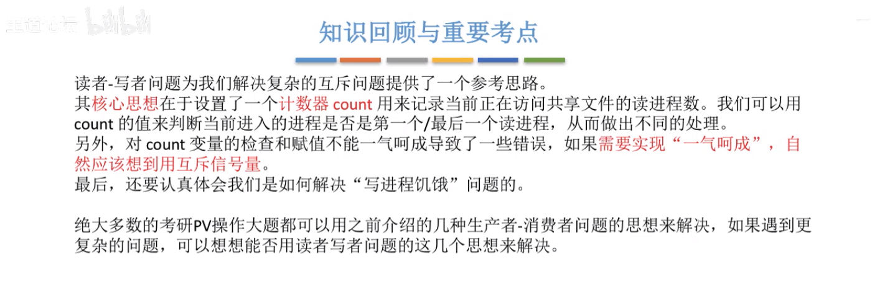

### 哲学家进餐问题


#### 分析
5个人，最多同时只能有两个人一起吃饭。这里没有同步关系，只是存在互斥关系：一根筷子的左右两个人。但是当出现，每个人都同时恰巧去拿位于他左边/右边的那个筷子，那么此时将会出现死锁，所有人都处于阻塞状态。

五根筷子都是临界资源，需要定义5个互斥信号量，并对哲学家进行编号0-4，筷子和其右边的人编号一致。

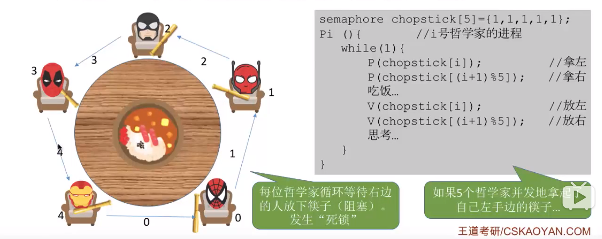 

因此，这个问题关键在于如何避免死锁。可以通过施加限制来解决：
+ 最多只是运行同时4个人拿筷子，这样就可以保证至少有一个可以拿到两只筷子吃饭。
+ 要么奇数号的哲学家先取左边的筷子，然后再去拿右边的筷子。而偶数号哲学家相反。那么对于一只筷子，任何时候都只有一个人拿到，没拿到的那人X就会阻塞。拿到筷子的那个人转而去争夺另一支筷子B，如果B有两人(X和Y)争夺，既然在争夺，肯定是两个人都有了一个筷子，不论哪个人争到，都能保证至少有一个人可以吃饭，不会变成死锁。

### 总结
这里存在多个临界资源，每个人都需要两个临界资源，可能会发生循环等待的现象导致死锁。

## 死锁

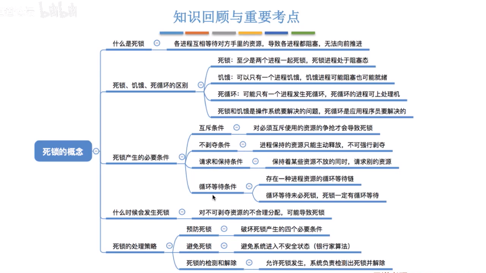