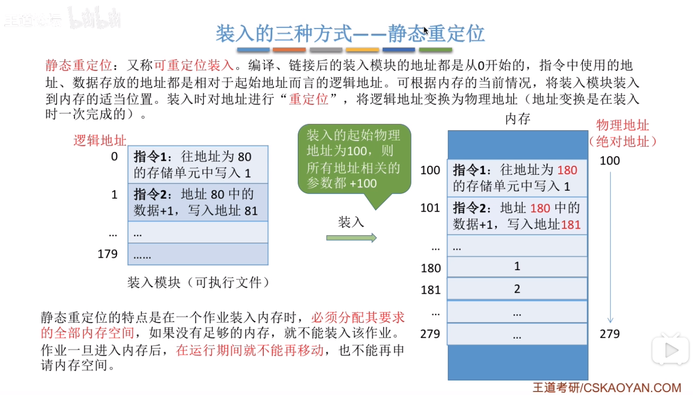
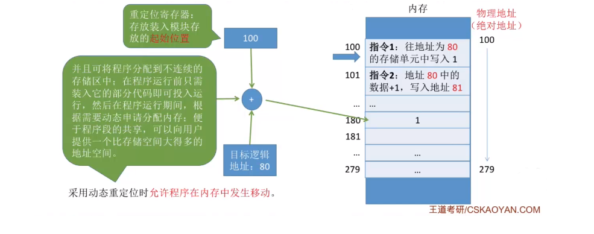
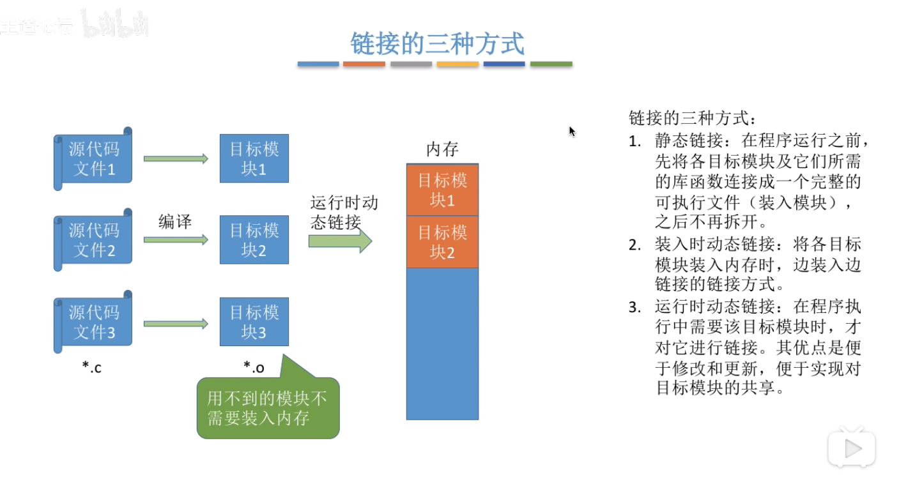

## 基本知识
### 装入的三种方式 

#### 绝对装入
在编译时，如果知道程序将放在内存的哪个位置，编译程序将产生绝对地址的目标代码，装入程序将按照转入模块中的地址，将程序和数据装入内存。

这个方式只是适用于单道程序的环境，程序中使用的绝对地址，可以在编译或者汇编时给出，也可由程序员直接赋予。最后装入模块直接使用的就是这个绝对地址在内存中操作。

#### 静态重定位 

 

指令中的地址、数据存放，都是相对起始地址而言的逻辑地址，转入时重定位为装入的物理起实地址 + 逻辑地址。所有的地址变换都是在装入时一次性完成。

#### 动态重定位
动态装入，即动态运行时装入。编译、链接后装入模块的地址都是从0开始的。装入程序把装入模块装入内存后，并不会立即把逻辑地址转换为物理地址，而是把转换工作推迟到程序真正运行的时候才执行。因此装入内存后，依旧所有的地址依旧是逻辑地址。这个方式需要一个重定位寄存器。 

 

这个方式便于实现内存的不连续不分配。

#### 链接
 

可以采用重定位寄存器（又叫做基址寄存器）和界地址寄存器（又名限长寄存器）进行越界检测。重定位寄存器中存放的是进程的起实物理地址，界地址寄存器存放的是进程的最大逻辑地址寄存器