# 内存管理

 

## 内存空间的扩充
### 覆盖技术
覆盖技术思想：将程序分为多个段，常用的段驻留在内存，不常用的段在需要时调入内存，来解决`程序大小超过物理内存总和`的问题。

内存中分为“固定区”和若干个“覆盖区”，需要驻留在内存的放在“固定区”，除非运行结束否则调入后就不再调出，不常用的段放在“覆盖区”，需要时调入，不需要时调出。

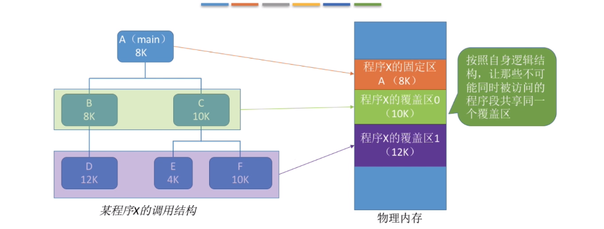 

例如上图，A段程序，是一直需要使用的，会驻留在固定区，并分配大小8k的内存。而`B-D`和`C-*`不会同时执行，因此可以先将`B-D`调入，等他们运行完再将`C-E`调入，再将`C-F`调入。

由程序员声明覆盖结构，操作系统自动完成覆盖。缺点，用于用户不透明，增加用户编程负担。仅仅早期操作系统中，已经是历史。

### 交换技术
交换技术的设计思想：内存空间紧张时，系统将内存中某些进程暂时换出到外村，把外村中某些已经具备运行条件的进程换入到内存。在进程调度中的“中级调度”即是如此，进程在内存和磁盘间的动态调度。

对于交换技术有三个主要问题：
+ 应该在外存的什么位置保存被换出的进程 
  
  具有交换功能的OS中，将磁盘空间分为`文件区`和`对换区`。其中，对换区空间只占磁盘空间的小部分，被换出的进程数据就存放于此。由于对换的速度直接影响系统的整体速度，因此兑换空间的管理主要是追求换入换出速度。这个区通常采用`连续分配方式`，其I/O速度高于文件管理区。
+ 什么时候应该交换
  
    交换通常在许多进程运行且内存吃紧时进行，在系统符负荷降低时就暂停。例如，在发现许多进程运行时经常发生缺页，就是说明内存紧张，此时可以换出一些进程。如果缺页率明显下降，那么就是可以暂停换出。
+ 应该换出哪些进程
  可以优先换出阻塞进程。可以换出优先级低的进程。为了防止优先级低的进程在被调入内存不久后又被调出，有的系统还要考虑进程在内存中的驻留时间。

  进程会被换出，但是PCB会常驻内存，不会被换出。
### 虚拟内存 
这部分内容比较多且重要，单独设置：[虚拟内存](./8_虚拟内存.md) 

## 内存空间的分配与回收
## 连续分配管理


### 单一分配
内存被分为系统区和用户区，系统区通常位于内存的低地址部分，用于存放操作系统、用户进程相关数据。而用户区，单一分配是将整个用户区分配给一个用户程序。即内存中只能有一道用户程序。

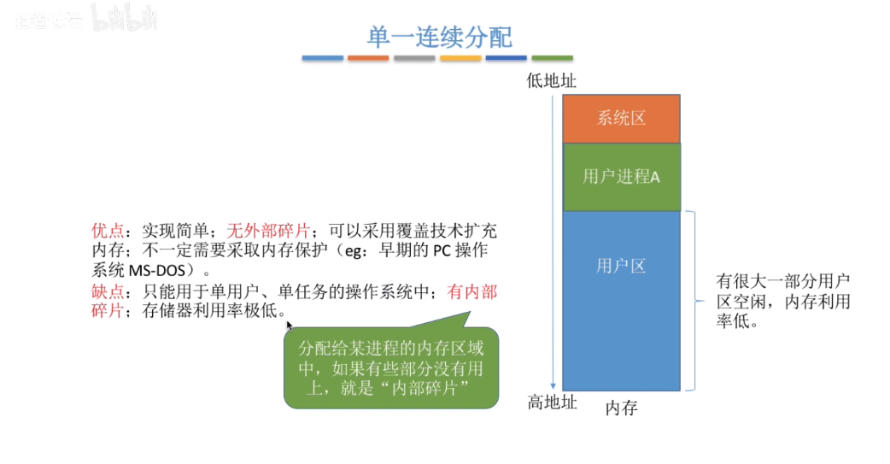

### 固定分区分配
早期多道程序设计。将内存分为系统区和用户区，又将整个用户区划分若干个固定大小的分区，在每个分区中只装入一道作业。而对于用户区的分配方式有：分区大小相等和分区大小不相等。

 

为了实现固定分区，必须要有一个数据结构：分区说明表，来实现将各个分区的分区与回收。表项包括分区的大小，起始地址、状态。

|分区号|大小(MB)| 起实地址|状态|
|-|-|-|-|
|1| 2|8|未分配|
|2| 2|10|未分配|
|3| 4|12|已分配|
|...| ...|...|...|

当某个用户程序需要装入内存时，由OS根据用户程序大小检索该表找到一个满足大小的、未分配的分区，将之分配给该程序。然后修改状态为“已经分配”。

固定分配：优点是实现简单，无外部碎片。缺点：1)用户程序太大，可能所有的分区都不能满足，此时不得不采用覆盖技术来解决，但是又会降低效率；2)虽然不会产生外部碎片，但是会产生内存碎片，内存利用率低。

### 动态分区分配
动态分区分配，又称为可变分区分配，是现代操作系统使用方法。它不会预先划分用户内存分区，而是在进程装入内存时，根据进程的大小动态地建立分区，并且使分区的大小正好适合进程的需要。因此系统分区的大小和数目是可变的。

+ 系统要用什么样的数据结构记录内存的使用情况
  
  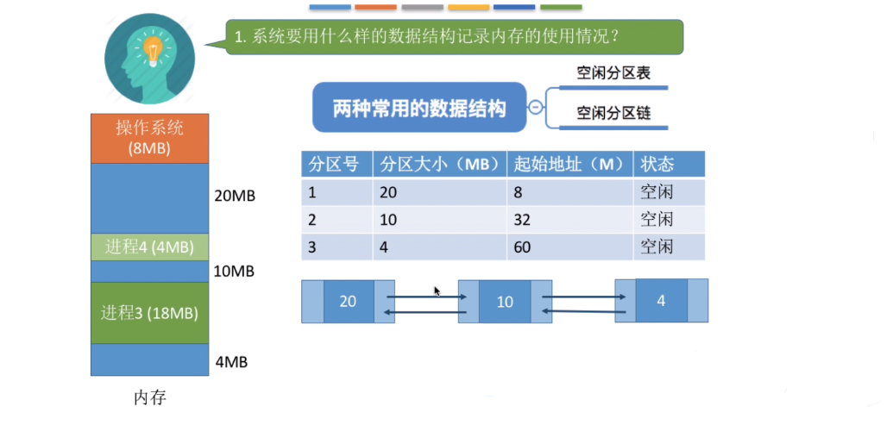 

  空闲分区表，就使用数组将记录空闲内存的各个表项结构连续存储在一起，每个表项对应一个空闲分区。空闲分区链，空闲分区表中的数据用链表链接起来。

+ 当很多个空闲分区都能满足时，应该选择哪个分区进程分配
  
  把一个新的作业装入内存，选择哪个内存区，这个需要按照 **动态分区分配算法** 从空闲分区表/链中选择一个分。
+ 如何进行分区的回收操作
    
   

  如图，上面的空闲分区表是内存初始状空闲态，
   + 当一个大小为4MB的进行被回收，
   + 如果是如果这个被回收的内存，附近存在空闲分区，那么就要刚被回收的内存和原来的空闲分区内存进行合，并且需要同时修改空闲分区表中相应的内表项：分区大小和起始地址。
   + 如果附近不存在空闲内存区，那么就在空闲分区表中建一个表项，记录这个刚被回收的内存。

### 动态分区算法
这是对动态分区分配方式中的动态分区算法的补充。
#### 首次适应算法 
思想：每次都是从低地址开始查找，找到第一个能满足大小的空闲分区。在实现上，将空闲分区**以地址递增的次序排列**，每次内存分配时顺序查找空闲分区表/链，找到大小第一个满足要求的空闲分区。

如图，根据空闲分区建立的空闲分区链/表： 

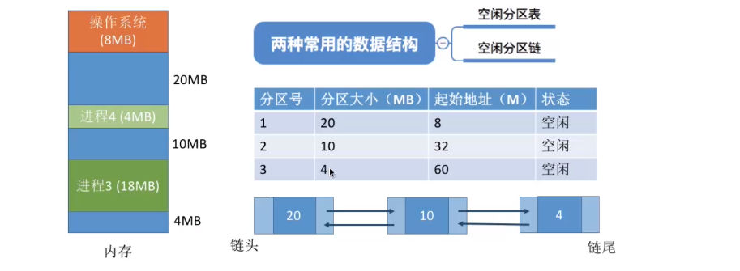 

#### 最佳适应算法
思想：每次分配内存时，找到满足需要大小的最小空闲内存，优先使用更小的空闲区。目的是保证大进程到来时能有足够的大片空间。在实现上，将空闲分区按照容量的大小以递增次序排列/链接，每次分配内存时顺序查找空闲分区链/表，找到满足大小的第一个空闲分区。

如图，根据空闲分区建立的空闲分区链/表： 

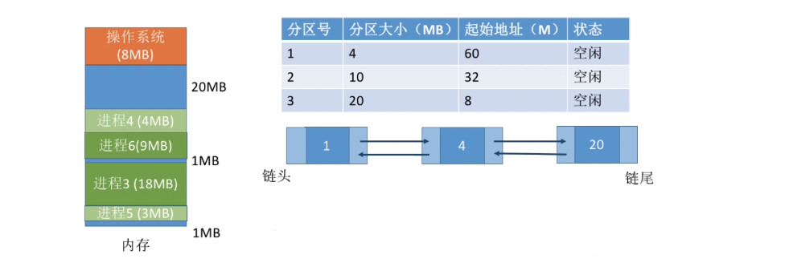

缺点是：1)每次都选择最小的分区进行分配，会留下越来越多的、很小的、难以利用的内存块，因此这种方法会产生很多的外部碎片。2)每次分配/回收内存后，都是需要动态调整表项的位置，以满足容量递增的顺序，因此开销很大。

#### 最坏适应算法
又称“最大适应算法`Largest Fit`”

思想：为解决“最佳适应算法”中留下太多难以利用的小碎片，可以在每次分配时优先使用最大的空闲分区，这一分配后剩余的空闲区就不会太小，更加方便使用。最坏使用算法，使空闲分区 **按空闲分区容量递减** 的次序链接，每次分配内存时顺序查找空闲分区链/表，找到第一个满足要求的空闲分区。

如图，根据空闲分区建立的空闲分区链/表： 

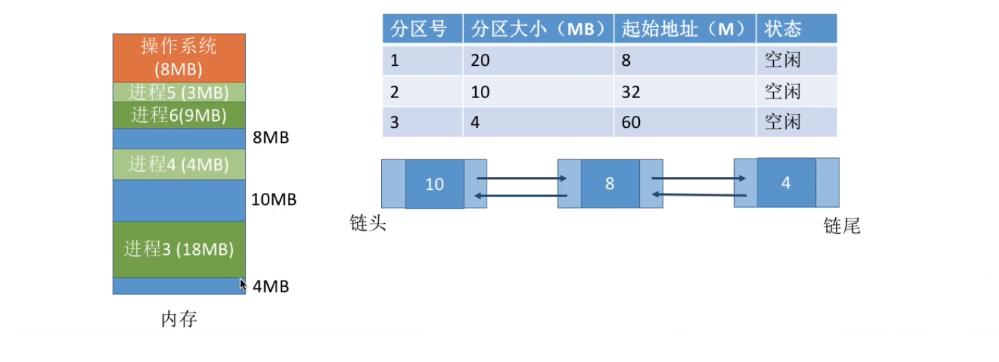

缺点：1) 每次都选择最大的内存分配，虽然会减少外部碎片，但是会导致较大的连续空闲区分配出去后，如果有更大的进程到达，没有内存可供分配。2)和最佳适应算法相同。

#### 邻近适应算法 
思想：由于最佳适应算法都是从链表开头的位置开始查找，这会导致低地址部分出现很多的小空闲分区，而每次分配查找时都要经过这些分区，因此增加了查找的开销。而如果每次都从上次查找的结束的位置开始检索，就能解决上述问题。在实现上，空闲分区 **以地址递增的顺序排列** （可排列成一个循环链表），每次分配内存分配时 **从上次查找结束的位置开始查找空闲分区链，找到能满足大小的第一个空闲分区**。

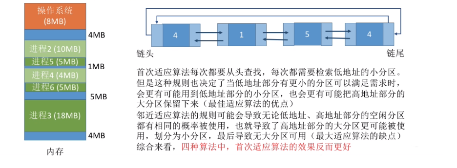 

开销小，不需要重新排列列表

#### 动态分配算法总结

 

## 非连续分配方式-分页存储
支持多道程序的两种连续分配方式：
+ 固定分区分配：缺乏灵活性，会产生大量的内部碎片，内存的利用率很低
+ 动态分区分配：会产生很多外部碎片，虽然可以用“紧凑”技术来处理，但是“紧凑”的时间代价很高

因此，如果允许将一个进程分散地装入到许多不相邻的内存分区中，便可以充分地利用内存，而无需再进行“紧凑”。基于这一思想，产生了“非连续分配方式”，或者称为“离散分配方式”。

### 分页存储
将内存空间分为一个个大小相等的分区（都是设置为2的整数幂，比如每个分区4KB），每个分区就是一个`页框`，或者`页帧`，每个页框都会有一个编号，称为页框号。页框号从0开始编号。将用户进程的地址空间也按照页框大小划分为一个个区域，每个区域称为`页`或者`页面`，每个页面也有一个编号，称为`页号`，从0开始。

操作系统以页框为单位为各个进程分配内存空间。进程的每个页面分别一个页框之中，也就是说进程的页面与内存的页框之间一一对应。 各个页面不必连续存放，也不必按照先后顺序存放， 因此实现了不连续分配。

#### 地址转换计算
计算步骤：
+ 要算出逻辑地址对应的页号
+ 知道页号对应的页面在物理内存中起始地址
+ 计算出逻辑地址在页面内的偏移量
+ 物理地址 = 页面起始地址 + 页内偏移地址

具体地，
+ 页面在内存中的起始地址用页表存储 
+ 页号 = 逻辑地址 / 页面长度 
+ 页内偏移地址 = 逻辑地址 % 页面长度 

因此，整个地址转换，只是需要提供一个逻辑地址即可。

每个分页存储的逻辑地址结构如下：

 

如果有K位表示“页内偏移量”，那么说明系统中一个页面的大小的是`2^k`个内存单元。如果有M位表示“页号”，那么说明在系统中，一个进程最多允许有`2^M`个单元。

#### 页表
为了能知道进程中每个页面在内存中的存放位置，操作系统要为每个进程建立一张页表。

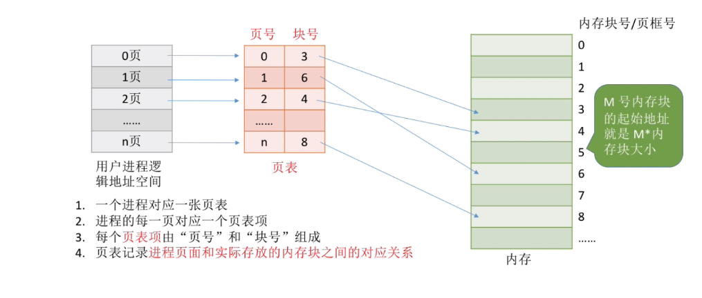

图中的“块号”其实就是页框号，记录进程的这个页面对应内存中的第几个页框。比如，进程的第0号页面，对应的是内存中的第3号页框，它的起始地址就是 `3*M`， 其中M是每个页框的大小。

在页表中，页号其实是隐藏的。

意思是，不需要页表中前一列的页号，因为这个页号和用户进程中的页号是一一对应的，有进程中页号就足够了，通过进程中的页号M就能直接算出M号的页表项的地址：`X+4*M`，其中4是每个页框号的字节数。再取出这个地址的内容，就是对应的内存的页框号。

#### 页表项 
一般地，在一个物理内存为4G，页面大小为4KB的操作系统中，内存会被分为`2^32/2^12=2^20`个内存块，因此内存块号的范围是`0 ~ 2^20-1`。因此，至少需要20为才能完整地表示这么多的内存块号，对应的至少需要3个字节。

然而，一个页面4KB可以存放`4096 /3=1365`个页表项，会产生`4096 %3=1`的内存碎片。如果每个页表项占4个字节，那么每个页框刚好可以存放1024个页表项，

因此，进程中的页号M号的页表项的地址：`X+4*M`，其中`X`是页表的起始地址。

### 基本地址变换结构
借组页进程的页表，基址变换机构可以将逻辑地址转化为物理地址。

在系统设置一个页表寄存器`PTR`，存放页表在内存中的起始地址`F`和页表长度`M`。进程未执行时，`F`和`M`都会存放在进程控制块`PCB`中，当进程被调度时，操作系统内核会将`F`和`M`放到页表寄存器中。 

设置页面大小为`L`，逻辑地址`A`到物理地址`E`的转换过程如下： 
+ 根据逻辑地址`A`计算页号`P`和页内偏移地址`W`
+ 比较页号`P`和页表长度`M`，如果 `P>=M` 说明发生越界，则会产生越界中断。否则继续执行。
+ 页表中页号`P`对应的的页表项地址 =`F + 4*P`。取出该页表新的内容`b`，这个`b`就是对应内存中的内存块号。
+ 物理地址`E = b*L + W`，用得到的物理地址`E`去访问内存。

#### 示例 
在分页存储管理的系统中，只要确定了每个页面的大小，逻辑地址就可以根据页面大小，算出页号和页内偏移地址，因此逻辑地址结构就能确定。因此，页式管理中的地址是一维度的。

 

### 具有快表的地址变换机构`TLB`
假设下面代码中数组`a[100]`的地址是20，那么在这段代码会短时间在频繁地访问20地址相邻的地址单元。同时赋值`a[i]=i`这个指令操作，也会被频繁地调用，局部很强的局部性。
```cpp
  int i=0;
  int a[100];

  while(i <100 ) { 
    a[i] = i;
    i++;
  }
```
局部性原理：
+ 时间局部性
  
  如果执行了程序中的某个指令，难么不久后这条指令很可能会再次执行；如果某个数据被访问过，不久之后该数据很可能会再次被访问。
+ 空间局部性
  
  一旦程序访问了某个存储单元，不久之后其附近的存储单元也有可能被访问（这是因为很多数据在内存中都是连续存放的）

在基址变换机构中，每次都要访问一个逻辑地址，都需要查找页表中的页表项，由局部性原理可知，可能连续很多次查到的都是同一个页表项。通过局部性原理可以加速这个操作流程。

#### 快表查询过程
结合局部性原理，比基址变换化机构多了一个快表，自然对应的基本地址变换机构就是慢表。每次查找，都是先在快表中查找，如果快表中不存在，那么再去慢表中查找，并且将找到的页表项复制到快表中。地址变换可以如下图所示：

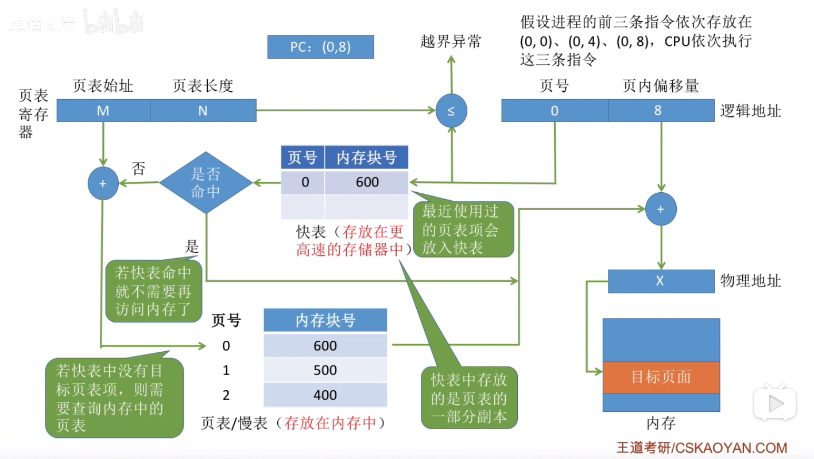 

在上图中，先是执行逻辑地址结构`(0,0)`的查询，会先进入快表中查询第0号页，未命中，因此会转而去页表中查询到起始地址为`F+4*0`，并且获得第0页对应内存中的第600号内存块，在查询获得后，1）将从页表中查询到的页表项复制到快表中；2）计算出物理地址。

当再次查询`(0,4)`，`(0,8)`的时候，就会直接进入快表中查询，极大的提高了效率。

##### 快表查询完整过程
+ CPU给出逻辑地址，由硬件算出页号，页内偏移量，将页号快表中的所有页号进行比较。
+ 如果找到匹配的页号，直接从中取出该页对应的内存块号，再将内存块号与页内偏移量拼接成物理地址，然后访问物理地址对应的内存单元。因此，若快表命中，则访问某个逻辑地址仅需一次访问内存即可。
+ 如果没有找到匹配的页号
  + 需要访问内存中的页表，找到对应的页表项，得到页表项存放的内存块号，与页内偏移地址拼接成物理地址，访问物理地址对应的内存单元。因此，如果没有命中快表，需要两次访问内存。
  + 将在慢表中找到的页表项复制到快表中，如果快表已满，可以参考虚拟内存中的页面置换算法替换旧的页表项。
  
快表的查询速度，和CPU指令周期一个数量级，只要快表命中，可以极大提高效率。一般快表命中率可以到达90%以上。

#### 地址变换机构总结 
 
### **两级页表**
32位的逻辑地址，如果每个页面大小是 $4KB$，页表项大小是 $4 Bytes$，因此那么页内偏移地址就需要用12位表示($4KB = 2^{12}$)，页号用剩余20位表示，因此系统中最多可有`2^20`页。那么一个进程最多也会有$2^{20}$个页表项，会导致一个页表消耗占内存也很大，最大需要$2^{20} * 4 = 2^{22}$字节。 因为一个页面是$4K$，在一个进程中存这个页表，那么就是至多需要 $2^{22}/2^{12}$个页面存储这个页表。

但实际上，**由局部性原理可知，进程在一段时间内，只需要访问某几个页面就能正常运行**。因此没有必要将整个物理内存的页表都加载进来。

这里稍稍解释下，将4G物理内存按照页面大小4K可以划分$2^{20}$个，但是进程没必要建立一个映射到全部物理页框的页表，而是只是需要其中几个物理页即可。

整个设计需要结合后面的虚拟内存技术，才能更好的理解。
#### 问题1：如何解决进程在内存中必须连续存储的问题
之前可以将进程地址空间分页，并且为其建立一张页表，记录各个页面的存放位置。这个思路也可以用于解决“页表也必须连续存放”的问题，把必须连续存放的页表再分页。 

可以将页表进行分组，使得每个内存块可以放入一个分组。比如页面大小4K，每个页表项是4B，每个页面可以存放1K个页表项，因此每1K个连续的页表项为一组，每组刚好占一个内存块，再将各组离散地放到各个内存块中。

自然地，也需要为离散的页表再建立一张页表，称为页目录表，或者页顶层表。

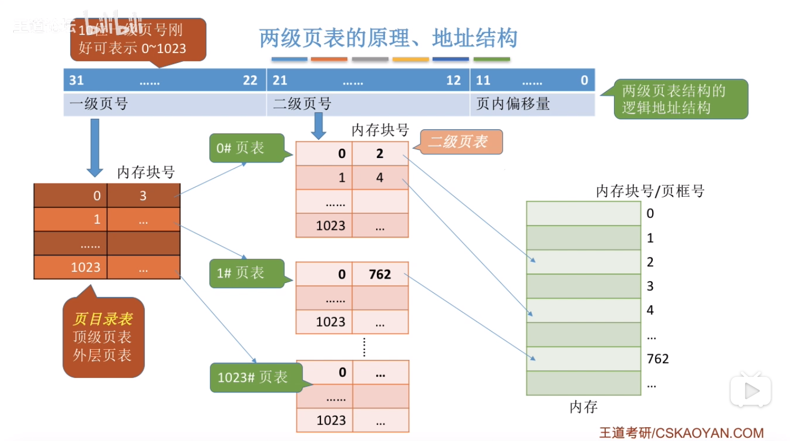

两级页表的逻辑地址结构，增加了一项，之前是一个页号，现在是两个页号。将4G内存空间分为1024组二级页表，再用一个一级页表指向这个二级页表，最后由于这个二级页表指向内存块。

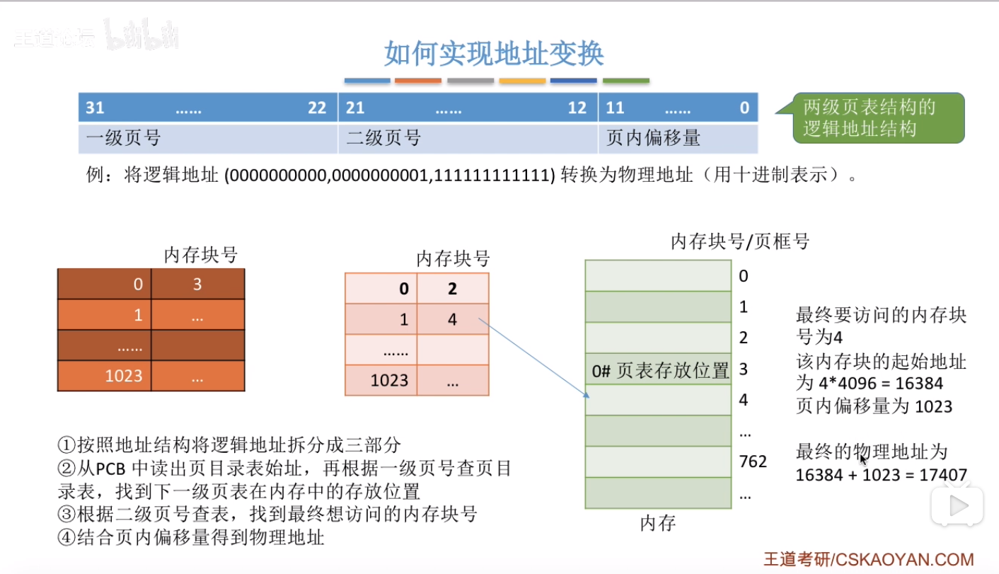

#### 没有必要让整个页表都常驻内存，因为进程在某一段时间内，可能只需要访问某几个特定的页面
可以在需要访问页面的时候才把页面调入内存（即虚拟存储技术）。在实现上，可以在一级和二级页表项中增加一个标志位，用于表示该页面是否已经调入内存。

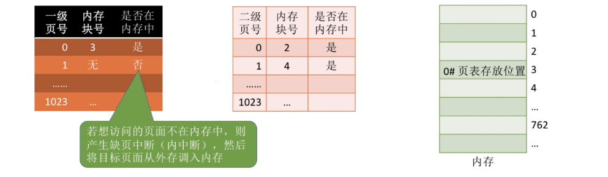 

### 两级页表注意事项
 

N级页表的访问内存次数，在没有快表的情况下，是N+1

## 非连续分配方式-基本分段存储管理

进程的地址空间，按照程序的自身逻辑关系划分为若干个段，每一个段都有一个段名，可以方便在汇编中用段名来编程。每段从0开始编址。

内存分配原则：以段为单位进行分配，每个段在内存中占据连续空间，但各个段之间可以不相邻。

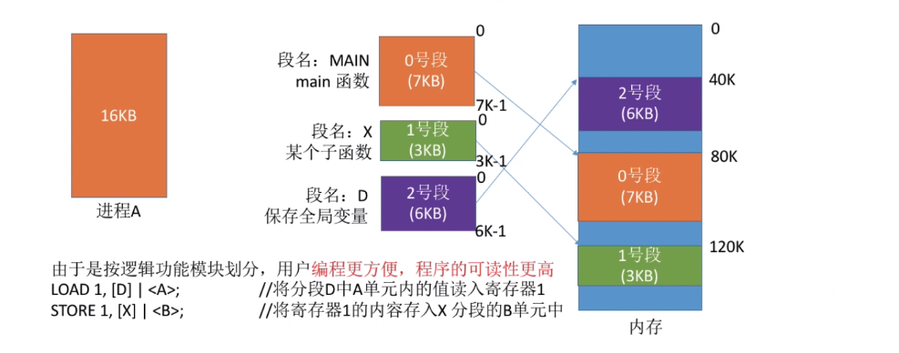 

#### 逻辑地址
分段系统的逻辑地址结构是由于：段号（段名）和段内偏移地址组成，如：

 

上图中，段号16位，因此在该系统中，每个进程最多可以有64K个段；段内地址16位，因此每个段的最大长度是64K。

在编译时，会将段名转换为段号

### 段表
程序分为多个段，各段离散的装入内存，为了保证程序能正常运行，需要找到其对应的物理内存位置。因此，各个进程建立一个段映射表：段表

[段表](./img/内存管理_非连续分配_段表) 

+ 每个段对应一个段表项，段表项记录了该段在物理内存中的起始位置（段基址）和段的长度。
+ 各个段表项的长度是相同的。因为和页表类似，段表的段号也是隐含的，不占存储空间。设段表的起始地址是`F`，则第`X`个段表项的地址是:`M+X*b`，其中b是段表项大小。

### 段的逻辑地址转换为物理地址
过程和页表地址机构翻译为物理地址过程差不多： 

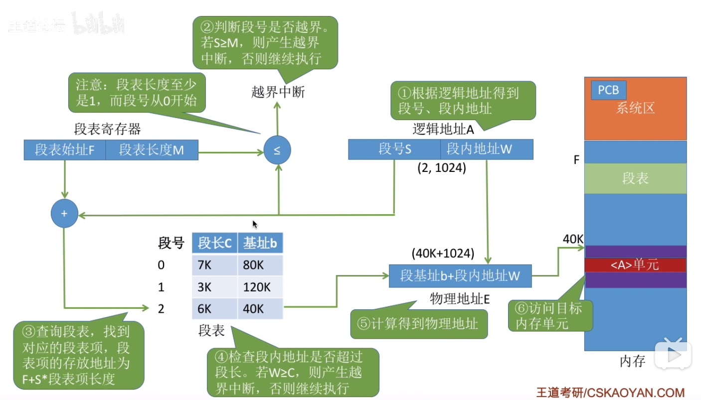 


分段中，段长是变化的，在翻译地址时需要检验长度是否越界。

### 分段与分页的对比
 

 