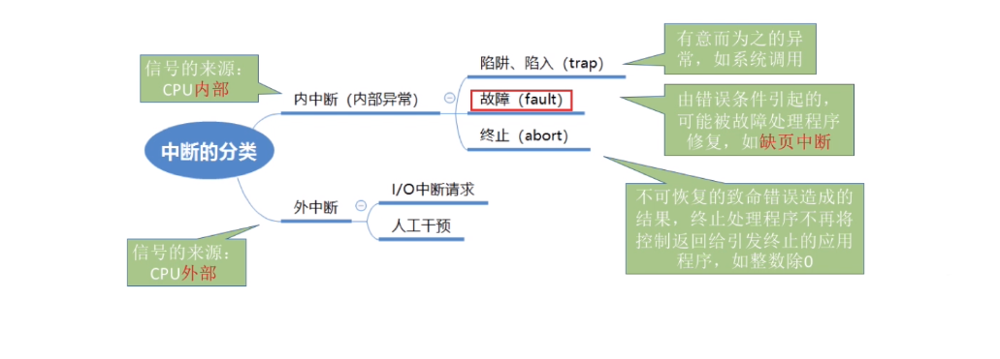
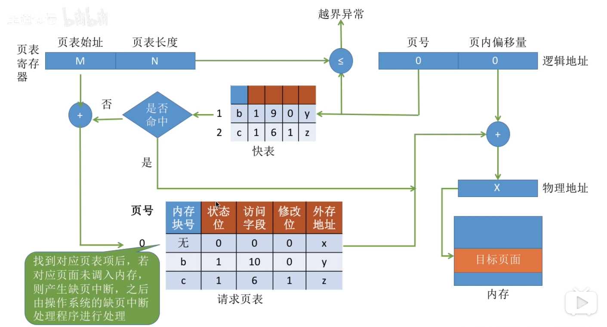
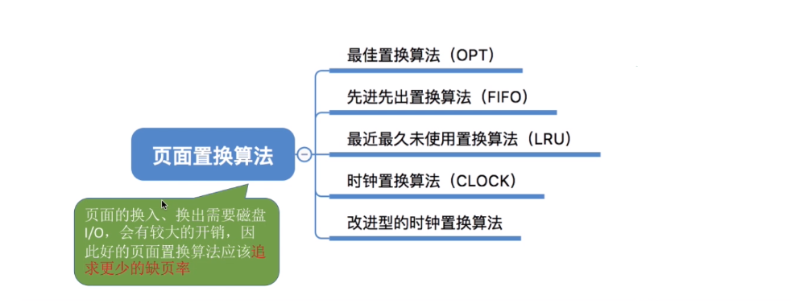
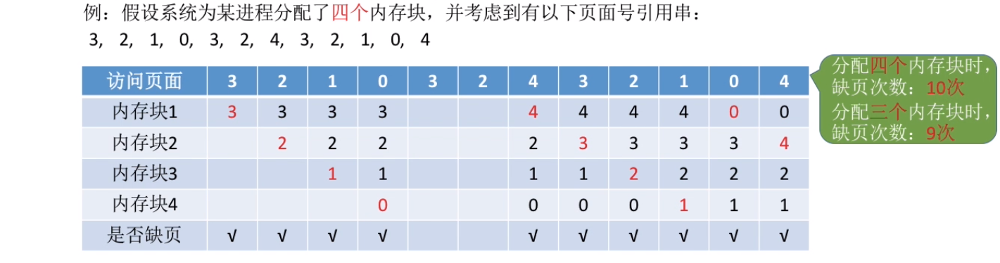
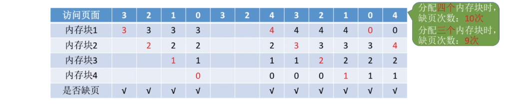
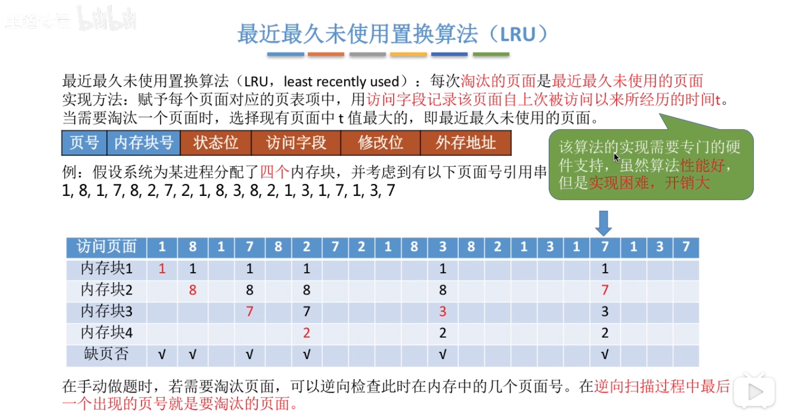
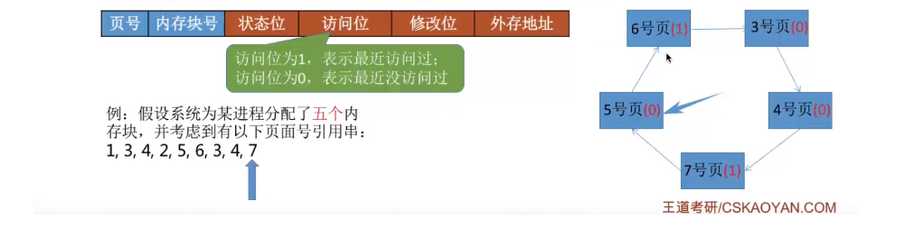
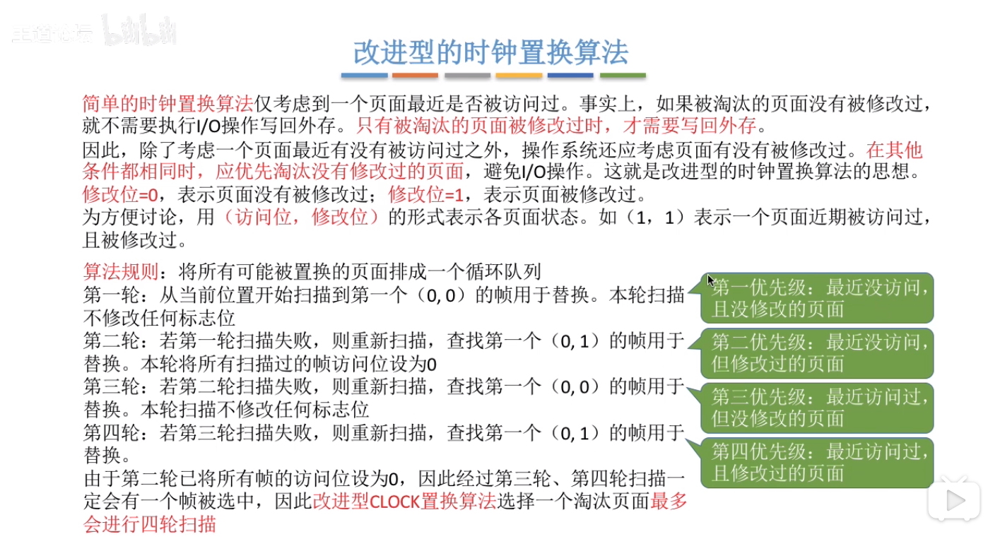

# 虚拟内存

## 传统存储管理方式的缺点

传统的存储管理方式的缺点：
+ 一次性：作业必须一次性全部装入内存后才能开始运行。这会造成两个问题：1）作业很大时不能全部装入内存，导致大作业无法运行；2）当大量作业要求运行时，由于内存无法容纳所有的作业，因此只能有少量的作业能运行，导致多道程序并发度下降。
+ 驻留性：一旦作业被装入到内存中，就会一直驻留在内存中，直到作业运行结束。事实上，由局部性原理可知，在一个时间段内，只要访问作业的一小部分数据即可正常运行，这就导致了内存中会驻留大量的、暂时用不到的数据，浪费了内存资源。
## 虚拟存储
通过局部性原理：
+ 在程序装入的过程中，可以将程序很快用到的部分装入内存，暂时用不到的部分驻留在外村，就可以让程序开始执行，
+ 在程序执行中，当所访问信息不在内存中时，由操作系统负责将所需信息从外村调入内存，然后继续执行程序。
+ 当内存空间不够，操作系统负责将内存中暂时用不到的信息换出到外村

因此，使得操作系统可以使用一个比实际物理内存大得多内存，即虚拟内存。这个虚拟内存就解决了“页表”中的问题2，两级页表 + 虚拟内存实现，可以高效查询。

#### 虚拟内存三个主要特征：
总结，针对传统的存储技术，虚拟存储有三个主要特征：
+ 多次性：无需在作业运行时一次性全部装入内存，而是运行被分成多次调入内存
+ 对换性：在无作业运行时无需一直常驻内存，而是允许在作业运行过程中将作业换入换出。
+ 虚拟性：从逻辑上扩充了内存的容量，用户看到的容量，远大于实际的容量。这是虚拟内存的体现

虚拟内存的最大容量是由于计算机地址结构（CPU寻址范围确定的），虚拟内存的实际容量 = MIN(内存和外存容量之和，CPU寻址范围)。

#### 虚拟内存的实现
虚拟内存技术，允许一个作业多次调入内存。如果采用连续分配方式，会不方便实现，因此虚拟内存的实现是建立在离散分配的内存管理方式基础上。
+ 请求分页存储管理
+ 请求分段存储管理
+ 请求段页式管理
  
### 请求分页存储管理 
对于的基本分页的驻留行和一次性缺点，请求分页存储管理的主要区别：
+ 在程序执行的过程中，当所访问的信息不在内存中时，由操作系统负责将所需信息从外存调入内存，然后执行程序。这是由操作系统提供的请求调页功能，将缺失页面从外存调入内存。
+ 如果内存空间不够，由操作系统将内存中暂时用不到的信息换出到外存。操作系统提供直面置换的功能，将暂时用不到的页面换出到外村。

### 页表机制
为实现请求调页，操作系统需要知道每个页面是否已经调入内存，如果还没有调入，那么也需要知道该页面在外村中的存放位置。当内存空间不够，要实现“页面置换”，操作系统需要通过某些标志位来决定到底换出哪个页面：有的页面没有被修改过，就不用再浪费时间写回到外存。有的页面修改过，就需要将外存中的旧数据覆盖，因此操作系统也需要记录各个页面是否被修改的信息。

因此，虚拟内存的页表结构，比基本页表多出了：
+ 状态位：表示是否已经调入内存
+ 访问字段：记录最近被访问过几次，或者上次访问的时间，可供页面置换算法选择换出哪个页面时使用
+ 修改位：页面调入内存后是否被修改过
+ 外存地址：页面再外存中的位置

|内存块号|状态位|访问字段|修改位|外存地址|
|-|-|-|-|-|
|无|0|0|0|x|
|b|1|10|0|y|
|c|1|6|1|z|
|...|...|...|...|...|

### 缺页中断 
缺页中断，是因为当前执行的指令想要访问的目标页面未调入内存时产生的，因此属于内中断。一条指令在执行期间可能会产生多次缺页中断，比如`copy A to B`，如果A，B属于不同的页面且都不在内存中，那么将会产生两次缺页中断。

 

假设某个要访问的逻辑地址 = （页号，页内偏移量）=（0，1024）

在请求分页系统中，所请查询的页表项不在内存中时：
+ 每次当访问的页面不在内存中时，会触发缺页中断，由操作系统的缺页中断处理程序处理中断。此时，缺页的进程阻塞，放入阻塞队列，调页完成后再将其唤醒，放回就绪队列。
+ 如果内存中有空闲块，则为进程分配一个空闲块，将所缺页面装入该块，并且修改页表中相应的表项。
+ 如果内存中没有空闲块，则由页面置换算法选择一个页面淘汰，若该页面在内存期间被修改过，则要将其写回外村，没有修改过的自然不需要写回外存。被淘汰的页面，如果之前在快表中有副本，那么也需要删除快表中的副本。
增加了2个功能

由此可见，在一个缺页中断中会出现：请求调页，在没有空闲块时出现页面置换。
### 地址变换机构

相比较，基本页的地址变换，虚拟内存的地址变换增加了三个步骤：
+ 请求调页（查到页表项时进行判断）
+ 页面置换（需要调入页面，但没有空闲内存块时进行）
+ 需要修改请求页表中新增的页表项
  
这三步都是在缺页中断时实现的，也就是在查询慢表时实现的。其他部分和基本页表查询过程类似，快表中存在，则直接从快表中查询获得。地址逻辑结构仍然是（页号，页内偏移量）。

### 页面置换算法
页面的换入换出需要磁盘I/O，有较大的开销，因此较好的页面置换算法应该追求较低的缺页率： 

 

### 最佳置换算法
思想是：每次选择淘汰的页面是将以后永不使用或者在最长时间内不再被访问的页面，这样可以保证最低的缺页率。

实际上是无法实现的，因为操作系统无法了解未来，不知道接下来会访问哪个页面。

### 先进先出置换算法 
每次淘汰的页面都是最早进入内存的页面。实现上，把调入内存的页面根据先后的顺序拍成一个队列需要换出时选择队头页面即可。队列长度取决系统为进程分配了多少内存块。

 

`Belady` 异常： 当为进程分配的物理块数增大时，缺页数不减反而增加的异常现象。也只有 `FIFO` 会产生 `Belady` 异常。另外，`FIFO`算法虽然简单，但是该算法与进程实际运行时的规律不适应。因此，算法性能差。

### 最近最少使用算法 LRU
每次淘汰的页面是最近最少使用的页面。在页表项中的“访问字段”记录该页面上次被访问以来所经历的时间t，当需要淘汰一个页面时，选择现有页面中t最大的即最近最少使用的页面。实现上需要专门硬件支持，实现困难。

### 时钟置换算法 clock
`OPT`无法实现，`FIFO`性能差，`LRU`性能好但是需要硬件支持。时钟置换算法是一种性能和开销均衡的算法，又称为`CLOCK`算法或者称为最近未使用`NOT Recently Used`。

实现上，为每个页表项设置一个访问位，页面被访问时置为1。将内存中的页面通过指针链接成循环队列。当淘汰一个页面时，只需要检查页的访问位，如果是0，则选择换出该页，如果1，则将该位置为0，暂不换出。继续检测下一个页面，若第一轮所有页面都是1，则将这些页面的访问位一次置为0。进行第二轮扫描，第二轮扫描中一定出现有访问位是0的页面。因此，`CLOCK`算法选择的淘汰一个页面最多会经过两轮遍历。

 

### 改进型 CLOCK

 

  
