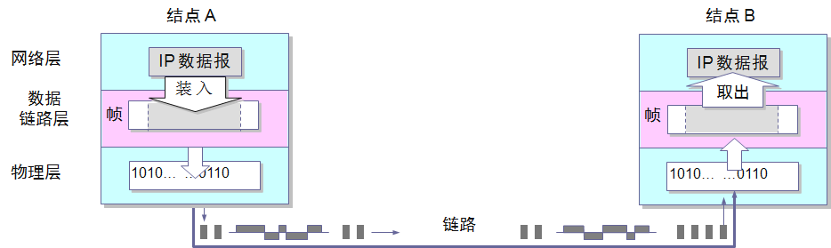
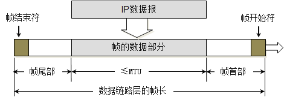
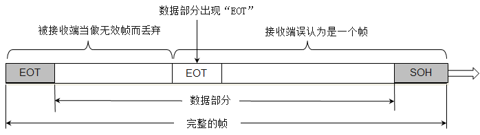
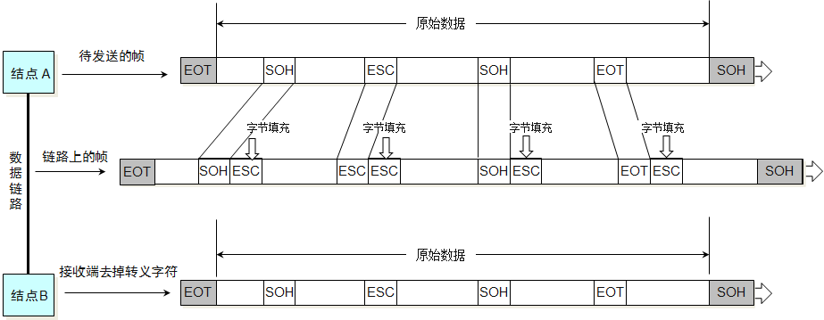
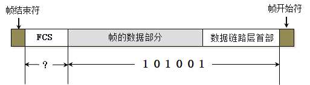
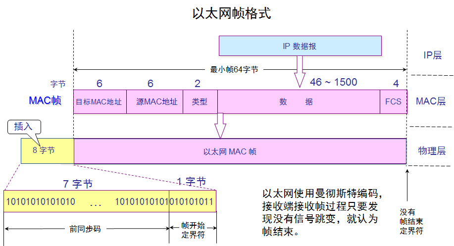
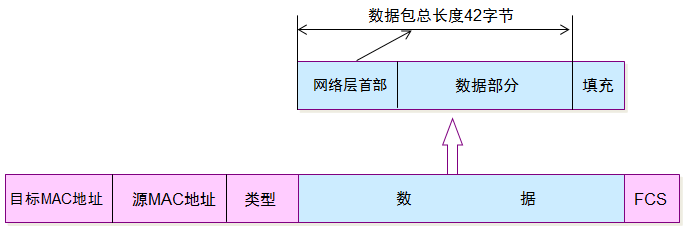

# 数据链路层

## 基本概念
#### 数据链路和链路
链路：指的是从一个节点到相邻节点的一段**物理线路**，且中间没有任何其他的交换节点

数据链路：传输数据时，除了一条物理线路，还需要一些必要通信协议来控制这些传输。

#### 数据链路层的三个基本问题：
+ 封装成帧
  + 基本概念
  
    数据链路层在接收端，将网络层交下来的数据报封装为数据帧，发送到链路上。在接收端，将接收到的数据帧中的数据报取出并且上交给网络层。

    网络层协议数据单元就是 **IP数据报**， 数据链路封装成的帧，在物理层变成数字信号在链路上传输。
    
    如上图，不考虑物理层，简单的认为，数据帧通过数据链路通过节点A发送到节点B。

  + 封装  
  
    

  + 封装成帧，就是在将**网络层的IP数据报**的前后分别添加**首部**和**尾部**，这样就构成了一个帧。
  + 不同的数据链路层协议的帧的首部和尾部包含的信息有明确的规定，帧的首部和尾部有`帧开始符`和`帧结束符`，称为**帧定界符**。接收端收到物理层传过来的数字信号读取到帧开始字符一直到帧结束字符，就认为接收到了一个完整的帧。在数据传输中出现差错时，帧定界符的作用更加明显。
  + MTU：每一种数据链路层协议都规定了所能够传送的帧的数据部分长度的上限--即最大传输单元MTU（Maximum Transfer Unit），**以太网的MTU为1500个字节**。

+ 透明传输
  
  
    帧的开始符为`SOH (start of head)`，是`ASCII`字符表中的，对应的16进制是0x01，结束符为`EOT (End of Transmission)`,也是`ASCII`字符表中。当传输二进制数据，很可能在数据部分出现和结束符相同的编码，那么为了避免提前结束，那么就需要用转义字符`ECS`，来告诉接收端的数据链路层，这里不是真正的结束符号。其他需要转义的字符也是也是如此。

  

+ 差错控制
  
    为了保证数据传输的可靠性，在计算机网络传输数据时，必须采用一些差错检测措施。目前比较广泛的是`CRC`。这部分位于数据帧的尾部:`FCS`部分。`FCS`是`CRC`的余数。如果无差错结束，这部分在接收端的数据链路层的数据帧中自动去掉。
---
## 以太网
以太网是一种计算机局域网组网技术。

### 以太网最短帧
为了能够检测到正在发送的帧在总线上是否产生冲突，以太网的帧不能太短，如果太短就有可能检测不到自己发送的帧产生了冲突。经过计算最短的帧是`64`字节

> 这就意味着**以太网发送数据帧如果前64字节没有检测出冲突，后面发送的数据就一定不会发生冲突**。换句话说，如果发生碰撞，就一定在发送前64字节之内。由于一旦检测出冲突就立即终止发送，这时发送的数据一定小于64字节，因此凡是长度小于64字节的帧都是由于冲突而异常终止的无效帧，只要收到了这种无效帧，就应当立即将其终止。

### MAC数据帧格式

从网络层来的是 `IP 数据报`，数据链路层分别在添加上：目标MAC地址，源MAC地址，类型（ip数据报的类型），以及在结尾处添加了差错控制部分`fcs`。物理层在以太网的MAC数据帧上添加8字节数据。

当数据字段的长度小于46字节时，数据链路层就会在数据字段的后面加入一个整数字节的填充字段，以保证以太网的MAC帧长不小于64字节，接收端还必须能够将添加的字节去掉。

  

之所以是46个字节，是因为"目标MAC地址、源MAC地址以及类型分别占6,6,2个字节"，64-18=46。

+ 无效帧MAC帧
  + 帧的长度不是整数个字节。
  + 用收到的帧检验序列FCS查出有差错。
  + 收到帧的MAC客户的**数据字段的长度**不在**46-1500**字节之间。考虑到MAC帧首部和尾部的长度共有18字节，可以得出有效的MAC帧长度为64-1518字节之间。  
  
  **对于检查出的无效MAC帧就简单地丢弃， 以太网不负责重传丢弃的帧**。是否重传是上层应用层的任务，比如TCP会重新传输，而UDP不会重新传输。

### 以太网的信道利率用
利用率是指的发送数据的时间占整个时间的比例。 

### MAC层的硬件地址 (MAC地址)
MAC地址，也叫硬件地址，一共48位：前24位是厂家 后面24位厂家自己指定