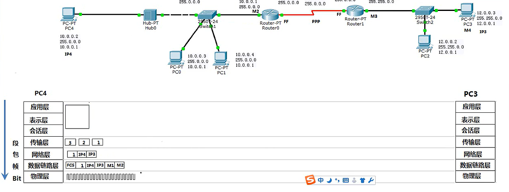
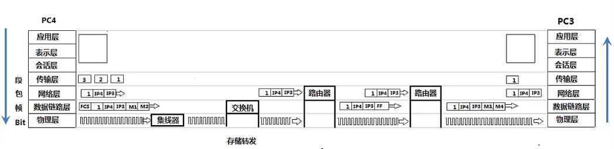
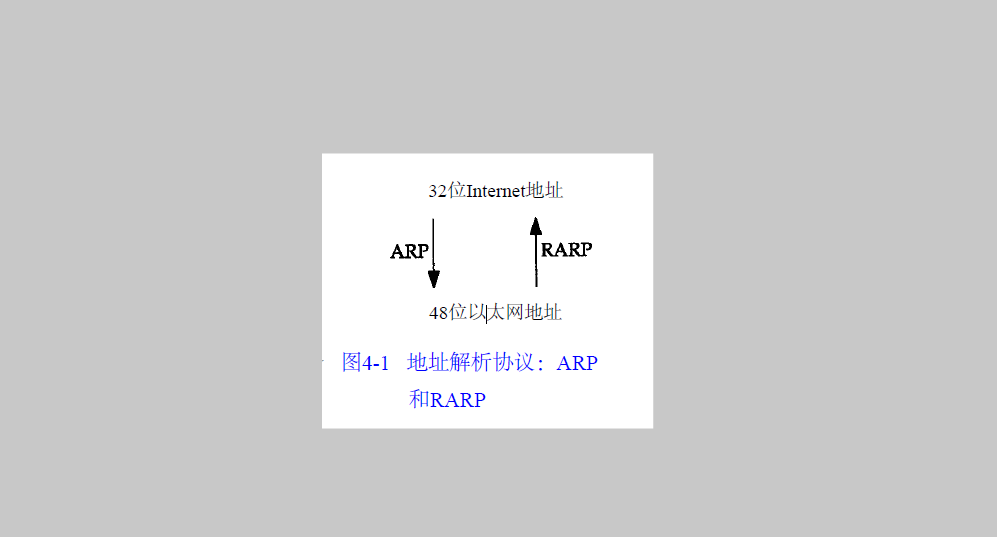
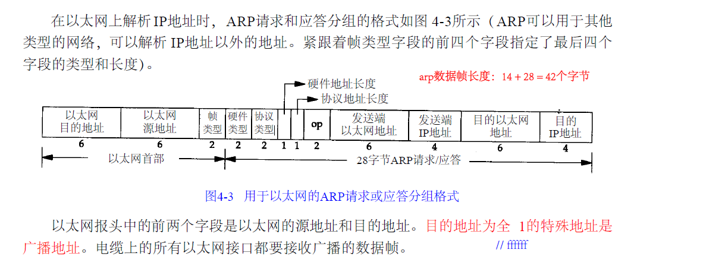

# 网络层

负责在不同的网络之间转发数据包，基于数据包的 `IP`地址转发，每个数据包可以按照不同路径传输。网络层不负责丢包重传，以及数据包之间数据顺序的的问题。

## 网络设备
+ 路由器工作在第三层：网络层，能看到网络层的地址，进行转发数据包。   
  + 网关，就是路由器地址。当需要路由器转发的时候，告诉主机数据从指定网关出发。
  + 网关一般是这个网络里第一个能用的地址，比如`10.0.0.1`
  + 路由器有个路由表，告诉路由器可以达到哪些地方。

### 网络设备和`OSI`模型关系

整个数据发送的准备过程如下：
+ 应用层将要发送的数据文件准备好,
+ 传输层
  + 根据传输层的协议的字节限制，决定是否要将待传输的数据分段。
  + 为每个片段数据添加上传输层的网络协议，
  + 为每个片段数据添加要发送的目的`ip`地址和源`ip`地址。
+ 在数据链路层要分两种情况：
  + 如果要发生数据的目的ip地址和源ip地址，就会广播给同一个网络段的所有主机，来获得mac地址，
   使用自己的子网掩码判断自己在哪个网段使用自己的子网掩码判断目标地址在哪个网络，如果是同一个网段，用`ARP`协议广播解析目标`ip`地址的`mac`地址
  + 如果目的`ip`地址在另一个网络段，那么数据就要通过路由器转发，那么就要通过网关地址获取路由器的`mac`地址。  
    当获取了`mac`地址，数据链路层就会为来自网络层的`ip`数据包添加上目的`mac`地址和源`mac`地址以及`fcs`校验码，就可以在链路上传输。

接受段与之相反，层层解除封装

#### 设备作用
+ 集线器：用于传输比特率，加强信号。
+ 交换机：接受存储比特率，看 **数据帧的目标mac地址**，选择出口，决定哪个出口转发
+ 路由器：接受存储比特流，先看目的mac地址，是不是自己，如果是，则去掉mac地址部分以及fcs校验部分，查看目的ip然后根据路由表选择出口，然后加上mac地址重新封装，转发数据
#### 设备与数据流动
  
+ 交换机：看到的是数据帧的流动  
+ 路由器：看到的是数据包的流动  
+ 物理层：看到的是比特流的流动

注意：路由器，交换机不会中病毒，但是病毒会影响网络设备转发没用的数据包，使得网络瘫痪

## 网络层协议

### `ARP`

`ARP`是为`IP`地址到对应的硬件地址之间提供动态映射。动态意思是这个过程是自动完成的，`ARP`是为32位的Ip地址个数据链路层48位的MAC地址之间提供映射。

`ARP`工作在网络层，当需要把一个数据从源主机发送目的主机时：
+ 如果目的主机在本地网络，那么ip数据报就可以直接送到目的主机上
+ 如果目的主机在远程网络上，那么就通过ip选路来确定本地网络的下一跳路由器地址，并且让它转发IP数据。  

在这个过程中，发送端主机必须要把32位的IP地址变成48位的MAC地址，**从逻辑的IP地址到对应的物理硬件地址需要进行翻译，这就是`APR`的左右**。
#### ARP请求/应答
> 在`ARP`背后有一个基本概念，那就是网络接口有一个硬件地址。在硬件层次上进行的数据帧交换必须有正确的接口地址。但是，`TCP/IP`有自己的地址：32 bit的I P地址。知道主机的`IP`地址并不能让内核发送一帧数据给主机。内核（如以太网驱动程序）必须知道目的端的硬件地址才能发送数据。`ARP`的功能是在32 bit的`IP`地址和采用不同网络技术的硬件地址之间提供动态映射。

  
+ `ARP` 请求  
在确定下一条的路由器或者主机的时候，需要发送端发送一个称为“ `ARP` 请求的以太网数据帧给以太网上的每个主机”，就是广播。 `ARP` 请求数据帧，包含目的主机的 `IP` 地址，目的端的 `MAC` 地址是48位的1(`0XFF:FF:FF:FF:FF`)。意思是，同一个网络段的所有主机都处理这个 `APR` 请求，如果你是这个 `IP` 地址拥有者，请回答你的硬件地址。
+  `ARP` 应答
目的主机的ARP接受到这份广播后，识别出这是在询问发送端在询问他的IP地址，于是发送一个ARP应答：在ARP应答中，将会包含IP地址和对应的硬件地址。

对于一个ARP请求来说，除目的端硬件地址外的所有其他的字段都有填充值。目的端硬件地址为0XFF:FF:FF:FF:FF。当系统收到一份目的端为本机的 ARP请求报文后，它就把硬件地址填进去。

完成一次，ARP应答和ARP请求之后的IP数据包就可以在链路上进行传输，当发送和目的端不在同一个网络会重复这个过程，直到到达目的主机。如果在同一个网络，那么一次ARP应答-请求就可以到达目的主机。

#### `ARP`高速缓存
`ARP`解析mac地址，数据发送就第一次需要解析数据包，以后就不需要了
#### `ARP`代理
> `ARP` 请求是从一个网络的主机发往另一个网络上的主机，那么连接这两个网络的路由器就可以回答该请求，这个过程称作ARP代理(`Proxy ARP`)。这样可以欺骗发起ARP请求的发送端，使它误以为路由器就是目的主机，而事实上目的主机是在路由器的“另一边”

## ICMP
用来检测网络故障的  `ping`命令就是使用这个协议的，`ping`是直接调用网络层，属于网络层

`ping`局域网time应该小于10ms，否则比较拥堵,ttl就是生存周期，防止数据包在网络上循环

## `IP`

### IP数据报结构
`IP`数据报的最高位在左边，最低位在右边，`IP`数据报的传输次序是大端字节序列，也叫网络字节序。
+ 版本用来标识，Tcp/ip是哪个版本的：ipv4 ,ipv6
+ 首部长度：普通的`IP`首部长度是20个字节，如果有可变部分20个字节就加上可变部分
+ 服务类型：为不同服务添加标记，实际就是优先级。
+ 总长度：
  + 是指整个 **`IP`数据报的长度**，因此知道首部字长度字段和总长度字段，就知道`IP`数据报中数据内容的起始位置和长度。
  + 以字节为单位，16个字节，2^16-1=65535个字节，即数据最大字节数。以太网的最大传输单元`MTU`是1500字节（其数据长度是1480字节，1500减去20个首长度），因此当网络层的`IP`数据报字节数超过`MTU`，那么在数据链路层就会将数据报进行 **“分片”** 操作，以适应`MTU`。但是如果`IP`数据报长度小于以太网最小帧46字节，那么就会被填充，使得满足46字节。
+ `ttl(time-to-live)`：数据报生存时间字段，设置了数据报可以经过的最多路由器数。每次经过一个路由器就会减少1，ttl是0，就无法再转发了
   + `linux`: 64
   + `unix` : 255
   + `wins` : 127 

#### `Ip`组成
`Ip`分为网络部分和主机部分，网络部分是可以由于子网掩码来确定，主机部分又可以细分为“子网和主机部分”：
+ 子网掩码 `255.0.0.0` 就是告诉计算机其 ip地址`10.0.0.0`中的`10`是网络部分，后面是主机部分。
+ 子网掩码 `255.255.0.0` 就是告诉计算机其ip地址`10.10.0.0`中的`10.10`是网络部分，后面是主机部分。

给定`IP`地址和子网掩码以后，主机就可以确定`IP`数据报的目的地是 
+ 本子网上的主机；
+ 本网络中其他子网中的主机；
+ 其他网络上的主机

> 在一般的体制中，`IP` 可以从传输层接收数据报并进行发送，或者从一个网络接口接收数据报（待转发的数据报）并进行发送。 `IP`层在内存中有一个路由表。当收到一份数据报并进行发送时，它都要对该表搜索一次。当数据报来自某个网络接口时， `IP` 首先检查目的 `IP` 地址是否为本机的 `IP`地址之一或者 `IP` 广播地址。如
果确实是这样，数据报就被送到由 `IP` 首部协议字段所指定的协议模块进行处理。如果数据报的目的不是这些地址，那么（ 1）如果`IP`层被设置为路由器的功能，那么就对数据报进行转发（也就是说，像下面对待发出的数据报一样处理）；否则（ 2）数据报被丢弃