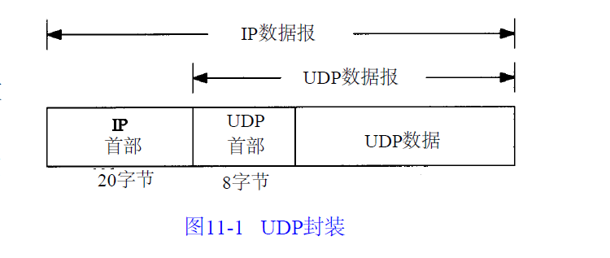
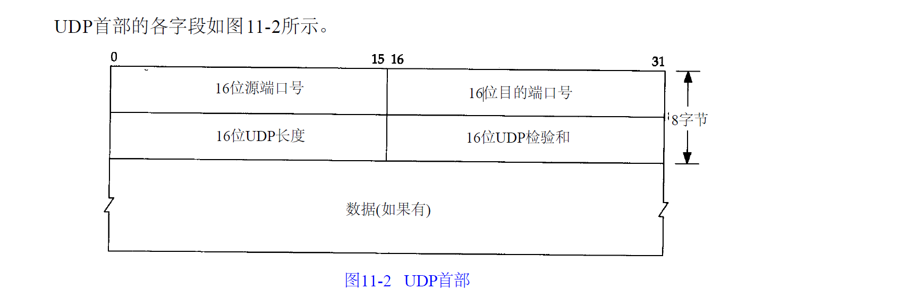
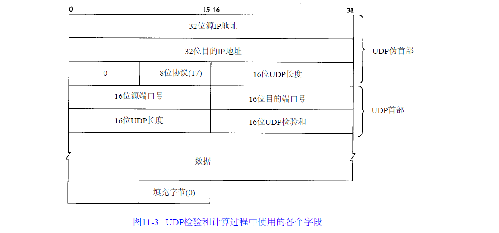
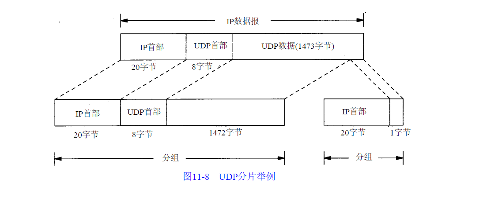

# 传输层

网络层不具有重传，需要传输层来控制。  
+ `Tcp`：需要将传输的数据进行分段传输，并且能够建立会话，具备流量控制，是一种可靠的传输协议
+ `UDP`：一个数据包就能完成数据通信，不分段，不需要建立会话，不需要流量控制，是一种不可靠控制。`DNS`服务器，广播，多播

## 命令
查看会话：`netstat -n`
查看建立会话的进程：`netstat -nb`
查看侦听的端口：`netstat -an`, `netstat -a`

## 应用层协议
+ `Http`: `TCP + 80`
+ `Https`: `Tcp + 443`
+ `FTP` : `TCP + 21`
+ `SMTP` : `TCP + 25`
+ `telnet`: `Tcp+23`
+ `DNS`: `UDP + 53`
+ 共享文件夹：`TCP + 445`

#### 服务器与应用层之间的关系
服务使用Tcp或者UDP端口侦听客户端请求，客户端使用IP地址定位服务器，使用目标端口定位服务。可以在服务器网卡上设置只开发必要的端口，实服务器的网络安全

### 传输层与网络层之间的关系
传输层 程序到程序，或者说是服务到服务，这个由“端口号”确定
网络层 地址到地址，这个由IP地址确定

## UDP：用户数据报协议

`UDP`是不可靠的协议：它把应用程序传给`IP`层的数据发送出去，但是并不能保证他们能送达目的性。支持一对一，一对多，多对一的交互通信。

`UDP`的首部是8个字节，开销小。端口号表示发送进程和接受进程。`UDP`首部字段是`UDP`首部和`UDP`数据长度和，因此这个字段的最小值是8，即`UDP`首部长度值。这个字段其实是多余的，因为等于IP数据报长度减去`IP`首部长度。

### UDP校验和
UDP检验和是一个端到端的检验和。它由发送端计算，然后由接收端验证。其目的是为了发现UDP首部和数据在发送端到接收端之间发生的任何改动。
`UDP`校验和是可选的，`TCP`的校验和是必须的。计算方法和`ip`首部的校验和计算类似，用的是16进制的二进制反码和，但是不同之处在于：
+ `UDP`数据报长度可以是奇数字节数，解决办法是需要填充
+ `UDP`数据报包含一个12字节长的伪首部
    这个伪首部，包含了一些IP的一些字段，目的是让UDP两次检查数据**是否已经正确到达目的地**，即IP没有接受地址不是本机的数据报。
    

如果校验和发生差错，那么UDP数据报就会被丢弃。

### IP分片
当IP数据报的长度大于MTU时就要被分片。

使用UDP很容易导致IP分片。以太网数据帧的最大字节数是1500，其中1480留给IP数据报，如果IP数据报首部20字节，UDP首部8个字节，不产生分片IP数据报的数据部分最大字节是1472字节。多于这个字节数就会导致分片。

分片后，传输层首部(就是UDP首部)只出现在第一片。

### UDP应用：多播和广播
多播和广播仅仅应用于UDP。

#### 广播
一个主机要向同一个网络的所有其他主机发送帧，这就是广播。那么网卡是如何确定广播的？ **网卡仅接收那些目的地址为网卡物理地址或广播地址的帧**。对于以太网，当地址中**最高字节的最低位设置为1**时表示该地址是一个多播地址，用十六进制可表示为01 : 00 : 00 : 00 : 00 : 0 0（以太网广播地址 `ff : ff : ff : ff : ff : ff` 可看作是以太网多播地址的特例）。

## Tcp协议 
+ Tcp协议如何实现可靠传输
+ Tcp协议如何实现流量控制
+ Tcp协议如何避免网络拥塞

Tcp是面向连接的传输协议，每次都要三次握手建立连接，每一条Tcp连接都是只能点对点，
Tcp提供可靠交付的服务
Tcp提供全双工通信
面向字节流

### 可靠传输
+ 停止等待协议
+ 确认丢失

### 报文
序号，就是数据在整个数据中的偏移地址+1，就是第几个字节。接收端确认回应，下一次可以发送字节偏移量。

数据便偏移：首部最长是60个字节，选项最多40个字节，首部以后的数据

SYN 发起会话请求 
ACK 同意会话请求
URG 不需要等待，直接发送，插队
PSH 接收端是优先接受，插队
RST TCP会话出现严重问题，意外中断，重新建立会话
FIN 正常中止