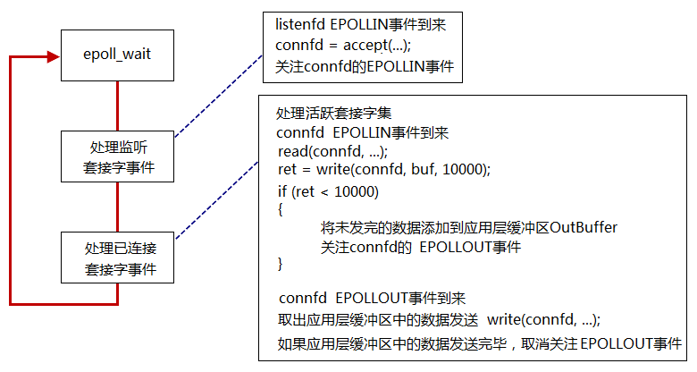
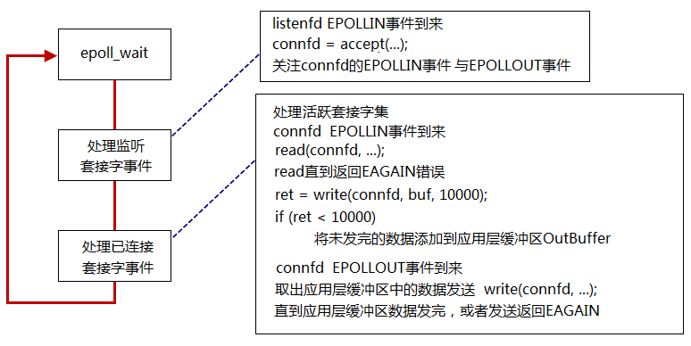
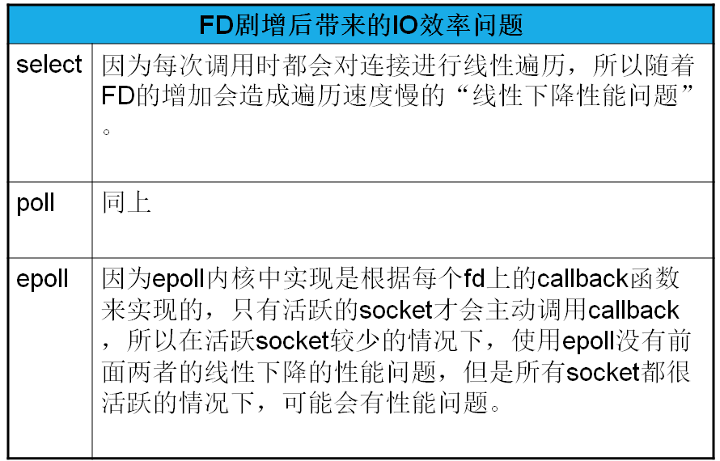

# *`select/poll/epoll`*
让内核来监听客户端。使用进程或者线程，消耗的资源比较大。

## 3. `epoll`
+ `event`
    + `EPOLLIN`
        + 内核中socket接受缓冲区为空  -->  低电平 --> 不可读
        + 内核中socket接受缓冲区不空  -->  高电平 --> 可读
    + `EPOLLOUT`
        + 内核中socket接受缓冲区为满  -->  低电平 --> 不可写
        + 内核中socket接受缓冲区不满  -->  高电平 --> 可写
        
+ 工作模式  
    + `LT`电平触发：高电平触发
    + `ET`边缘触发：
        + 低电平-->高电平 触发
        + 高电平-->低电平 触发

+ LT模式的工作流程

    + `busy loop`  
    在使用`epoll_LT`模型时，要注意一个忙等待事件(`busy-loop`)。  
        > 在 *`connfd=accept(listenfd,...)`* 获得监听套接字`connfd`之后，不能立即监听`connfd`的`EPOLLOUT`事件，因为刚获得`connfd`的接受缓冲区肯定是空的，一直处于高电平，处于可写状态。如果此时就监听那么将一直触发`epoll_wait`函数，会一直等待写满，即`busy loop`。
    + 正确的流程  
    在第一次你 *`n=write(connfd, buffer, sizeof(BUFFER))`* 之后，如果返回的字节数`n!=sizeof(buffer)`，说明socket的发送缓冲区小于应用层的buffer的缓冲区，此时需要做两件事：
    
        + 需要将未发完的数据添加到应用层缓冲区OuyBuffer
        + **关注`connfd`的`EPOLLOUT`事件**   
    
        等待`connfd`的`EPOLLOUT`事件的到来：取出应用层的缓冲区中的数据发送，*`write(connfd, ...)`* 。如果应用层缓冲区中的数据发送完毕，**取消关注`EPOLLOUT`事件**。因为不取消，sokcet发送缓冲区为空后，又会触发`EPOLLOUT`，但是此时数据已经发送完毕，又会陷入`busy loop。`
+ ET模式的工作流程    
  
ET工作模式不存在LT中的`busy loop`，但是会有更麻烦的问题：*`read/write`* 直到返回`EAGAIN`错误。否则程序会发送意外。  
    + `read`  
    在 *`connfd=accept(listenfd,...)`* 之后得到的`connfd`是边缘触发，因此不会在一开始就触发`EPOLLIN/EPOLLOUT`。
        > 触发`EPOLLIN`事件后，如果`connfd`的接受缓冲区中的数据没有读取完毕，那么当`connfd`的又接受到新的缓冲区数据时，`EPOLLIN`事件不会触发。因为之前的数据没有读取完，处于高电平状态，此时又来新的数据并没有改变电平状态，因此即使有新的数据到来也无法触发`EPOLLIN`。同理`write`。
    
        重点： ***`read/write`*** 必须将缓冲区读完或者写满。
    + `EMFILE`  
    如果在使用 *`connfd=accept(listenfd,...)`* 返回失败，并且返回的错误是 `EMFILE`，那么会使得`listenfd`的接受缓冲区有数据为高电平。如果不清除，那么即使后面有空余的文件描述符也无法使用，因为`listenfd`的接受缓冲区一直处于有数据的高电平状态，无法触发`EPOLLIN`。

### 4. I/O复用模型对比
  
  
  
    

