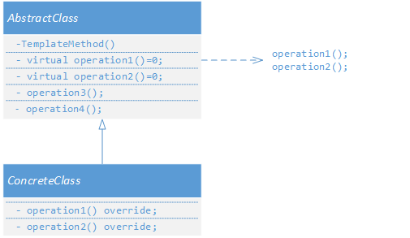
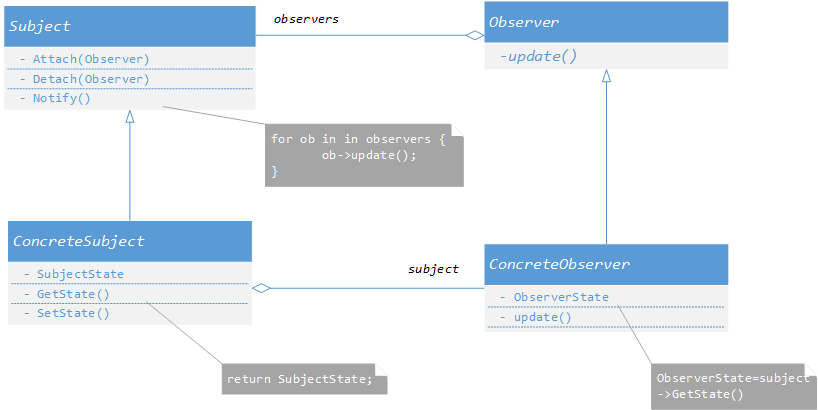

# 组件协作 
+ ***`Template Method`***
+ ***`Strategy`*** 
+ ***`Observer`***

### 1. ***Template Method***
+ 动机  
在软件的构建过程中，对于某一项任务，它常常有稳定的整体操作结构，但是各个子步骤却有着很多改变的需要，或者固定的原因而无法立即和框架同时实现。  
+ 问题   
如何在确定稳定操作结构的前提下，来灵活应对各个子步骤的变化或者晚期实现需求？  
&emsp;&emsp;&emsp;&emsp;&emsp;&emsp;   
如图，在一个稳定模板方法中，有4个步骤，其中两个子步骤`oprtation()1`和`operation()2`的具体实现却不确定，那么怎么办？这个时候好的方法是：**将两个子函数声明为虚函数**，等到子类来实现，就可以具体的子类实现自己的操作。  
+ *`template Method`* 定义  
    > 定义一个操作中的算法的骨架(稳定)，而将一些步骤延迟
    > (变化)到子类中。Template Method使得子类可以不改变
    > (复用)一个算法的结构即可重定义(override 重写)该算法的
    > 某些特定步骤。
    >                           ——《设计模式》GoF

    也即实现了“晚绑定-->早绑定”。“早板顶”即将主流程`ThemplateMethod()`放在了子类中实现。由子类来调用父类，**晚绑定**刚好相反。
+ 要点总结  
    + >***`template Method`*** 模式是一种非常基础性的设计模式，在面向对象系统中有着大量的应用。它用最简洁的机制（**虚函数的多态性**）为很多应用程序框架提供了灵活的扩展点，是代码复用方面的基本实现结构.
    + 回调机制，让父类调用子类。  
    + 将被 ***`template Method`*** 调用的虚函数设置为`protected`。
### 2. ***Strategy Method***
+ 动机  
 在软件构建过程中，某些对象使用的算法可能多种多样，经常改变。如果将这些算法都编码到对象中，将会使得对象变得异常复杂，而且有时候支持不使用的算法也是一种性能负担。  

    如何在运行时根据需要**透明地**更改对象的算法？将算法和对象本身解耦，从而避免上述问题。  
+ 模式定义
    > 定义一系列算法，把它们一个个封装起来，并且使它们可互
    > 相替换（**变化**）。该模式使得算法可独立于使用它的客户程
    > 序(**稳定**)而变化（扩展，子类化）
    >                                   ——《设计模式》GoF
    
    比如在`Context`类中，需要使用一个算法，比如计算汇率比，不同的国家不同。常见的方式：
    ```python 
        if country == 中国:
            comunlate()
        elif country == 美国:
            comunlate()
        elif country == 英国:
            comunlate()
        ...
    ````
    将需要的的国家都遍历一次。当需要增加新的国家汇率计算方法时又继续添加 *`if--else`*。使得代码很难维护，冗余。此时可以将这个计算汇率的方法设计为一个接口类，所有的国家的具体计算方法继承自这个类。  在使用这个函数的类中，包含整个基类即可，利用多态实现对不同国家的访问。  
    &emsp;&emsp;&emsp; 
+ 要点总结  
    + ***`Strategy`*** 及其子类为组件提供了一系列可重用的算法，从而可以使得类型在运行时方便地根据需要在各个算法之间进行切换。
    + ***`Strategy`*** 模式提供了用条件判断语句以外的另一种选择，**消除条件判断语句，就是在解耦合** 。含有许多条件判断语句的代码通常都需要 ***`Strategy`*** 模式。
    + 如果 ***`Strategy`*** 对象没有实例变量，那么各个上下文可以共享同一个 ***`Strategy`*** 对象，从而节省对象开销。

###  3. ***Observer***
+ 动机  
在软件构建过程中，我们需要为某些对象建立一种 **“通知依赖关系”**  -- 一个目标对象的发生了**变化**，所有的依赖对象（**观察者对象**）都将得到通知。如果这样的依赖关系过于紧密，使得软件就不能很好的**抵御变化**。

    使用面向对象技术，科研获奖这种依赖关系弱化，形成一种稳定的依赖关系，从而实现软件体系结构的松耦合。
+ 模式定义  
    > 定义对象间的一种一对多（**变化**）的依赖关系，以便当一个
    > 对象(Subject)的状态发生改变时，所有依赖于它的对象都
    > 得到通知并自动更新。
    > ——《设计模式》GoF5    
       
    &emsp;&emsp;&emsp; 

+ 举例
    比如，实现一个更新进度的功能，应用`Observer`设计思想：为了使得这个更新进度的功能方便以后扩展到不同的平台，不能直接写死了，即实现为虚基类，作为一个接口让子类来继承实现具体的功能。
    ```cpp 
        class IProgress{
        public:
            virtual void DoProgress(float value)=0;
            virtual ~IProgress(){}
        };
    ```
    每个`IProgress`的子类实例都是一个观察者，需要实现接口`void DoProgress(float value)`，当进度值`value`发生改变时，每个观察者都会得到通知，然后进行进度更新。  

+ 注意  
    C++里没有接口关键词，但是有多继承，一般不建议多继承，但是可以将虚基类当作接口使用。