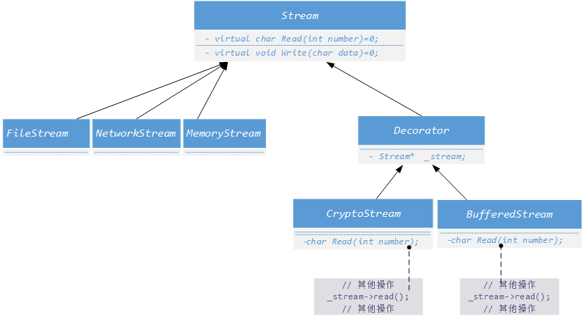
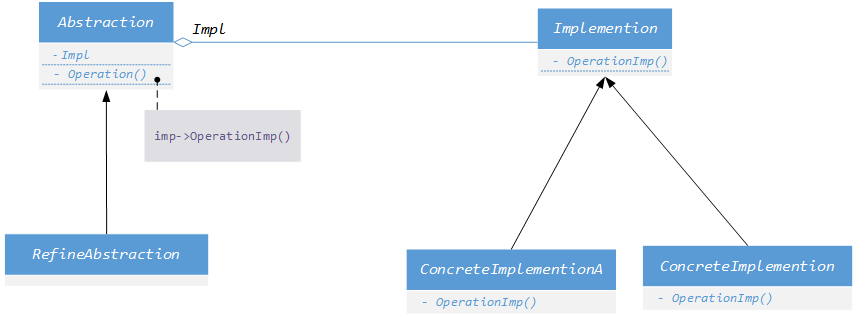

# 单一职责模式  

+ ***`Decorator`***
+ ***`Bridge`***

##  ***`Decorator`***
+ 动机 
    + [ ] 在某些情况下我们可能会 **“过度地使用继承来扩展对象的功能”**，由于继承为类型引入的静态特质，使得这种扩展方式缺乏灵活性；并且随着子类的增多（扩展功能的增多），各种子类的组合（扩展功能的组合）会导致更多子类的膨胀。

    + [ ] 如何使得 **“对象功能的扩展”** 能够根据需求来 **动态** 的实现？同时避免“扩展功能的增多带来的子类膨胀问题？使功能的拓展变化导致的影响最低？
+ 定义
    > 动态（组合）地给一个对象增加一些额外的职责。就增加功
    > 能而言，***`Decorator`*** 模式比生成子类（继承）更为灵活（消
    > 除重复代码 & 减少子类个数）。
    > ——《设计模式》GoF
+ 举例  
比如设计一个流系统，开始分别有`FileStream`、`NetworkStream`、 `MemoryStream`，因为这些类使用相同的函数，但是面向对象不同，因此可以有一个虚基类`Stream`作为他们的父类。
    ```cpp
        class Stream { 
        public：
            virtual char Read(int number)=0;
            virtual void Seek(int position)=0;
            virtual void Write(char data)=0;
            virtual ~Stream(){}
        };

        class FileStream: public Stream{ ...};
        class NetworkStream: public Stream{ ...};
        class MemoryStream: public Stream{ ...};
    ```
    但是当后期想扩展功能时，比如在`FileStream`的基础上扩展出`CryptoFileStream` `BufferedFileStream`等，如果`NetworkStream`、`MemeoryStream`类也有这样的需求，如果直接使用子类继承的方式设计，就会形成如下的类图：   
       
    设，二级子类（图中第二层的类）有n个，三级子类有m个，那么共需要 **1+m+mn** 个类别，并且包含了大量的重复代码。  

    以`Cryptoxxxtream`为例：
    ```cpp
        class CryptoFileStream :public FileStream{
        public:
            virtual char Read(int number) override;
            virtual void Seek(int position) override;
            virtual void Write(char data) override;
        };

        class CryptoNetworkStream : :public NetworkStream{
        public:
            virtual char Read(int number) override;
            virtual void Seek(int position) override;
            virtual void Write(char data) override;
        };
    ```
    `CryptoFileStream`和`CryptoNetworkStream`接口一致，只是面向不同的平台应用不同，导致了代码冗余。当扩展功能增多，那么冗余的更多，可维护性就更差。  

+  ***`Decorator`***
    应用此模式时的类图：      

       
    &emsp;&emsp;&emsp;&emsp;&emsp;&emsp;&emsp;&emsp;&emsp;&emsp;&emsp;&emsp;&emsp;&emsp;&emsp;&emsp;&emsp;&emsp;&emsp;&emsp;&emsp;&emsp;&emsp;&emsp;&emsp;&emsp;图2  

   在上图2中，新拓展的功能类没有直接继承相对应的父类，而是通过加入一个`Decotator`类，使得在扩展功能类中到底继承哪个父类延迟到子类中。  
    ```cpp
        class Decorator: public Stream{
        protected:
            Stream* _stream;

            Decorator(Stream * stm):_stream(stm)
            { }
        };
    ```
    `Decoraotr`最大特点是：**继承 *`stream`* 的同时也包含了一个 *`stream`* 类型的字段`_stream`**。
    + 继承`stream`：是为了继承`stream`的接口函数
    + `_stream`字段：是为了使用 **多态**，在后续的功能扩展中，在运行时再决定扩展`FileStream`、`NetworkStream`、`MemoryStream`中的哪个对象。  
    比如  ：  
        ```cpp
            //运行时装配
            FileStream* s1=new FileStream();
            // 扩展FileStream --> CryFileStream
            CryptoStream* s2=new CryptoStream(s1);
            // 扩展FileStream --> BufferedStreamFileStream
            BufferedStream* s3=new BufferedStream(s1);
            // 扩展CryFileStream --> CryBufferedStreamFileStream
            BufferedStream* s4=new BufferedStream(s2);
        ```    
        此时相比原本的设计，需要的类数是：***1+n+1+m***，由此可见代码复杂度降低了，可维护性上升了。
     
        这个案例中，变化的是那些扩展的功能，不变的`FileStream`、`NetworkStream`、`MemoryStream`以及`Stream`。
+ 总结  
    + [x] 通过采用 **组合而非继承** 的手法， ***Decorator*** 模式实现了在运行时 **动态扩展对象功能** 的能力，而且可以根据需要扩展多个功能。避免了使用继承带来的“灵活性差”和“多子类衍生问题”
    + [x] `Decoraotr` 类在 **接口上表现为 *`is-a Component`* 的继承关系** ，即Decorator类继承了Component类所具有的接口。但 **在实现上又表现为 *`has-a Component`* 的组合关系**，即 `Decoraotr` r类又使用了另外一个Component类。
    + [x] `Decoraotr` 模式的目的并非解决“多子类衍生的多继承”问题，`Decoraotr` 模式应用的要点在于解决 **“主体类在多个方向上的扩展功能”** 。

## ***`Bridge`***
+ 动机 
    + [ ] 由于某些类型的固有的实现逻辑，使得它们具有两个变化的维度，乃至多个纬度的变化
    + [ ] 如何应对这种“多维度的变化”？如何利用面向对象技术来使得类型可以轻松地沿着两个乃至多个方向变化，而不引入额外的复杂度
+ 模式定义  
    > 将抽象部分(业务功能)与实现部分(平台实现)分离，使它们都可以独立地**变化**。
    ——《设计模式》GoF
+ 举例  
比如要设计一个`Messageer`类来应对不同的平台需求，比如有`PC`和`Mobile`两个平台：     
    ```cpp
        class Messager{
        public:
            virtual void Login(string username, string password)=0;
            virtual void SendMessage(string message)=0;
            virtual void SendPicture(Image image)=0;

            virtual void PlaySound()=0;
            virtual void DrawShape()=0;
            virtual void WriteText()=0;
            virtual void Connect()=0;
            
            virtual ~Messager(){}
        };
    ```
    将`Meassger`抽象成虚基类，让子类来继承实现。  比如：
    ```cpp
        // pc平台
        class PCMessagerBase : public Messager{
        public:
            virtual void PlaySound(){
                //**********
            }
            virtual void DrawShape(){
                //**********
            }
            virtual void WriteText(){
                //**********
            }
            virtual void Connect(){
                //**********
            }
        };

        // mobile平台
        class MobileMessagerBase : public Messager{
        public:
            virtual void PlaySound(){
                //==========
            }
            virtual void DrawShape(){
                //==========
            }
            virtual void WriteText(){
                //==========
            }
            virtual void Connect(){
                //==========
            }
        };
    ```
    如此设计容易出现两个问题：
    + 假设针对 *`PCMessagerBase`* 扩展出两个需求，一个是精简版，一个完全版本。在登录`login`、`sendMessgae`以及`sendPicture`时效果不同，以其中一个需求为例：
        ```cpp
        class PCMessagerPerfect : public PCMessagerBase {
        public:
            virtual void Login(string username, string password){
                
                PCMessagerBase::PlaySound();
                //********
                PCMessagerBase::Connect();
                //........
            }
            virtual void SendMessage(string message){
                
                PCMessagerBase::PlaySound();
                //********
                PCMessagerBase::WriteText();
                //........
            }
            virtual void SendPicture(Image image){
                
                PCMessagerBase::PlaySound();
                //********
                PCMessagerBase::DrawShape();
                //........
            }
        };
        ```

        可以看出，`PCMessagerPerfect`只重新实现`login`、`sendMessgae`、`sendPicture`，而其余的函数使用父类。而父类`PCMessagerBase`只实现后四个函数，前三个却不想实现，因为假设在不同平台只是后面的四个函数操作不同，前面三个一致。  
        
        而产生这个问题，在于类`Messager`里面有朝着两个方向的发展，那么就需要将其分开来，变成两个类，让子类选择自己变化方向的类来继承：
        ```cpp
        class Messager{
        protected:
            MessagerImp* messagerImp;//...
        public:
            virtual void Login(string username, string password)=0;
            virtual void SendMessage(string message)=0;
            virtual void SendPicture(Image image)=0;
            
            virtual ~Messager(){}
        };

        class MessagerImp{
        public:
            virtual void PlaySound()=0;
            virtual void DrawShape()=0;
            virtual void WriteText()=0;
            virtual void Connect()=0;
            
            virtual MessagerImp(){}
        };
        ```
        将后四个函数的具体业务实现剥离开来，然后组合该类的一个指针对象。那么子类也可以很方便的选择自己需求方向来继承：
        ```cpp
        // 平台实现
        class PCMessagerImp : public MessagerImp{
        public:
            virtual void PlaySound(){
                //**********
            }
            virtual void DrawShape(){
                //**********
            }
            virtual void WriteText(){
                //**********
            }
            virtual void Connect(){
                //**********
            }
        };

        // 业务抽象
        class MessagerLite :public Messager {
        public:
            virtual void Login(string username, string password){
                messagerImp->Connect();
                //........
            }
            virtual void SendMessage(string message){
                messagerImp->WriteText();
                //........
            }
            virtual void SendPicture(Image image){
                messagerImp->DrawShape();
                //........
            }
        };
        ```
        在 `MessagerLite` 实现业务，`PCMessagerImp`实现逻辑， **这是两个方向的变化** 。通过前者的`messagerImp`指针实现运行时函数调用确定。通过这种组合可以实现相互组合：`MessagerImp`可以开发出针对更多的平台（n个），`Messager`开发出更多的设计需求（m个），两个可以任意结合。然而只是需要 ***`2+n+m`*** 个类，就能设计出 n*m 个结果。  
        
        
+ 总结  
    + [x]  Bridge模式使用 **“对象间的组合关系”** 解耦了抽象和实现之间固有的绑定关系，使得抽象和实现可以 **沿着各自的维度来变化** 。所谓抽象和实现沿着各自纬度的变化，即“子类化”它们
    + [x] Bridge模式有时候类似于多继承方案，但是多继承方案往往违背单一职责原则（即一个类只有一个变化的原因），复用性比较差。Bridge模式是比多继承方案更好的解决方法
    + [x] **Bridge模式的应用一般在“两个非常强的变化维度”**，有时一个类也有多于两个的变化维度，这时可以使用Bridge的扩展模式