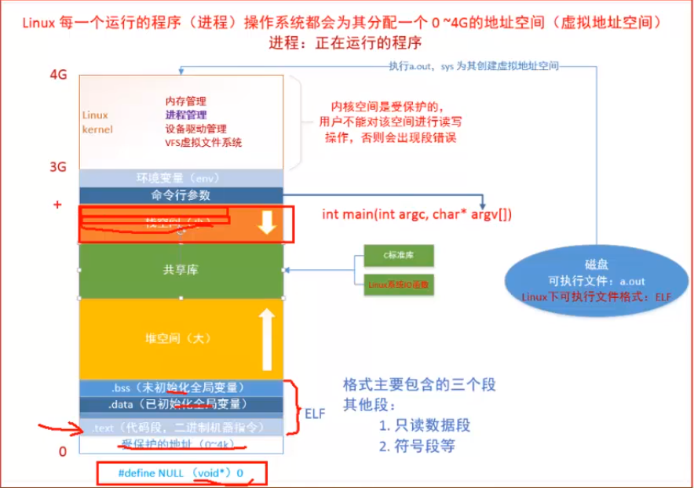

### 系统IO 函数
---
1. C库函数  
    C语言的库函数的I/O操作都是带有缓冲区的，只有当缓冲区满了才会进行相应的操作。  
    ```c
    fopen、fclose、fread、fwrite、fgets、fputs、fscanf、fprintf、fseek、fgetc、fputc、ftell、feof、flush...
    ```  
    + 刷新缓冲区
        + 强制性刷新:*`flush`*
        + 缓冲区已满
        + 正常关闭文件:  
            > `fclose`  
            > `return`(main函数中)  
            > `exit`(main函数中)
    + C语言的库函数操作后组成:
        + 文件描述符: *`FILE* fp`*,索引到对应的磁盘文件
        + 文件读写指针: 读写文件过程中的实际位置
        + I/O缓冲区(默认是8K): 通过寻址找到对应的内存块

    + *`printf`*  
    *`printf`* 函数完成的工作流程如下图所示。
          
         *`printf`*  调用后，会产生一个由系统维护的一个结构体，包含了
        ```cpp  
        file description 文件描述符号
        FP_POS           读写指针
        I/O buffer       缓冲区
        ```
        +  *`printf`* 会调用系统API *`write`*，系统通过 *`write`* 来操作内核，使得内核可以调用设备驱动使得输出的内容显示在显示器上。
        
     

2. **虚拟地址空间**  
    模型如图：  
        

    + 可执行程序(*`elf格式`*)包括：  
        + *`.text`*:代码段
        + *`.data`*:已经初始化的全局变量段
        + *`.bss`*: 未初始化的全局变量段
        + 其他段：只读数据段，符号段等  
        main函数就是在 *`.text`* 段中，从这里开始执行。
    
    + 栈与堆   
    栈，存放的是临时变量，生长方向是向下生长。  
    堆，存放的是 *`new/malloc`* 得到的变量，生长方向是向上生长。

    + 共享库与 *`.text`*
        + 共享库存放的是代码的偏移地址。C库函数和Linux系统库函数都是动态库中。
        + *`.text`* 存放的是静态库，或者说是存放的是代码的绝对地址。
    
    + 命令行参数  
        *`int main(int argc, const char* argv[])`* 中的 *`argc, argv`*。  

    + 环境变量(*`env`*)
    
    + Cpu使用虚拟内存地址空间与物理地址空间映射？解决了什么问题？  
        + 方便编译器和操作系统安排程序的地址分布。程序可以使用一系列相邻的虚拟地址来访问物理内存中不相邻的大内存缓冲区。
        + 方便进行之间隔离。不同进程之间使用虚拟地址彼此隔离，一个进程中代码无法更改另一个进程使用的物理内存。
        + 方便使用不多的内存。
