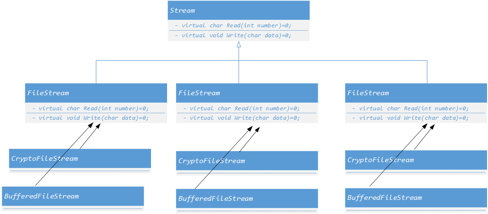

# 单一职责模式  

+ ***`Decorator`***
+ ***`Bridge`***

##  ***`Decorator`***
+ 动机 
    + [ ] 在某些情况下我们可能会 **“过度地使用继承来扩展对象的功能”**，由于继承为类型引入的静态特质，使得这种扩展方式缺乏灵活性；并且随着子类的增多（扩展功能的增多），各种子类的组合（扩展功能的组合）会导致更多子类的膨胀。

    + [ ] 如何使得 **“对象功能的扩展”** 能够根据需求来 **动态** 的实现？同时避免“扩展功能的增多带来的子类膨胀问题？使功能的拓展变化导致的影响最低？
+ 定义
    > 动态（组合）地给一个对象增加一些额外的职责。就增加功
    > 能而言，***`Decorator`*** 模式比生成子类（继承）更为灵活（消
    > 除重复代码 & 减少子类个数）。
    > ——《设计模式》GoF
+ 举例  
比如设计一个流系统，开始分别有`FileStream`、`NetworkStream`、 `MemoryStream`，因为这些类使用相同的函数，但是面向对象不同，因此可以有一个虚基类`Stream`作为他们的父类。
    ```cpp
        class Stream { 
        public：
            virtual char Read(int number)=0;
            virtual void Seek(int position)=0;
            virtual void Write(char data)=0;
            virtual ~Stream(){}
        };

        class FileStream: public Stream{ ...};
        class NetworkStream: public Stream{ ...};
        class MemoryStream: public Stream{ ...};
    ```
    但是当后期想扩展功能时，比如在`FileStream`的基础上扩展出`CryptoFileStream` `BufferedFileStream`等，如果`NetworkStream`、`MemeoryStream`类也有这样的需求，如果直接使用子类继承的方式设计，就会形成如下的类图：   
       
    设，二级子类（图中第二层的类）有n个，三级子类有m个，那么共需要 **1+m+mn** 个类别，并且包含了大量的重复代码。  

    以`Cryptoxxxtream`为例：
    ```cpp
        class CryptoFileStream :public FileStream{
        public:
            virtual char Read(int number) override;
            virtual void Seek(int position) override;
            virtual void Write(char data) override;
        };

        class CryptoNetworkStream : :public NetworkStream{
        public:
            virtual char Read(int number) override;
            virtual void Seek(int position) override;
            virtual void Write(char data) override;
        };
    ```
    `CryptoFileStream`和`CryptoNetworkStream`接口一致，只是面向不同的平台应用不同，导致了代码冗余。当扩展功能增多，那么冗余的更多，可维护性就更差。  

+  ***`Decorator`***
    应用此模式时的类图：      

       
    &emsp;&emsp;&emsp;&emsp;&emsp;&emsp;&emsp;&emsp;&emsp;&emsp;&emsp;&emsp;&emsp;&emsp;&emsp;&emsp;&emsp;&emsp;&emsp;&emsp;&emsp;&emsp;&emsp;&emsp;&emsp;&emsp;图2  

   在上图2中，新拓展的功能类没有直接继承相对应的父类，而是通过加入一个`Decotator`类，使得在扩展功能类中到底继承哪个父类延迟到子类中。  
    ```cpp
        Decorator: public Stream{
        protected:
            Stream* _stream;

            Decorator(Stream * stm):_stream(stm)
            { }
        };
    ```
    `Decoraotr`最大特点是：**继承 *`stream`* 的同时也包含了一个 *`stream`* 类型的字段`_stream`**。
    + 继承`stream`：是为了继承`stream`的接口函数
    + `_stream`字段：是为了使用 **多态**，在后续的功能扩展中，在运行时再决定扩展`FileStream`、`NetworkStream`、`MemoryStream`中的哪个对象。  
    比如  ：  
        ```cpp
            //运行时装配
            FileStream* s1=new FileStream();
            // 扩展FileStream --> CryFileStream
            CryptoStream* s2=new CryptoStream(s1);
            // 扩展FileStream --> BufferedStreamFileStream
            BufferedStream* s3=new BufferedStream(s1);
            // 扩展CryFileStream --> CryBufferedStreamFileStream
            BufferedStream* s4=new BufferedStream(s2);
        ```    
        此时相比原本的设计，需要的类数是：***1+n+1+m***，由此可见代码复杂度降低了，可维护性上升了。
     
        这个案例中，变化的是那些扩展的功能，不变的`FileStream`、`NetworkStream`、`MemoryStream`以及`Stream`。
+ 总结  
    + [x] 通过采用 **组合而非继承** 的手法， ***Decorator*** 模式实现了在运行时 **动态扩展对象功能** 的能力，而且可以根据需要扩展多个功能。避免了使用继承带来的“灵活性差”和“多子类衍生问题”
    + [x] Decorator类在 **接口上表现为 *`is-a Component`* 的继承关系** ，即Decorator类继承了Component类所具有的接口。但 **在实现上又表现为 *`has-a Component`* 的组合关系**，即Decorator类又使用了另外一个Component类。
    + [x] `Decoraotr` 模式的目的并非解决“多子类衍生的多继承”问题，`Decoraotr` 模式应用的要点在于解决 **“主体类在多个方向上的扩展功能”** 。


