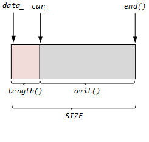

# 日志
+ ***`Logger`***
+ ***`LogFile`***
## 日志类 ***Logger***
*`loggering --> Impl --> LogStream --> operator<< --> FixedBuffer --> g_output --> flush`*

```cpp
    class Logger {
    public:
        enum LogLevel { TRACE, DEBUG, INFO, WARN, ERROR, FATAL, NUM_LOG_LEVELS};

        class SourceFile {
        public:
            const char* data_; // 文件名首地址
            int size_;         // 文件的字符个数
            ...
        };

    private:
        class Impl{
        public:
            Timestamp time_;
            LogStream stream_;
            LogLevel level_;
            int line_;
            SourceFile basename_;
            ...
        };
        Impl impl_;
    };
```
+ 原理：    
整个`Logger`内部是靠类 ***`Impl`*** 和类 ***`SourceFile`*** 实现的：

    + 日志等级: ***`LogLevel`*** ，分为6个等级，由`g_logLevel`指定。
    + 类`Impl`内部包含了一个缓冲流`LogStream`对象实现缓冲  
        + 通过`Logger`的构造函数来初始化成员变量`impl`.
            ```cpp
            Logger::Impl::Impl(LogLevel level, int savedErrno, const SourceFile& file, int line)
            : time_(Timestamp::now()), stream_(),
              level_(level), line_(line), basename_(file) 
            {
                formatTime();
                CurrentThread::tid();
                stream_ << T(CurrentThread::tidString(), 6);
                stream_ << T(LogLevelName[level], 6);
                if (savedErrno != 0) {
                    stream_ << strerror_tl(savedErrno) << " (errno=" << savedErrno << ") ";
                }
            }
            ```
            在构造`impl`时，由`Logger`构造函数传入三个等级:日志等级`level_`，以及行号`line_`和文件名`basename_`。`Impl`自己初始化`time_`和`stream_`。 通过`stream_`来实现对象的缓冲。至于具体缓冲到哪里，由类`LogStream`决定，`LogStream`重载了运算操作符号`<<`。
        
        + 由`SourceFile`来获取文件名及文件名字符数。 
    + 构造函数
        ```cpp
            Logger(SourceFile file, int line);
            Logger(SourceFile file, int line, LogLevel level);
            Logger(SourceFile file, int line, LogLevel level, const char* func);
            Logger(SourceFile file, int line, bool toAbort);
            ~Logger();
        ```
        默认日志等级是`INFO`，可通过`level`改变
    + 缓冲目的地  
        ```cpp
        class Logger {
        public:
            typedef void (*OutputFunc)(const char* msg, int len);   
            typedef void (*FlushFunc)();
            static void setOutput(OutputFunc);
            static void setFlush(FlushFunc);
            ...
        };
        ```
        可以由上述两个函数进行设置改变。默认下缓冲输出到标准输出`stdout`。
        ```cpp
            Logger::~Logger() {
                impl_.finish();
                const LogStream::Buffer& buf(stream().buffer());
                // 把buf内容输出到stdout
                g_output(buf.data(), buf.length());
                if (impl_.level_ == FATAL) {
                        g_flush();
                        abort();
                }
            }
        ```
        在`Logger`析构时，获取缓冲区并且将缓冲区的内容成输出到`g_output`指定的地方。  
    + 使用  
        ```c
            #define LOG_TRACE \
                if (muduo::Logger::logLevel() <= muduo::Logger::TRACE) \
                    muduo::Logger(__FILE__, __LINE__, muduo::Logger::TRACE, __func__).stream()  
            #define LOG_DEBUG  \ 
                if (muduo::Logger::logLevel() <= muduo::Logger::DEBUG) \
                    muduo::Logger(__FILE__, __LINE__, muduo::Logger::DEBUG, __func__).stream()
            #define LOG_INFO   \ 
                if (muduo::Logger::logLevel() <= muduo::Logger::INFO)   \
                    muduo::Logger(__FILE__, __LINE__).stream()
            #define LOG_WARN     \
                    muduo::Logger(__FILE__, __LINE__, muduo::Logger::WARN).stream()
            #define LOG_ERROR    \
                    muduo::Logger(__FILE__, __LINE__, muduo::Logger::ERROR).stream()
            #define LOG_FATAL    \
                    muduo::Logger(__FILE__, __LINE__, muduo::Logger::FATAL).stream()
            #define LOG_SYSERR   \
                    muduo::Logger(__FILE__, __LINE__, false).stream()
            #define LOG_SYSFATAL \
                    muduo::Logger(__FILE__, __LINE__, true).stream()
        ```
        通过使用宏定义来使用这个`Logger`，可以通过函数 ***`static void setLogLevel(LogLevel level);`*** 来决定使用哪个宏。

### 缓冲流 ***LogStream***  
```cpp
    class LogStream : boost::noncopyable {
    public:
        ...
        typedef detail::FixedBuffer<detail::kSmallBuffer> Buffer;
        self& operator<<(...);
        ...
        void append(const char* data, int len) { buffer_.append(data, len); }
        void resetBuffer() ;    // 只是重置缓冲区的cur_指针到初始位置，数据没有删除。

    private:
        ...
        Buffer buffer_; // 定义一个缓冲区，将所有的数据先写入缓冲区中
        static const int kMaxNumericSize = 32; // 缓冲区剩余容量只有大于这个字节数，才能继续加入缓冲数据。
    };
```
在 ***`LogStream`*** 内部定义一个缓冲区`buffer_`，将所有的 ***`<<`*** 重定向的数据都先缓冲到 `buffer_`中。因此需要经过系列的 ***`operator<<(...)`***，来实现对各自数据类型的支持。  
缓冲区模型如图：  
&emsp;&emsp;&emsp;&emsp;&emsp;&emsp;&emsp;&emsp;&emsp;&emsp;&emsp;  

## 滚动日志 ***LogFile*** 
```cpp
    class LogFile : boost::noncopyable {
    private:
        const string basename_;   // 日志文件名
        const size_t rollSize_;   // 每个日志文件最大的大小
        const int flushInterval_; // 每次刷新日志的间隔

        boost::scoped_ptr<MutexLock> mutex_;   

        time_t startOfPeriod_;  // 日志的生产时间的当天零点
        time_t lastRoll_;	    // 每次产生日志的时间
        time_t lastFlush_;		// 每次日志修改的时间的确切时间
        
        class File;
        boost::scoped_ptr<File> file_; // 指向日志文件的指针
        
        int count_; 
        const static int kCheckTimeRoll_ = 1024;        
        const static int kRollPerSeconds_ = 60*60*24;   // 一天
        ...
    };
```
日志文件名通过 ***`getLogFileName`*** 函数获取，格式是：`文件名+年月日时分秒+主机名+进程id+.log`。
+ `File`  
    在内部有个`File`类，管理着文件及其写操作。
    ```cpp
        class File :: boost::noncopyable { 
        private: 
            FILE* fp_;                  // 指向打开的日志文件
            char buffer_[64*1024];      // 日志文件大小 64k
            size_t writtenBytes_;       // 已用大小
        public:
            void append(const char* logline, const size_t len); // 向日志写lonline，其长度是len 
            ...
        };
    ```
+ 产生日志条件  
    + 日志的字节数到了其最大值。
    + 一个日志只能记录当天记录，超过一天时间就要重新产生日志
        ```cpp
            void LogFile::append_unlocked(const char* logline, int len) {
                file_->append(logline, len);   
                // 条件1： 超过日志大小 
                if (file_->writtenBytes() > rollSize_) { 
                    rollFile(); 
                }
                else {
                    if (count_ > kCheckTimeRoll_) {     
                        count_ = 0;
                        time_t now = ::time(NULL);
                        time_t thisPeriod_ = now / kRollPerSeconds_ * kRollPerSeconds_; 
                        //条件2：thisPeriod_ != startOfPeriod_ 说明超过一天了
                        if (thisPeriod_ != startOfPeriod_){
                            rollFile();
                        }
                        // 刷新日志
                        else if (now - lastFlush_ > flushInterval_) {
                            lastFlush_ = now;
                            file_->flush();
                        }
                    }
                    else {
                        ++count_; 
                    }
                }
            }
        ```
## ***Logger && LogFile*** 
见测试文件`LogFile_test.cc`，使`Logger`的输出重定向到`LogFile`指定的文件中，
```cpp
    std::unique_ptr<muduo::LogFile> g_logFile; // 指向的是LogFile文件

    void outputFunc(const char* msg, int len) {
        g_logFile->append(msg, len);
    }

    void flushFunc() {
        g_logFile->flush();
    }
```
整个流程：
+ 先使用`Logger`使得所有的数据缓冲到`stream_`的缓冲区中。
+ 由于宏`LOG_INFO`创建的`Logger`匿名对象在每次for循环迭代中都会析构，在析构时就将数据发发送到`g_LogFile`指定的文件中。 
    ```c
    #define LOG_INFO \
        if (muduo::Logger::logLevel() <= muduo::Logger::INFO) 
             muduo::Logger(__FILE__, __LINE__).stream() 
    ```
+ 下次for循环又会创建一个匿名对象，如此循环。 
---

## 细节
+ `gmtime_r`：线程安全的获取时间。
    ```c
        struct tm *gmtime(const time_t *timep);
        struct tm *gmtime_r(const time_t *timep, struct tm *result);

        struct tm {
            int tm_sec;    /* Seconds (0-60) */
            int tm_min;    /* Minutes (0-59) */
            int tm_hour;   /* Hours (0-23) */
            int tm_mday;   /* Day of the month (1-31) */
            int tm_mon;    /* Month (0-11) */
            int tm_year;   /* Year - 1900 */
            int tm_wday;   /* Day of the week (0-6, Sunday = 0) */
            int tm_yday;   /* Day in the year (0-365, 1 Jan = 0) */
            int tm_isdst;  /* Daylight saving time */
        };
    ```
  `gmttime`函数返回的是一个指向全局静态内存区，这就导致了如果有另一个线程修改了这个数据，那么当前函数返回就不符合预期。而 ***`gmtime_r`*** 通过自己传入一个地址，这样就会被影响，因此是线程安全的。

+ `strftime`  
 时间格式化
    ```c
        #include <time.h>

        size_t strftime(char *s, size_t max, 
                        const char *format,
                        const struct tm *tm);
    ```
+ `write`系列
    + `fwrite_unlock`
        ```c
            size_t fwrite_unlocked(const void *ptr, size_t size, size_t n,
                                   FILE *stream);
        ```
        其行为和`fwrite`一致，但是这是对应线程不安全的函数，其内部没有`lock`行为，因此速度更快。
    + `pwrite`
        ```c
            #include <unistd.h>

            ssize_t pread(int fd, void *buf, size_t count, off_t offset);

            ssize_t pwrite(int fd, const void *buf, size_t count, off_t offset);
        ```
        这比`write`行为多了一个偏移量`offset`：将`buf`从文件的`offset`偏移量开始写入数据，累计写入`count`个字节。
+ 内置宏定义
    + `__FILE__`：这行代码的文件名
    + `__LINE__`：这行代码的行号
    + `__fun__` ： 所在函数的函数名
+ 非类型参数
    ```cpp
        template<int SIZE>
        class FixedBuffer : boost::noncopyable {
            ...
        };
    ```
    这里的模板传入的参数`SIZE`是个具体的值，而不是类型。
+ **`strerror_r`**
    ```c
           #include <string.h>

       char *strerror(int errnum);

       char *strerror_r(int errnum, char *buf, size_t buflen); /* GNU-specific */
    ```
    `strerror`将错误代码`errnum`转换为字符串返回，`strerror_r`是其线程安全版本，返回结果存在`buf`中。