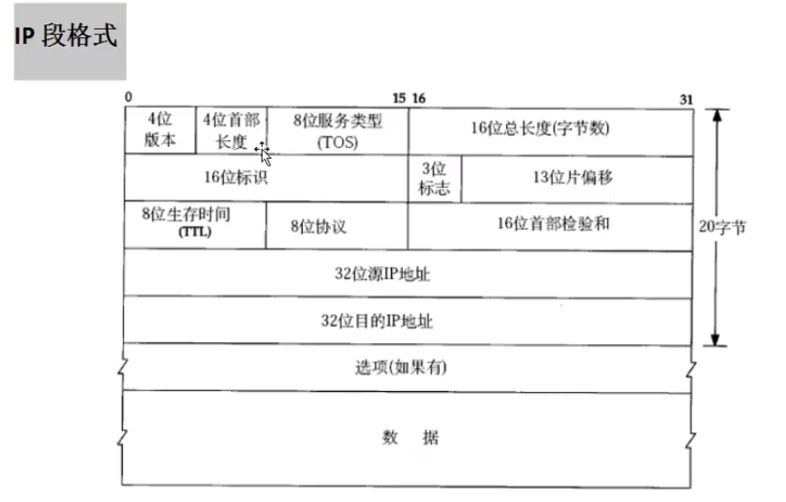

# 协议
+ `OSI`七层模型和`TCP/IP`模型
    

    内核负责对服务器和客户端发出去的或者接受到的数据进行封装/解封装。
+ 通信过程  


+ 以太网帧格式


+  `ARP`数据格式  

以太网帧格式的**类型=0x06**时，就是**APR应答请求**。`ARP`是为了获取下一跳的mac地址。
+ IP段格式  

IP段在以太网帧中属于46-1500字节的数据部分。
+ tcp数据封装

+ `NAT`映射
+ `socket`    
socket:在网络环境中唯一标识的进程  
    + ip地址：在网络环境中唯一表示一台主机  
    + 端口：在主机中唯一表示一个进程  
    + 特点
        + 全双工：一个文件描述符，两个缓冲区。  
        + `socket`总是成对
+ TCP/IP   
    TCP/IP协议规定，网络传输字节按照**大端字节序列**方式    
    + 大端：低地址存储在高位。
    + 小端：低地址存低位。  
      

    因此存在网络字节序列和主机字节序列的转换，有一系列的函数。   

    ```c
        #include <arpa/inet.h>

        uint32_t htonl(uint32_t hostlong);  // host to net long(32位置)

        uint16_t htons(uint16_t hostshort); // host to net short(16位置)

        uint32_t ntohl(uint32_t netlong);   // net to host long

        uint16_t ntohs(uint16_t netshort);
    ```
    ```c
        #include <arpa/inet.h>

        int 
        inet_pton(int af, const char *src, void *dst);
        
        const char *
        inet_ntop(int af, const void *src, char *dst, socklen_t size);
    ```
    + `htonl`与`inet_pton`区别

    
    