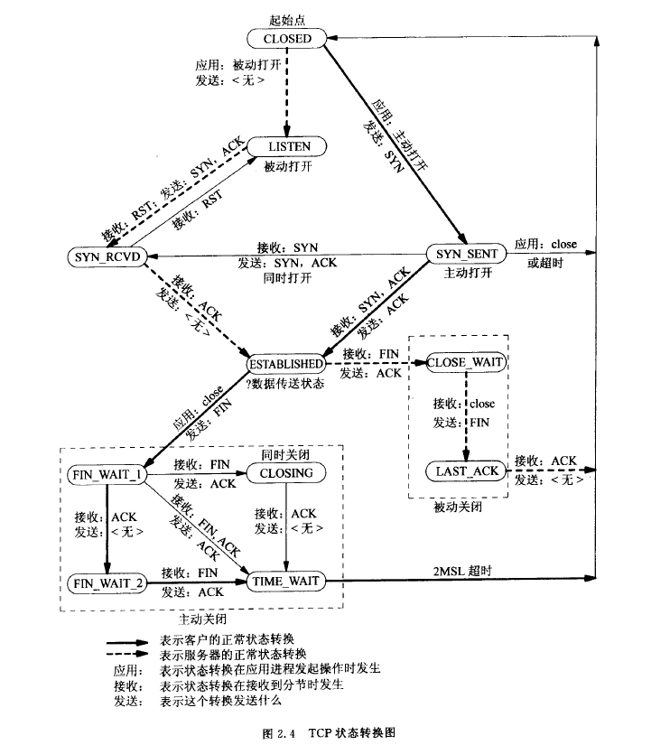

# TCP/IP
TCP是面向连接的可靠数据包传递。UDP是无连接的的不可靠数据传递。TCP的连接和断开：  
+ 连接：三次握手
+ 断开：四次握手
### 1. 三次握手

### 2. 状态图

+ 主动方三个重要状态
    + `ESTABLISHED`：三次握手已经完成
    + `FIN_WAIT_2`：**主动关闭方**，半关闭完成
    + `TIME_WAIT`：**主动关闭方**，用来等`2MLS`超时，等的原因是不确定对方是否接受到自己发的`ACK`信号，如果没有送到，那么就需要再发送一次。

