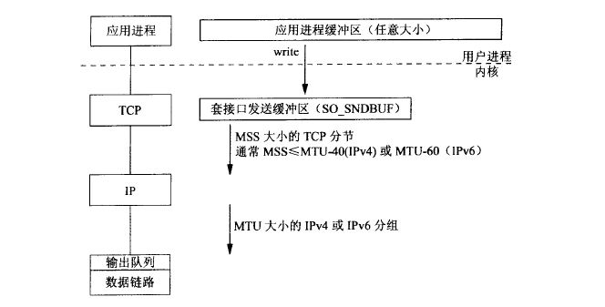

# TCP/IP
UDP是一个无连接的、简单的、不可靠数据协议，TCP是一个面向连接的、可靠的字节流协议。

### 1. TCP状态
+ TCP建立连接  
    通常服务端是被动打开，客户端调用`connect`函数实现主动打开，开启tcp三次握手：
    + client调用`connect`发起主动打开，使得客户端向服务端发送一个`SYN`分节，告诉服务器客户端将在待建立连接中要发送的数据初始序列号，比如`J`。
    + 服务器端确认(`ACK`)客户的`SYN`，同时自己也得发送一个`SYN`分节，告诉客户端将在同一连接中发送得数据初始序列号，比如`K`。
    + 客户端确认服务器端的`SYN`分解。

+ TCP断开连接  
    TCP的建立需要三个分节，终止需要四个分节。
    + 一端调用 ***`close`***，该端TCP发送一个`FIN`分节，**表示数据发送完毕**。
    + 接受到这个`FIN`分节的一端是被动关闭方。TCP接受到`FIN`分节后确认(`ACK`)。`FIN`的接受表示再也数据可以接受。
    + **一段时间后**，被动关闭方将调用 ***`close`***函数关闭它的套接字，使得TCP向主动关闭方也发送一个`FIN`分节。
    + 主动关闭方确认这个由被动关闭方发送的`FIN`分节。  
      
    这里的关闭是全关闭，即TCP的两端都关闭了。对方`read`函数在遇到`FIN`时返回0，就类似于`EOF`。

+ TCP状态图  
    TCP为连接定义了11种状态，如下图，是11种状态之间的转换。
    + 主动方三个重要状态
        + `ESTABLISHED`：三次握手已经完成
        + `FIN_WAIT_2`：**主动关闭方**，半关闭完成
        + `TIME_WAIT`：  
            这个状态存在原因：  
            + **主动关闭方**，用来等`2MLS`超时，等的原因是不确定对方是否接受到自己发的`ACK`信号，如果没有送到，那么就需要对方再发送一次`FIN`分节，这一端再重新发送一次`ACK`。
            + 允许老的重复分节在网络中流逝。
        + `TIME_WAIT`状态，对大并发服务器的影响     
             > 应该尽可能避免在服务器端出现`TIME_WAIT`状态。如果服务器主动断开连接（先于clinet调用close），服务器就会进入`TIME_WAIT`。    
            因此，协议设计上，应该让客户端主动断开连接，这样就把`TIME_WAIT`分散到大量的客户端。如果客户端不活跃了，一些客户端不断开连接，就会占用服务器的连接资源，服务器也要有个机制来踢掉不活跃的client。

### 2. TCP输出
如图，是写一个数据到tcp套接字中时的过程。应用进程调用`write`函数时，内核从该应用进程的缓冲区中复制所有的数据写到套接字的发送缓冲区中。`write`函数返回，只是表示上述过程数据复制完成，可以重新使用原来的应用进程的缓冲区，而不是对端tcp已经接收到数据。
