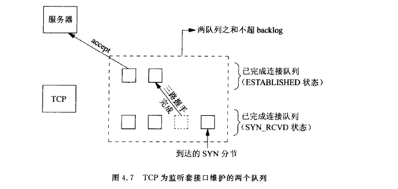

# *socket*
### 1. socket地址结构
+ `sockaddr_in`  
    ipv4协议的地址结构是`sockaddr_in`，ipv6的地址结构是`sockaddr_in6`。
    ```c
        struct sockaddr_in
        {
            sa_family_t     sin_family;
            in_port_t       sin_port;	    /* Port number.  */
            struct in_addr  sin_addr;		/* Internet address.  */

            /* Pad to size of `struct sockaddr'.  */
            unsigned char sin_zero[sizeof (struct sockaddr) -
                    __SOCKADDR_COMMON_SIZE -
                    sizeof (in_port_t) -
                    sizeof (struct in_addr)];
        };
    ```

    + `sin_family`：表示地址簇，`ipv4: AF_INET, ipv6: AF_INET6`，
    + `sin_port`：16位的端口号
    + `sin_addr`：点分十进制。
+ 通用地址结构  
    结构体是`sockaddr`，方便可以接受ipv4/ipv6的地址结构。之所以采用`sockaddr`，而不采用`void*`是因此socket编程早于ANSI C。
    ```c
        struct sockaddr {
            sa_family_t  sa_family;
            char         ss_data[14];
        };  
    ```
    将`sockaddr_in/sockaddr_in6`强制转换为`sockaddr`，通过`sockaddr`的`sa_family`来分别使用的是ipv4/ipv6。
+ 网络字节序列和主机字节序列转换  
&emsp;&ensp;TCP/IP协议规定，网络传输字节按照**大端字节序列**方式      
&emsp;&ensp;大端：低地址存储在高位。小端：低地址存低位。  
    + `sin_port` 转换
        ```c
            #include <arpa/inet.h>

            uint32_t htonl(uint32_t hostlong);  // host to net long(32位置)

            uint16_t htons(uint16_t hostshort); // host to net short(16位置)

            uint32_t ntohl(uint32_t netlong);   // net to host long

            uint16_t ntohs(uint16_t netshort);
        ```
    + `sin_addr` 转换  
    与协议无关的的转换函数，即ipv4/ipv6都可以。
        ```c
            #include <arpa/inet.h>

            int 
            inet_pton(int af, const char *src, void *dst);
            
            const char *
            inet_ntop(int af, const void *src, char *dst, socklen_t size);
        ```
        ipv4专用的转换函数
        ```c
            #include <arpa/inet.h>

            int 
            inet_aton(const char *cp, struct in_addr *inp);
            
            char 
            *inet_ntoa(struct in_addr in);

            in_addr_t 
            inet_addr(const char *cp); // 有风险，不建议使用
        ```
### 2. socket函数  
客户端的tcp和服务端tcp通信与socket函数关系，如图所示。  
&emsp;&emsp;&emsp;
+ `socket`
    ```c
       #include <sys/types.h>         
       #include <sys/socket.h>

       int socket(int family, int type, int protocol);
    ```
    失败时返回-1，成功是返回一个非零整数值，表示套接字描述符，sockfd。
    + 参数
        + *`family`*：`AF_INET,AF_INET6,AF_LOCAL`
        + *`type`*：`SOCK_STREAM`、`SOCK_DGRAM`，还可和`SOCK_NOBLOCK`和`SOCK_CLOEXEC`进行组合使用。
        + *`protocol`*：0，表示选择`family`和`type`组合系统默认值。
    + 状态：  
        创建`sockfd`以后，处于`CLOSED`状态。
+ `connect`
    ```c
       #include <sys/types.h>         
       #include <sys/socket.h>

       int connect(int sockfd, const struct sockaddr *addr, socklen_t addrlen);
    ```
    客户端调用函数。  
    + 返回值：成功返回0，失败返回-1。
       客户端调用`connect`函数，**会激发`TCP`的三次握手过程**，而且仅仅在连接成功或者失败才返回。**客户端是在第二个分节返回，服务端是第三个分节返回**。  
        + *`ETIMEOUT`*：若客户端没有收到`SYN`分节响应，就会返回这个错误。
        + *`ECONNREFUSED`*：若对客户端的`SYN`分节响应的是`RST`，表示服务器主机在指定的端口上没有进程与之连接，客户端一接受到`RST`就返回`ECONNREFUSED`错误。
        + 不可达错误。
    + 参数
        + *`sockfd`*：是`socket`函数返回值。
        + *`sockaddr`*：是套接字的地址结构，`sockaddr_int/sockaddr_in6`强制转换而来。
        + *`addrlen`*：传入的地址结构大小。  
    + 状态：  
      `connect`会使得当前套接字从`closed`状态转移到`SYN_SENT`状态，如成功再转移到`ESTABLISHED`状态，若失败则该套接字不可用，**必须关闭**。
+ `blind`
    ```c
       #include <sys/types.h>         
       #include <sys/socket.h>

       int bind(int sockfd, const struct sockaddr *addr, socklen_t addrlen);
    ```
    服务器端调用函数。  
    addr的地址一般选择通配地址`ADDR_ANY`，端口选择一个大于1024的端口。ip地址和端口哪个是0，哪个就由内核决定。
+ `listen`
    ```c
       #include <sys/types.h>         
       #include <sys/socket.h>

       int listen(int sockfd, int backlog);
    ```
    `listen`函数由服务器端调用。
    + 作用完成两件事：
        + `socket`函数创建的套接字是一个主动套接字，即是一个将会主动调用`connect`函数发起连接的客户端套接字。`listen`把一个未连接的套接字转换程一个被动套接字，告诉内核接受指向这个被动套接字的连接请求。**此时的状态是:`LISTEN`**
        + 参数`backlog`规定了内核为相应套接字排队的最大连接个数。
    + `backlog`  
    内核为每个**监听**套接字维护两个队列：  
        &emsp;&ensp;(1) 未完成连接队列：处于`SYN_RCVD`状态的客户端套接字。   
        &emsp;&ensp;(2) 已完成连接队列：每个已经完成TCP三次握手过程的客户端套接字。这些套接字处于`ESTABLISHED`状态。  
        backlog = 两个队列数之后。
      
    + 状态转移   
    如图，当来自客户的`SYN`分节到达时，TCP在未连接队列创建一个新项，然后响应以三次握手的第二个分节，这一项一直保留在未完成连接队列中，直到三次握手的第三个分节到达或者超时。如果到达，该项就从未完成连接队列中移到已完成连接队列的队尾。当调用`accept`时，已完成连接队列的队首将作为`accept`的返回值，如果已完成连接队列是空，那么调用`accept`函数的进程会进入睡眠状态。
    &emsp;&ensp;&emsp;&ensp;  
+ `accept`
    ```c
        #include <sys/types.h>          /* See NOTES */
        #include <sys/socket.h>

        int accept(int sockfd, struct sockaddr *addr, socklen_t *addrlen);
    ```
    调用`accept`时，已完成连接队列的队首将作为`accept`的返回值，如果已完成连接队列是空，那么调用进程进入睡眠状态。成功返回客户端的已连接套接字`connfd`，失败返回-1。

    `accpet`函数返回时，表示已连接套接字`connfd`和服务器端的监听套接字`listenfd`完成了三次握手。
+ `close`
    ```c
       #include <unistd.h>

       int close(int fd);
    ```
    这个函数表示的把该套接字标记为已关闭，然后立即返回到调用进程，该套接字描述符不能再被调用进程使用。  
    + 注意事项
        + 由于描述符是引用计数，close只是减少该引用计数，只有当该引用计数为0时才会引用终止序列
        + tcp会先将已经排队等待发送到对端的任何数据发送过去，然后再发送终止序列`FIN`。因此，调用close不是立即发送终止序列。
+ `shutdown`
    ```c
        #include <sys/socket.h>

        int shutdown(int sockfd, int how);
    ```
    + `shutdown`解决的是`close`的两个限制：
        + `close`把描述符计数减一，仅仅在计数变为0时才关闭套接字。`shutdown`可以不管描述符计数就激发TCP的正常连接终止序列。
        + `close`终止读和写两个方向的数据传递，`shutdown`是半关闭，可以只是关闭一个方向数据流。
    + 参数
    + `how`:
        + `SHUT_RD`：关闭读
        + `SHUT_WR`：关闭写
        + `SHUT_RDWR`：关闭读写